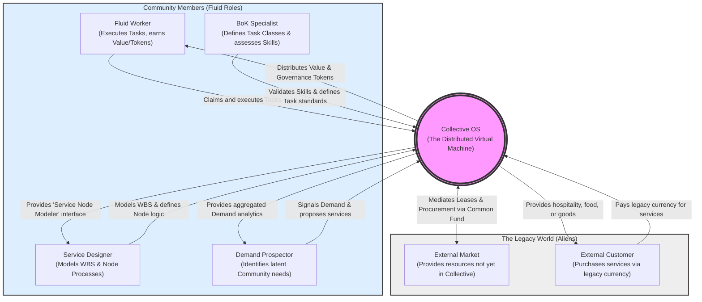
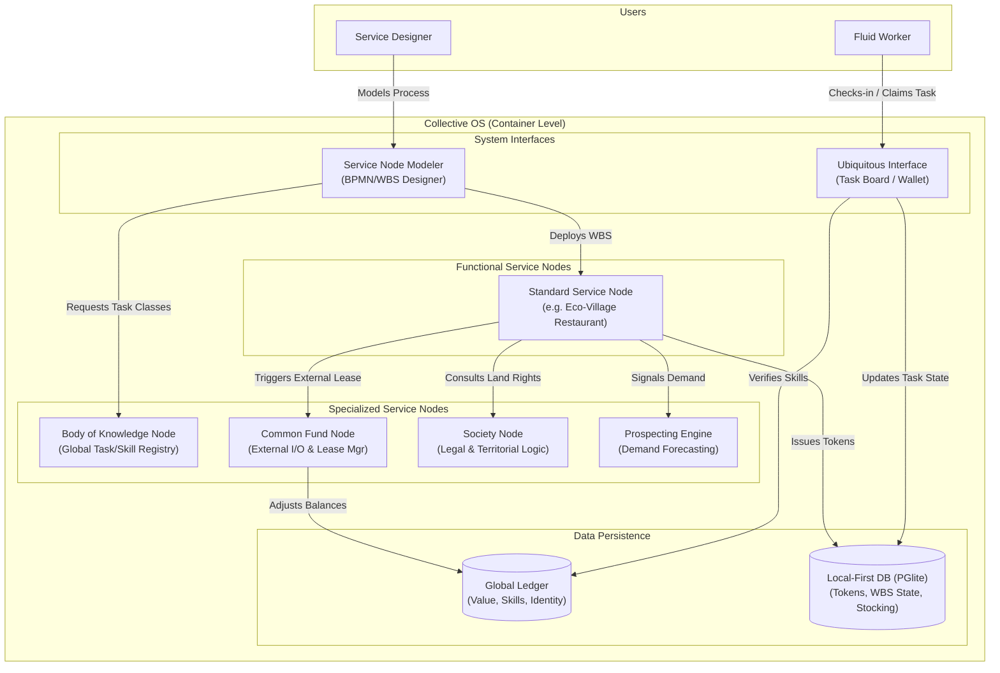

# Collective Diagrams

---

This is a set of diagrams to help illustrate the architectural view for Collective.

> ## System Context Diagram (C4 - Level 1)

---

System Context represents the outermost level of interaction

Community Members are those vetoed by the community and accepted as part of it, non-members cannot execute Tasks or accrue Value and Reputation Tokens, they are also not governed by Societies but may have service denied in cases where they violate those decisions oriented for external agents.

> ## Container Diagram (C4 - Level 2)

---

This diagram zooms into the "Collective OS" to show how the specialized Service Nodes we’ve defined (Common Fund, BoK, Societies, etc.) interact as a decentralized "Node-of-Nodes."

### Container Breakdown

- Body of Knowledge (BoK) Container: Acts as the "Global Header." It provides the technical definitions of Tasks that the Modeler uses to build any WBS. It ensures a "Plumbing" task in a City Node is the same as in the Eco-Village.

- Common Fund Container: The metabolic gateway. It handles the API calls to the External Market. If a Service Node's WBS requires an "External Resource," this container manages the legacy currency transaction and tracks the "Lease" status.

- Society Container: The permission and legal layer. It stores the "Community Rules" and territorial boundaries. It mediates when two Service Nodes have a conflict over the same physical resource (like a specific plot of land).

- Service Node Modeler: The IDE. It allows the Designer to drag "Task Blocks" from the BoK and "Resource Blocks" from the Common Fund to create a runnable BPMN process.

- Global Ledger vs. Local DB:

  - Global Ledger: Replicated across the entire mesh. It ensures Maria’s Value and Skills are recognized whether she is in a City Cell or an Eco-Village.

  - Local DB: High-performance, local-first storage. It tracks the Tokens earned in that specific Node and the real-time "Stocking" and "Priority" of active Tasks.

### The "System Call" Flow Example

1. Prospector identifies high demand for lodging.

1. Designer uses the Modeler to pull "Cleaning" and "Reception" tasks from the BoK.

1. Service Node requests a "Lease" for a building from the Society (Internal) and "Linens" from the Common Fund (External).

1. Worker uses the Interface to see the task. The system checks the Global Ledger for their skills.

1. Upon completion, the Global Ledger updates their Value, and the Local DB updates their Tokens for that specific Lodging Node.
