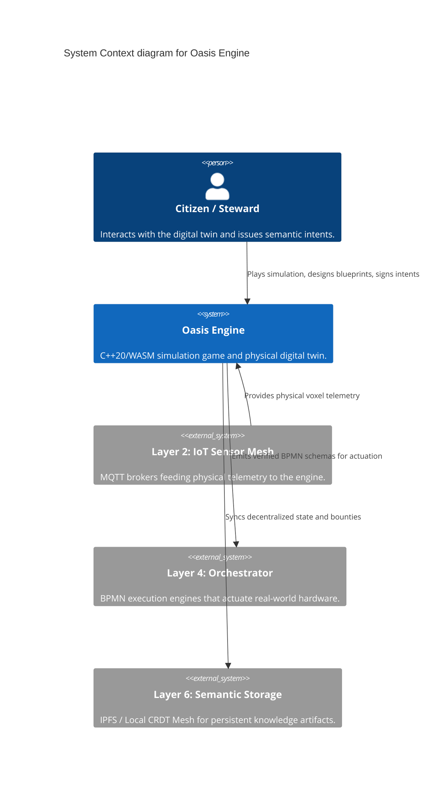
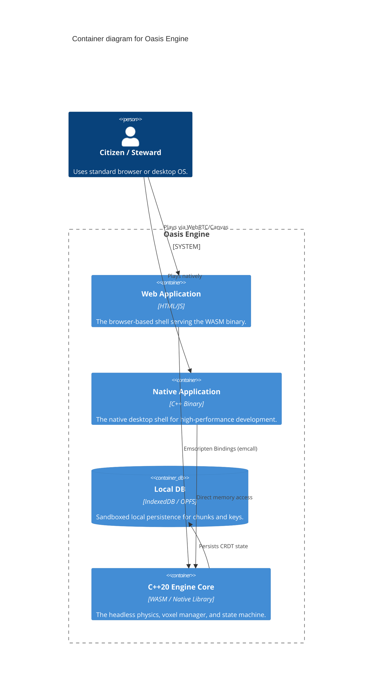
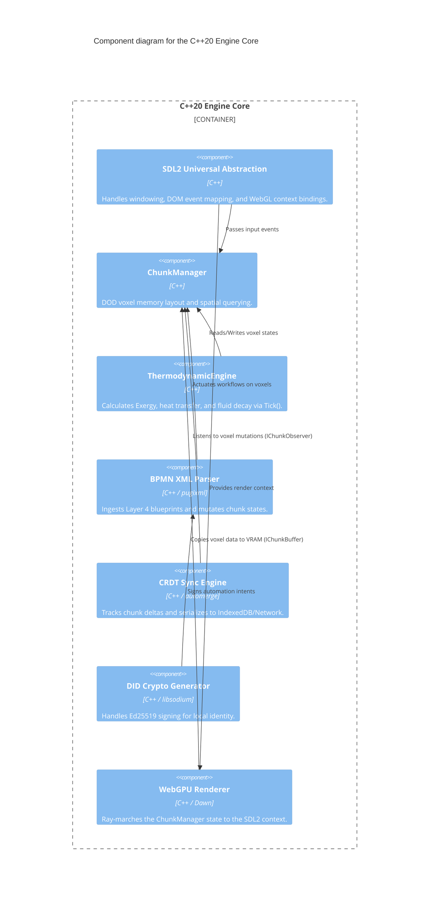

# C4 Architecture Model: Oasis Engine

This document visually maps the architecture of the Oasis Engine across the Context (Level 1), Container (Level 2), and Component (Level 3) layers. It serves as the structural foundation for our Product Backlog and Sprint sequences.

## Level 1: System Context
The Oasis Engine operates as a bridge between the physical realities of the Sovereign Node and the semantic intent of the citizens.

## Level 2: Container Diagram
The deployment architecture, demonstrating how the identical C++ core runs natively and in the browser.

## Level 3: Component Diagram (C++ Core)
Zooming into the `C++20 Engine Core` container. This maps perfectly to our Epic and Story boundaries in the Product Backlog.

