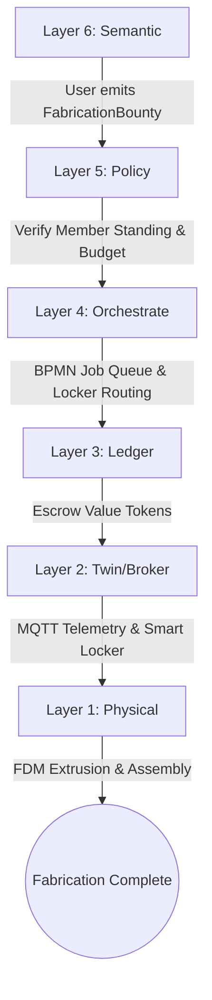
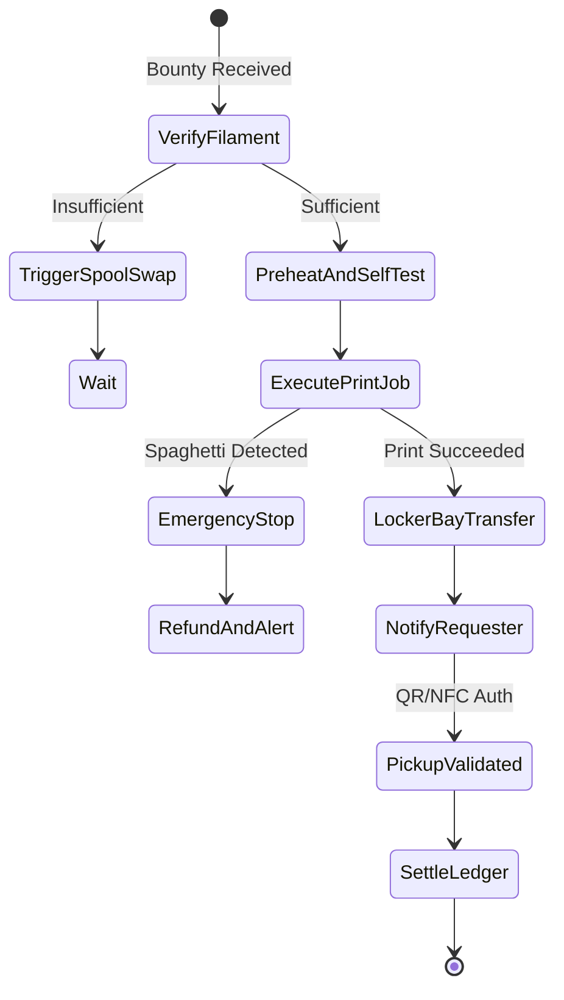
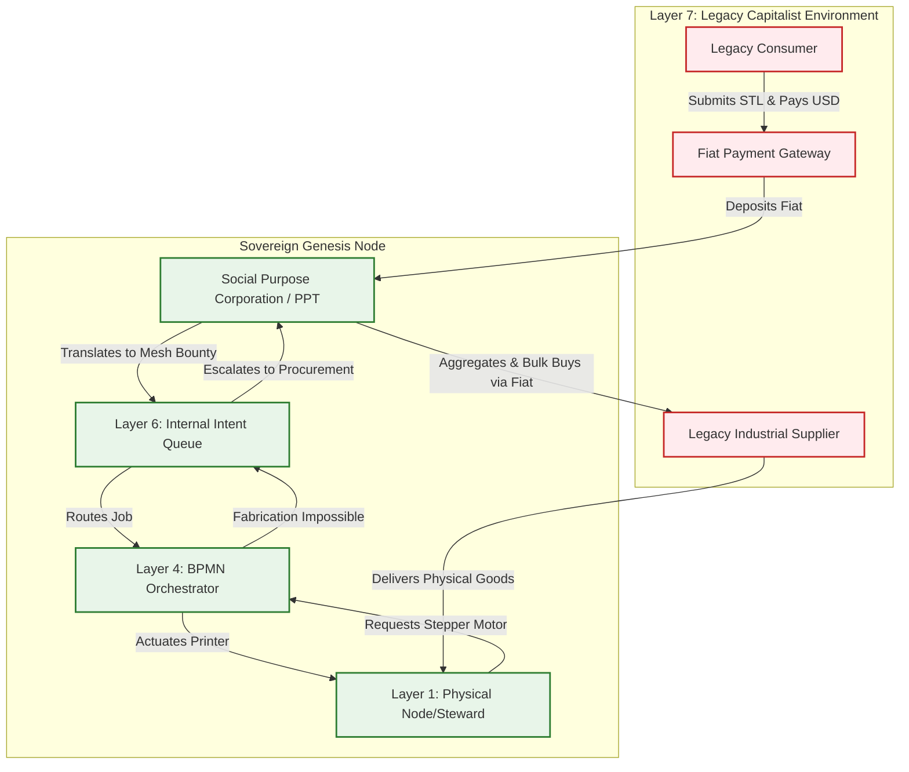

# Scenario Alpha: The Fabrication Commons

*   **Identifier:** `SCN-ALPHA-FAB`
*   **System Epic:** Distributed Physical Fabrication & Shared Tool Library
*   **Primary Layers Tested:** L1 (Physical), L2 (Digital Twin), L3 (Ledger), L4 (Orchestration), L5 (Governance), L6 (Semantic)
*   **Pass/Fail Metric:** On-demand fabrication of functional replacement components completed with local thermodynamic cost < 20% of retail fiat equivalent; zero centralized server dependencies.

---

## 1. Problem Statement & Legacy Failure

In legacy suburban infrastructure (Layer 7), personal manufacturing equipment is heavily atomized. Dozens of households within a single neighborhood independently purchase low-duty 3D printers, power tools, and lawn equipment that remain idle >95% of their operational lifespan. 

When a physical component fails (e.g., a broken dishwasher impeller, a custom mounting bracket, or interlocking mechanical gears for an irrigation timer):
*   **Supply Chain Latency & Carbon Drag:** The user purchases a mass-produced injection-molded plastic replacement shipped thousands of miles via air and truck freight, wrapped in single-use petrochemical packaging.
*   **Planned Obsolescence:** Manufacturers withhold CAD models, forcing consumers to replace entire subassemblies rather than individual worn parts.
*   **Commercial Printing Cost:** Third-party on-demand print services impose exorbitant markups ($30–$60 for a $1.20 plastic component) and multi-day shipping queues.

---

## 2. The Collective Workflow (7-Layer Traversal)

The Fabrication Commons converts personal fabrication capacity into an automated, neighborhood-scale public utility.



### Layer 1: Physical Ground Truth
*   **Hardware Node:** A shared high-reliability FDM printer (e.g., Bambu Lab A1 Mini with 4-spool AMS for multi-material/color capacity) housed in a climate-controlled acoustic enclosure, coupled with an electronically latched physical retrieval locker.
*   **Feedstock Inventory:** Standardized spools of structural PETG, recycled PLA, and TPU tagged with optical or RFID spool markers.
*   **Action:** Extruder heating, selective AMS filament retraction and feeding, dynamic layer deposition, and automated bed clearance or manual transfer into the smart locker.

### Layer 2: Digital Twin & Telemetry
*   **Ingress Telemetry (MQTT):**
    *   `node/fab/printer_01/telemetry/nozzle_temp` (Target vs. Actual °C)
    *   `node/fab/printer_01/telemetry/bed_temp` (°C)
    *   `node/fab/printer_01/telemetry/filament_used_grams` (Continuous integration)
    *   `node/fab/printer_01/status` (`IDLE`, `PREHEAT`, `PRINTING`, `FAILED`, `COMPLETE`)
*   **Optical Verification:** Edge-AI camera inference flags spaghetti failures or layer shifts; if confidence of failure > 85%, an emergency stop is dispatched over local MQTT.
*   **Actuator Control:** Physical solenoid latch on the smart locker triggered via authenticated relay pin.

### Layer 3: Network & Ledger
*   **Escrow Lock:** Prior to g-code dispatch, the requester’s wallet locks the estimated thermodynamic fee:
    $$\Delta V_{est} = \left( m_{filament} \cdot k_{material} + E_{electrical} \right) \cdot \lambda_{ERC}$$
*   **Consensus Settlement:** Upon Layer 2 confirmation of `COMPLETE` and verification that actual filament mass matches the slice profile within $\pm 3\%$, the locked tokens transfer to the printer Steward, minus a localized depreciation reserve credited to the Commons Maintenance Pool.

### Layer 4: Orchestration State Machine
The workflow is managed deterministically via an embedded BPMN 2.0 engine:



### Layer 5: Policy & Web of Trust
*   **Noise & Energy Budgeting:** High-temperature engineering filaments (requiring sustained high bed temps) are prohibited during peak residential quiet hours or local microgrid deficits unless compensated at surge exergy rates.
*   **Reputation Gating:** Unverified or low-trust nodes must lock full replacement collateral for borrowing handheld tools from the physical library; verified Stewards check out tools on mutual trust attestations.

### Layer 6: Semantic Intent
Requests are defined as machine-readable Linked Data, mapping directly to standard ontologies and custom Collective extensions.

### Layer 7: The Legacy Proxy (Fiat Ingestion & Stewarded Procurement)
The Fabrication Commons does not exist in a vacuum; it actively interfaces with the legacy capitalist market through the Node's Social Purpose Corporation (SPC) to achieve two vital bootstrapping functions:

**1. Trojan Manufacturing (Inbound Fiat Extraction)**
To fund the Node’s legacy tethers (property tax, ISP bills, raw filament), the SPC operates a standard, outward-facing Web2 storefront (e.g., integrating the Stripe API). Legacy consumers upload `.stl` files and pay standard legacy market rates ($30+ USD). 
*   The Layer 7 API intercepts the fiat payment into the SPC bank account.
*   The API automatically generates a Layer 6 `FabricationBounty` on the internal mesh.
*   The local Steward executes the print and is compensated in internal Value Tokens. The fiat is trapped and retained by the Node's treasury, effectively subsidizing the sovereign infrastructure using external legacy consumption.

**2. Ecological Leeching (Outbound Stewarded Procurement)**
When a local citizen needs a component the mesh *cannot* physically manufacture (e.g., a NEMA 17 stepper motor, a silicon IC, or bulk raw PETG pellets), the intent hits a "Fabrication Ceiling" at Layer 4. 
*   Instead of the citizen going to Amazon and ordering a single item (incurring massive individual packaging and shipping carbon drag), the request is pushed up to Layer 7.
*   The SPC acts as a **Decentralized Group Purchasing Organization (GPO)**. It pools all unfulfillable legacy requests across the Node for the week.
*   The SPC uses its aggregated fiat reserves to execute a single, bulk B2B legacy purchase from vetted, ecologically optimized suppliers, minimizing shipping latency and packaging waste before distributing the parts internally via the mesh.

---

### Layer 7 Bidirectional Flowchart
*(Add this Mermaid diagram to visualize the membrane)*




---

## 3. Machine-Readable Schemas

### 3.1 Layer 6 Knowledge Artifact: Fabrication Bounty (`bounty.jsonld`)

```json
{
  "@context": [
    "[https://schema.org/](https://schema.org/)",
    "[https://collective.network/ontology/v1/](https://collective.network/ontology/v1/)"
  ],
  "@type": "FabricationBounty",
  "identifier": "urn:uuid:f47ac10b-58cc-4372-a567-0e02b2c3d479",
  "issuerDid": "did:mesh:node04:steward_alice",
  "creationTimestamp": "2026-10-01T14:30:00Z",
  "jobProfile": {
    "@type": "FDMPrintProfile",
    "payloadUri": "ipfs://bafybeicg24u.../aquaponics_valve_gear.3mf",
    "payloadSha256": "e3b0c44298fc1c149afbf4c8996fb92427ae41e4649b934ca495991b7852b855",
    "materialRequired": {
      "polymer": "PETG",
      "colorHex": "#000000",
      "estimatedMassGrams": 42.5
    },
    "sliceParameters": {
      "layerHeightMm": 0.2,
      "infillPercentage": 40,
      "infillPattern": "gyroid",
      "supportRequired": false
    }
  },
  "settlementCriteria": {
    "maxExergyJoules": 450000,
    "maxTokenFee": "3.50",
    "timeoutHours": 12
  }
}
```

### 3.2 Layer 2 Telemetry Attestation: Completion Proof (`attestation.json`)

```json
{
  "@context": "[https://collective.network/ontology/v1/](https://collective.network/ontology/v1/)",
  "@type": "FabricationAttestation",
  "bountyRef": "urn:uuid:f47ac10b-58cc-4372-a567-0e02b2c3d479",
  "printerNode": "did:mesh:node04:device:bambu_a1_01",
  "executionMetrics": {
    "startTime": "2026-10-01T15:00:12Z",
    "endTime": "2026-10-01T16:14:45Z",
    "durationSeconds": 4473,
    "filamentConsumedGrams": 42.8,
    "energyConsumedWattHours": 87.4,
    "meanNozzleTempC": 240.2,
    "meanBedTempC": 70.1,
    "anomalyDetected": false
  },
  "lockerCompartment": "B-03",
  "pickupTokenHash": "a665a45920422f9d417e4867efdc4fb8a04a1f3fff1fa07e998e86f7f7a27ae3"
}
```
## 4. Oasis Engine Implementation Specification

To pass Scenario Alpha in the Oasis engine (`engine/scenarios/alpha_test.cpp`), the C++ simulation core must execute the following state validation loop without headless crashes or memory leaks.

### 4.1 Memory Allocation & Voxel State

The fabrication node occupies a specific coordinate in the $32^3$ chunk space:
- The printer voxel is initialized with `material_id = 15` (`HARDWARE_FAB_NODE`).
- The `Is_Actuator` bit is set in `metadata`.
- A connected raw material hopper voxel (`material_id = 16`, `POLYMER_SPOOL`) tracks `moisture` and `capacitance` as filament inventory.

### 4.2 C++20 Test Harness Structure

```cpp
// engine/tests/scenario_alpha_test.cpp
#include <cassert>
#include "oasis/chunk_manager.hpp"
#include "oasis/orchestration/bpmn_engine.hpp"
#include "oasis/ledger/crdt_wallet.hpp"

void test_scenario_alpha_fabrication() {
    using namespace oasis;

    // 1. Initialize local chunk and dependencies
    ChunkManager chunk_mgr;
    chunk_mgr.allocate_chunk(0, 0, 0);
    
    // Set printer node at local voxel (16, 8, 16)
    Voxel printer_voxel{
        .material_id = 15, // FAB_NODE
        .moisture = 5,     // Enclosure RH%
        .temperature = 22, // Ambient °C
        .metadata = 0b00000110 // Actuator + Sensor bits
    };
    chunk_mgr.set_voxel(16, 8, 16, printer_voxel);

    // 2. Setup Wallets & Balances
    CRDTWallet requester_wallet("did:mesh:node04:steward_alice", 100.0f);
    CRDTWallet provider_wallet("did:mesh:node04:steward_bob", 20.0f);

    // 3. Load & Run BPMN Orchestration State Machine
    BPMNEngine orchestrator;
    orchestrator.load_schema("schemas/bpmn/fabrication_pipeline.bpmn");

    JobContext job{
        .bounty_id = "f47ac10b-58cc-4372-a567-0e02b2c3d479",
        .filament_required_grams = 42.5f,
        .estimated_energy_wh = 88.0f,
        .target_locker_id = 3
    };

    // Assert Escrow Lock
    bool escrow_success = orchestrator.lock_escrow(requester_wallet, 3.50f);
    assert(escrow_success);
    assert(requester_wallet.balance() == 96.50f);

    // Simulate Layer 2 Telemetry Tick Loop
    SimResult res = orchestrator.step_simulation_ticks(chunk_mgr, job, 4473);
    assert(res.status == ExecutionStatus::COMPLETED);
    assert(res.filament_used >= 42.0f && res.filament_used <= 43.5f);

    // Validate Ledger Settlement
    orchestrator.settle_job(provider_wallet);
    assert(provider_wallet.balance() > 20.0f);

    // Ensure physical locker voxel updated to LOCKED_OCCUPIED state
    Voxel locker_voxel = chunk_mgr.get_voxel(16, 9, 16);
    assert(locker_voxel.material_id == 17); // SMART_LOCKER_SECURED
}
```

## 5. Acceptance Test Gates (Pass/Fail)

To pass Scenario Alpha in the Oasis engine, the C++ simulation core must execute the following state validation loop without headless crashes or memory leaks. These tests ensure the node functions autonomously while safely managing legacy fiat exposure.

| Checkpoint | Validation Method | Pass Condition |
| :--- | :--- | :--- |
| **G1: Thermodynamic Bounds** | Virtual Joules vs. Extrusion Mass | Energy consumption is within $\pm 10\%$ of the thermodynamic minimum required for melting 42.5g of PETG. |
| **G2: Offline Autonomy** | Localhost Network Isolation | Internal print workflow completes from dispatch to physical locker latching while the node is completely disconnected from WAN/Internet. |
| **G3: Byzantine Detection** | Simulated Layer 2 Spoof | Injecting edge telemetry with zero energy draw while reporting filament mass depletion fails reconciliation; Value Token escrow is refunded, not minted. |
| **G4: Material Tracking** | Voxel Hopper Depletion | Voxel inventory counter decrements by exactly the consumed filament mass; triggers an internal `RESTOCK_BOUNTY` when spool threshold drops $< 100\text{g}$. |
| **G5: Trojan Ingestion (L7)** | External Webhook Injection | A mock Stripe JSON payload successfully compiles into an internal `FabricationBounty`; fiat is correctly credited to the SPC ledger, and internal Value Tokens are escrowed for the Steward. |
| **G6: Ecological Leeching (L7)**| Procurement Aggregation | Requesting an unprintable legacy component (`material_id = SILICON_PCB`) suspends the immediate BPMN workflow; the system successfully pools 5 independent requests and triggers a single, batched `PROCUREMENT_BATCH` order after 7 simulated days. |
