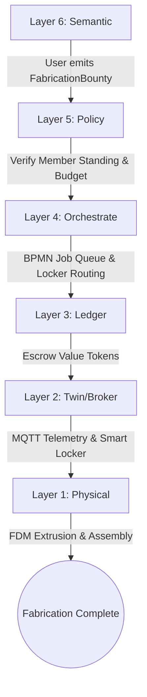
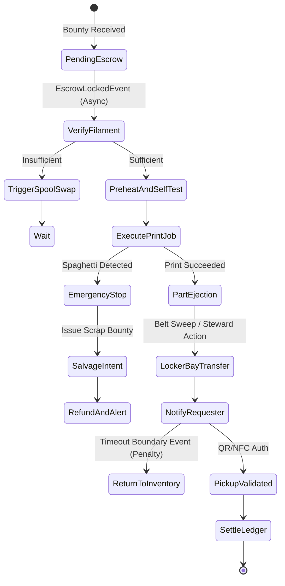
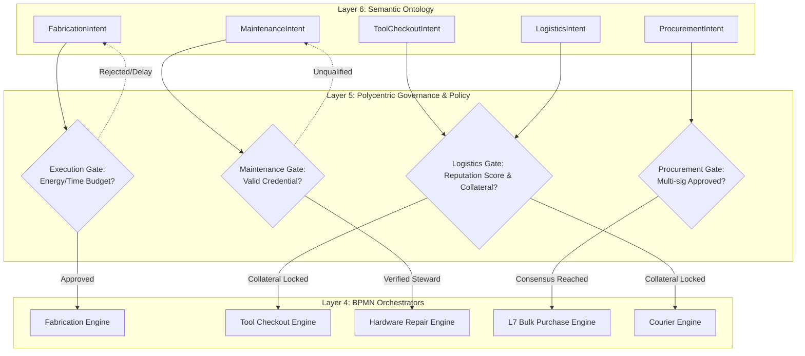
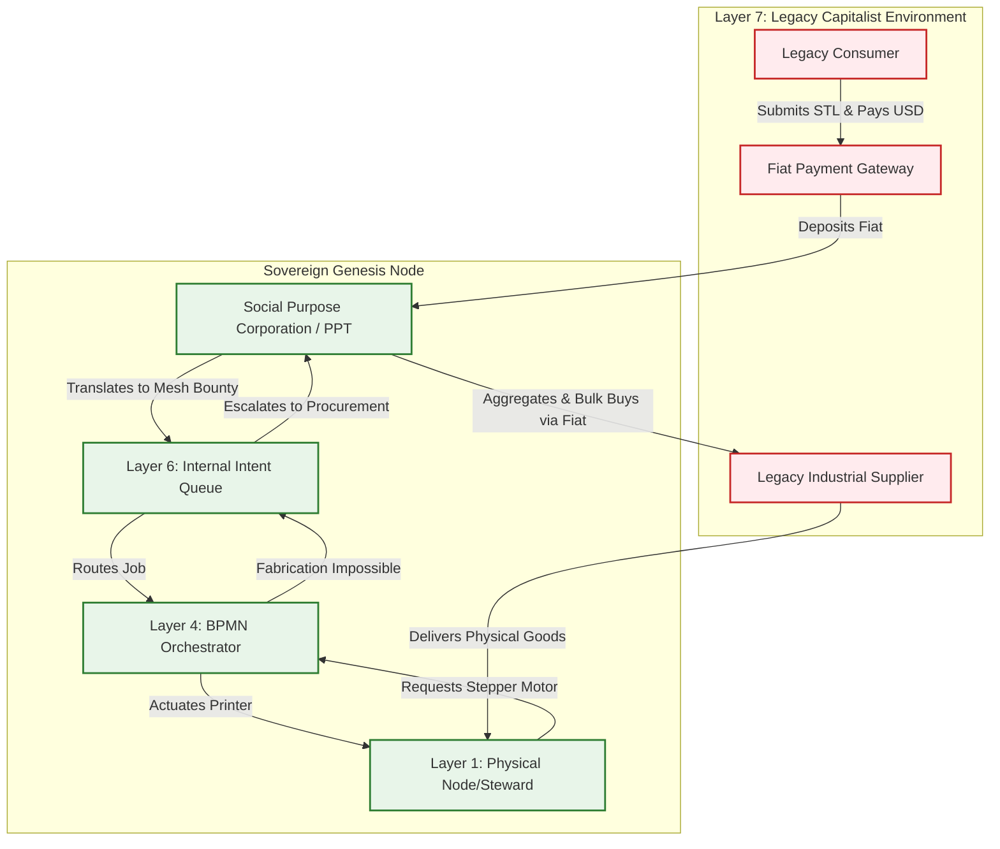

# Scenario Alpha: The Fabrication Commons

*   **Identifier:** `SCN-ALPHA-FAB`
*   **System Epic:** Distributed Physical Fabrication & Shared Tool Library
*   **Primary Layers Tested:** L1 (Physical), L2 (Digital Twin), L3 (Ledger), L4 (Orchestration), L5 (Governance), L6 (Semantic)
*   **Pass/Fail Metric:** On-demand fabrication of functional replacement components completed with local thermodynamic cost < 20% of retail fiat equivalent; zero centralized server dependencies.

---

## 1. Problem Statement & Legacy Failure

In legacy suburban infrastructure (Layer 7), personal manufacturing equipment is heavily atomized. Dozens of households within a single neighborhood independently purchase low-duty 3D printers, power tools, and lawn equipment that remain idle >95% of their operational lifespan. 

When a physical component fails (e.g., a broken dishwasher impeller, a custom mounting bracket, or interlocking mechanical gears for an irrigation timer):
*   **Supply Chain Latency & Carbon Drag:** The user purchases a mass-produced injection-molded plastic replacement shipped thousands of miles via air and truck freight, wrapped in single-use petrochemical packaging.
*   **Planned Obsolescence:** Manufacturers withhold CAD models, forcing consumers to replace entire subassemblies rather than individual worn parts.
*   **Commercial Printing Cost:** Third-party on-demand print services impose exorbitant markups ($30–$60 for a $1.20 plastic component) and multi-day shipping queues.

---

## 2. The Collective Workflow (7-Layer Traversal)

The Fabrication Commons acts as a localized analogue to a corporate maker space (akin to Microsoft's "The Garage"), converting atomized personal fabrication capacity and equipment into an automated, neighborhood-scale public utility. It functions as both a comprehensive hub for stationary fabrication and diagnostics (3D printers, CNC metal cutters, woodworking stations, oscilloscopes) and a shared "tool library" for high-value portable equipment (e.g., lawn mowers, power drills).



### Layer 1: Physical Ground Truth
*   **Hardware Nodes (Stationary Hub):** A shared high-reliability, open-source FDM printer (e.g., Voron or Prusa running Klipper for local-first autonomy) housed in an actively heated desiccant dry box and acoustic enclosure, alongside CNC metal cutters, woodworking stations, and diagnostic benches (oscilloscopes, protoboards).
*   **Hardware Nodes (Tool Library):** High-value, portable equipment (e.g., electric lawn mowers, reciprocating saws) housed in secure, electronically latched physical retrieval lockers or garage bays, tracked via embedded RFID or BLE beacons.
*   **Inventory & Feedstock:** Standardized spools of structural PETG/TPU tagged with optical markers, alongside bins of spare electrical material (resistors, ICs) and standardized lumber/sheet metal.
*   **Action:** Extruder heating and layer deposition for printing, alongside physical solenoid latch actuation for smart lockers allowing users to check-in/check-out portable tools and materials.

### Layer 2: Digital Twin & Telemetry
*   **Ingress Telemetry (MQTT):**
    *   `node/fab/printer_01/telemetry/nozzle_temp` (Target vs. Actual °C)
    *   `node/fab/printer_01/telemetry/filament_used_grams` (Continuous integration)
    *   `node/tools/lawnmower_01/telemetry/battery_level` (%)
    *   `node/tools/lawnmower_01/status` (`STOWED`, `IN_USE`, `MAINTENANCE_REQUIRED`)
*   **Verification:** Edge-AI camera inference flags spaghetti failures for 3D prints. For portable tools, BLE beacon proximity and weight sensors act as a baseline; electronic tools require a functional diagnostic (e.g., measuring battery impedance via charging pins), and mechanical tools require a post-return photo uploaded and validated by Edge-AI before releasing collateral.
*   **Actuator Control:** Physical solenoid latch on the smart locker triggered via authenticated relay pin for both printed part retrieval and tool check-out.

### Layer 3: Network & Ledger
*   **Escrow Lock:** Prior to g-code dispatch or tool check-out, the requester’s wallet locks the estimated thermodynamic fee (for fabrication) or a temporary collateral deposit (for the tool library):
    $$\Delta V_{est\_fab} = \left( m_{filament} \cdot k_{material} + E_{electrical} + C_{wear} \right) \cdot \lambda_{THERMO}$$
    Where $C_{wear}$ accounts for machine depreciation (e.g., brass nozzle abrasion, end-mill dulling).
*   **Consensus Settlement:** Upon Layer 2 confirmation of `COMPLETE` (print) or `STOWED` (tool return), the locked tokens transfer to the Steward (with $C_{wear}$ allocated to a maintenance pool for `MaintenanceIntent` bounties), or the tool collateral is safely released back to the requester.

### Layer 4: Orchestration State Machine
The workflow is managed deterministically via an embedded BPMN 2.0 engine, incorporating async escrow, automated ejection, timeouts, and salvage paths:



### Layer 5: Policy & Polycentric Governance
Layer 5 acts as the cryptographic traffic cop and judge. It ingests the JSON-LD intents from Layer 6, evaluates them against the local Trust Ring's policies, and if approved, routes them to the appropriate Layer 4 BPMN orchestrator. 

Layer 5 governs these multiple workflows via **Policy Gates**:

*   **Execution Gate (Acoustic & Energy Budgeting):** If a `FabricationIntent` requests high-temperature ABS printing at 2:00 AM, Layer 5 checks the local acoustic zoning policy. If the Node is in a residential cluster, the policy rejects the intent or queues it for daylight hours, preventing neighbor disputes.
*   **Maintenance Gate (Competency Gating):** If a `MaintenanceIntent` is generated to replace a 500°C hotend, Layer 5 consults the Web of Trust. It requires a `Hardware_Maintenance_L2` Verifiable Credential. Alternatively, novices can enter "Apprentice Mode" by co-signing the intent with a Master Steward, earning credential fragments (XP) by physically shadowing the repair.
*   **Procurement Gate (Fiat Capital Allocation):** If a `ProcurementIntent` requires spending legacy fiat, Layer 5 evaluates the cost. If $>\$50$, it triggers a 3-of-5 multi-sig consensus request with an explicit BPMN Timer Boundary (TTL). If the TTL expires before consensus, the intent is rejected to prevent hanging state.
*   **Logistics Gate (Reputation Escrow):** If a user requests a tool checkout, Layer 5 verifies a Zero-Knowledge Proof (ZKP) derived from their Verifiable Credentials. This proves they meet the safe-return threshold without leaking their entire behavioral history, preserving self-sovereign privacy.

### Layer 6: Semantic Intent & The Fabrication Ontology
The network does not understand "I need a part." Layer 6 is responsible for mapping raw human needs into strict, machine-readable JSON-LD Knowledge Artifacts. 

For the Fabrication Commons, Layer 6 maintains a specific ontology that categorizes intent into five distinct branches, each triggering a completely different lifecycle:
1.  **`FabricationIntent` (Execution):** The request to convert digital geometry or CAD paths into physical matter (via FDM printer, CNC, or laser).
2.  **`ToolCheckoutIntent` (Library Access):** The request to temporarily check out a portable physical asset (e.g., lawn mower, oscilloscope). Contains duration bounds and collateral terms.
3.  **`MaintenanceIntent` (Hardware Care):** Emitted automatically by Layer 2 (e.g., "extruder clogged" or "mower blade dull") or manually by a user.
4.  **`ProcurementIntent` (Supply Chain):** Emitted when internal hoppers report low raw materials, requesting replenishment.
5.  **`LogisticsIntent` (Movement):** The request to physically transport a part or checked-out tool.
6.  **`SalvageIntent` (Recycling):** Emitted on hardware failure, generating a "Scrap Bounty" to retrieve failed polymer and feed it into a local recycler.

Layer 6 bundles these intents with cryptographic signatures (proving *who* is asking) and hands them down to Layer 5 for evaluation.

### The Governance Router Flowchart
*(Add this Mermaid diagram to visualize how L5 routes L6 intents to different L4 BPMNs)*



### Layer 7: The Legacy Proxy (Fiat Ingestion & Stewarded Procurement)
The Fabrication Commons does not exist in a vacuum; it actively interfaces with the legacy capitalist market through the Node's Social Purpose Corporation (SPC) to achieve two vital bootstrapping functions:

**1. Trojan Manufacturing & Rental (Inbound Fiat Extraction)**
To fund the Node’s legacy tethers (property tax, ISP bills, equipment maintenance), the SPC operates a standard, outward-facing Web2 storefront (e.g., integrating the Stripe API). Legacy consumers upload `.stl` files for commercial 3D printing, or pay fiat to rent high-end tools (like a commercial CNC or lawn mower) at legacy market rates.
*   The Layer 7 API intercepts the fiat payment into the SPC bank account.
*   The API automatically generates a Layer 6 `FabricationBounty` or `ToolCheckoutIntent` on the internal mesh.
*   The local Steward facilitates the print or tool handover and is compensated in internal Value Tokens. The fiat is trapped and retained by the Node's treasury. This treasury functions as a "Community Tech Tree"—the Trust Ring pools tokens and uses Layer 5 Governance to vote on the next infrastructure unlock (e.g., "Purchase Resin Printer" or "Upgrade Solar Capacity"), gamifying public utility growth.

**2. Ecological Leeching (Outbound Stewarded Procurement)**
When a local citizen needs materials the mesh *cannot* physically manufacture (e.g., a NEMA 17 stepper motor, bulk protoboards, specialized woodworking blades, or bulk raw PETG pellets), the intent hits a "Fabrication Ceiling" at Layer 4. 
*   Instead of the citizen going to Amazon and ordering a single item (incurring massive individual packaging and shipping carbon drag), the request is pushed up to Layer 7.
*   The SPC acts as a **Decentralized Group Purchasing Organization (GPO)**. It pools all unfulfillable legacy requests across the Node for the week.
*   The SPC uses its aggregated fiat reserves to execute a single, bulk B2B legacy purchase from vetted, ecologically optimized suppliers (e.g., industrial electrical suppliers, lumber yards), minimizing shipping latency and packaging waste before distributing the parts internally via the mesh.

---

### Layer 7 Bidirectional Flowchart
*(Add this Mermaid diagram to visualize the membrane)*




---

## 3. Machine-Readable Schemas

### 3.1 Layer 6 Knowledge Artifact: Fabrication Bounty (`bounty.jsonld`)

```json
{
  "@context": [
    "[https://schema.org/](https://schema.org/)",
    "[https://collective.network/ontology/v1/](https://collective.network/ontology/v1/)"
  ],
  "@type": "FabricationBounty",
  "identifier": "urn:uuid:f47ac10b-58cc-4372-a567-0e02b2c3d479",
  "issuerDid": "did:mesh:node04:steward_alice",
  "creationTimestamp": "2026-10-01T14:30:00Z",
  "jobProfile": {
    "@type": "FDMPrintProfile",
    "payloadUri": "ipfs://bafybeicg24u.../aquaponics_valve_gear.3mf",
    "payloadSha256": "e3b0c44298fc1c149afbf4c8996fb92427ae41e4649b934ca495991b7852b855",
    "materialRequired": {
      "polymer": "PETG",
      "colorHex": "#000000",
      "estimatedMassGrams": 42.5
    },
    "sliceParameters": {
      "layerHeightMm": 0.2,
      "infillPercentage": 40,
      "infillPattern": "gyroid",
      "supportRequired": false
    }
  },
  "settlementCriteria": {
    "maxExergyJoules": 450000,
    "maxTokenFee": "3.50",
    "timeoutHours": 12
  }
}
```

### 3.2 Layer 2 Telemetry Attestation: Completion Proof (`attestation.json`)

```json
{
  "@context": "[https://collective.network/ontology/v1/](https://collective.network/ontology/v1/)",
  "@type": "FabricationAttestation",
  "bountyRef": "urn:uuid:f47ac10b-58cc-4372-a567-0e02b2c3d479",
  "printerNode": "did:mesh:node04:device:bambu_a1_01",
  "executionMetrics": {
    "startTime": "2026-10-01T15:00:12Z",
    "endTime": "2026-10-01T16:14:45Z",
    "durationSeconds": 4473,
    "filamentConsumedGrams": 42.8,
    "energyConsumedWattHours": 87.4,
    "meanNozzleTempC": 240.2,
    "meanBedTempC": 70.1,
    "anomalyDetected": false
  },
  "lockerCompartment": "B-03",
  "pickupTokenHash": "a665a45920422f9d417e4867efdc4fb8a04a1f3fff1fa07e998e86f7f7a27ae3"
}
```
## 4. Oasis Engine Implementation Specification

To pass Scenario Alpha in the Oasis engine (`engine/scenarios/alpha_test.cpp`), the C++ simulation core must execute the following state validation loop without headless crashes or memory leaks.

### 4.1 Memory Allocation & Voxel State

The fabrication node occupies a specific coordinate in the $32^3$ chunk space:
- The printer voxel is initialized with `material_id = 15` (`HARDWARE_FAB_NODE`).
- The `Is_Actuator` bit is set in `metadata`.
- A connected raw material hopper voxel (`material_id = 16`, `POLYMER_SPOOL`) tracks `moisture` and `capacitance` as filament inventory.

### 4.2 C++20 Test Harness Structure

```cpp
// engine/tests/scenario_alpha_test.cpp
#include <cassert>
#include "oasis/chunk_manager.hpp"
#include "oasis/orchestration/bpmn_engine.hpp"
#include "oasis/ledger/crdt_wallet.hpp"

void test_scenario_alpha_fabrication() {
    using namespace oasis;

    // 1. Initialize local chunk and dependencies
    ChunkManager chunk_mgr;
    chunk_mgr.allocate_chunk(0, 0, 0);
    
    // Set printer node at local voxel (16, 8, 16)
    Voxel printer_voxel{
        .material_id = 15, // FAB_NODE
        .moisture = 5,     // Enclosure RH%
        .temperature = 22, // Ambient °C
        .metadata = 0b00000110 // Actuator + Sensor bits
    };
    chunk_mgr.set_voxel(16, 8, 16, printer_voxel);

    // 2. Setup Wallets & Balances
    CRDTWallet requester_wallet("did:mesh:node04:steward_alice", 100.0f);
    CRDTWallet provider_wallet("did:mesh:node04:steward_bob", 20.0f);

    // 3. Load & Run BPMN Orchestration State Machine
    BPMNEngine orchestrator;
    orchestrator.load_schema("schemas/bpmn/fabrication_pipeline.bpmn");

    JobContext job{
        .bounty_id = "f47ac10b-58cc-4372-a567-0e02b2c3d479",
        .filament_required_grams = 42.5f,
        .estimated_energy_wh = 88.0f,
        .target_locker_id = 3
    };

    // Assert Escrow Lock (Async Pattern)
    orchestrator.emit_event(EscrowInitiatedEvent{requester_wallet, 3.50f});
    orchestrator.await_event<EscrowLockedEvent>();
    assert(requester_wallet.balance() == 96.50f);

    // Simulate Layer 2 Telemetry Tick Loop
    SimResult res = orchestrator.step_simulation_ticks(chunk_mgr, job, 4473);
    assert(res.status == ExecutionStatus::COMPLETED);
    assert(res.filament_used >= 42.0f && res.filament_used <= 43.5f);

    // Validate Ledger Settlement
    orchestrator.settle_job(provider_wallet);
    assert(provider_wallet.balance() > 20.0f);

    // Ensure physical locker voxel updated to LOCKED_OCCUPIED state
    Voxel locker_voxel = chunk_mgr.get_voxel(16, 9, 16);
    assert(locker_voxel.material_id == 17); // SMART_LOCKER_SECURED
}

void test_scenario_alpha_fabrication_anomaly() {
    using namespace oasis;
    ChunkManager chunk_mgr;
    chunk_mgr.allocate_chunk(0, 0, 0);
    BPMNEngine orchestrator;
    orchestrator.load_schema("schemas/bpmn/fabrication_pipeline.bpmn");
    CRDTWallet requester_wallet("did:mesh:node04:steward_alice", 100.0f);
    JobContext job{.bounty_id = "fail-test", .filament_required_grams = 40.0f};
    
    orchestrator.emit_event(EscrowInitiatedEvent{requester_wallet, 3.50f});
    orchestrator.await_event<EscrowLockedEvent>();

    // Inject spaghetti failure at tick 2000
    SimResult res = orchestrator.step_simulation_ticks(chunk_mgr, job, 2000, true);
    
    assert(res.status == ExecutionStatus::EMERGENCY_STOP);
    assert(orchestrator.current_state() == BPMNState::SALVAGE_INTENT);
    // Assert partial refund for unextruded filament
    assert(requester_wallet.balance() > 96.50f && requester_wallet.balance() < 100.0f);
}
```

## 5. Acceptance Test Gates (Pass/Fail)

To pass Scenario Alpha in the Oasis engine, the C++ simulation core must execute the following state validation loop without headless crashes or memory leaks. These tests ensure the node functions autonomously while safely managing legacy fiat exposure.

| Checkpoint | Validation Method | Pass Condition |
| :--- | :--- | :--- |
| **G1: Thermodynamic Bounds** | Virtual Joules vs. Extrusion Mass | Energy consumption is within $\pm 10\%$ of the thermodynamic minimum required for melting 42.5g of PETG. |
| **G2: Offline Autonomy** | Localhost Network Isolation | Internal print workflow completes from dispatch to physical locker latching while the node is completely disconnected from WAN/Internet. |
| **G3: Byzantine Detection** | Simulated Layer 2 Spoof | Injecting edge telemetry with zero energy draw while reporting filament mass depletion fails reconciliation; Value Token escrow is refunded, not minted. |
| **G4: Material Tracking** | Voxel Hopper Depletion | Voxel inventory counter decrements by exactly the consumed filament mass; triggers an internal `RESTOCK_BOUNTY` when spool threshold drops $< 100\text{g}$. |
| **G5: Trojan Ingestion (L7)** | External Webhook Injection | A mock Stripe JSON payload successfully compiles into an internal `FabricationBounty`; fiat is correctly credited to the SPC ledger, and internal Value Tokens are escrowed for the Steward. |
| **G6: Ecological Leeching (L7)**| Procurement Aggregation | Requesting an unprintable legacy component (`material_id = SILICON_PCB`) suspends the immediate BPMN workflow; the system successfully pools 5 independent requests and triggers a single, batched `PROCUREMENT_BATCH` order after 7 simulated days. |
