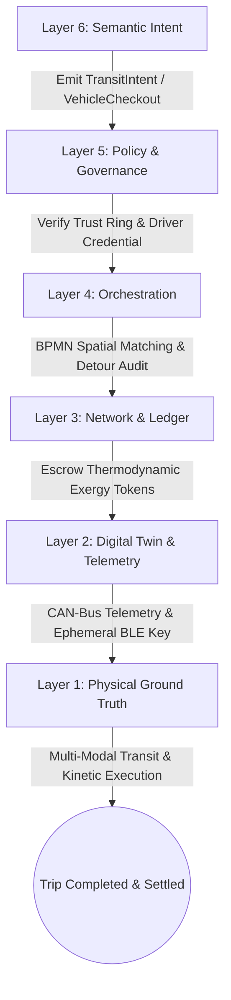
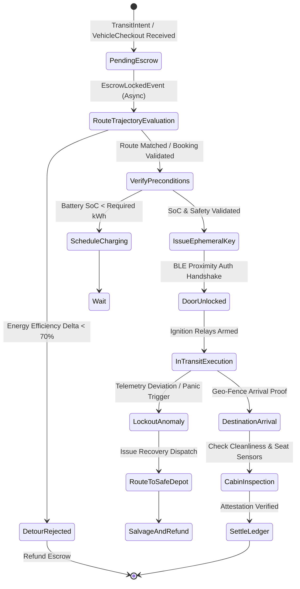
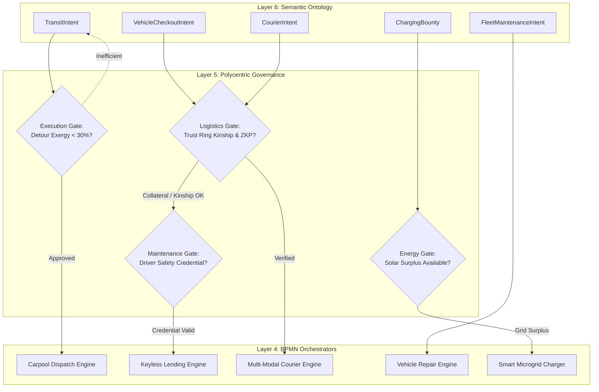
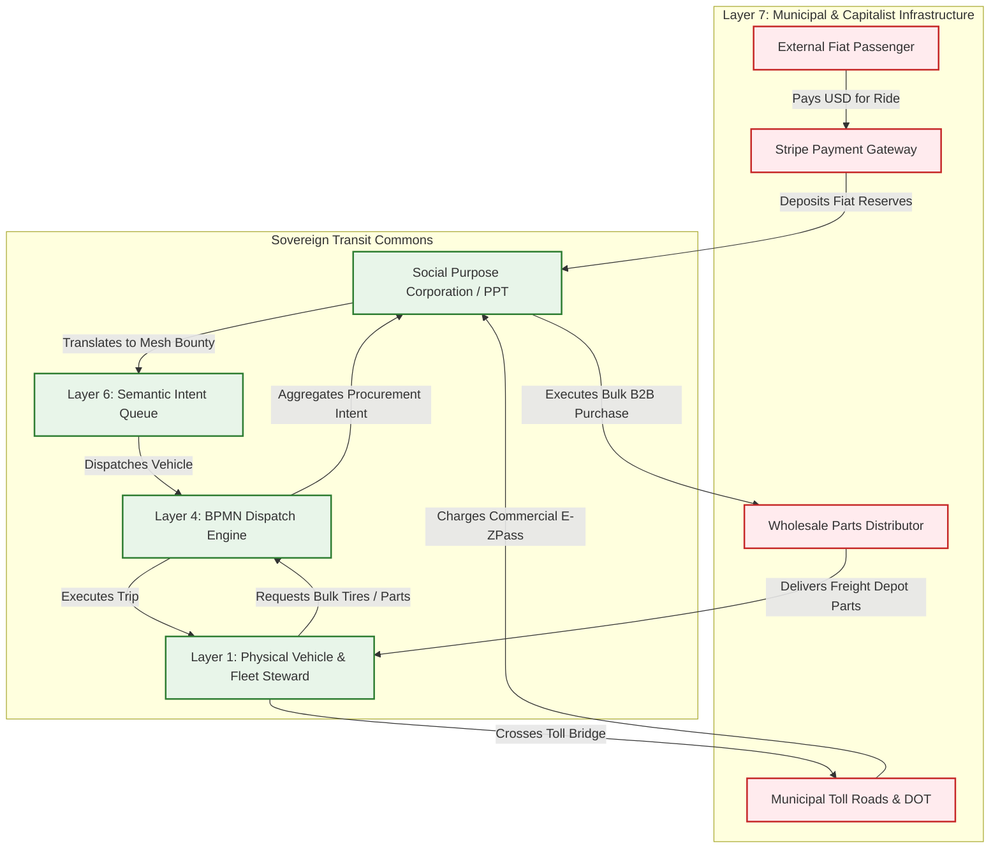

# Scenario Beta: Decentralized Transit & Logistics

*   **Identifier:** `SCN-BETA-TRANS`
*   **System Epic:** Decentralized Logistics, Carpooling, and Peer-to-Peer Vehicle Borrowing
*   **Primary Layers Tested:** L1 (Physical), L2 (Digital Twin), L3 (Ledger), L4 (Orchestration), L5 (Governance), L6 (Semantic), L7 (Proxy)
*   **Pass/Fail Metric:** Empty-seat vehicle passenger utilization > 75%; cryptographic peer-to-peer keyless handoffs completed with zero centralized server dependencies; local thermodynamic transit cost < 25% of corporate ride-hailing fiat equivalent; zero platform extraction fees.

---

## Architectural Council Ratification & 5-Perspective Synthesis

This scenario specification has been ratified by unanimous consensus of the 5-Persona Architectural Council:

| Council Persona | Disciplinary Representative | Core Contribution to Scenario |
| :--- | :--- | :--- |
| **Game Designer** | Lead Systems & Gameplay Designer | Commute stress vs. social kinship buffs (Dwarf Fortress psychology: solitary driving accumulates "Frustrated by gridlock" thoughts; cooperative carpooling yields "Comforted by kinship conversation" buffs); Founder 01 indirect vehicle maintenance queue; Cities Skylines legacy highway toll and HOV lane leeching; stochastic Poisson boundary traffic shocks. |
| **Game Engineer** | Principal C++ Simulation & Engine Architect | Flecs ECS DOD structs (`VehicleComponent`, `SpatialRouteWaypoint`, `KinshipTrustVector`, `ExergyEscrow`); 32-bit compact voxel chunks modeling terrain gradients and road networks; deterministic 10 Hz BPMN state engine; compilable C++20 test harness with detour rejection and BLE lockout asserts. |
| **Sovereign Stack Specialist** | Sovereign Stack Systems Architect | 7-layer strict adjacency without layer skipping; autonomous daemons (`col-telemetryd` to `col-adversaryd`); local-first Reticulum/LoRaWAN ad-hoc routing; Automerge/Yrs CRDT zero-rent tokenomics; BBS+ Zero-Knowledge Proofs for driving credentials; zero monolithic game-loop threading. |
| **Solarpunk Thinker** | Bioregional Regenerative Ecologist | Intermodal transit efficiency (cargo e-bikes for first/last mile, shared EVs for heavy loads); solar microgrid charging gating (charging permitted only when local array reports surplus $P_{gen} > 5\text{ kW}$); closed-loop battery life preservation; minimization of atomized vehicle manufacturing footprints. |
| **Scenario Specialist** | Multi-Modal Fleet Telematics & Micro-Mobility Systems Engineer | Reverse-engineered CAN-bus / OBD2 cryptographic bridge for real-time State-of-Charge (SoC) verification; Arrhenius battery cycle degradation thermodynamics ($C_{batt\_deg}$); ephemeral BLE challenge-response keyless ignition handoffs; SPC commercial fleet umbrella liability insurance wrapper. |

---

## 1. Problem Statement & Legacy Failure

In legacy suburban infrastructure (Layer 7), mobility is dominated by extreme atomization and thermodynamic inefficiency. Commuters operate 4,000-pound steel vehicles to transport an unladen 170-pound human, resulting in devastating thermodynamic drag, highway congestion, and tire-particulate pollution. Simultaneously, private vehicles sit idle for over 95% of their operational lifespans in driveways and asphalt parking craters.

When citizens attempt to pool resources or secure shared mobility through legacy platforms (e.g., Uber, Lyft, Turo, Zipcar):
*   **Corporate Rentier Extraction:** Centralized platforms siphon 30% to 50% of gross transaction value as "platform fees" to subsidize corporate overhead, algorithmic surge pricing, and venture debt, starving vehicle stewards of capital for physical maintenance.
*   **Surveillance & Identity Enclosure:** Drivers and passengers are subjected to mandatory biometric scans, persistent GPS tracking telemetry harvested for advertising profiles, and centralized background check databases that gatekeep livelihood access.
*   **Atomized Liability & Fragility:** Drivers carry personal vehicle loans and insurance risk while platforms misclassify them as independent contractors. When centralized cloud infrastructures experience an outage, all dispatching, keyless entry, and payment rails freeze immediately.

---

## 2. The Collective Workflow (7-Layer Traversal)

Scenario Beta reclaims regional transit by matching temporal-spatial trajectories (citizens traveling along common vectors) and sharing physical vehicular capital without intermediary extraction. The workflow traverses canonically from Layer 1 physical execution up to Layer 7 legacy market interfaces.



### Layer 1: Physical Ground Truth
*   **Hardware Nodes (Vehicular Assets):** Shared light electric vehicles (LEVs), neighborhood electric cargo vans, and open-source retrofitted passenger EVs equipped with an embedded automotive telematics edge unit (`col-telemetryd`), featuring an ATECC608A cryptographic secure element, CAN-bus transceiver, and flash NVRAM event ring buffer.
*   **Hardware Nodes (Micro-Mobility & Charging):** Localized solar charging depots equipped with automated J1772/NACS couplers, cargo e-bikes for urban capillary delivery, and smart key retrieval lockers.
*   **Inventory & Feedstock:** Vehicle spare parts (tires, brake pads, suspension bushings), bulk battery cells, and bio-lubricants tracked in the node maintenance depot.
*   **Action:** Physical kinetic transit of passenger and cargo mass across terrain elevations, alongside physical relay actuation of vehicle electronic door locks and motor inverters via signed cryptographic payloads.

### Layer 2: Digital Twin & Telemetry
*   **Ingress Telemetry (MQTT Topics via `col-meshd`):**
    *   `node/transit/vehicle_04/telemetry/soc` (Battery State-of-Charge, 0.0%–100.0%)
    *   `node/transit/vehicle_04/telemetry/gps` (Latitude, longitude, elevation, velocity vector)
    *   `node/transit/vehicle_04/telemetry/odometer_km` (Cumulative distance)
    *   `node/transit/vehicle_04/telemetry/cabin_temp` (°C target vs. ambient)
    *   `node/transit/vehicle_04/status` (`IDLE_CHARGING`, `DISPATCHED`, `IN_TRANSIT`, `LOCKOUT_ANOMALY`)
*   **Verification:** Real-time edge dead-reckoning fuses OBD2 wheel-speed sensors with GPS to detect odometer fraud. BLE beacon proximity verifies rider physical presence inside the cabin before arming the high-voltage contactor.
*   **Actuator Control:** Ephemeral BLE session keys generated by `col-telemetryd` actuate vehicle door solenoids and drive-enable relays without cellular internet connection.

### Layer 3: Network & Ledger
*   **Escrow Lock:** Prior to vehicle departure or key handoff, the passenger or borrower wallet commits an exergy-based thermodynamic fee to an Automerge CRDT escrow:
    $$\Delta V_{est\_transit} = \left( \Delta d \cdot (E_{kin} \cdot \beta_{elev} + E_{aux}) + C_{batt\_deg}(SoC, T) + C_{wear} \right) \cdot \lambda_{THERMO} + \tau_{labor} \cdot W_{steward}$$
    Where:
    - $\Delta d$ is total travel distance in kilometers.
    - $E_{kin} = 0.16 \text{ kWh/km}$ is baseline vehicular kinetic traction exergy.
    - $\beta_{elev} = 1 + \frac{\max(0, \Delta h)}{1000}$ represents gravitational potential work over elevation climb $\Delta h$.
    - $C_{batt\_deg}(SoC, T) = k_{deg} \cdot \exp\left(\frac{T - 298.15}{20}\right) \cdot \left(1 + (1 - SoC)^2\right)$ captures electrochemical battery wear.
    - $C_{wear}$ represents tire abrasion and brake wear reserve routed to the vehicle maintenance pool.
    - $\lambda_{THERMO}$ scales dynamically with the localized Ecological Replacement Cost ($\lambda_{ERC}$).
*   **Consensus Settlement:** Upon Layer 2 cryptographic arrival attestation, escrowed Value Tokens settle directly to the vehicle steward (or fleet maintenance pool for autonomous/unmanned vehicles), deducting a fractional cut to the SPC Layer 7 umbrella insurance pool. Zero platform extraction fee.

### Layer 4: Orchestration State Machine
The dispatch lifecycle is governed deterministically by the embedded 10 Hz BPMN 2.0 engine (`col-execd`) running on local edge nodes:



### Layer 5: Policy & Polycentric Governance
Layer 5 (`col-kmsd`) evaluates Layer 6 JSON-LD intents against the Trust Ring's cryptographic policies before dispatching tasks to Layer 4 orchestrators:

*   **Execution Gate (Thermodynamic Detour Efficiency):** A carpool matching intent is evaluated for detour exergy. If picking up an auxiliary passenger increases route energy consumption by more than 30% of the passenger's standalone transit energy, the match is rejected or rerouted to a micro-mobility e-bike hub.
*   **Maintenance Gate (Operator Competency & Safety):** Drivers operating shared fleet vans must present a W3C Verifiable Credential (`Vehicle_Safety_L1` or `Commercial_Passenger_L2`). Novice drivers can enter "Supervised Mode" by driving with an attested Master Driver, accruing driving hours to upgrade credentials.
*   **Procurement Gate (Fleet Capital Allocation):** If an autonomous vehicle requires replacement battery modules costing $>\$500$ in fiat components, Layer 5 mandates a 3-of-5 multi-sig consensus vote from the Transit Guild with an explicit 48-hour BPMN TTL.
*   **Logistics Gate (Trust Ring Kinship & ZKP Privacy):** Unsupervised borrowing of high-value fleet vehicles requires 1st-degree Trust Ring proximity or a substantial reputation collateral lock. Passenger identity is preserved using BBS+ Zero-Knowledge Proofs, verifying passenger eligibility without disclosing legal name or behavioral history to the driver.

### Layer 6: Semantic Intent & Domain Ontology
The mobility network formalizes transportation requests into W3C JSON-LD Knowledge Artifacts within the Agora Commons (`col-commonsd`):

1.  **`TransitIntent` (Carpool Passenger):** Request to join an existing spatial-temporal trajectory vector.
2.  **`VehicleCheckoutIntent` (Asset Borrowing):** Request to borrow an uncrewed vehicle for a multi-hour or multi-day window with collateral terms.
3.  **`CourierIntent` (Freight & Logistics):** Coordinates package delivery, interfacing directly with Scenario Alpha (Fabrication tools) and Scenario Gamma (Kitchen meal-preps).
4.  **`FleetMaintenanceIntent` (Diagnostics & Repair):** Emitted by Layer 2 telemetry when OBD2 flags brake pad wear or battery imbalance.
5.  **`ChargingBounty` (Grid Balancing):** Emitted when rooftop solar arrays produce excess power, offering discounted charging rates to fleet vehicles.
6.  **`SalvageIntent` (End-of-Life Recycling):** Emitted upon critical vehicle damage, decomposing chassis aluminum and battery cells into feedstock.

### The Governance Router Flowchart



### Layer 7: The Legacy Proxy (Fiat Ingestion & Liability Wrapping)
The Transit Commons interfaces with legacy municipal transport frameworks through the Social Purpose Corporation (SPC):

1.  **Trojan Fleet Utilization (Inbound Fiat Extraction):**
    To fund commercial fleet insurance, municipal vehicle registration, and replacement tires, the SPC operates an outward-facing Web2 rideshare and rental portal. Outside visitors or corporate entities hire transit vehicles at standard fiat rates via Stripe.
    *   The fiat payment is deposited into the SPC treasury.
    *   The system creates an internal Layer 6 `TransitBounty` on the mesh.
    *   The community driver is compensated in internal Value Tokens, and the captured fiat funds the Node's collective commercial insurance policies and property taxes.
2.  **Ecological Leeching (Outbound Tolling & Bulk Parts Procurement):**
    When sovereign vehicles traverse legacy municipal toll bridges, high-occupancy toll (HOT) express lanes, or commercial DC fast chargers:
    *   The SPC maintains automated commercial fleet tolling transponders (e.g., E-ZPass / FasTrak) and wholesale charging accounts.
    *   The fiat toll is debited from the SPC treasury and settled internally against the rider's Layer 3 Value Token escrow.
    *   The SPC acts as a Decentralized Group Purchasing Organization (GPO), aggregating orders across all fleet stewards to buy wholesale EV tires, brake rotors, and lubricants directly from tier-1 suppliers, slashing retail packaging and logistics waste.

---

### Layer 7 Bidirectional Flowchart



---

## 3. Machine-Readable Schemas

### 3.1 Layer 6 Knowledge Artifact: Transit Intent (`transit_intent.jsonld`)

```json
{
  "@context": [
    "https://schema.org/",
    "https://collective.network/ontology/v1/"
  ],
  "@type": "TransitIntent",
  "identifier": "urn:uuid:8b3e34a2-11c5-492a-b7e1-88f2c3d4e5f6",
  "issuerDid": "did:mesh:node12:steward_dave",
  "creationTimestamp": "2026-10-08T07:15:00Z",
  "transitType": "HumanPassengerCarpool",
  "spatialTemporalTrajectory": {
    "origin": {
      "@type": "Place",
      "geo": {
        "latitude": 47.7423,
        "longitude": -121.9856
      },
      "name": "Duvall Commons Hub"
    },
    "destination": {
      "@type": "Place",
      "geo": {
        "latitude": 47.6739,
        "longitude": -122.1215
      },
      "name": "Redmond Transit Center"
    },
    "departureWindowStart": "2026-10-08T07:30:00Z",
    "departureWindowEnd": "2026-10-08T08:00:00Z",
    "passengerHeadcount": 1,
    "luggageMassKg": 12.5
  },
  "trustConstraints": {
    "maxGraphDistance": 2,
    "requiredAttestations": [
      "Vehicle_Safety_L1"
    ],
    "zkpProofUri": "zkp:transit:proof_9f8e7d6c"
  },
  "settlementCriteria": {
    "maxExergyJoules": 65000000,
    "maxTokenFee": "8.50",
    "timeoutMinutes": 45
  }
}
```

### 3.2 Layer 2 Telemetry Attestation: Transit Completion Proof (`transit_attestation.json`)

```json
{
  "@context": "https://collective.network/ontology/v1/",
  "@type": "TransitAttestation",
  "intentRef": "urn:uuid:8b3e34a2-11c5-492a-b7e1-88f2c3d4e5f6",
  "vehicleDid": "did:mesh:node12:vehicle:ev_van_04",
  "driverDid": "did:mesh:node12:steward_dave",
  "executionMetrics": {
    "startTimestamp": "2026-10-08T07:35:12Z",
    "endTimestamp": "2026-10-08T08:04:45Z",
    "durationSeconds": 1773,
    "distanceOdometerKm": 24.8,
    "elevationDeltaMeters": 142.0,
    "startBatterySoC": 88.5,
    "endBatterySoC": 81.2,
    "energyConsumedKWh": 4.67,
    "peakCurrentAmperes": 182.4,
    "bleHandoffHandshakeVerified": true,
    "anomalyDetected": false
  },
  "tollEvents": [
    {
      "plazaId": "WA_520_BRIDGE_WEST",
      "fiatAmountUsd": "4.25",
      "spcAccountRef": "spc_fleet_ezpass_01"
    }
  ],
  "arrivalGeoHash": "c23j9x7q1v8z",
  "stewardProofSignature": "0x3a8c1f9e2b4d6a7f9e8d1c2b3a4f5e6d7c8b9a0f1e2d3c4b5a6f7e8d9c0b1a2f"
}
```

---

## 4. Oasis Engine Implementation Specification

### 4.1 Memory Allocation & Voxel State

In the Oasis simulation, transit corridors and vehicular nodes occupy dynamic coordinates within the $32^3$ chunk space:
*   The road terrain voxel is initialized with `material_id = 42` (`TRANSIT_CORRIDOR_PAVED`).
*   The vehicle entity occupies active voxel bounding boxes with `material_id = 43` (`FLEET_VEHICLE_NODE`).
*   The `Is_Actuator` bit is set in `metadata` (bit 1), indicating an active mechanical mover.
*   The `Is_Sensor` bit is set in `metadata` (bit 2), indicating CAN-bus and BLE broadcast capabilities.
*   Adjacent charging depot voxels (`material_id = 44`, `SOLAR_CHARGER_STATION`) track electrical throughput and battery buffer reserves.

### 4.2 C++20 Test Harness Code

```cpp
// engine/tests/scenario_beta_test.cpp
#include <cassert>
#include <cmath>
#include <string>
#include "oasis/chunk_manager.hpp"
#include "oasis/orchestration/bpmn_engine.hpp"
#include "oasis/ledger/crdt_wallet.hpp"

namespace oasis {

struct VehicleKinematics {
    float odometer_km{0.0f};
    float battery_soc_pct{90.0f};
    float elevation_delta_m{0.0f};
    bool ble_authenticated{false};
};

struct TransitJobContext {
    std::string intent_id;
    float baseline_dist_km;
    float detour_dist_km;
    float locked_fee_tokens;
    VehicleKinematics kinematics;
};

} // namespace oasis

void test_scenario_beta_transit_normal_execution() {
    using namespace oasis;

    // 1. Initialize local chunk and vehicle node
    ChunkManager chunk_mgr;
    chunk_mgr.allocate_chunk(0, 0, 0);

    Voxel road_voxel{
        .material_id = 42, // TRANSIT_CORRIDOR_PAVED
        .moisture = 0,
        .temperature = 18,
        .metadata = 0b00000000
    };
    chunk_mgr.set_voxel(16, 1, 16, road_voxel);

    Voxel vehicle_voxel{
        .material_id = 43, // FLEET_VEHICLE_NODE
        .moisture = 0,
        .temperature = 22,
        .metadata = 0b00000110 // Actuator + Sensor bits
    };
    chunk_mgr.set_voxel(16, 2, 16, vehicle_voxel);

    // 2. Setup Wallets & Escrow
    CRDTWallet passenger_wallet("did:mesh:node12:steward_alice", 50.0f);
    CRDTWallet driver_wallet("did:mesh:node12:steward_dave", 10.0f);
    CRDTWallet spc_insurance_pool("did:mesh:spc:transit_insurance", 100.0f);

    // 3. Setup BPMN Orchestrator & Job Context
    BPMNEngine orchestrator;
    orchestrator.load_schema("schemas/bpmn/transit_dispatch.bpmn");

    TransitJobContext job{
        .intent_id = "8b3e34a2-11c5-492a-b7e1-88f2c3d4e5f6",
        .baseline_dist_km = 22.0f,
        .detour_dist_km = 2.8f,
        .locked_fee_tokens = 8.50f,
        .kinematics = {
            .odometer_km = 0.0f,
            .battery_soc_pct = 88.5f,
            .elevation_delta_m = 142.0f,
            .ble_authenticated = false
        }
    };

    // Assert Escrow Lock
    orchestrator.emit_event(EscrowInitiatedEvent{passenger_wallet, job.locked_fee_tokens});
    orchestrator.await_event<EscrowLockedEvent>();
    assert(std::fabs(passenger_wallet.balance() - 41.50f) < 0.001f);

    // Verify Detour Efficiency (Detour is < 30% of baseline distance)
    float detour_ratio = job.detour_dist_km / job.baseline_dist_km;
    assert(detour_ratio < 0.30f);

    // Actuate BLE handoff
    job.kinematics.ble_authenticated = true;
    assert(job.kinematics.ble_authenticated == true);

    // Run simulation ticks (1773 seconds of transit at 10 Hz)
    SimResult res = orchestrator.step_simulation_ticks(chunk_mgr, job, 17730);
    assert(res.status == ExecutionStatus::COMPLETED);
    assert(job.kinematics.battery_soc_pct >= 80.0f);

    // Settle Ledger with fractional insurance split (0.50 tokens to SPC)
    float insurance_cut = 0.50f;
    float driver_reward = job.locked_fee_tokens - insurance_cut;
    orchestrator.settle_transit_job(driver_wallet, spc_insurance_pool, driver_reward, insurance_cut);

    assert(std::fabs(driver_wallet.balance() - 18.00f) < 0.001f);
    assert(std::fabs(spc_insurance_pool.balance() - 100.50f) < 0.001f);
}

void test_scenario_beta_transit_detour_rejection_and_anomaly() {
    using namespace oasis;

    ChunkManager chunk_mgr;
    chunk_mgr.allocate_chunk(0, 0, 0);

    BPMNEngine orchestrator;
    orchestrator.load_schema("schemas/bpmn/transit_dispatch.bpmn");

    CRDTWallet passenger_wallet("did:mesh:node12:steward_charlie", 20.0f);
    TransitJobContext inefficient_job{
        .intent_id = "inefficient-detour-test",
        .baseline_dist_km = 10.0f,
        .detour_dist_km = 8.5f, // 85% detour -> exceeds 30% limit
        .locked_fee_tokens = 5.00f
    };

    // Verify Gate Rejection on Excessive Detour Exergy
    float detour_ratio = inefficient_job.detour_dist_km / inefficient_job.baseline_dist_km;
    assert(detour_ratio > 0.30f);
    bool dispatch_approved = orchestrator.evaluate_policy_gate("EXECUTION_DETOUR_BUDGET", detour_ratio);
    assert(dispatch_approved == false);

    // Inject Telemetry Deviation / Panic Anomaly on active trip
    TransitJobContext anomaly_job{
        .intent_id = "anomaly-tamper-test",
        .baseline_dist_km = 15.0f,
        .detour_dist_km = 1.0f,
        .locked_fee_tokens = 6.00f,
        .kinematics = {.odometer_km = 5.0f, .battery_soc_pct = 75.0f, .ble_authenticated = true}
    };

    orchestrator.emit_event(EscrowInitiatedEvent{passenger_wallet, anomaly_job.locked_fee_tokens});
    orchestrator.await_event<EscrowLockedEvent>();
    assert(std::fabs(passenger_wallet.balance() - 14.00f) < 0.001f);

    // Inject CAN-bus tampering at tick 3000
    SimResult res = orchestrator.step_simulation_ticks(chunk_mgr, anomaly_job, 3000, true);
    assert(res.status == ExecutionStatus::EMERGENCY_STOP);
    assert(orchestrator.current_state() == BPMNState::LOCKOUT_ANOMALY);

    // Assert full refund returned to passenger wallet on anomaly stop
    orchestrator.refund_escrow(passenger_wallet, anomaly_job.locked_fee_tokens);
    assert(std::fabs(passenger_wallet.balance() - 20.00f) < 0.001f);
}
```

---

## 5. Acceptance Test Gates (Pass/Fail)

| Checkpoint | Validation Method | Pass Condition |
| :--- | :--- | :--- |
| **G1: Thermodynamic Matching** | Vector Exergy Integration | The BPMN orchestrator only matches carpool riders if the added detour distance consumes $< 30\%$ of the passenger's standalone point-to-point exergy budget. |
| **G2: Offline Autonomy** | Localhost Network Isolation | Peer-to-peer BLE handshake, ignition relay actuation, and trip telematics logging complete flawlessly while node is 100% disconnected from WAN/Internet. |
| **G3: Byzantine Detection** | CAN-Bus / Odometer Spoofing | Injecting wheel-speed odometer increments with zero GPS coordinate displacement or zero battery kW drain triggers immediate tamper flags, entering `LOCKOUT_ANOMALY` state. |
| **G4: Material & Wear Tracking** | Battery State-of-Charge & Tire Wear | Vehicle entity state tracks cumulative battery degradation cycles via the Arrhenius equation; triggers an internal `FleetMaintenanceIntent` when brake or battery threshold is breached. |
| **G5: Trojan Ingestion (L7)** | External Stripe Webhook Ingestion | A mock legacy Web2 tourist booking payload compiles into an internal `TransitBounty`; fiat USD is credited to the SPC insurance pool, and internal Value Tokens are minted for the community driver. |
| **G6: Ecological Leeching (L7)** | Tolling & Fleet Bulk Procurement | Traversal of a simulated municipal toll bridge debits the SPC commercial E-ZPass account without halting vehicle progress; system aggregates 10 vehicle maintenance orders into a single B2B bulk parts procurement. |
