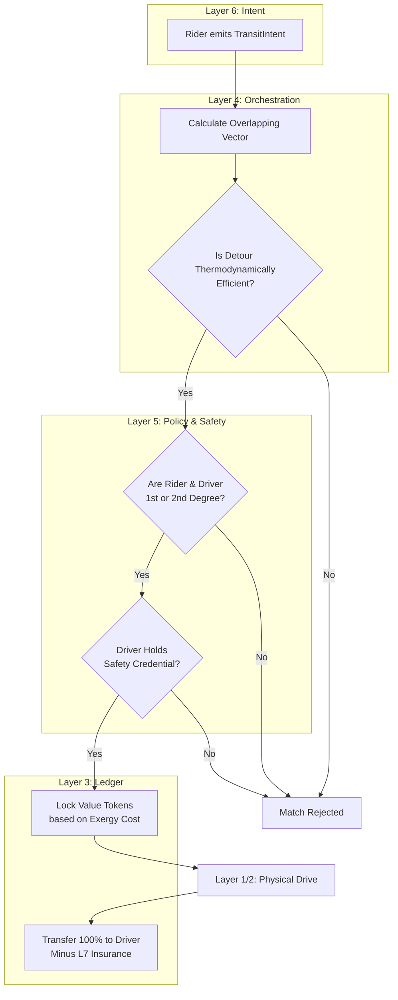

# Scenario Beta: Decentralized Transit & Logistics

*   **Identifier:** `SCN-BETA-TRANS`
*   **System Epic:** Decentralized Logistics, Carpooling, and Peer-to-Peer Routing
*   **Primary Layers Tested:** L2 (Twin), L3 (Ledger), L4 (Orchestrator), L5 (Governance), L6 (Semantic), L7 (Proxy)
*   **Pass/Fail Metric:** Empty-seat vehicle passenger utilization > 75%; zero platform extraction fees; driver compensated at strict thermodynamic + labor replacement cost.

---

## 1. Problem Statement & Legacy Failure

In the legacy system, mobility is heavily atomized and predatory. Commuters move 4,000 pounds of steel to transport a single 170-pound human, resulting in massive exergy waste (traffic, carbon drag). 
When humans attempt to pool resources via legacy platforms (Uber, Lyft), the corporate Layer 7 extracts 30% to 50% of the transaction as a "platform fee." Furthermore, safety is outsourced to centralized background checks rather than community trust, and insurance liability rests heavily on the atomized individual.

## 2. The Collective Workflow (7-Layer Traversal)

Scenario Beta reclaims transit by matching temporal-spatial vectors (people going the same way at the same time) without a centralized middleman extracting rent.

### Layer 7: The Legacy Proxy (Insurance & Tolls)
*   **Commercial Shield:** The Social Purpose Corporation (SPC) acts as a legal shield. It holds a commercial fleet or rideshare umbrella insurance policy. When a Steward drives for the mesh, they are legally operating under the SPC’s liability wrapper, protecting their personal assets.
*   **Toll Ingestion:** The SPC pays legacy fiat tolls (e.g., bridge tolls, public EV charging) and converts those costs into the internal Value Token escrow.

### Layer 6: Semantic Intent
*   Users emit a `TransitIntent` (moving a human) or a `CourierIntent` (moving a package, hooking into Scenario Alpha's logistics).
*   The intent defines the spatial vector (Start Node to End Node), temporal constraints (must arrive by 09:00), and accessibility needs.

### Layer 5: Policy & Web of Trust (Safety Gate)
*   **Kinship Routing:** You do not ride with random strangers. Layer 5 calculates the shortest cryptographic trust path between the Rider and the Driver. If they are not 1st-degree (friends) or 2nd-degree (friends of friends) connections within a recognized Trust Ring, the match is rejected or requires a higher collateral stake.
*   **Safety Attestations:** Drivers must hold a valid `Vehicle_Safety_L1` Verifiable Credential.

### Layer 4: Orchestration (Spatial-Temporal Matching)
*   The BPMN engine acts as a localized dispatch. It does not run on a central server; it operates on the local edge nodes, gossiping spatial vectors.
*   It calculates the thermodynamic efficiency of a detour. If picking up a rider requires a 5-mile detour for a 2-mile shared route, the orchestrator rejects the match as a net-negative exergy action.

### Layer 3: Ledger & Escrow
*   The cost of the ride is strictly calculated based on physical realities: `(Distance * EV_kWh_Cost * Wear_Depreciation) + Steward_Time_Bounty`.
*   Zero platform fees. 100% of the Value Tokens locked in escrow by the Rider go directly to the Driver (minus a fractional fraction deposited into the SPC's Layer 7 insurance pool).

### Layer 2 & 1: Digital Twin & Physical Reality
*   **Telemetry (L2):** The driver's mobile device or EV telemetry API broadcasts GPS coordinates and state-of-charge via MQTT to the local mesh during the active workflow.
*   **Physical (L1):** The actual movement of human mass and vehicle chassis across the physical terrain.

---



---

## 3. Oasis Engine Implementation Specification

In the Oasis C++ simulation, vehicles are treated as mobile voxels or entities that traverse the chunk grid.

*   **Vector Math:** The engine must parse the starting chunk and destination chunk for multiple NPC/player entities.
*   **Matching Algorithm:** The orchestrator must successfully identify when two entities have overlapping trajectory vectors within a specific time window.
*   **Ledger Validation:** The engine must correctly calculate the "Exergy Cost" of moving the vehicle entity across the terrain (factoring in terrain elevation and distance) and execute the CRDT wallet transfer upon arrival at the destination chunk.

---

```json
{
  "@context": [
    "[https://schema.org/](https://schema.org/)",
    "[https://collective.network/ontology/v1/](https://collective.network/ontology/v1/)"
  ],
  "@type": "TransitIntent",
  "identifier": "urn:uuid:8b3e34a2-11c5-492a-b7e1-88f2c3d4e5f6",
  "issuerDid": "did:mesh:node12:steward_dave",
  "transitType": "HumanPassenger",
  "routeParameters": {
    "origin": {
      "@type": "Place",
      "geo": {
        "latitude": 47.7423,
        "longitude": -121.9856
      },
      "name": "Duvall Commons Hub"
    },
    "destination": {
      "@type": "Place",
      "geo": {
        "latitude": 47.6739,
        "longitude": -122.1215
      },
      "name": "Redmond Transit Center"
    },
    "departureWindowStart": "2026-10-02T07:30:00Z",
    "departureWindowEnd": "2026-10-02T08:00:00Z"
  },
  "trustConstraints": {
    "maxGraphDistance": 2,
    "requiredAttestations": ["Vehicle_Safety_L1"]
  },
  "escrowCapacity": {
    "maxValueTokens": "8.50"
  }
}
```

---

## 4. Acceptance Test Gates (Pass/Fail)

| Checkpoint | Validation Method | Pass Condition |
| :--- | :--- | :--- |
| **G1: Thermodynamic Matching** | Vector Efficiency | The BPMN orchestrator only matches riders if the shared route distance is $> 70\%$ of the driver's total detour distance. |
| **G2: Trust Ring Safety** | Cryptographic Graph Traversal | Route matching fails instantly if the Rider and Driver do not share at least one mutual node in their Web of Trust graph. |
| **G3: Zero-Rent Ledger** | Token Settlement | Rider wallet decrements by $X$. Driver wallet increments by $X - Y$ (where $Y$ is the strict mathematical cost of the L7 insurance fraction). No corporate profit is taken. |
| **G4: Offline Gossip Routing**| Mesh Re-routing | If the primary cellular connection drops (simulated), the transit intent successfully hops via localized LoRa/WiFi-Direct to update the ETA. |
