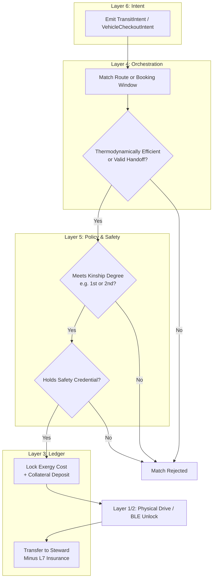

# Scenario Beta: Decentralized Transit & Logistics

*   **Identifier:** `SCN-BETA-TRANS`
*   **System Epic:** Decentralized Logistics, Carpooling, and Peer-to-Peer Vehicle Borrowing
*   **Primary Layers Tested:** L2 (Twin), L3 (Ledger), L4 (Orchestrator), L5 (Governance), L6 (Semantic), L7 (Proxy)
*   **Pass/Fail Metric:** Empty-seat vehicle passenger utilization > 75%; successful peer-to-peer vehicle handoffs without key physical exchange; zero platform extraction fees.

---

## 1. Problem Statement & Legacy Failure

In the legacy system, mobility is heavily atomized and predatory. Commuters move 4,000 pounds of steel to transport a single 170-pound human, resulting in massive exergy waste (traffic, carbon drag). Simultaneously, these personal vehicles sit parked and idle for >95% of their operational life.
When humans attempt to pool resources or share vehicles via legacy platforms (Uber, Lyft, Turo, Zipcar), the corporate Layer 7 extracts 30% to 50% of the transaction as a "platform fee." Furthermore, safety is outsourced to centralized background checks rather than community trust, and insurance liability rests heavily on the atomized individual.

## 2. The Collective Workflow (7-Layer Traversal)

Scenario Beta reclaims transit by matching temporal-spatial vectors (people going the same way at the same time) without a centralized middleman extracting rent.

### Layer 7: The Legacy Proxy (Insurance & Tolls)
*   **Commercial Shield:** The Social Purpose Corporation (SPC) acts as a legal shield. It holds a commercial fleet, rideshare, and peer-to-peer rental umbrella insurance policy. When a Steward drives for the mesh, or lends their vehicle to a trusted neighbor, they are legally operating under the SPC’s liability wrapper, protecting their personal assets.
*   **Toll Ingestion:** The SPC pays legacy fiat tolls (e.g., bridge tolls, public EV charging) and converts those costs into the internal Value Token escrow.

### Layer 6: Semantic Intent
*   Users emit a `TransitIntent` (ride-sharing along an existing route), a `VehicleCheckoutIntent` (borrowing/renting a vehicle for a vague or multi-day trip), or a `CourierIntent` (moving a package, hooking into Scenario Alpha).
*   The intent defines the spatial vector (Start Node to End Node), temporal constraints (must arrive by 09:00, or needs vehicle for 48 hours), and accessibility needs.

### Layer 5: Policy & Web of Trust (Safety Gate)
*   **Kinship Routing & Borrowing:** You do not ride with (or lend your car to) random strangers. Layer 5 calculates the shortest cryptographic trust path. Ride-sharing might allow 2nd-degree connections (friends of friends), while unsupervised vehicle borrowing might strictly enforce 1st-degree connections or require a massive reputational collateral lock.
*   **Safety Attestations:** Drivers (whether driving their own car or a borrowed one) must hold a valid `Vehicle_Safety_L1` Verifiable Credential.

### Layer 4: Orchestration (Spatial-Temporal Matching & Handoffs)
*   The BPMN engine acts as a localized dispatch operating on edge nodes.
*   For **Transit**: It calculates the thermodynamic efficiency of a detour. If a detour wastes more energy than it saves, the match is rejected.
*   For **Borrowing**: It orchestrates the asynchronous keyless handoff, managing booking windows and resolving scheduling conflicts without centralized servers.

### Layer 3: Ledger & Escrow
*   The cost of the trip is strictly calculated based on physical realities: `(Distance * EV_kWh_Cost * Wear_Depreciation) + Steward_Time_Bounty` (for rideshares).
*   For borrowing, the borrower locks a significant **collateral deposit** in escrow (released upon safe return) and pays only for depreciation and energy consumed. 
*   Zero platform fees. 100% of the Value Tokens locked in escrow go directly to the vehicle Steward (minus a fractional cut to the SPC's Layer 7 insurance pool).

### Layer 2 & 1: Digital Twin & Physical Reality
*   **Telemetry (L2):** The vehicle's OBD2/API broadcasts GPS coordinates, odometer readings, and state-of-charge via MQTT to the local mesh.
*   **Digital Key Handoff (L2/L1):** For vehicle borrowing, the smart contract provisions a temporary, cryptographically signed BLE digital key to the borrower's mobile device, actuating the vehicle's physical locks and ignition without manual key exchange.
*   **Physical (L1):** The actual movement of human mass and vehicle chassis across the physical terrain.

---



---

## 3. Oasis Engine Implementation Specification

In the Oasis C++ simulation, vehicles are treated as mobile voxels or entities that traverse the chunk grid.

*   **Vector Math:** The engine must parse the starting chunk and destination chunk for multiple NPC/player entities.
*   **Matching Algorithm:** The orchestrator must successfully identify when two entities have overlapping trajectory vectors within a specific time window.
*   **Ledger Validation:** The engine must correctly calculate the "Exergy Cost" of moving the vehicle entity across the terrain (factoring in terrain elevation and distance) and execute the CRDT wallet transfer upon arrival at the destination chunk.

---

```json
{
  "@context": [
    "[https://schema.org/](https://schema.org/)",
    "[https://collective.network/ontology/v1/](https://collective.network/ontology/v1/)"
  ],
  "@type": "TransitIntent",
  "identifier": "urn:uuid:8b3e34a2-11c5-492a-b7e1-88f2c3d4e5f6",
  "issuerDid": "did:mesh:node12:steward_dave",
  "transitType": "HumanPassenger",
  "routeParameters": {
    "origin": {
      "@type": "Place",
      "geo": {
        "latitude": 47.7423,
        "longitude": -121.9856
      },
      "name": "Duvall Commons Hub"
    },
    "destination": {
      "@type": "Place",
      "geo": {
        "latitude": 47.6739,
        "longitude": -122.1215
      },
      "name": "Redmond Transit Center"
    },
    "departureWindowStart": "2026-10-02T07:30:00Z",
    "departureWindowEnd": "2026-10-02T08:00:00Z"
  },
  "trustConstraints": {
    "maxGraphDistance": 2,
    "requiredAttestations": ["Vehicle_Safety_L1"]
  },
  "escrowCapacity": {
    "maxValueTokens": "8.50"
  }
}
```

---

## 4. Acceptance Test Gates (Pass/Fail)

| Checkpoint | Validation Method | Pass Condition |
| :--- | :--- | :--- |
| **G1: Thermodynamic Matching** | Vector Efficiency | The BPMN orchestrator only matches riders if the shared route distance is $> 70\%$ of the driver's total detour distance. |
| **G2: Trust Ring Safety** | Cryptographic Graph Traversal | Route matching fails instantly if the Rider and Driver do not share at least one mutual node in their Web of Trust graph. |
| **G3: Zero-Rent Ledger** | Token Settlement | Rider wallet decrements by $X$. Driver wallet increments by $X - Y$ (where $Y$ is the strict mathematical cost of the L7 insurance fraction). No corporate profit is taken. |
| **G4: Offline Gossip Routing**| Mesh Re-routing | If the primary cellular connection drops (simulated), the transit intent successfully hops via localized LoRa/WiFi-Direct to update the ETA. |
