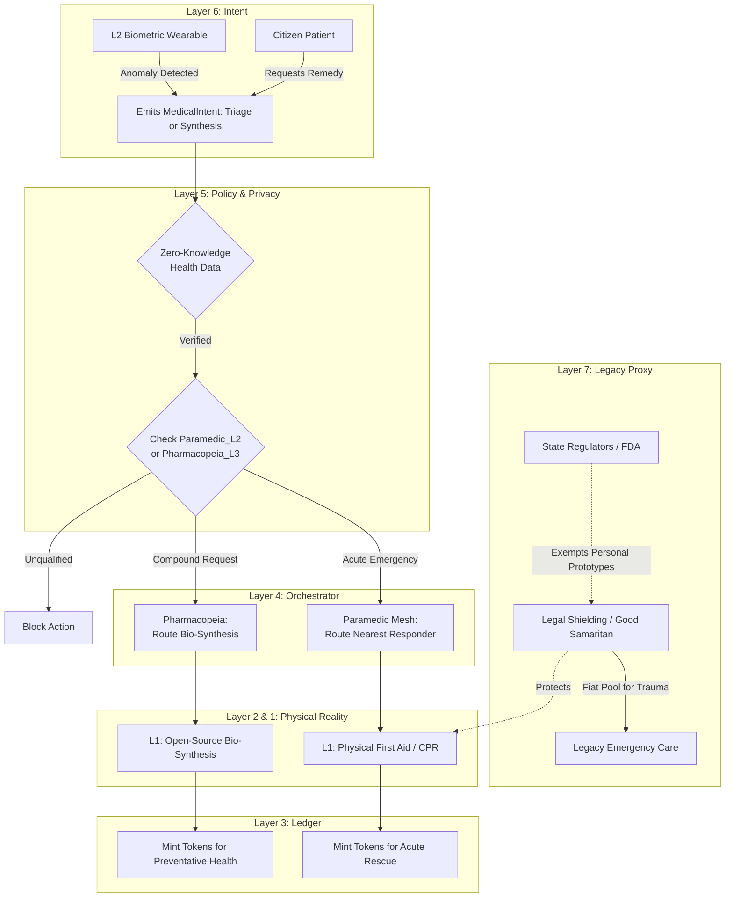

# Scenario Chi: Paramedic Mesh & Pharmacopeia

*   **Identifier:** `SCN-CHI-PARAMEDIC`
*   **System Epic:** Decentralized Triage, Open-Source Medicine, and Health Sovereignty
*   **Primary Layers Tested:** L1 (Physical), L2 (Twin), L3 (Ledger), L4 (Orchestrator), L5 (Governance), L6 (Semantic), L7 (Proxy)
*   **Pass/Fail Metric:** Successful decentralized dispatch of localized first responders to an acute medical event faster than legacy 911 benchmarks; successful open-source synthesis of a required biological compound; cryptographic enforcement of absolute privacy (Zero-Knowledge health data).

---

## 1. Problem Statement & Legacy Failure

The legacy healthcare system fails on two distinct fronts: time and access. 
First, acute trauma response is highly centralized. Legacy 911 dispatch can take 15 to 30 minutes to route an ambulance to a rural or suburban neighborhood, while a neighbor with EMT training might be sitting in the house next door, completely unaware of the emergency. 
Second, the legacy pharmaceutical cartel utilizes patent enclosure to restrict access to life-saving compounds (like insulin or epinephrine), artificially inflating prices to extract maximum fiat. The state acts as a rigid gatekeeper, functionally outlawing community-based preventative care. A sovereign Node cannot be truly independent if its citizens' biological survival relies on legacy dispatch algorithms and brittle, globalized supply chains.

## 2. The Collective Workflow (7-Layer Traversal)

Scenario Chi splits into two interconnected workflows: the **Paramedic Mesh** (acute, hyper-local trauma response) and the **Pharmacopeia** (long-term, open-source biological synthesis).

### Layer 7: The Legacy Proxy (Good Samaritan & FDA Shielding)
*   **Good Samaritan Shield:** The Social Purpose Corporation (SPC) provides legal architecture for the Paramedic Mesh. By strictly organizing as a private mutual aid society, citizens executing first aid (CPR, tourniquets) are protected from legacy civil liability under established Good Samaritan doctrines.
*   **The FDA Shield (Pharmacopeia):** To protect local bio-hackers and herbalists from federal prosecution, the SPC legally classifies all synthesized compounds and open-source hardware (e.g., 3D printed insulin pumps) as "Experimental Prototypes for Personal/Educational Use Only." There is no commercial fiat sale of drugs, placing the activity outside interstate commerce jurisdiction.

### Layer 6: Semantic Intent
*   **The Triage Hook:** L2 ambient sensors (like the fall-detection radar in **Scenario Phi**) or wearables emit an `AcuteTriage` intent.
*   **The Synthesis Hook:** Citizens emit a `SynthesisRequest` (e.g., "Requesting batch of open-source anti-inflammatory compound"). If the required compound formula isn't known locally, the Orchestrator routes an R&D bounty to **Scenario Iota (Epistemic Mesh)** to reverse-engineer the legacy patent.

### Layer 5: Policy & Web of Trust (The "Do No Harm" Gate)
*   **Proximity & Competency Gating:** When an `AcuteTriage` intent fires, Layer 5 calculates the Trust Ring graph. It directly pings the closest DIDs holding `Trauma_Care_L2` credentials. During an ecological shock (**Scenario Upsilon**), it utilizes offline LoRaWAN to ensure dispatch succeeds even if legacy cell towers are down.
*   **Absolute Data Privacy:** In legacy systems, health data is commodified. Here, it is cryptographically sovereign. Layer 5 utilizes Zero-Knowledge (ZK) proofs. A Paramedic can mathematically verify a patient is not allergic to a compound without ever gaining decryption access to the patient's lifelong health ledger.

### Layer 4: Orchestration (Dispatch, Fabrication & Apprenticeship)
*   **Paramedic Dispatch:** The BPMN engine acts as a decentralized 911 dispatcher. It routes the alert to the nearest qualified responder, instantly suspending their other pending intents (e.g., pausing their 3D print job or lowering the heat on their forge).
*   **Hardware Routing:** If a `SynthesisRequest` requires specialized diagnostic tools (e.g., an open-source centrifuge or insulin pump), Layer 4 routes a sub-bounty to **Scenario Alpha (Fabrication)** to print the parts, and **Scenario Theta (Foundry)** to cast the metal chassis.
*   **The Mentorship Bridge:** To ensure the Node never has a "single point of failure" for bio-synthesis, Layer 4 actively bridges with **Scenario Kappa (Apprenticeship)**, mathematically requiring Master Bio-Hackers to take on apprentices to disseminate the Pharmacopeia knowledge.

### Layer 3: Ledger (Minting Survival)
*   Legacy medicine profits from prolonged sickness. The Collective profits from resilience.
*   First responders are minted "Heroic Bounties" (Value Tokens) for executing acute triage. Pharmacopeia practitioners are minted Value Tokens from the community treasury based on *preventative outcomes*—keeping the Trust Ring healthy and out of the expensive legacy hospital system.

### Layer 2 & 1: Digital Twin & Physical Reality
*   **Telemetry (L2):** Open-source, air-gapped wearables (heart rate, blood oxygen) detect an anomaly (e.g., a massive heart rate drop) and automatically emit an `AcuteTriage` intent via MQTT without waiting for human input.
*   **Physical (L1):** Tourniquets, CPR, centrifuges, localized medicinal herb gardens, synthesized compounds, open-source hardware, and the physical act of saving a life.

---



---

## 3. Oasis Engine Implementation Specification

In the C++ Oasis engine, Scenario Chi tests real-time entity routing and complex biological state management:

*   **Biological Status Vectors:** `Player` and `NPC` entities possess a complex array of hidden health variables (`blood_volume`, `toxin_level`). If `blood_volume` drops below a critical threshold due to a physics collision (injury), the engine autonomously emits a high-priority P2P event.
*   **Paramedic Pathfinding:** The `BountyManager` must instantly query the `CredentialArray` of all entities within a 500-voxel radius. It overrides the current pathfinding target of the closest qualified entity, forcing them to navigate to the injured entity to execute a `STABILIZE` action.
*   **Compound Synthesis Logic:** Combining `BIOMASS_A` and `SOLVENT_B` in a `CENTRIFUGE` voxel requires exact tick-timing. Missing the temporal window converts the output voxel to `TOXIC_SLUDGE`, enforcing skill-based crafting over simple automated menus.

---

```json
{
  "@context": [
    "[https://schema.org/](https://schema.org/)",
    "[https://collective.network/ontology/v1/](https://collective.network/ontology/v1/)"
  ],
  "@type": "MedicalIntent",
  "identifier": "urn:uuid:d4e5f6g7-8a9b-0c1d-2e3f-4a5b6c7d8e9f",
  "issuerDid": "did:mesh:node04:citizen_kyle_wearable_01",
  "requestType": "AcuteTriage_Paramedic",
  "diagnosticContext": {
    "automatedTelemetry": "Severe_Laceration_Detected_Via_BloodPressure_Drop",
    "zeroKnowledgeDataUri": "zkp:health_vault:0x88f9a2b...",
    "disclosedAllergies": ["Latex"]
  },
  "dispatchParameters": {
    "targetLocationCoordinates": [47.7423, -121.9856],
    "requiredResponseTimeMinutes": 3,
    "overridePendingIntents": true
  },
  "trustConstraints": {
    "requiredCredentials": ["Paramedic_L2", "Trauma_Care_L1"],
    "dataPrivacyLevel": "Ephemeral_Execution_Only"
  },
  "settlementCriteria": {
    "heroicBountyTokensEscrowed": "50.00"
  }
}
```

---

## 4. Acceptance Test Gates (Pass/Fail)

| Checkpoint | Validation Method | Pass Condition |
| :--- | :--- | :--- |
| **G1: Autonomous Dispatch Speed** | L2 Telemetry Event | A simulated critical biometric drop successfully routes a triage bounty to the nearest qualified DID within 500 milliseconds, overriding their current queued tasks. |
| **G2: ZK Privacy Enforcement** | Database Audit | A simulated practitioner successfully administers a treatment based on a patient's L2 biometric data without the patient's raw JSON telemetry ever being stored unencrypted on the practitioner's node. |
| **G3: Strict Competency Lockout** | L5 Policy Gateway | An entity attempting to use the `CENTRIFUGE` voxel to synthesize a targeted compound is mathematically denied actuator power if they lack the `Pharmacopeia_L3` credential. |
| **G4: Preventative Minting** | CRDT State Update | The engine calculates the Node's average `vitality_score` over a simulated month; if it remains in the top quartile, the system automatically mints a Value Token dividend to the Pharmacopeia practitioners. |
