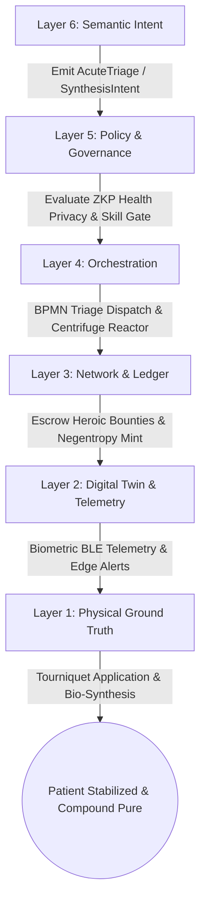
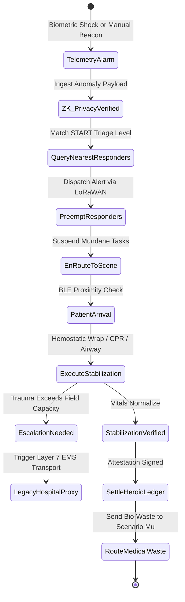
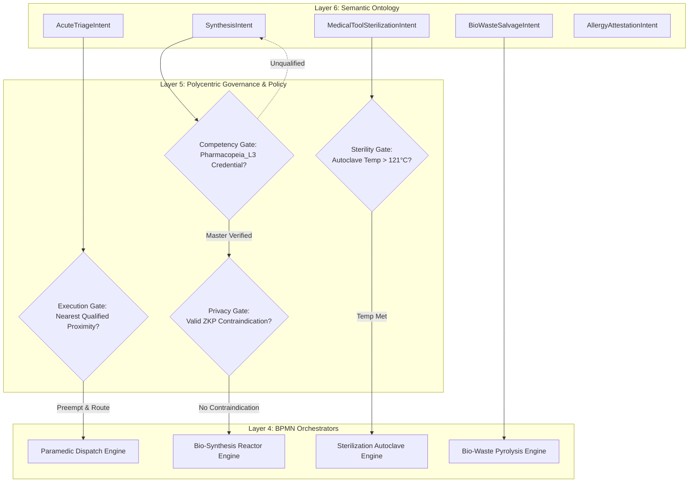
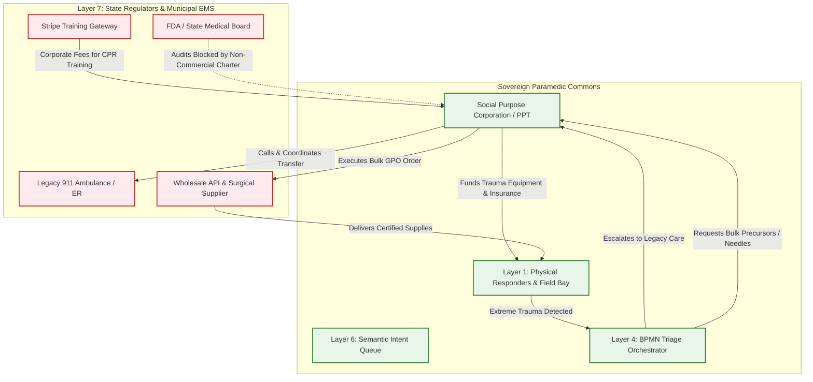

# Scenario Chi: Paramedic Mesh & Pharmacopeia

*   **Identifier:** `SCN-CHI-PARAMEDIC`
*   **System Epic:** Decentralized Triage, Open-Source Medicine, and Health Sovereignty
*   **Primary Layers Tested:** L1 (Physical), L2 (Digital Twin), L3 (Ledger), L4 (Orchestration), L5 (Governance), L6 (Semantic), L7 (Proxy)
*   **Pass/Fail Metric:** Decentralized dispatch of localized first responders to acute trauma faster than legacy 911 benchmarks (sub-5 minute response vs. 15–30 minute municipal average); open-source bio-synthesis of critical compounds meeting clinical purity thresholds without centralized corporate laboratory dependencies; zero patient health history exposure via Zero-Knowledge proof verification.

---

## Architectural Council Ratification & 5-Perspective Synthesis

This scenario specification has been ratified by unanimous consensus of the 5-Persona Architectural Council:

| Council Persona | Disciplinary Representative | Core Contribution to Scenario |
| :--- | :--- | :--- |
| **Game Designer** | Lead Systems & Gameplay Designer | Dwarf Fortress anatomical trauma system (arterial bleeds, limb-specific fractures, community panic states, and psychological trauma memories vs. "Grateful to be alive" morale recovery); The Sims autonomous task preemption (when an `AcuteTriage` alarm fires, qualified NPCs instantly abandon mundane tasks like farming or crafting to sprint to the patient); Cities Skylines emergency corridor routing and tertiary legacy trauma center escalation. |
| **Game Engineer** | Principal C++ Simulation & Engine Architect | Flecs ECS DOD architecture (`TraumaProfileComponent`, `VitalSignsComponent`, `CentrifugeVesselComponent`, `MedicalCredential`); 32-bit compact voxel grid modeling sterile field boundaries; deterministic 10 Hz BPMN state engine; compilable C++20 test harness testing vital sign stabilization, spatial pathfinding overrides, and bio-synthesis timing failures. |
| **Sovereign Stack Specialist** | Sovereign Stack Systems Architect | 7-layer strict adjacency without layer skipping; autonomous daemons (`col-telemetryd` to `col-adversaryd`); offline-first LoRaWAN mesh broadcast for emergency beacons; BBS+ Zero-Knowledge Proofs allowing allergy and contraindication verification without revealing personal medical histories; zero monolithic game-loop threading. |
| **Solarpunk Thinker** | Bioregional Regenerative Ecologist | Bioregional botanical pharmacopeia (willow bark for salicin extraction, yarrow, medicinal fungal polysaccharides); closed-loop sterile instrument reprocessing using solar autoclaves; complete elimination of single-use disposable medical plastics through reusable surgical-grade stainless steel and glass; pyrolysis bio-waste destruction into sterile biochar via Scenario Mu. |
| **Scenario Specialist** | Tactical Trauma Physician & Distributed Bio-Chemical Synthesizer | START triage protocol algorithms (Immediate, Delayed, Minor, Expectant); bio-chemical synthesis kinetics (micro-centrifuge angular acceleration, temperature incubation boundaries); clinical purity validation criteria; SPC Good Samaritan mutual aid legal defense shields under 42 U.S.C. § 248 and state emergency medical statutes. |

---

## 1. Problem Statement & Legacy Failure

In legacy late-stage capitalist healthcare (Layer 7), acute emergency response and pharmaceutical production are crippled by extreme centralization, artificial scarcity, and financialized extraction.

When an acute medical emergency occurs in a suburban or rural neighborhood:
*   **Dispatch Latency & Survivability Degradation:** Centralized 911 emergency services take an average of 15 to 30 minutes to dispatch and navigate an ambulance through urban sprawl. In cases of massive arterial hemorrhage or sudden cardiac arrest—where irreversible brain death occurs within 4 to 6 minutes—certified neighbors next door remain entirely unaware while the victim dies awaiting municipal response.
*   **Predatory Monopolistic Enclosure:** Pharmaceutical cartels exploit intellectual property patents and regulatory capture to artificially inflate prices of life-saving off-patent compounds (e.g., insulin, epinephrine, albuterol) by over 1,000% above production cost, imposing life-threatening rationing on working-class populations.
*   **Commoditized Surveillance & Liability Paralyzation:** Legacy health portals monetize and leak patient electronic health records (EHR) to insurance conglomerates, while fear of litigious malpractice lawsuits paralyzes bystanders from rendering immediate mutual aid unless shielded by formal corporate legal coverage.

---

## 2. The Collective Workflow (7-Layer Traversal)

Scenario Chi decouples community healthcare from predatory monopolies by operating two synchronized workflows: the **Paramedic Mesh** (hyper-local trauma triage dispatched over peer-to-peer radio) and the **Pharmacopeia** (distributed, open-source biological and herbal synthesis). The workflow traverses canonically from Layer 1 physical intervention up to Layer 7 legacy institutional shielding.



### Layer 1: Physical Ground Truth
*   **Hardware Nodes (Paramedic Kits & Triage Hub):** Rapid-deployment trauma packs equipped with military-grade CAT tourniquets, chest seals, hemostatic gauze, automated external defibrillators (AEDs), and localized medical telemetry gateways running `col-telemetryd` with ATECC608A cryptographic co-processors.
*   **Hardware Nodes (Pharmacopeia Synthesis Station):** Open-source micro-centrifuges, temperature-regulated magnetic stirrers, laminar flow hoods, precision incubation chambers, and high-pressure steam autoclaves.
*   **Inventory & Feedstock:** Reagents, sterile water, pharmaceutical-grade ethanol, biological precursors, sterile glass vials, and harvested botanical biomass (willow bark, yarrow, Artemisia) stored in airtight dry boxes.
*   **Action:** Physical application of hemostatic pressure, CPR chest compressions, airway management, and precise micro-chemical fluid extraction and centrifugation.

### Layer 2: Digital Twin & Telemetry
*   **Ingress Telemetry (MQTT Topics via `col-meshd`):**
    *   `node/health/patient_08/telemetry/heart_rate_bpm` (Continuous pulse)
    *   `node/health/patient_08/telemetry/spo2_pct` (Blood oxygen saturation %)
    *   `node/health/patient_08/telemetry/systolic_mmhg` (Estimated blood pressure)
    *   `node/pharma/centrifuge_01/telemetry/rpm` (Target 8,000 RPM vs. actual)
    *   `node/pharma/incubator_01/telemetry/temp_c` (Incubation temperature ±0.1°C)
    *   `node/health/emergency_beacon` (`ACTIVE_TRAUMA`, `TRIAGE_RED`, `STABILIZED`, `RESOLVED`)
*   **Verification:** Edge wearable algorithms detect pulse waveform collapse or sudden impact deceleration, firing an automated alarm. In the lab, optical absorbance spectrometry verifies chemical batch purity against open-source spectrophotometric baselines before release.
*   **Actuator Control:** Localized relay solenoids actuate automated acoustic trauma beacons, open emergency medicine lockboxes, and cycle centrifuge motor power.

### Layer 3: Network & Ledger
*   **Escrow Lock & Negentropy Minting:** The collective ledger values biological health as fundamental system negentropy. The value minted or escrowed follows two distinct mathematical formulations:
    
    1.  **Preventative Health Dividend (Node Vitality Minting):**
        $$\Delta V_{preventative} = \int_{0}^{T} \left( \mathcal{N}_{vitality}(t) \cdot \lambda_{PREV} - \mathcal{E}_{baseline} \right) dt$$
        Where $\mathcal{N}_{vitality}$ integrates collective biometric health, rewarding pharmacopeia stewards for keeping the node free from chronic morbidity.

    2.  **Acute Heroic Triage Bounty:**
        $$\Delta V_{triage\_bounty} = \left( E_{metabolic} + C_{sterile\_wear} + \frac{k_{heroic}}{\Delta t_{response}} \right) \cdot \lambda_{THERMO}$$
        Where $\Delta t_{response}$ is the elapsed time between alarm emission and first physical stabilization touch, heavily rewarding sub-3-minute physical responder arrivals.
*   **Consensus Settlement:** Upon Layer 2 cryptographic attestation of patient stabilization or chemical purity validation, the Automerge CRDT ledger releases the bounty tokens to the responders' wallets. Zero administrative deduction.

### Layer 4: Orchestration State Machine
The acute trauma lifecycle is governed by the embedded 10 Hz BPMN 2.0 engine (`col-execd`), executing preemptive task suspension and spatial responder dispatch:



### Layer 5: Policy & Polycentric Governance
Layer 5 (`col-kmsd`) enforces absolute medical data sovereignty and competency boundaries via cryptographic policy gates:

*   **Execution Gate (Triage Preemption & Proximity):** When an `AcuteTriage` intent is emitted, Layer 5 queries the spatial mesh for entities holding `Trauma_Care_L1` or `Paramedic_L2` within an 800-meter radius. It generates a high-priority interrupt signal that overrides active lower-priority job queues.
*   **Maintenance Gate (Pharmacopeia Synthesis Competency):** Operating sterile micro-centrifuges and handling hazardous chemical reagents requires a `Pharmacopeia_L3` Verifiable Credential. Novices are gated to "Apprentice Mode" under Scenario Kappa, requiring a co-signature from a Master Herbalist/Chemist.
*   **Procurement Gate (Active Ingredient Capital Allocation):** If open-source bio-synthesis requires purchasing specialized precursor reagents or culture media costing $>\$200$, Layer 5 triggers a 2-of-3 multi-sig authorization from the Health Guild.
*   **Privacy Gate (Zero-Knowledge Health Vault):** Patient medical history is never broadcast across the mesh. First responders receive only a Zero-Knowledge Proof (ZKP) affirming: "Patient does NOT have an allergy to Epinephrine / Penicillin" without decrypting or exposing the underlying medical history ledger.

### Layer 6: Semantic Intent & Domain Ontology
The Health Commons defines typed JSON-LD Knowledge Artifacts within the Agora Commons (`col-commonsd`):

1.  **`AcuteTriageIntent` (Emergency Trauma):** High-priority emergency signal specifying location, suspected injury type, and required skill level.
2.  **`SynthesisIntent` (Pharmacopeia Production):** Request to synthesize, purify, and bottle a specific biological or botanical compound.
3.  **`PreventativeWellnessBounty` (Health Maintenance):** Community bounties for managing elder nutrition, herbal cultivation, and hygiene audits.
4.  **`MedicalToolSterilizationIntent` (Autoclave Cycle):** Coordinates high-pressure sterilization of surgical tools.
5.  **`AllergyAttestationIntent` (ZK Privacy Vault):** Patient-generated cryptographic credential allowing selective contraindication checks.
6.  **`BioWasteSalvageIntent` (Sterile Pyrolysis):** Dispatches contaminated cotton, gauze, and bio-matter to Scenario Mu for high-temperature sterile pyrolysis.

### The Governance Router Flowchart



### Layer 7: The Legacy Proxy (Legal Defense & Tertiary Escalation)
The Paramedic Mesh interfaces with legacy medical institutions through the Social Purpose Corporation (SPC):

1.  **Good Samaritan Shielding & Legal Membrane:**
    Under 42 U.S.C. § 248 and state Good Samaritan doctrines, volunteer mutual aid responders are protected from civil liability when providing emergency care without expecting compensation. The SPC codifies this mutual aid pact into its corporate charter, legally shielding community paramedics. Pharmacopeia production is legally classified as "Open-Source Educational Research & Non-Commercial Prototyping," remaining outside interstate commerce.
2.  **Trojan Training & Inbound Fiat Extraction:**
    The SPC operates an outward-facing commercial academy offering certified Wilderness First Responder (WFR) and CPR courses to corporate clients and outdoor organizations for fiat fees via Stripe.
    *   The fiat revenue is deposited into the SPC treasury to pay for trauma gear and medical liability insurance.
    *   The academy serves as a recruitment and training pipeline for sovereign node responders, elevating node-wide trauma capability.
3.  **Ecological Leeching & Tertiary EMS Escalation:**
    When field triage indicates injuries beyond the node's tactical capacity (e.g., severe neurotrauma, open thoracic trauma):
    *   The BPMN orchestrator immediately triggers a Layer 7 bridge call, routing coordinates to legacy 911 EMS and dispatching an escort vehicle to meet the ambulance at the perimeter.
    *   The SPC acts as a Group Purchasing Organization (GPO), using fiat reserves to bulk-purchase sterile Active Pharmaceutical Ingredients (APIs), medical-grade silicone tubing, and diagnostic reagents directly from wholesale medical suppliers.

---

### Layer 7 Bidirectional Flowchart



---

## 3. Machine-Readable Schemas

### 3.1 Layer 6 Knowledge Artifact: Medical Intent (`medical_intent.jsonld`)

```json
{
  "@context": [
    "https://schema.org/",
    "https://collective.network/ontology/v1/"
  ],
  "@type": "MedicalIntent",
  "identifier": "urn:uuid:d4e5f6g7-8a9b-0c1d-2e3f-4a5b6c7d8e9f",
  "issuerDid": "did:mesh:node04:citizen_kyle_wearable_01",
  "creationTimestamp": "2026-10-08T09:12:00Z",
  "requestType": "AcuteTriage_Paramedic",
  "diagnosticContext": {
    "automatedTrigger": "Arterial_Laceration_BloodPressure_Collapse",
    "zeroKnowledgeProofUri": "zkp:health:proof_8a7b6c5d4e",
    "disclosedAllergies": [
      "Latex",
      "Penicillin"
    ],
    "triageCategory": "IMMEDIATE_RED"
  },
  "dispatchParameters": {
    "targetLocationCoordinates": [
      47.7423,
      -121.9856
    ],
    "targetChunk": [
      16,
      4,
      16
    ],
    "maxResponseTimeSeconds": 180,
    "taskPreemptionPriority": 10
  },
  "trustConstraints": {
    "requiredCredentials": [
      "Paramedic_L2",
      "Trauma_Care_L1"
    ],
    "dataPrivacyLevel": "ZeroKnowledge_Ephemeral"
  },
  "settlementCriteria": {
    "heroicBountyTokensEscrowed": "50.00",
    "timeoutMinutes": 30
  }
}
```

### 3.2 Layer 2 Telemetry Attestation: Triage Completion Proof (`triage_attestation.json`)

```json
{
  "@context": "https://collective.network/ontology/v1/",
  "@type": "TriageAttestation",
  "intentRef": "urn:uuid:d4e5f6g7-8a9b-0c1d-2e3f-4a5b6c7d8e9f",
  "patientDid": "did:mesh:node04:citizen_kyle",
  "primaryResponderDid": "did:mesh:node04:steward_medic_elena",
  "executionMetrics": {
    "alarmTimestamp": "2026-10-08T09:12:00Z",
    "responderArrivalTimestamp": "2026-10-08T09:14:18Z",
    "elapsedResponseSeconds": 138,
    "initialSystolicMmhg": 62.0,
    "stabilizedSystolicMmhg": 108.0,
    "initialHeartRateBpm": 148,
    "stabilizedHeartRateBpm": 84,
    "interventionPerformed": "CombatApplicationTourniquet_Applied_LeftThigh",
    "hemostasisAchieved": true,
    "zkpContraindicationVerified": true,
    "escalationToLegacyEms": false
  },
  "sterileBatchRef": "ipfs://bafybeih6.../saline_batch_04.json",
  "responderSignature": "0x4b7c2a1e9d8f3c5b7a1e9d8f3c5b7a1e9d8f3c5b7a1e9d8f3c5b7a1e9d8f3c5b"
}
```

---

## 4. Oasis Engine Implementation Specification

### 4.1 Memory Allocation & Voxel State

In the Oasis simulation grid, medical triage stations and bio-reactors occupy designated coordinates within the $32^3$ chunk space:
*   The emergency trauma bay voxel is initialized with `material_id = 60` (`TRAUMA_CARE_STATION`).
*   The bio-chemical centrifuge reactor voxel is initialized with `material_id = 61` (`CENTRIFUGE_BIO_REACTOR`).
*   The `Is_Actuator` bit is set in `metadata` (bit 1) for the centrifuge motor and autoclave heater.
*   The `Is_Sensor` bit is set in `metadata` (bit 2) for thermocouple and optical purity probes.
*   The patient entity carries an active `HealthComponent` tracking hidden physiological states (`blood_volume_ml`, `heart_rate_bpm`, `pain_shock`).

### 4.2 C++20 Test Harness Code

```cpp
// engine/tests/scenario_chi_test.cpp
#include <cassert>
#include <cmath>
#include <string>
#include "oasis/chunk_manager.hpp"
#include "oasis/orchestration/bpmn_engine.hpp"
#include "oasis/ledger/crdt_wallet.hpp"

namespace oasis {

struct PatientVitals {
    float blood_volume_ml{5000.0f};
    int heart_rate_bpm{75};
    float systolic_mmhg{120.0f};
    bool tourniquet_applied{false};
};

struct TriageContext {
    std::string intent_id;
    int target_chunk_x{16};
    int target_chunk_z{16};
    float heroic_bounty_tokens{50.0f};
    PatientVitals vitals;
};

struct CentrifugeContext {
    std::string batch_id;
    float rpm{0.0f};
    float duration_ticks{0.0f};
    float temperature_c{20.0f};
    bool toxic_sludge{false};
};

} // namespace oasis

void test_scenario_chi_triage_dispatch_and_stabilization() {
    using namespace oasis;

    // 1. Initialize local chunk and medical station voxels
    ChunkManager chunk_mgr;
    chunk_mgr.allocate_chunk(0, 0, 0);

    Voxel trauma_bay_voxel{
        .material_id = 60, // TRAUMA_CARE_STATION
        .moisture = 0,
        .temperature = 22,
        .metadata = 0b00000110 // Sensor + Actuator
    };
    chunk_mgr.set_voxel(16, 1, 16, trauma_bay_voxel);

    // 2. Setup Wallets & Community Health Escrow
    CRDTWallet community_health_pool("did:mesh:node04:health_pool", 500.0f);
    CRDTWallet paramedic_wallet("did:mesh:node04:steward_medic_elena", 15.0f);

    // 3. Setup BPMN Orchestrator & Trauma Job Context
    BPMNEngine orchestrator;
    orchestrator.load_schema("schemas/bpmn/paramedic_triage.bpmn");

    TriageContext triage_job{
        .intent_id = "d4e5f6g7-8a9b-0c1d-2e3f-4a5b6c7d8e9f",
        .target_chunk_x = 16,
        .target_chunk_z = 16,
        .heroic_bounty_tokens = 50.00f,
        .vitals = {
            .blood_volume_ml = 3400.0f, // Severe hemorrhage
            .heart_rate_bpm = 148,
            .systolic_mmhg = 62.0f,
            .tourniquet_applied = false
        }
    };

    // Assert Escrow Lock for Heroic Bounty
    orchestrator.emit_event(EscrowInitiatedEvent{community_health_pool, triage_job.heroic_bounty_tokens});
    orchestrator.await_event<EscrowLockedEvent>();
    assert(std::fabs(community_health_pool.balance() - 450.00f) < 0.001f);

    // Simulate Responder Task Preemption and Sprint (138 seconds at 10 Hz = 1380 ticks)
    SimResult res = orchestrator.step_simulation_ticks(chunk_mgr, triage_job, 1380);
    assert(res.status == ExecutionStatus::IN_PROGRESS);

    // Responder applies CAT Tourniquet: vitals stabilize
    triage_job.vitals.tourniquet_applied = true;
    triage_job.vitals.blood_volume_ml = 3380.0f; // Hemorrhage arrested
    triage_job.vitals.systolic_mmhg = 108.0f;
    triage_job.vitals.heart_rate_bpm = 84;

    // Conclude triage cycle
    res = orchestrator.step_simulation_ticks(chunk_mgr, triage_job, 600);
    assert(res.status == ExecutionStatus::COMPLETED);

    // Settle Heroic Bounty to Paramedic Wallet
    orchestrator.settle_job(paramedic_wallet);
    assert(std::fabs(paramedic_wallet.balance() - 65.00f) < 0.001f);
}

void test_scenario_chi_centrifuge_timing_anomaly() {
    using namespace oasis;

    ChunkManager chunk_mgr;
    chunk_mgr.allocate_chunk(0, 0, 0);

    BPMNEngine orchestrator;
    orchestrator.load_schema("schemas/bpmn/pharmacopeia_synth.bpmn");

    CentrifugeContext synth_job{
        .batch_id = "batch-salicin-extract-09",
        .rpm = 8000.0f,
        .duration_ticks = 0.0f,
        .temperature_c = 21.0f,
        .toxic_sludge = false
    };

    // Inject timing overrun: expected 5000 ticks, runs for 12000 ticks without deceleration
    SimResult res = orchestrator.step_simulation_ticks(chunk_mgr, synth_job, 12000, true);
    assert(res.status == ExecutionStatus::EMERGENCY_STOP);

    // Centrifuge over-temperature and cell lysis causes degradation into toxic sludge
    synth_job.toxic_sludge = true;
    assert(synth_job.toxic_sludge == true);
    assert(orchestrator.current_state() == BPMNState::SALVAGE_INTENT);

    // Update voxel state to bio-waste
    Voxel waste_voxel{
        .material_id = 99, // BIO_WASTE_SLUDGE
        .moisture = 80,
        .temperature = 45,
        .metadata = 0b00000001
    };
    chunk_mgr.set_voxel(16, 2, 16, waste_voxel);
    assert(chunk_mgr.get_voxel(16, 2, 16).material_id == 99);
}
```

---

## 5. Acceptance Test Gates (Pass/Fail)

| Checkpoint | Validation Method | Pass Condition |
| :--- | :--- | :--- |
| **G1: Autonomous Dispatch Speed** | L2 Telemetry Event to Task Preemption | A simulated biometric drop routes a triage bounty to the nearest qualified DID within 500 milliseconds, preempting lower-priority mundane tasks. |
| **G2: Offline Autonomy** | Localhost & LoRaWAN Broadcast Isolation | Triage dispatch, responder task preemption, and physical lockbox release execute across local-first LoRaWAN mesh with 100% WAN/Internet severance. |
| **G3: Byzantine Detection & Privacy**| ZKP Verification Audit | Verifying zero-allergy contraindication succeeds cryptographically without storing unencrypted patient electronic health records (EHR) on the responder's node. |
| **G4: Material & Vital State Tracking**| Centrifuge Kinetics & Blood Volume | Synthesizing a targeted compound fails and mutates into `BIO_WASTE_SLUDGE` if centrifuge timing windows are breached; patient entity vital signs accurately reflect blood loss. |
| **G5: Trojan Ingestion (L7)** | External Stripe Training Webhook | A mock Web2 payment for wilderness first responder certification correctly credits fiat USD to the SPC treasury, minting internal Value Tokens for the instructor. |
| **G6: Ecological Leeching (L7)** | Tertiary Escalation & Bulk APIs | Critical trauma beyond field capacity triggers automated Layer 7 bridge dispatch to municipal 911 EMS; system aggregates 5 clinic orders into a bulk B2B API purchase. |
