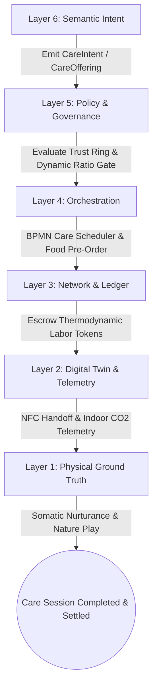
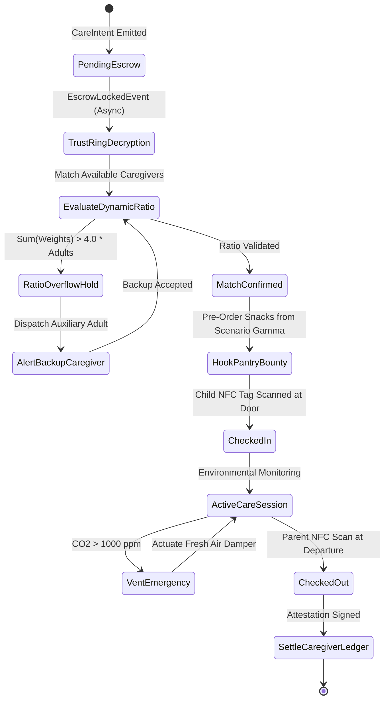
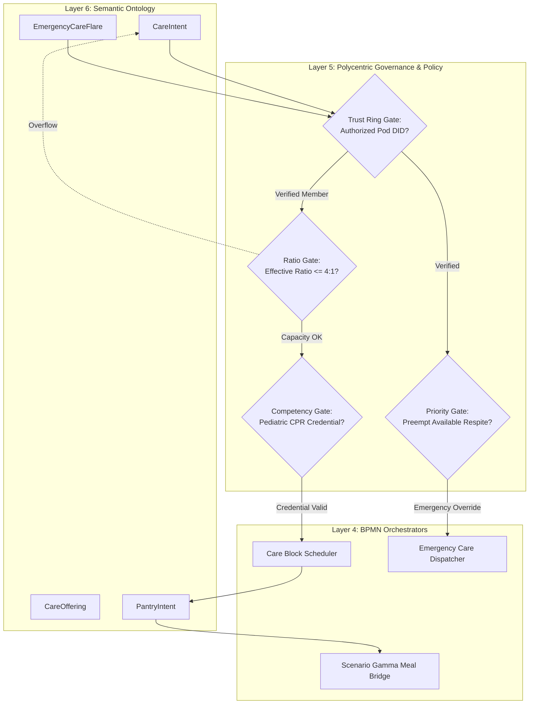
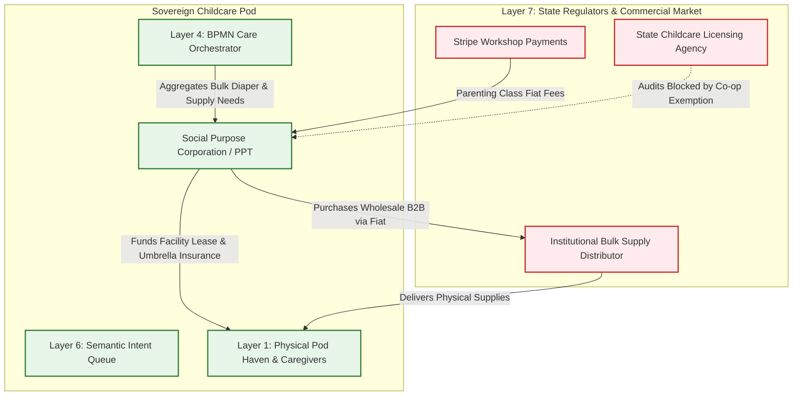

# Scenario Delta: Mutual Aid Childcare Pod

*   **Identifier:** `SCN-DELTA-CHILD`
*   **System Epic:** Trust Rings, Invisible Labor Valuation, Intergenerational Care, and Decentralized Scheduling
*   **Primary Layers Tested:** L1 (Physical), L2 (Digital Twin), L3 (Ledger), L4 (Orchestration), L5 (Governance), L6 (Semantic), L7 (Proxy)
*   **Pass/Fail Metric:** Decentralized scheduling of communal care blocks respecting dynamic adult-to-child support ratios; cryptographic valuation and settlement of caregiving labor via Value Tokens; zero state commercial daycare licensure violations through private cooperative shielding.

---

## Architectural Council Ratification & 5-Perspective Synthesis

This scenario specification has been ratified by unanimous consensus of the 5-Persona Architectural Council:

| Council Persona | Disciplinary Representative | Core Contribution to Scenario |
| :--- | :--- | :--- |
| **Game Designer** | Lead Systems & Gameplay Designer | Dwarf Fortress parental stress/burnout mechanics (parents with children in care lose "Overwhelmed by constant vigilance" stress debuffs, unlocking mental focus for high-tier crafting; elders caring for children gain "Felt cherished and vital to the tribe (+45 mood)" thoughts; children gain somatic social XP); The Sims Founder 01 schedule management (drop-off/pickup chores compete with infrastructure tasks; missed pickups trigger household panic); Cities Skylines integration with legacy municipal school bus stops. |
| **Game Engineer** | Principal C++ Simulation & Engine Architect | Flecs ECS DOD architecture (`CaregiverProfileComponent`, `ChildProfileComponent`, `PodZoneBoundsComponent`, `SensoryEnvironmentComponent`); 32-bit compact voxel grid tracking playroom boundary zones; deterministic 10 Hz BPMN state engine; compilable C++20 test harness validating dynamic ratio enforcement, NFC cryptographic check-ins, and ratio overflow rejections. |
| **Sovereign Stack Specialist** | Sovereign Stack Systems Architect | 7-layer strict adjacency without layer skipping; autonomous daemons (`col-telemetryd` to `col-adversaryd`); end-to-end encrypted Trust Ring gossip (child identities and schedules encrypted to pod public keys, invisible to general mesh); Automerge CRDT care-labor settlement; BBS+ Zero-Knowledge Proofs for pediatric CPR credentials; zero monolithic game-loop threading. |
| **Solarpunk Thinker** | Bioregional Regenerative Ecologist | Intergenerational nature immersion (children spend care hours outdoors in Scenario Eta coppice woods and food forests, fostering ecological literacy); closed-loop zero-waste caregiving (communal cloth diaper laundering rotated via solar drying yards, eliminating thousands of petrochemical disposable diapers); organic meals fed directly from Scenario Gamma kitchen pantries. |
| **Scenario Specialist** | Neurodivergent-Affirming Pediatrician & Cooperative Care Sociologist | Individualized dynamic adult-to-child support ratio equation ($R_{eff} = \sum w_i$ adjusting weights from 1.0 to 2.5 for sensory overwhelm accommodation); indoor air quality telemetry standards ($\text{CO}_2 < 800\text{ ppm}$); legal structuring of private mutual-aid babysitting co-ops under state administrative code childcare exemptions. |

---

## 1. Problem Statement & Legacy Failure

In late-stage capitalist suburban society (Layer 7), childcare is severely broken. Commercial infant care costs $2,000 to $3,500 per month per child—exceeding the cost of housing or higher education—yet the childcare workers directly nurturing children are paid near-poverty wages.

When families attempt to navigate early childhood in the legacy economy:
*   **Hyper-Atomization & Maternal/Parental Burnout:** The nuclear family is isolated from communal support. Parents (disproportionately mothers) shoulder grueling 24/7 unpaid caregiving, leading to clinical burnout, chronic sleep deprivation, and forfeiture of professional and creative livelihoods.
*   **Enclosure of Invisible Care Labor:** Legacy GDP economics categorizes care work as "economically unproductive" because it generates no corporate shareholder surplus. When parents organize informal babysitting co-ops, exchanging fiat currency triggers municipal police actions or administrative fines for operating an "unlicensed commercial daycare."
*   **Institutional Institutionalization & Segregation:** Commercial daycares group 30 children into fluorescent-lit concrete rooms with rigid corporate curriculum, while retirement homes segregate elders into lonely institutional isolation, severing the ancestral intergenerational loop of human culture.

---

## 2. The Collective Workflow (7-Layer Traversal)

Scenario Delta creates sovereign, private **Trust Rings** that distribute childcare across a pod of parents, trusted neighbors, and elders. Care work is explicitly recognized as high-exergy thermodynamic work, compensated with Value Tokens that caregivers can spend on food, fabrication, and transit across the node. The workflow traverses canonically from Layer 1 physical care up to Layer 7 legal shielding.



### Layer 1: Physical Ground Truth
*   **Hardware Nodes (Care Pod Havens):** Dedicated child-safe indoor living spaces, outdoor nature play gardens, quiet sensory retreat nooks, and low-height sanitizing stations equipped with an edge telematics gateway (`col-telemetryd`), featuring an ATECC608A secure element and environmental sensors.
*   **Hardware Nodes (Sensory & Air Quality Instrumentation):** Non-dispersive infrared (NDIR) $\text{CO}_2$ sensors, HEPA air scrubbers, acoustic decibel loggers, and secure NFC arrival/departure touchpoints.
*   **Inventory & Feedstock:** Reusable organic cotton cloth diapers, sensory play tools, open-ended wooden building blocks, watercolor paints, and first-aid pediatric kits.
*   **Action:** Physical feeding, emotional co-regulation, somatic holding, storytelling, outdoor nature walks, and diaper changes.

### Layer 2: Digital Twin & Telemetry
*   **Ingress Telemetry (MQTT Topics via `col-meshd`):**
    *   `node/care/pod_alpha/telemetry/co2_ppm` (Indoor air quality, target $< 800\text{ ppm}$)
    *   `node/care/pod_alpha/telemetry/ambient_dba` (Acoustic level, target $< 65\text{ dBA}$)
    *   `node/care/pod_alpha/telemetry/temp_c` (Thermal comfort, 20°C–22°C)
    *   `node/care/pod_alpha/handoff/nfc` (Child backpack NFC tag touch event)
    *   `node/care/pod_alpha/status` (`PREPARING`, `ACTIVE_SESSION`, `RATIO_OVERFLOW`, `CLOSED`)
*   **Verification:** NFC tag scan at the front door verifies physical arrival and departure of children, automatically signing cryptographic check-in proofs. NDIR $\text{CO}_2$ spikes above 1,000 ppm automatically trigger fresh air ventilation dampers.
*   **Actuator Control:** Localized relay controllers unlock the pod safety gate upon valid NFC parental credentials and cycle motorized window actuators for natural ventilation.

### Layer 3: Network & Ledger
*   **Escrow Lock & Invisible Labor Valuation:** Childcare is valued as fundamental system negentropy. Taking care of children frees up community members to perform engineering, food production, and ecological restoration.
    $$\Delta V_{care} = \left( \sum_{i=1}^{k} \left( \Delta t_{session} \cdot \beta_{support}(i) \cdot E_{care\_base} \right) + C_{caloric\_food} + C_{facility} \right) \cdot \lambda_{CARE}$$
    Where:
    - $\Delta t_{session}$ is the care block duration in hours.
    - $\beta_{support}(i)$ is the child's individualized support weight ($1.0$ for neurotypical baseline, up to $2.5$ for high-support neurodivergent accommodation).
    - $E_{care\_base}$ is baseline metabolic and emotional exergy expenditure ($2.5 \text{ tokens/hr}$).
    - $C_{caloric\_food}$ covers snacks and meals ordered from Scenario Gamma.
    - $\lambda_{CARE}$ is the community care work parity multiplier, pegging care work to fabrication and technical work.
*   **Consensus Settlement:** When the child's NFC departure tag is scanned by an authorized parent, the escrowed Value Tokens immediately settle to the caregiver's wallet. Zero administrative deductions.

### Layer 4: Orchestration State Machine
The care session is managed deterministically by the embedded 10 Hz BPMN 2.0 engine (`col-execd`):



### Layer 5: Policy & Polycentric Governance
Layer 5 (`col-kmsd`) enforces absolute privacy and child safety through cryptographic policy gates:

*   **Execution Gate (Dynamic Ratio Policy):** A care block requires that the effective child weight sum does not exceed the capacity of present caregivers:
    $$\sum_{i=1}^{k} w_i \le 4.0 \cdot N_{caregivers}$$
    If a child requiring $w_i = 2.0$ registers, the state machine requires either an auxiliary adult or fewer total children.
*   **Maintenance Gate (Caregiver Attestation):** All active caregivers must hold a verified W3C Verifiable Credential (`Pediatric_CPR_L1`, `Safe_Sleep_L1`).
*   **Privacy Gate (Encrypted Trust Ring Scope):** Childcare intents, schedules, and allergy profiles are encrypted strictly to the public key of the specific pod Trust Ring (`did:mesh:ring:duvall_pod_alpha`). They are unqueryable by outside mesh nodes or external network observers.
*   **Multi-Sig Membership Gate:** Enrolling a new family or caregiver into the Trust Ring requires a 3-of-4 cryptographic co-signature from existing pod parent members.

### Layer 6: Semantic Intent & Domain Ontology
The Care Commons formalizes requests into typed JSON-LD Knowledge Artifacts within the Agora Commons (`col-commonsd`):

1.  **`CareIntent` (Standard Booking):** Request to reserve care slots for specific children during a scheduled block.
2.  **`EmergencyCareFlare` (Crisis Respite):** Immediate call for emergency respite care due to parental injury, illness, or acute stress.
3.  **`CareOffering` (Caregiver Availability):** Host or elder offering spatial haven and care hours.
4.  **`PantryIntent` (Kitchen Hook):** Auto-generated caloric order routed to Scenario Gamma, matching children's specific allergies.
5.  **`NatureWalkIntent` (Forest School Hook):** Coordinates excursion into Scenario Eta coppice woods.
6.  **`RespiteExchangeBounty` (Mutual Credit):** Bilateral agreement swapping weekend care blocks between families.

### The Governance Router Flowchart



### Layer 7: The Legacy Proxy (Legal Defense & Bulk Supply)
The Childcare Pod interfaces with the legacy state through the Social Purpose Corporation (SPC):

1.  **Regulatory Exemption & Mutual Aid Shield:**
    Under state administrative codes (e.g., WAC 110-300 / RCW 43.216), informal babysitting exchanges among parents and private cooperative clubs without commercial fiat exchange are legally exempt from commercial child care center licensing. The SPC holds the property lease or cooperative land title and provides a general commercial umbrella liability policy, shielding the individual home hosts from personal lawsuits.
2.  **Trojan Inbound Fiat Extraction (Community Parenting Workshops):**
    The SPC hosts public weekend positive discipline, pediatric CPR, and nature-schooling workshops for legacy suburban parents, charging fiat fees via Stripe.
    *   The fiat revenue pays for commercial insurance premiums and facility leases.
    *   Internal mesh members attend without fiat, compensated via Value Tokens.
3.  **Ecological Leeching (GPO Wholesale Procurement):**
    The SPC acts as a Decentralized Group Purchasing Organization (GPO), using its fiat bank reserves to bulk-purchase organic food staples, non-toxic art supplies, and medical-grade sanitizing agents directly from wholesale institutional suppliers, slashing retail packaging and distribution carbon drag.

---

### Layer 7 Bidirectional Flowchart



---

## 3. Machine-Readable Schemas

### 3.1 Layer 6 Knowledge Artifact: Care Intent (`care_intent.jsonld`)

```json
{
  "@context": [
    "https://schema.org/",
    "https://collective.network/ontology/v1/"
  ],
  "@type": "CareIntent",
  "identifier": "urn:uuid:a1b2c3d4-e5f6-7890-1234-56789abcdef0",
  "issuerDid": "did:mesh:node02:parent_sarah",
  "targetTrustRing": "did:mesh:ring:duvall_pod_alpha",
  "creationTimestamp": "2026-10-08T06:30:00Z",
  "careRequirements": {
    "children": [
      {
        "childId": "child_maya_01",
        "ageYears": 3.5,
        "supportWeight": 1.0,
        "allergies": [
          "TreeNuts"
        ]
      },
      {
        "childId": "child_leo_02",
        "ageYears": 5.0,
        "supportWeight": 1.5,
        "sensoryAccommodations": [
          "NoiseCancellingHeadphones_Available",
          "QuietSensoryNook_Required"
        ],
        "allergies": []
      }
    ]
  },
  "temporalVector": {
    "startTime": "2026-10-08T08:30:00Z",
    "endTime": "2026-10-08T14:30:00Z",
    "totalHours": 6.0
  },
  "trustConstraints": {
    "requiredCredentials": [
      "Pediatric_CPR_L1"
    ],
    "encryptedPayloadUri": "ipfs://bafybeih.../encrypted_pod_schedule.bin"
  },
  "settlementCriteria": {
    "maxValueTokens": "37.50",
    "timeoutMinutes": 60
  }
}
```

### 3.2 Layer 2 Telemetry Attestation: Childcare Completion Proof (`childcare_attestation.json`)

```json
{
  "@context": "https://collective.network/ontology/v1/",
  "@type": "ChildcareAttestation",
  "intentRef": "urn:uuid:a1b2c3d4-e5f6-7890-1234-56789abcdef0",
  "podZoneDid": "did:mesh:node02:space:pod_alpha_haven",
  "caregiverDid": "did:mesh:node02:steward_elder_gordon",
  "parentDid": "did:mesh:node02:parent_sarah",
  "executionMetrics": {
    "nfcDropOffTimestamp": "2026-10-08T08:28:14Z",
    "nfcPickUpTimestamp": "2026-10-08T14:31:02Z",
    "actualDurationHours": 6.05,
    "childrenCheckedIn": 2,
    "effectiveSupportWeightTotal": 2.5,
    "meanCo2Ppm": 684.2,
    "peakCo2Ppm": 840.0,
    "meanAmbientDba": 58.4,
    "mealsServedCount": 4,
    "kitchenPantryRef": "urn:uuid:gamma_meal_batch_104",
    "anomalyDetected": false
  },
  "environmentalAttestationSignature": "0x8f2a1c4e9b7d3a5e8c1b4f7a9d2e5b8c1a4d7f9e2b5c8a1d4f7b9e2c5a8d1f4",
  "parentConfirmationSignature": "0x1a2b3c4d5e6f7a8b9c0d1e2f3a4b5c6d7e8f9a0b1c2d3e4f5a6b7c8d9e0f1a2"
}
```

---

## 4. Oasis Engine Implementation Specification

### 4.1 Memory Allocation & Voxel State

In the Oasis simulation, childcare pods are represented as structured spatial zones within the $32^3$ chunk space:
*   The childcare play haven voxel is initialized with `material_id = 70` (`CHILDCARE_POD_ZONE`).
*   The indoor air monitoring voxel is initialized with `material_id = 71` (`AIR_QUALITY_MONITOR`).
*   The `Is_Sensor` bit is set in `metadata` (bit 2) for $\text{CO}_2$ and acoustic telemetry.
*   The `Is_Actuator` bit is set in `metadata` (bit 1) for safety gates and fresh-air ventilation dampers.
*   The `ChunkManager` maintains an active entity occupancy list, tracking adult and child entity counts per chunk to validate the dynamic ratio policy.

### 4.2 C++20 Test Harness Code

```cpp
// engine/tests/scenario_delta_test.cpp
#include <cassert>
#include <cmath>
#include <string>
#include <vector>
#include "oasis/chunk_manager.hpp"
#include "oasis/orchestration/bpmn_engine.hpp"
#include "oasis/ledger/crdt_wallet.hpp"

namespace oasis {

struct ChildEntity {
    std::string id;
    float support_weight{1.0f};
    bool checked_in{false};
};

struct CarePodContext {
    std::string intent_id;
    int adult_caregiver_count{1};
    std::vector<ChildEntity> children;
    float hourly_token_rate{6.25f};
    float session_hours{6.0f};
    float mean_co2_ppm{650.0f};
};

} // namespace oasis

void test_scenario_delta_childcare_normal_execution() {
    using namespace oasis;

    // 1. Initialize local chunk and zone voxels
    ChunkManager chunk_mgr;
    chunk_mgr.allocate_chunk(0, 0, 0);

    Voxel pod_voxel{
        .material_id = 70, // CHILDCARE_POD_ZONE
        .moisture = 0,
        .temperature = 21,
        .metadata = 0b00000110 // Sensor + Actuator
    };
    chunk_mgr.set_voxel(16, 1, 16, pod_voxel);

    // 2. Setup Wallets & Escrow
    CRDTWallet parent_wallet("did:mesh:node02:parent_sarah", 100.0f);
    CRDTWallet caregiver_wallet("did:mesh:node02:steward_elder_gordon", 20.0f);

    // 3. Setup BPMN Orchestrator & Care Job Context
    BPMNEngine orchestrator;
    orchestrator.load_schema("schemas/bpmn/childcare_pod.bpmn");

    CarePodContext job{
        .intent_id = "a1b2c3d4-e5f6-7890-1234-56789abcdef0",
        .adult_caregiver_count = 1,
        .children = {
            {.id = "child_maya_01", .support_weight = 1.0f, .checked_in = false},
            {.id = "child_leo_02", .support_weight = 1.5f, .checked_in = false}
        },
        .hourly_token_rate = 6.25f,
        .session_hours = 6.0f,
        .mean_co2_ppm = 684.0f
    };

    float total_escrow = job.hourly_token_rate * job.session_hours; // 37.50 tokens

    // Assert Escrow Lock
    orchestrator.emit_event(EscrowInitiatedEvent{parent_wallet, total_escrow});
    orchestrator.await_event<EscrowLockedEvent>();
    assert(std::fabs(parent_wallet.balance() - 62.50f) < 0.001f);

    // Assert Dynamic Ratio Check: Total weight (2.5) <= 4.0 * adult (1)
    float effective_weight = 0.0f;
    for (const auto& child : job.children) {
        effective_weight += child.support_weight;
    }
    assert(effective_weight <= 4.0f * job.adult_caregiver_count);

    // Check-in children via NFC simulation
    for (auto& child : job.children) {
        child.checked_in = true;
    }

    // Step simulation ticks (6 hours at 10 Hz = 216,000 ticks)
    SimResult res = orchestrator.step_simulation_ticks(chunk_mgr, job, 216000);
    assert(res.status == ExecutionStatus::COMPLETED);
    assert(job.mean_co2_ppm < 800.0f);

    // Check-out children and settle ledger
    orchestrator.settle_job(caregiver_wallet);
    assert(std::fabs(caregiver_wallet.balance() - 57.50f) < 0.001f);
}

void test_scenario_delta_ratio_overflow_anomaly() {
    using namespace oasis;

    ChunkManager chunk_mgr;
    chunk_mgr.allocate_chunk(0, 0, 0);

    BPMNEngine orchestrator;
    orchestrator.load_schema("schemas/bpmn/childcare_pod.bpmn");

    CRDTWallet parent_wallet("did:mesh:node02:parent_bob", 50.0f);

    // Create an invalid job context: 1 adult attempting to care for 5 children (weight = 5.5)
    CarePodContext invalid_job{
        .intent_id = "overflow-ratio-test",
        .adult_caregiver_count = 1,
        .children = {
            {.id = "c1", .support_weight = 1.0f},
            {.id = "c2", .support_weight = 1.0f},
            {.id = "c3", .support_weight = 1.0f},
            {.id = "c4", .support_weight = 1.0f},
            {.id = "c5", .support_weight = 1.5f}
        }
    };

    float effective_weight = 0.0f;
    for (const auto& child : invalid_job.children) {
        effective_weight += child.support_weight;
    }
    assert(effective_weight > 4.0f * invalid_job.adult_caregiver_count);

    // Orchestrator evaluates policy gate and halts dispatch
    bool gate_approved = orchestrator.evaluate_policy_gate("EXECUTION_DYNAMIC_RATIO", effective_weight);
    assert(gate_approved == false);
    assert(orchestrator.current_state() == BPMNState::RATIO_OVERFLOW_HOLD);
}
```

---

## 5. Acceptance Test Gates (Pass/Fail)

| Checkpoint | Validation Method | Pass Condition |
| :--- | :--- | :--- |
| **G1: Thermodynamic Care Valuation**| Exergy Ratio Parity | Care labor tokens are minted at thermodynamic parity with high-exergy engineering tasks ($\lambda_{CARE} \ge 1.0$); caregiver balance increments accurately. |
| **G2: Offline Autonomy** | Local Pod Network Severance | NFC drop-off/pick-up handoffs and environmental $\text{CO}_2$ logging operate with 100% WAN/Internet severance over the local-first mesh. |
| **G3: Byzantine Privacy Gate** | Trust Ring Boundary Audit | A node outside the authorized pod Trust Ring querying the mesh receives zero schedule data, child identities, or telemetry logs. |
| **G4: Material & Ratio Tracking** | Dynamic Ratio Policy Gate | Attempting to dispatch a care session where effective child weight $\sum w_i > 4.0 \cdot N_{adult}$ mathematically triggers `RATIO_OVERFLOW_HOLD`. |
| **G5: Trojan Ingestion (L7)** | External Stripe Training Webhook | External fiat paid by non-members for positive parenting workshops is credited to the SPC insurance pool, subsidizing facility overhead. |
| **G6: Ecological Leeching (L7)** | Bulk Non-Toxic Supply GPO | The system pools 5 pod supply requisitions, triggering a single wholesale B2B purchase of organic cloth diapers and non-toxic materials via the SPC. |
