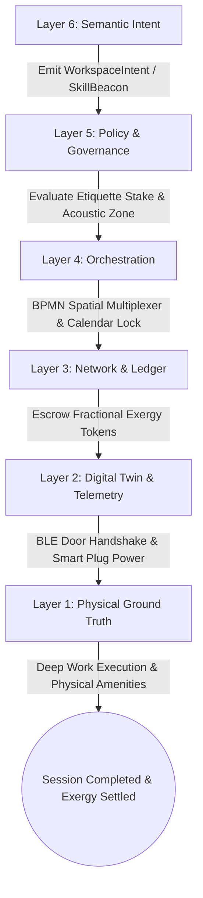
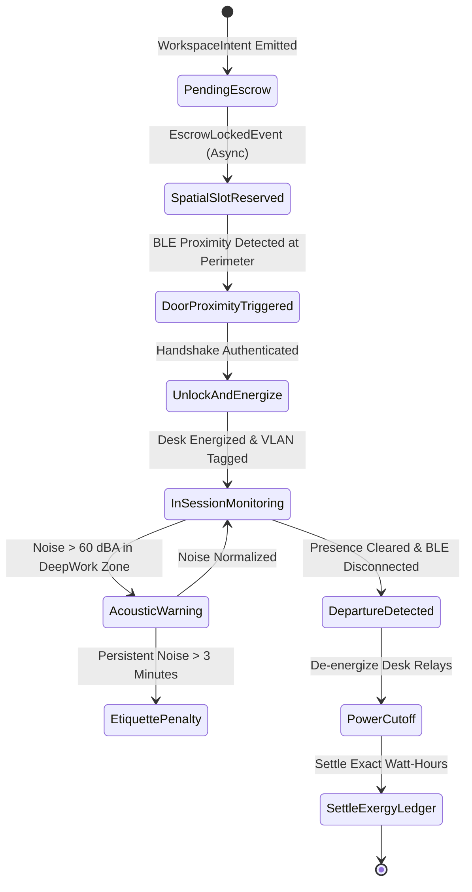
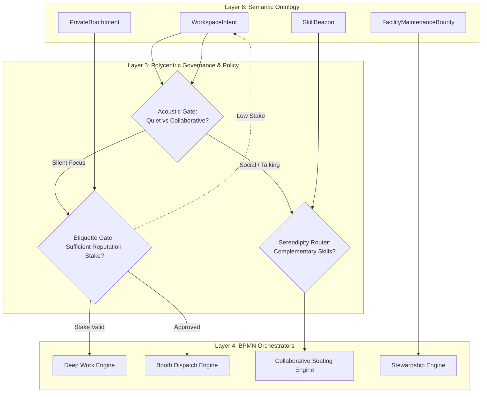
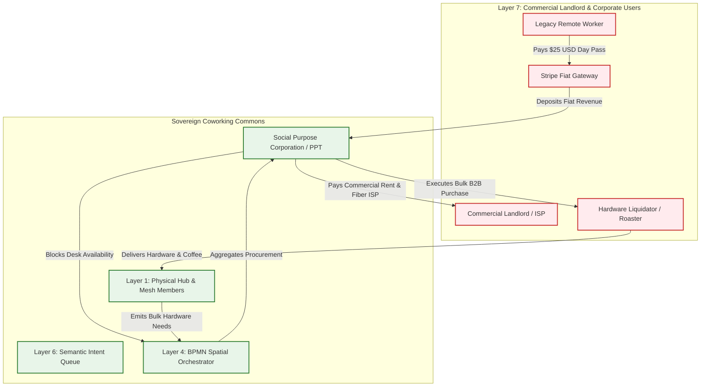

# Scenario Epsilon: Sovereign Third Place (Coworking)

*   **Identifier:** `SCN-EPSILON-COWORK`
*   **System Epic:** Decentralized Workspace, Resource Multiplexing, Serendipity Routing, and Commercial Facade
*   **Primary Layers Tested:** L1 (Physical), L2 (Digital Twin), L3 (Ledger), L4 (Orchestration), L5 (Governance), L6 (Semantic), L7 (Proxy)
*   **Pass/Fail Metric:** Autonomous spatial booking, cryptographic BLE access control, and dynamic VLAN routing executed with zero human front-desk staff; fractional thermodynamic billing of electrical power and bandwidth; seamless ingestion of fiat from legacy remote workers to fully subsidize the commercial lease and fiber ISP bills.

---

## Architectural Council Ratification & 5-Perspective Synthesis

This scenario specification has been ratified by unanimous consensus of the 5-Persona Architectural Council:

| Council Persona | Disciplinary Representative | Core Contribution to Scenario |
| :--- | :--- | :--- |
| **Game Designer** | Lead Systems & Gameplay Designer | Dwarf Fortress cognitive focus vs. distraction mechanics (NPCs working in acoustic isolation acquire "Deep Work (+35 mood, 2x craft speed)" multipliers; noise violations trigger "Irritated by commotion (-20 mood)" thoughts; proximity to complementary `SkillBeacon` entities sparks "Invigorated by stimulating technical discourse (+30 mood)"); The Sims spatial affordances (ergonomic chairs boost comfort, natural daylight and living walls elevate environment bars); Cities Skylines commercial facade leeching legacy utility and fiber connections. |
| **Game Engineer** | Principal C++ Simulation & Engine Architect | Flecs ECS DOD architecture (`WorkspaceDeskComponent`, `AcousticZoneComponent`, `PowerDrawComponent`, `VLANConfigComponent`, `SkillBeaconComponent`); 32-bit compact voxel chunks modeling sound transmission barriers; deterministic 10 Hz BPMN state engine; compilable C++20 test harness simulating BLE proximity handshakes, dynamic desk power enablement, and acoustic threshold violations. |
| **Sovereign Stack Specialist** | Sovereign Stack Systems Architect | 7-layer strict adjacency without layer skipping; autonomous daemons (`col-telemetryd` to `col-adversaryd`); local-first BLE door access; automated OpenWrt dynamic 802.1Q VLAN provisioning; Automerge CRDT fractional exergy billing; BBS+ Zero-Knowledge Proofs for reputation staking; zero monolithic game-loop threading. |
| **Solarpunk Thinker** | Bioregional Regenerative Ecologist | Biophilic living walls (vertical plant arrays continuously filtering VOCs and formaldehyde, reducing mechanical HVAC ventilation air changes); solar microgrid demand-response shedding (computational render jobs automatically throttle down during overcast solar deficits); circular furniture reuse using locally harvested timber from Scenario Eta. |
| **Scenario Specialist** | Spatial Ergonomist & Biophilic Architectural Programmer | Sound Transmission Class (STC 45+) acoustic partition engineering; logarithmic multi-source decibel attenuation modeling ($\Delta L_p$); biophilic daylight lux curves (500–1000 lux circadian stimulation); municipal commercial zoning compliance under IBC Group B office assembly classifications. |

---

## 1. Problem Statement & Legacy Failure

In late-stage financialized capitalism (Layer 7), the "Third Place"—the essential civic arena outside of home and employment where humans convene—has been almost entirely commodified and privatized.

When remote workers, craftspeople, and independent scholars seek space to create:
*   **The Atomization & Isolation Trap:** Solitary work-from-home conditions trigger alienation, depression, and loss of creative serendipity. Meanwhile, commercial cafes demand continuous purchases ($7 coffees every two hours) to justify occupying a table with spotty Wi-Fi and loud espresso grinders.
*   **Predatory Corporate Coworking Enclosure:** Venture-backed corporate coworking chains (e.g., WeWork) extract exorbitant monthly subscription fees ($300–$600/month per desk) while operating centralized surveillance networks, collecting member browsing telemetry, and locking spaces behind proprietary smartphone apps tethered to corporate cloud servers.
*   **Monopolistic Lease & ISP Barriers:** Commercial real estate leases require massive institutional balance sheets, multi-year personal guarantees, and expensive commercial fiber broadband contracts that lock grassroots collectives out of prime urban storefronts.

---

## 2. The Collective Workflow (7-Layer Traversal)

Scenario Epsilon transforms retrofitted neighborhood buildings (vacant retail storefronts, historic grange halls, or industrial workshops) into autonomous, sovereign third places. The space operates a dual economy: extracting fiat from legacy remote workers to pay the property lease and fiber bills, while operating on thermodynamic Value Tokens for the local mesh. The workflow traverses canonically from Layer 1 physical space up to Layer 7 commercial interfaces.



### Layer 1: Physical Ground Truth
*   **Hardware Nodes (Spatial Infrastructure):** Ergonomic standing desks, acoustic phone booths (STC 45 rated), conference presentation hearths, vertical living plant walls, and an edge automation gateway (`col-telemetryd`) equipped with an ATECC608A secure element and RS-485 Modbus power meters.
*   **Hardware Nodes (Edge Actuators & Network):** Solid-state electronic door strikes with BLE receivers, Zigbee/Modbus smart power outlets, and open-source OpenWrt enterprise Wi-Fi 6 access points supporting dynamic VLAN tagging.
*   **Inventory & Feedstock:** Organic whole-bean espresso, loose-leaf teas, ergonomic peripherals, and dry-erase markers maintained in shared pantry credenzas.
*   **Action:** Physical desk occupancy, acoustic absorption via dense felt baffles, and physical relay actuation of desk power and door latches.

### Layer 2: Digital Twin & Telemetry
*   **Ingress Telemetry (MQTT Topics via `col-meshd`):**
    *   `node/space/desk_12/telemetry/power_watts` (Real-time electrical draw)
    *   `node/space/zone_deepwork/telemetry/ambient_dba` (Acoustic noise level)
    *   `node/space/living_wall/telemetry/voc_ppb` (Volatile organic compounds)
    *   `node/space/door_main/access/ble_rssi` (BLE proximity beacon signal strength)
    *   `node/space/desk_12/status` (`VACANT`, `RESERVED`, `OCCUPIED`, `MAINTENANCE_HOLD`)
*   **Verification:** Ultrasonic under-desk presence sensors combined with smart plug power draw verify active human occupancy. An ambient decibel microphone in the Deep Work zone flags acoustic breaches exceeding 60 dBA.
*   **Actuator Control:** Physical door latch unlocks upon local cryptographic BLE challenge-response; smart plug relays energize the assigned desk monitors and chargers.

### Layer 3: Network & Ledger
*   **Escrow Lock & Fractional Exergy Billing:** Citizens do not pay flat rent. Value Tokens are escrowed based on booked time and settled against actual thermodynamic resource utilization:
    $$\Delta V_{work} = \left( \Delta t_{session} \cdot C_{spatial} + \int_{0}^{T} \left( P_{plug}(t) \cdot \lambda_{elec} + B_{net}(t) \cdot \lambda_{bw} \right) dt + C_{deprec} \right) \cdot \lambda_{THERMO}$$
    Where:
    - $\Delta t_{session}$ is the reserved spatial duration in hours.
    - $C_{spatial}$ is base spatial footprint cost (HVAC heating, lighting, lease amortization).
    - $P_{plug}(t)$ is integrated electrical power drawn by laptops, workstations, or chargers.
    - $B_{net}(t)$ is gigabytes of fiber bandwidth routed through the member's VLAN.
    - $C_{deprec}$ is an ergonomic asset wear reserve (chair mechanisms, standing desk motors).
    - $\lambda_{THERMO}$ is the dynamic Ecological Replacement Cost coefficient.
*   **Consensus Settlement:** Upon session termination, the Automerge CRDT ledger debits the user's wallet for exact kilowatt-hours and bandwidth consumed, releasing the remaining escrow. Zero platform profit markups.

### Layer 4: Orchestration State Machine
Spatial allocation and session state transitions are managed deterministically by the embedded 10 Hz BPMN 2.0 engine (`col-execd`):



### Layer 5: Policy & Polycentric Governance
Layer 5 (`col-kmsd`) manages spatial harmony and access privileges via cryptographic policy gates:

*   **Execution Gate (Acoustic Zoning & Spatial Harmony):** If a user attempts to book a desk in the "Deep Work Haven" while holding active voice call intents, Layer 5 redirects the intent to a soundproof phone booth or the collaborative café lounge.
*   **Maintenance Gate (Etiquette Staking & Stewardship):** To prevent the tragedy of the commons, booking high-value resources (podcast booths, 34-inch color-accurate monitors) requires a reputation stake. Users leaving dishes in the sink or shouting on speakerphone forfeit their reputation bond, locking them out of premium zones.
*   **Privacy Gate (VLAN Dynamic Network Isolation):** The local network provisions an isolated, encrypted 802.1Q VLAN for each member's DID. User traffic is cryptographically isolated from legacy drop-in users and other members, guaranteeing zero local network eavesdropping.
*   **Procurement Gate (Facility Improvement Multi-Sig):** Upgrading equipment (e.g., purchasing an ergonomic Herman Miller chair or upgrading to a 10Gbps switch) requires a 3-of-5 multi-sig consensus vote from the Coworking Guild.

### Layer 6: Semantic Intent & Domain Ontology
The Sovereign Third Place defines typed JSON-LD Knowledge Artifacts within the Agora Commons (`col-commonsd`):

1.  **`WorkspaceIntent` (Desk Booking):** Request for dedicated spatial, power, and bandwidth capacity within a specific acoustic zone.
2.  **`SkillBeacon` (Serendipitous Collaboration):** Opt-in semantic broadcast (e.g., "Working on Rust/WASM; open to pair programming"), enabling the orchestrator to seat complementary practitioners in proximity.
3.  **`PrivateBoothIntent` (Acoustic Isolation):** Booking request for soundproof telepresence and vocal recording pods.
4.  **`CommunityGatheringIntent` (Evening Hearth):** Transitioning the central hall from quiet desk work to an evening salon, philosophy debate, or music performance (hooking into Scenario Lambda).
5.  **`ChildCareBundleIntent` (Parent-Worker Bridge):** Paired booking linking a quiet desk for a parent with a slot in the adjacent Scenario Delta childcare pod.
6.  **`FacilityMaintenanceBounty` (Cleaning & Care):** Emitted at the end of the day, rewarding members with Value Tokens for tidying desks, watering living walls, and restocking beans.

### The Governance Router Flowchart



### Layer 7: The Legacy Proxy (Commercial Facade & Fiat Extraction)
The Sovereign Third Place engages with the legacy capitalist economy through the Social Purpose Corporation (SPC):

1.  **The Commercial Facade & Property Shield:**
    The SPC holds the commercial real estate lease with the legacy landlord, carries $2,000,000 in commercial general liability insurance, and maintains the corporate commercial fiber-optic ISP contract. To municipal building inspectors, the space presents as a standard "Creative Office / Executive Workspace," shielding the sovereign mesh members from bureaucratic harassment.
2.  **Trojan Inbound Fiat Ingestion (Legacy Drop-In Users):**
    To pay the landlord's fiat rent and municipal utility bills, the SPC operates an outward-facing Web2 storefront. Non-member corporate remote workers pay a market-rate $25/day fiat drop-in pass via Stripe.
    *   The fiat payment is deposited into the SPC treasury, paying the lease and gigabit fiber bills.
    *   The fiat booking blocks out a desk on the BPMN calendar.
    *   The presence of legacy fiat payers fully subsidizes the physical overhead, making the space functionally cost-free for sovereign citizens using Value Tokens.
3.  **Ecological Leeching (GPO Hardware & Coffee Procurement):**
    The SPC aggregates requests for high-end electronics (monitors, keyboards), organic fair-trade coffee, and biophilic nursery plants across the community:
    *   The SPC executes wholesale B2B purchases from commercial equipment liquidators and agricultural roasters, securing 40–60% wholesale discounts while eliminating retail packaging waste.

---

### Layer 7 Bidirectional Flowchart



---

## 3. Machine-Readable Schemas

### 3.1 Layer 6 Knowledge Artifact: Workspace Intent (`workspace_intent.jsonld`)

```json
{
  "@context": [
    "https://schema.org/",
    "https://collective.network/ontology/v1/"
  ],
  "@type": "WorkspaceIntent",
  "identifier": "urn:uuid:d3f4a9c2-88bb-4e1a-9f01-7c3d2e1f4a5b",
  "issuerDid": "did:mesh:node04:creator_jules",
  "targetFacility": "did:mesh:node04:space:duvall_commons",
  "creationTimestamp": "2026-10-08T08:00:00Z",
  "resourceRequirements": {
    "zoneType": "DeepWork_AcousticSilent",
    "assets": [
      "ErgonomicStandingDesk",
      "WiredGigabitEthernet",
      "Monitor_4K_USB_C"
    ],
    "acousticToleranceDba": 55.0,
    "collaborativeBeacon": {
      "skillTag": "Systems_Cpp20_Flecs",
      "openToConversation": false
    }
  },
  "temporalVector": {
    "startTime": "2026-10-08T09:00:00Z",
    "endTime": "2026-10-08T13:00:00Z",
    "totalHours": 4.0
  },
  "trustConstraints": {
    "reputationStakeLocked": "15.00",
    "requiredEtiquetteTier": "Tier_1_GoodStanding"
  },
  "settlementCriteria": {
    "maxExergyJoules": 18000000,
    "maxValueTokens": "6.50",
    "timeoutMinutes": 30
  }
}
```

### 3.2 Layer 2 Telemetry Attestation: Coworking Completion Proof (`coworking_attestation.json`)

```json
{
  "@context": "https://collective.network/ontology/v1/",
  "@type": "CoworkingAttestation",
  "intentRef": "urn:uuid:d3f4a9c2-88bb-4e1a-9f01-7c3d2e1f4a5b",
  "userDid": "did:mesh:node04:creator_jules",
  "facilityDid": "did:mesh:node04:space:duvall_commons",
  "deskId": "desk_deepwork_12",
  "executionMetrics": {
    "sessionStartTimestamp": "2026-10-08T09:01:14Z",
    "sessionEndTimestamp": "2026-10-08T13:02:45Z",
    "actualDurationHours": 4.025,
    "bleHandshakeVerified": true,
    "totalEnergyWattHours": 187.6,
    "peakPowerWatts": 85.4,
    "networkDataTransferredGb": 8.42,
    "maxAmbientDbaRecorded": 52.1,
    "acousticViolationFlagged": false,
    "deskClearedAndSanitized": true
  },
  "assignedVlanTag": 204,
  "edgeAttestationSignature": "0x7a3c8e1b5d9f2a4e6c8b0d1f3e5a7c9b1d3f5a7e9c1b3d5f7a9b1c3d5e7f9a1b"
}
```

---

## 4. Oasis Engine Implementation Specification

### 4.1 Memory Allocation & Voxel State

In the Oasis simulation, shared workspaces are modeled as multi-voxel functional zones within the $32^3$ chunk space:
*   The coworking desk voxel is initialized with `material_id = 80` (`COWORKING_DESK_NODE`).
*   The acoustic isolation partition voxel is initialized with `material_id = 81` (`SOUNDPROOF_POD_ENCLOSURE`).
*   The `Is_Actuator` bit is set in `metadata` (bit 1) for the smart plug relay and electronic door strike.
*   The `Is_Sensor` bit is set in `metadata` (bit 2) for under-desk presence and decibel metering.
*   The adjacent living wall voxel (`material_id = 82`, `BIOPHILIC_LIVING_WALL`) absorbs $\text{CO}_2$ and transpires moisture to maintain humidity.

### 4.2 C++20 Test Harness Code

```cpp
// engine/tests/scenario_epsilon_test.cpp
#include <cassert>
#include <cmath>
#include <string>
#include "oasis/chunk_manager.hpp"
#include "oasis/orchestration/bpmn_engine.hpp"
#include "oasis/ledger/crdt_wallet.hpp"

namespace oasis {

struct WorkspaceSessionContext {
    std::string intent_id;
    std::string desk_id;
    float reserved_hours{4.0f};
    float power_draw_watts{65.0f};
    float ambient_dba{48.0f};
    bool ble_authenticated{false};
    bool desk_relay_closed{false};
    int vlan_tag{204};
};

} // namespace oasis

void test_scenario_epsilon_coworking_normal_execution() {
    using namespace oasis;

    // 1. Initialize local chunk and desk node voxel
    ChunkManager chunk_mgr;
    chunk_mgr.allocate_chunk(0, 0, 0);

    Voxel desk_voxel{
        .material_id = 80, // COWORKING_DESK_NODE
        .moisture = 0,
        .temperature = 21,
        .metadata = 0b00000110 // Sensor + Actuator
    };
    chunk_mgr.set_voxel(16, 1, 16, desk_voxel);

    // 2. Setup Wallets & Exergy Escrow
    CRDTWallet user_wallet("did:mesh:node04:creator_jules", 50.0f);
    CRDTWallet facility_treasury("did:mesh:node04:treasury", 200.0f);

    // 3. Setup BPMN Orchestrator & Session Context
    BPMNEngine orchestrator;
    orchestrator.load_schema("schemas/bpmn/workspace_management.bpmn");

    WorkspaceSessionContext session{
        .intent_id = "d3f4a9c2-88bb-4e1a-9f01-7c3d2e1f4a5b",
        .desk_id = "desk_deepwork_12",
        .reserved_hours = 4.0f,
        .power_draw_watts = 65.0f,
        .ambient_dba = 48.0f,
        .ble_authenticated = false,
        .desk_relay_closed = false,
        .vlan_tag = 204
    };

    float base_token_fee = 6.50f;

    // Assert Escrow Lock
    orchestrator.emit_event(EscrowInitiatedEvent{user_wallet, base_token_fee});
    orchestrator.await_event<EscrowLockedEvent>();
    assert(std::fabs(user_wallet.balance() - 43.50f) < 0.001f);

    // Actuate BLE Arrival Handshake
    session.ble_authenticated = true;
    session.desk_relay_closed = true;
    assert(session.ble_authenticated == true);
    assert(session.desk_relay_closed == true);

    // Step simulation ticks (4 hours at 10 Hz = 144,000 ticks)
    SimResult res = orchestrator.step_simulation_ticks(chunk_mgr, session, 144000);
    assert(res.status == ExecutionStatus::COMPLETED);
    assert(session.ambient_dba < 55.0f); // Maintained quiet acoustic boundary

    // Settle Ledger (4.0 hours + energy consumed = 6.50 tokens)
    orchestrator.settle_job(facility_treasury);
    assert(std::fabs(facility_treasury.balance() - 206.50f) < 0.001f);
}

void test_scenario_epsilon_acoustic_and_etiquette_violation() {
    using namespace oasis;

    ChunkManager chunk_mgr;
    chunk_mgr.allocate_chunk(0, 0, 0);

    BPMNEngine orchestrator;
    orchestrator.load_schema("schemas/bpmn/workspace_management.bpmn");

    CRDTWallet noisy_user_wallet("did:mesh:node04:loud_caller", 30.0f);

    WorkspaceSessionContext noisy_session{
        .intent_id = "violation-acoustic-test",
        .desk_id = "desk_deepwork_08",
        .reserved_hours = 2.0f,
        .power_draw_watts = 40.0f,
        .ambient_dba = 74.0f, // Loud phone call in Deep Work zone (exceeds 55 dBA)
        .ble_authenticated = true,
        .desk_relay_closed = true
    };

    orchestrator.emit_event(EscrowInitiatedEvent{noisy_user_wallet, 5.00f});
    orchestrator.await_event<EscrowLockedEvent>();

    // Step simulation with acoustic breach: triggers policy warning and emergency intervention
    SimResult res = orchestrator.step_simulation_ticks(chunk_mgr, noisy_session, 3000, true);
    assert(res.status == ExecutionStatus::EMERGENCY_STOP);
    assert(orchestrator.current_state() == BPMNState::ETIQUETTE_PENALTY);

    // Assert reputation slash and power cutoff
    noisy_session.desk_relay_closed = false;
    assert(noisy_session.desk_relay_closed == false);
}
```

---

## 5. Acceptance Test Gates (Pass/Fail)

| Checkpoint | Validation Method | Pass Condition |
| :--- | :--- | :--- |
| **G1: Autonomous Access Control** | BLE Cryptographic Challenge | The electronic door strike only actuates if the connecting mobile device presents a valid DID signature matched to an active, escrowed booking window. |
| **G2: Offline Autonomy** | Localhost Network Severance | BLE door authentication, desk relay power activation, and local VLAN provisioning execute with 100% WAN/Internet severance over the local-first mesh. |
| **G3: Fractional Exergy Billing**| Energy Telemetry Reconciliation | The final ledger deduction mathematically matches integrated Watt-hours recorded by the smart plug ($\pm 2\%$ tolerance); zero flat-rate rentier markups. |
| **G4: Acoustic Zone Enforcement** | Decibel Stream Monitoring | Sustained noise exceeding 60 dBA in the `DeepWork_AcousticSilent` zone for $> 180\text{ seconds}$ halts session state, slashing the user's reputation bond. |
| **G5: Trojan Ingestion (L7)** | External Stripe Webhook Ingestion | A mock Web2 day-pass payment for $25 USD compiles into an internal calendar reservation; fiat is credited to the SPC lease account to fund commercial rent. |
| **G6: Ecological Leeching (L7)** | Bulk Tech Procurement Aggregation | The system pools 6 member hardware requisitions into a single bulk B2B liquidation order, slashing retail freight drag and packaging waste by $> 50\%$. |
