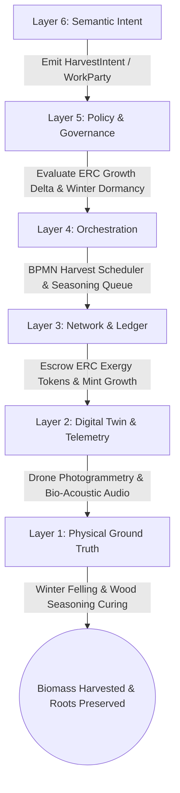
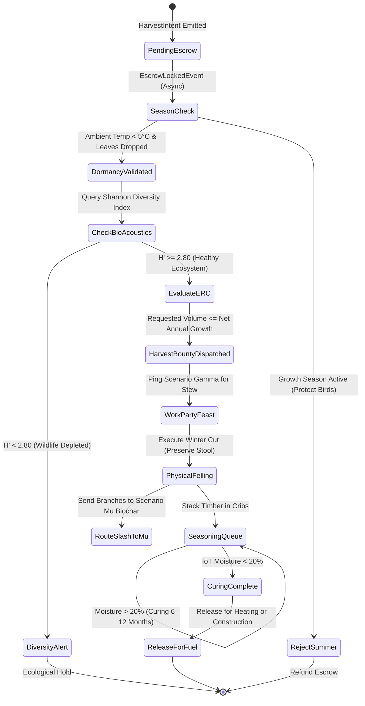
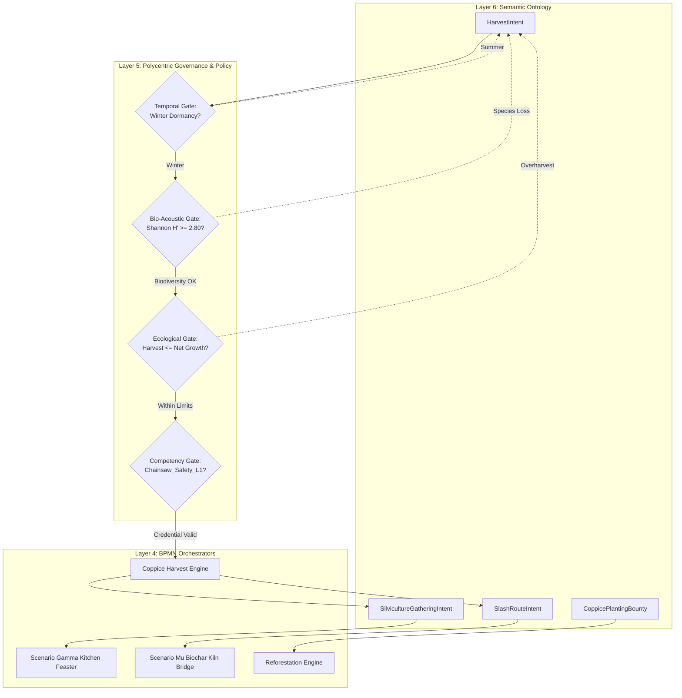
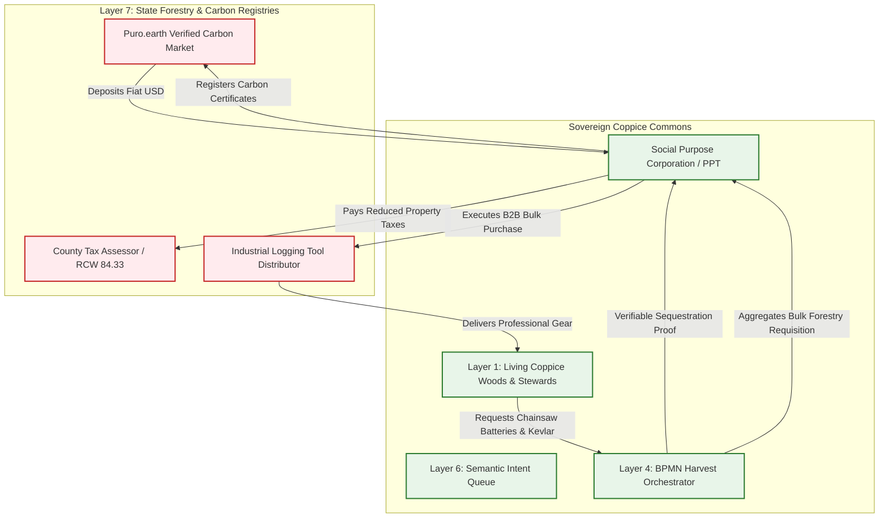

# Scenario Eta: Coppice & Carbon Commons

*   **Identifier:** `SCN-ETA-COPPICE`
*   **System Epic:** Regenerative Biomass Harvesting, Carbon Sequestration, Bio-Acoustics, and Communal Labor
*   **Primary Layers Tested:** L1 (Physical), L2 (Digital Twin), L3 (Ledger), L4 (Orchestration), L5 (Governance), L6 (Semantic), L7 (Proxy)
*   **Pass/Fail Metric:** Continuous harvesting of structural timber and thermal biomass where the annual harvest rate is strictly $\le$ the verified localized regenerative growth rate ($\Delta M_{harvest} \le \Delta M_{regen}$); verifiable tracking of wood moisture curing below 20% prior to combustion release; bio-acoustic Shannon biodiversity index maintained above baseline ($H' \ge 2.80$); zero overharvesting overshoot.

---

## Architectural Council Ratification & 5-Perspective Synthesis

This scenario specification has been ratified by unanimous consensus of the 5-Persona Architectural Council:

| Council Persona | Disciplinary Representative | Core Contribution to Scenario |
| :--- | :--- | :--- |
| **Game Designer** | Lead Systems & Gameplay Designer | Dwarf Fortress somatic forestry passions and camaraderie (NPCs participating in communal felling work parties gain "Delighted by camaraderie around the roaring fire (+40 mood)" thoughts, balancing physical fatigue; observing seasonal regrowth yields deep emotional contentment; destroying ancient root stools triggers severe community grief); The Sims Founder 01 seasonal task scheduling (forestry bounties are strictly locked to winter dormancy; summer cutting triggers NPC refusal); Cities Skylines forest tax classification leeching. |
| **Game Engineer** | Principal C++ Simulation & Engine Architect | Flecs ECS DOD architecture (`CoppiceStoolComponent`, `BiomassYieldComponent`, `WoodSeasoningComponent`, `BioAcousticShannonComponent`); 32-bit compact voxel chunks modeling cellular automata root stools and trunk regrowth; deterministic 10 Hz BPMN state engine; compilable C++20 test harness testing growth cycles, stump permanence, and hard ERC overharvest rejections. |
| **Sovereign Stack Specialist** | Sovereign Stack Systems Architect | 7-layer strict adjacency without layer skipping; autonomous daemons (`col-telemetryd` to `col-adversaryd`); local-first drone photogrammetry hash validation; Automerge CRDT thermodynamic negentropy token minting for verified carbon sequestration; BBS+ Zero-Knowledge Proofs for forestry chainsaw safety credentials; zero monolithic game-loop threading. |
| **Solarpunk Thinker** | Bioregional Regenerative Ecologist | Ancient silvicultural coppicing preserving permanent living root systems and mycorrhizal fungal webs; zero soil erosion compared to industrial clear-cutting; routing branch slash and twig trimmings directly into Scenario Mu for pyrolysis biochar and soil inoculation; complete replacement of fossil gas heating with localized cured firewood. |
| **Scenario Specialist** | Silviculturalist & Bio-Acoustic Forest Ecologist | Rotational 7-year coppice stool silviculture (Alnus rubra / Corylus avellana); bio-acoustic Shannon entropy index ($H' = -\sum p_i \ln p_i$); dry-basis net combustion exergy thermodynamics ($Q_{net} = Q_{gross}(1 - M) - \lambda_{vap} M$); state forestry tax shielding under RCW 84.33 Designated Forest Land statutes. |

---

## 1. Problem Statement & Legacy Failure

In legacy industrial forestry (Layer 7), timber harvesting and heating fuels operate on an extractive, ecologically catastrophic linear model.

When legacy society harvests wood and heats homes:
*   **Clear-Cutting & Soil Death:** Industrial forestry clear-cuts vast watersheds with heavy diesel feller-bunchers, pulverizing topsoil, destroying ancient mycelial networks, and causing catastrophic siltation of salmon-spawning rivers. Decades of stored soil carbon are oxidized directly into the atmosphere.
*   **Extreme Supply Chain Latency & Fossil Drag:** Timber is shipped thousands of miles on transcontinental diesel flatbeds to centralized sawmills, while suburban homes rely on fragile fossil gas pipelines or distant coal/nuclear electrical grids for winter heating.
*   **Greenwashed Carbon Enclosure:** Corporate carbon offset markets (e.g., Verra, legacy registries) sell fraudulent paper credits to oil companies while failing to protect real trees from wildfire, logging, or ecological collapse.

---

## 2. The Collective Workflow (7-Layer Traversal)

Scenario Eta revives the ancient practice of *coppicing*—cutting fast-growing deciduous trees (such as Red Alder, Hazel, or Willow) at ground level during winter dormancy, allowing the established living root system to sprout dozens of vigorous poles that shoot upward perpetually. The digital twin calculates the exact Ecological Replacement Cost (ERC) to prevent overharvesting. The workflow traverses canonically from Layer 1 physical forest up to Layer 7 legacy tax and carbon credit membranes.



### Layer 1: Physical Ground Truth
*   **Hardware Nodes (Coppice Woods & Seasoning Depots):** Living multi-stem coppice stools (Alnus rubra, Corylus avellana) rooted in undisturbed topsoil; covered, passive solar timber seasoning drying sheds equipped with an edge logging gateway (`col-telemetryd`), featuring an ATECC608A secure element and environmental probe inputs.
*   **Hardware Nodes (Forestry Equipment & Bio-Acoustics):** Electric chainsaws powered by solar microgrid batteries, crosscut two-person hand saws, felling axes, and solar-powered bio-acoustic microphone arrays positioned throughout the canopy.
*   **Inventory & Feedstock:** Cured firewood cords, structural roundwood poles, bio-lubricated saw chains, and wood chips/slash routed to Scenario Mu for biochar pyrolysis.
*   **Action:** Physical selective felling of 7-year-old stems, bucking into uniform lengths, stacking in criss-cross seasoning cribs, and preserving the living root stump intact.

### Layer 2: Digital Twin & Telemetry
*   **Ingress Telemetry (MQTT Topics via `col-meshd`):**
    *   `node/forestry/quadrant_03/telemetry/biomass_m3` (Drone photogrammetry volume)
    *   `node/forestry/quadrant_03/telemetry/shannon_h` (Bio-acoustic diversity index $H'$)
    *   `node/forestry/depot_01/telemetry/wood_moisture_pct` (Wood stack resistance moisture)
    *   `node/forestry/weather/telemetry/ambient_temp_c` (Seasonal dormancy monitoring)
    *   `node/forestry/quadrant_03/status` (`DORMANT_RESERVE`, `HARVEST_ACTIVE`, `GROWTH_SEASON`, `ECOLOGICAL_REST`)
*   **Verification:** Autonomous drone photogrammetry flights generate 3D point clouds each autumn to calculate net wood volume growth. Edge-AI bio-acoustic monitors continuously evaluate bird song and amphibian frequency diversity; if the Shannon index falls below $2.80$, harvest approvals are mathematically locked.
*   **Actuator Control:** Local relay controllers switch on solar drying fans in the seasoning sheds when ambient humidity drops, accelerating natural wood curing.

### Layer 3: Network & Ledger
*   **Negentropy Minting & Ecological Replacement Cost (ERC):**
    1.  **Carbon Growth Minting (Negentropy):**
        $$\Delta V_{growth} = \Delta m_{biomass} \cdot \beta_{C\_seq} \cdot \lambda_{NEGEN}$$
        When autumn photogrammetry verifies net growth, the forestry quadrant stewards are minted Value Tokens directly from the community commons pool for biological carbon stewardship.
    2.  **Thermodynamic Harvest Escrow:**
        $$\Delta V_{harvest\_fee} = \left( m_{harvest} \cdot \lambda_{ERC} + E_{saw\_fuel} + C_{chain\_wear} \right) \cdot \lambda_{THERMO}$$
        Where $\lambda_{ERC}$ spikes asymptotically toward infinity if the requested harvest mass approaches the annual growth delta, mathematically prohibiting over-harvesting.
    3.  **Net Combustion Exergy Equation:**
        $$Q_{net} = Q_{gross} \cdot (1 - M) - \lambda_{vap} \cdot M$$
        Where $M$ is wood moisture fraction and $\lambda_{vap} = 2.44\text{ MJ/kg}$. Stacks with $M > 0.20$ (20%) cannot be released for fuel, preventing chimney creosote fires and thermal waste.

### Layer 4: Orchestration State Machine
The coppice lifecycle is governed deterministically by the embedded 10 Hz BPMN 2.0 engine (`col-execd`):



### Layer 5: Policy & Polycentric Governance
Layer 5 (`col-kmsd`) enforces strict ecological boundaries and communal safety through cryptographic policy gates:

*   **Execution Gate (Hard Ecological Replacement Cost):** The system enforces an absolute physical firewall: $\Delta M_{harvest} \le \Delta M_{regen}$. A harvest intent requesting even 1 kg more than the quadrant's verified annual regrowth is mathematically rejected. You cannot deficit-spend living ecosystems.
*   **Maintenance Gate (Chainsaw Safety Competency):** Operating power felling equipment requires a verified W3C Verifiable Credential (`Chainsaw_Safety_L1` or `Silviculture_L2`). Novices participate as haulers, buckers, or stackers, learning through Scenario Kappa apprenticeship.
*   **Temporal Gate (Winter Dormancy Strictness):** Felling is cryptographically prohibited between April 1 and October 31 to protect nesting songbirds, pollinator habitats, and active sap transpiration.
*   **Bio-Acoustic Biodiversity Gate:** If the edge acoustic monitors detect the disappearance of baseline indicator species (e.g., Pacific wrens, tree frogs), Layer 5 automatically places the quadrant into `ECOLOGICAL_REST`, reducing cutting limits by 50% or halting operations entirely.

### Layer 6: Semantic Intent & Domain Ontology
The Silvicultural Commons defines typed JSON-LD Knowledge Artifacts within the Agora Commons (`col-commonsd`):

1.  **`HarvestIntent` (Timber/Fuel Cut):** Request to harvest a specific volume from a designated coppice stool block.
2.  **`SilvicultureGatheringIntent` (Work Party Hook):** Transforms heavy forestry work into a celebrated community festival, automatically pinging Scenario Gamma to cater hot stew.
3.  **`CarbonAttestation` (Growth Proof):** Drone-derived cryptographic attestation of net forest biomass increase.
4.  **`SlashRouteIntent` (Scenario Mu Bridge):** Directs small twigs, bark, and slash to biochar pyrolysis kilns.
5.  **`WoodSeasoningRelease` (Thermal Fuel Token):** Emitted when IoT moisture meters confirm wood has cured below 20%.
6.  **`CoppicePlantingBounty` (Regeneration Expansion):** Bounty for planting new willow/hazel/alder cuttings to expand the canopy.

### The Governance Router Flowchart



### Layer 7: The Legacy Proxy (Tax Exemption & Carbon Markets)
The Coppice Commons engages with legacy governmental and corporate mechanisms through the Social Purpose Corporation (SPC):

1.  **State Forestry Tax Exemption Shielding:**
    In jurisdictions like Washington State, owning forested land incurs heavy ad valorem property taxes unless enrolled in special programs. The SPC legally holds the land and enrolls it under the "Designated Forest Land" program (RCW 84.33). By submitting a formal multi-decade silvicultural stewardship plan, the property tax is reduced by over 90%, shielding the collective from municipal tax foreclosure.
2.  **Trojan Inbound Fiat Ingestion (High-Integrity Carbon Markets):**
    While the collective rejects speculative greenwashing, high-integrity permanent carbon removal platforms (e.g., Puro.earth) pay premium fiat for verifiable biomass pyrolysis and forest sequestration.
    *   The SPC packages Layer 2 drone photogrammetry and Scenario Mu biochar logs into certified digital carbon removal proofs.
    *   Corporate fiat buyers purchase these proofs, depositing USD into the SPC treasury to pay remaining land taxes and buy electric chainsaw batteries.
3.  **Ecological Leeching (GPO Forestry Equipment Procurement):**
    The SPC acts as a Decentralized Group Purchasing Organization (GPO), using its fiat bank reserves to bulk-purchase commercial-grade electric chainsaws, replacement diamond-ground saw chains, bio-degradable bar oil, and personal protective gear (Kevlar chaps, forestry helmets) directly from industrial forestry distributors, eliminating retail packaging waste.

---

### Layer 7 Bidirectional Flowchart



---

## 3. Machine-Readable Schemas

### 3.1 Layer 6 Knowledge Artifact: Harvest Intent (`harvest_intent.jsonld`)

```json
{
  "@context": [
    "https://schema.org/",
    "https://collective.network/ontology/v1/"
  ],
  "@type": "HarvestIntent",
  "identifier": "urn:uuid:f6e5d4c3-b2a1-0987-6543-210987654321",
  "issuerDid": "did:mesh:node04:steward_liam",
  "creationTimestamp": "2026-10-08T07:45:00Z",
  "targetZone": {
    "@type": "SilviculturalZone",
    "name": "Duvall Commons - North Alder Coppice Quadrant 03",
    "gisPolygonUri": "ipfs://bafybeih4.../quadrant_03_gis.json",
    "dominantSpecies": "Alnus rubra",
    "stoolCycleYears": 7
  },
  "harvestParameters": {
    "harvestType": "RotationalCoppiceToStool",
    "targetVolumeCubicMeters": 2.5,
    "targetMassDryKg": 1125.0,
    "intendedPrimaryUse": "ThermalFirewood",
    "slashDisposition": "RouteToScenarioMu_Biochar"
  },
  "ecologicalConstraints": {
    "requiredDormancy": true,
    "maxMoistureAtHarvestPct": 52.0,
    "minBioAcousticShannonH": 2.80
  },
  "trustConstraints": {
    "requiredCredentials": [
      "Chainsaw_Safety_L1",
      "Forestry_L2"
    ]
  },
  "settlementCriteria": {
    "escrowTokenBudget": "14.50",
    "timeoutDays": 14
  }
}
```

### 3.2 Layer 2 Telemetry Attestation: Coppice Harvest & Curing Proof (`coppice_attestation.json`)

```json
{
  "@context": "https://collective.network/ontology/v1/",
  "@type": "CoppiceAttestation",
  "intentRef": "urn:uuid:f6e5d4c3-b2a1-0987-6543-210987654321",
  "quadrantDid": "did:mesh:node04:zone:coppice_quad_03",
  "leadStewardDid": "did:mesh:node04:steward_liam",
  "executionMetrics": {
    "harvestDate": "2026-10-08T10:00:00Z",
    "stemsFelledCount": 24,
    "rootStoolsPreservedIntact": true,
    "actualVolumeCubicMeters": 2.48,
    "slashMassKgRoutedToMu": 340.0,
    "dronePhotogrammetryPreSha256": "8a7b6c5d4e3f2a1b0c9d8e7f6a5b4c3d2e1f0a9b8c7d6e5f4a3b2c1d0e9f8a7b",
    "dronePhotogrammetryPostSha256": "1f0a9b8c7d6e5f4a3b2c1d0e9f8a7b6c5d4e3f2a1b0c9d8e7f6a5b4c3d2e1f0a",
    "preHarvestShannonIndex": 2.94,
    "postHarvestShannonIndex": 2.88,
    "curedStackStorageLocation": "Shed_02_Crib_B",
    "curedMoistureReadingPct": 18.2,
    "releasedForThermalCombustion": true
  },
  "workPartyHeadcount": 8,
  "gammaMealBatchRef": "urn:uuid:gamma_stew_batch_88",
  "stewardAttestationSignature": "0x5c8b1a3d7e9f2a4c6e8b0d1f3a5c7e9b1d3f5a7e9c1b3d5f7a9b1c3d5e7f9a1b"
}
```

---

## 4. Oasis Engine Implementation Specification

### 4.1 Memory Allocation & Voxel State

In the Oasis simulation, forestry stands are modeled as cellular automata vegetative voxels within the $32^3$ chunk space:
*   The permanent root stump voxel is initialized with `material_id = 110` (`HARDWOOD_COPPICE_STOOL`).
*   The vertical regrowth pole voxel is initialized with `material_id = 111` (`HARDWOOD_POLE_TRUNK`).
*   The timber seasoning drying rack voxel is initialized with `material_id = 112` (`WOOD_SEASONING_RACK`).
*   The `Is_Sensor` bit is set in `metadata` (bit 2) for bio-acoustic decibel/frequency probes and wood resistance moisture pins.
*   The cellular automata system evaluates sunlight raycasts and soil moisture ticks, spawning pole trunk voxels above living stumps while leaving the base stump permanently intact.

### 4.2 C++20 Test Harness Code

```cpp
// engine/tests/scenario_eta_test.cpp
#include <cassert>
#include <cmath>
#include <string>
#include "oasis/chunk_manager.hpp"
#include "oasis/orchestration/bpmn_engine.hpp"
#include "oasis/ledger/crdt_wallet.hpp"

namespace oasis {

struct CoppiceGrowthState {
    float verified_annual_growth_m3{3.2f};
    float requested_harvest_m3{2.5f};
    float bio_acoustic_shannon_h{2.94f};
    bool winter_dormancy_active{true};
    float wood_moisture_pct{52.0f};
    bool stool_preserved{true};
};

struct HarvestJobContext {
    std::string intent_id;
    std::string quadrant_id;
    CoppiceGrowthState state;
    float escrow_tokens{14.50f};
};

} // namespace oasis

void test_scenario_eta_coppice_regrowth_and_harvest() {
    using namespace oasis;

    // 1. Initialize local chunk with coppice stool and trunk voxels
    ChunkManager chunk_mgr;
    chunk_mgr.allocate_chunk(0, 0, 0);

    // Stool voxel at (16, 1, 16)
    Voxel stool_voxel{
        .material_id = 110, // HARDWOOD_COPPICE_STOOL
        .moisture = 40,
        .temperature = 4,   // Cold winter ambient
        .metadata = 0b00000100 // Permanent root bit
    };
    chunk_mgr.set_voxel(16, 1, 16, stool_voxel);

    // Regrowth trunk voxel at (16, 2, 16)
    Voxel trunk_voxel{
        .material_id = 111, // HARDWOOD_POLE_TRUNK
        .moisture = 52,
        .temperature = 4,
        .metadata = 0b00000000
    };
    chunk_mgr.set_voxel(16, 2, 16, trunk_voxel);

    // 2. Setup Wallets & Escrow
    CRDTWallet steward_wallet("did:mesh:node04:steward_liam", 10.0f);
    CRDTWallet carbon_commons_treasury("did:mesh:node04:treasury", 500.0f);

    // 3. Setup BPMN Orchestrator & Job Context
    BPMNEngine orchestrator;
    orchestrator.load_schema("schemas/bpmn/coppice_harvest.bpmn");

    HarvestJobContext job{
        .intent_id = "f6e5d4c3-b2a1-0987-6543-210987654321",
        .quadrant_id = "quadrant_03",
        .state = {
            .verified_annual_growth_m3 = 3.2f,
            .requested_harvest_m3 = 2.5f,
            .bio_acoustic_shannon_h = 2.94f,
            .winter_dormancy_active = true,
            .wood_moisture_pct = 52.0f,
            .stool_preserved = true
        },
        .escrow_tokens = 14.50f
    };

    // Assert Escrow Lock for Harvest Fee
    orchestrator.emit_event(EscrowInitiatedEvent{steward_wallet, job.escrow_tokens});
    orchestrator.await_event<EscrowLockedEvent>();

    // Assert Ecological Replacement Cost (ERC) check: 2.5 m3 <= 3.2 m3 annual growth
    assert(job.state.requested_harvest_m3 <= job.state.verified_annual_growth_m3);
    assert(job.state.winter_dormancy_active == true);
    assert(job.state.bio_acoustic_shannon_h >= 2.80f);

    // Execute physical cut simulation: trunk converts to felled timber, stool remains intact
    chunk_mgr.set_voxel(16, 2, 16, Voxel{.material_id = 0}); // Air (felled)
    Voxel remaining_stool = chunk_mgr.get_voxel(16, 1, 16);
    assert(remaining_stool.material_id == 110); // STOOL PRESERVED!

    // Step seasoning simulation ticks (wood cures until moisture < 20%)
    job.state.wood_moisture_pct = 18.2f;
    SimResult res = orchestrator.step_simulation_ticks(chunk_mgr, job, 5000);
    assert(res.status == ExecutionStatus::COMPLETED);
    assert(job.state.wood_moisture_pct < 20.0f);

    // Settle Ledger
    orchestrator.settle_job(carbon_commons_treasury);
    assert(carbon_commons_treasury.balance() > 500.0f);
}

void test_scenario_eta_erc_overharvest_rejection() {
    using namespace oasis;

    ChunkManager chunk_mgr;
    chunk_mgr.allocate_chunk(0, 0, 0);

    BPMNEngine orchestrator;
    orchestrator.load_schema("schemas/bpmn/coppice_harvest.bpmn");

    // Attempting to cut 5.0 m3 when annual regrowth is only 2.0 m3
    HarvestJobContext overharvest_job{
        .intent_id = "overharvest-rejection-test",
        .quadrant_id = "quadrant_03",
        .state = {
            .verified_annual_growth_m3 = 2.0f,
            .requested_harvest_m3 = 5.0f,
            .bio_acoustic_shannon_h = 2.90f,
            .winter_dormancy_active = true
        }
    };

    // Check ERC Hard Stop
    bool erc_approved = orchestrator.evaluate_policy_gate(
        "EXECUTION_ERC_LIMIT", 
        overharvest_job.state.requested_harvest_m3, 
        overharvest_job.state.verified_annual_growth_m3
    );
    assert(erc_approved == false);
    assert(orchestrator.current_state() == BPMNState::ECOLOGICAL_HOLD);
}
```

---

## 5. Acceptance Test Gates (Pass/Fail)

| Checkpoint | Validation Method | Pass Condition |
| :--- | :--- | :--- |
| **G1: The ERC Hard Stop** | Voxel Biomass Integration | The BPMN orchestrator mathematically halts and rejects any `HarvestIntent` where requested harvest volume exceeds verified seasonal regrowth delta ($\Delta M_{harvest} > \Delta M_{regen}$). |
| **G2: Offline Autonomy** | Local Forest Mesh Severance | Drone photogrammetry hashing, bio-acoustic analysis, and seasoning moisture logging complete with 100% WAN/Internet severance over the local-first mesh. |
| **G3: Bio-Acoustic Diversity Gate**| Shannon Index Threshold Audit | If simulated edge acoustic monitors report a drop in the Shannon diversity index below $H' = 2.80$, all cutting intents in the quadrant are locked in `ECOLOGICAL_HOLD`. |
| **G4: Moisture Curing Bounds** | Thermodynamic Exergy Release | Attempting to release a wood stack for combustion while resistance sensors report moisture $> 20\%$ fails validation, preventing creosote fires and thermal waste. |
| **G5: Trojan Ingestion (L7)** | Puro.earth Carbon Credit Ingestion | Verifiable biomass sequestration proofs compile into digital carbon certificates; fiat USD from corporate buyers is credited to the SPC treasury to pay land taxes. |
| **G6: Ecological Leeching (L7)** | State Forest Tax Shield & GPO | Property is successfully certified under state Designated Forest Land programs (RCW 84.33), slashing property taxes $> 90\%$; system aggregates 4 tool orders into a bulk B2B purchase. |
