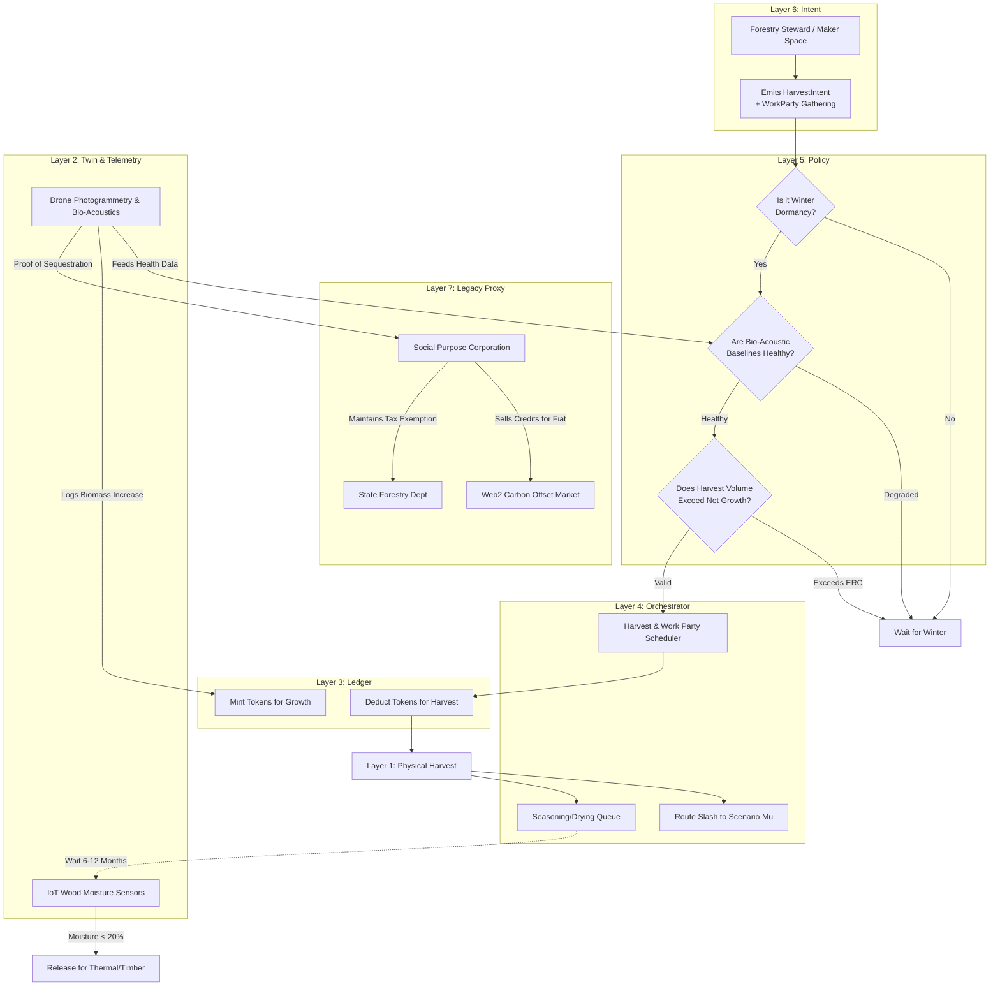

# Scenario Eta: Coppice & Carbon Commons

*   **Identifier:** `SCN-ETA-COPPICE`
*   **System Epic:** Regenerative Biomass Harvesting, Carbon Sequestration, Bio-Acoustics, and Communal Labor
*   **Primary Layers Tested:** L1 (Physical), L2 (Twin), L3 (Ledger), L4 (Orchestrator), L5 (Governance), L7 (Proxy)
*   **Pass/Fail Metric:** Continuous harvesting of biomass (wood/timber) where the harvest rate is strictly $\le$ the localized regenerative growth rate; verifiable tracking of wood moisture content; active bio-acoustic monitoring maintaining biodiversity baselines.

---

## 1. Problem Statement & Legacy Failure

The legacy timber and heating industries operate on linear extraction. Forests are clear-cut, destroying mycelial networks and soil retention, only to be shipped thousands of miles via diesel freight. Conversely, relying on legacy grid electricity or natural gas for winter heating tethers the Node to fragile, centralized fossil-fuel infrastructure.
The ancient practice of *coppicing*—harvesting fast-growing trees (like Alder, Hazel, or Willow) by cutting them at the base so they rapidly regenerate from the established root system—provides a perpetual, localized source of building materials and thermal fuel. However, without precise orchestration, a community can easily over-harvest and collapse the local ecosystem.

## 2. The Collective Workflow (7-Layer Traversal)

Scenario Eta uses the digital twin to calculate the exact Ecological Replacement Cost (ERC) of the local canopy, orchestrating a decentralized, sustainable harvest.

### Layer 7: The Legacy Proxy (Land Designation & Carbon Markets)
*   **Tax Shielding:** The Social Purpose Corporation (SPC) legally holds the forested land. In jurisdictions like Washington State, it enrolls the land in "Designated Forest Land" or agricultural tax exemption programs, drastically lowering legacy fiat property taxes in exchange for active stewardship.
*   **Trojan Carbon Credits:** If the Node sequesters more carbon than it emits, the SPC can package the L2 cryptographic proofs and sell them on legacy Web2 carbon offset markets, ingesting fiat to pay the remaining taxes.

### Layer 6: Semantic Intent
*   Citizens or the Maker Space (Scenario Alpha) emit a `HarvestIntent` (requesting permission to fell a specific coppice block for winter fuel or structural timber).
*   **The "Work Party" Hook:** A `HarvestIntent` inherently triggers a `GatheringIntent`. Heavy forestry labor is culturally transformed into a community event, automatically pinging the Commons Kitchen (Scenario Gamma) to cater a hot meal for the work crew.
*   The system generates a `CarbonAttestation` whenever new growth reaches a specific biomass threshold.

### Layer 5: Policy & Web of Trust (The Ecological Gate)
*   **The ERC Limit:** The Trust Ring sets a hard physical limit. If the local canopy regenerated 1,000 kg of biomass this season, Layer 5 policy will absolutely reject any `HarvestIntent` that attempts to cut 1,001 kg. You cannot borrow from the thermodynamic future.
*   **Competency Gate:** Only Stewards holding a `Chainsaw_Safety_L1` or `Forestry_L2` Verifiable Credential can be approved for the harvest bounty.

### Layer 4: Orchestration (Dormancy & Seasoning)
*   **Temporal Constraints:** The BPMN engine strictly controls *when* the harvest occurs. Coppicing must happen during winter dormancy. The engine blocks all cutting intents during spring/summer to protect nesting birds and sap flow.
*   **The Seasoning Queue:** Freshly cut wood is ~50% water. Burning it is thermodynamically inefficient and creates dangerous creosote. The orchestrator tracks the harvested stack in a "Seasoning Queue" for 6–12 months, only releasing it for thermal use (heating) when L2 telemetry confirms the moisture content is $< 20\%$.

### Layer 3: Ledger (Negentropy Minting)
*   **Growth as Value:** When the digital twin verifies (via drone photogrammetry or manual audit) that a coppice stool has grown, the Steward responsible for that quadrant is minted Value Tokens. 
*   **Extraction Cost:** When a citizen harvests the wood, they must burn or escrow Value Tokens equal to the Ecological Replacement Cost of that biomass. 

### Layer 2 & 1: Digital Twin & Physical Reality
*   **Telemetry (L2):** GIS mapping and drone-assisted photogrammetry generate a 3D point cloud of the local canopy. 
*   **Bio-Acoustic Monitoring (L2 Enrichment):** Edge-AI microphones continuously monitor bird songs and amphibian calls. If the biodiversity index drops, Layer 5 dynamically tightens the harvest limits, ensuring the ledger responds directly to wildlife health.
*   Moisture meters embedded in the drying racks broadcast MQTT data on the wood's curing status.
*   **Physical (L1):** Alder trees, axes, chainsaws, drying sheds, and the physical act of community members hauling timber.

---



---

## 3. Oasis Engine Implementation Specification

In the C++ Oasis engine, Scenario Eta acts as the foundational test for the biological cellular automata:

*   **Voxel Growth Cycles:** The `ChunkManager` must run a slow-tick growth algorithm. A voxel with `material_id = 4` (`HARDWOOD_STUMP`) must periodically check adjacent voxels. If there is adequate `sunlight` (raycast from sky) and `moisture`, it spawns a `HARDWOOD_TRUNK` voxel above it.
*   **Harvesting Logic:** When a player entity uses a tool on a `HARDWOOD_TRUNK`, the voxel converts to a drop entity (`WOOD_LOG`), but the base `HARDWOOD_STUMP` must remain intact to trigger the regrowth cycle. (If the stump is destroyed, the ERC penalty is massive).
*   **Moisture Decay:** The `WOOD_LOG` entity tracks an internal `moisture` byte. Over thousands of simulated ticks in an `AIR` voxel with low humidity, this byte decrements until it crosses the combustible threshold.

---

```json
{
  "@context": [
    "[https://schema.org/](https://schema.org/)",
    "[https://collective.network/ontology/v1/](https://collective.network/ontology/v1/)"
  ],
  "@type": "HarvestIntent",
  "identifier": "urn:uuid:f6e5d4c3-b2a1-0987-6543-210987654321",
  "issuerDid": "did:mesh:node04:steward_liam",
  "targetZone": {
    "@type": "EcologicalZone",
    "name": "Duvall Commons - North Alder Coppice",
    "gisPolygon": "ipfs://QmGeoSpatialPolygonData..."
  },
  "harvestParameters": {
    "species": "Alnus rubra",
    "harvestType": "CoppiceToStool",
    "targetVolumeCubicMeters": 2.5,
    "intendedUse": "ThermalFuel"
  },
  "ecologicalConstraints": {
    "maxMoistureAtHarvest": 55,
    "requiredDormancyState": true
  },
  "trustConstraints": {
    "requiredCredentials": ["Chainsaw_Safety_L1", "Forestry_L2"]
  }
}
```

---

## 4. Acceptance Test Gates (Pass/Fail)

| Checkpoint | Validation Method | Pass Condition |
| :--- | :--- | :--- |
| **G1: The ERC Hard Stop** | Voxel Biomass Calculation | The BPMN orchestrator mathematically rejects a `HarvestIntent` if the requested volume exceeds the chunk's net growth delta for the simulated year. |
| **G2: Dormancy Enforcement** | Temporal Gate | Any attempt to harvest during the simulated `SPRING` or `SUMMER` ticks is automatically rejected by Layer 5 policy. |
| **G3: Moisture Curing** | Thermodynamic Combustion | Attempting to use a `WOOD_LOG` entity as fuel in a `STOVE` voxel while `moisture > 20%` results in a net-negative heat output and flags an `EMISSION_WARNING`. |
| **G4: Cryptographic Growth Minting** | Twin Reconciliation | Simulated drone photogrammetry accurately counts newly spawned `HARDWOOD_TRUNK` voxels and correctly mints the proportional Value Tokens to the zone's Steward. |
