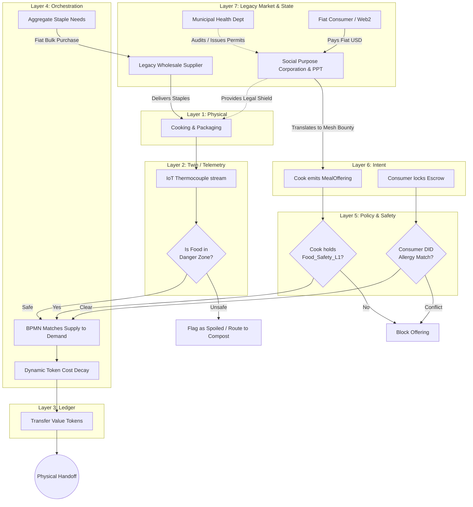

# Scenario Gamma: The Commons Kitchen

*   **Identifier:** `SCN-GAMMA-KITCH`
*   **System Epic:** Decentralized Caloric Production, IoT Food Safety, and Zero-Waste Routing
*   **Primary Layers Tested:** L1 (Physical), L2 (Digital Twin), L3 (Ledger), L4 (Orchestrator), L5 (Governance), L6 (Semantic)
*   **Pass/Fail Metric:** Hyper-local meal production and distribution with 0% legacy platform extraction fees; verifiable continuous thermal telemetry proving food safety without municipal health inspector presence.

---

## 1. Problem Statement & Legacy Failure

The legacy food system suffers from three critical failures:
1.  **Ecological Drag:** The average meal travels 1,500 miles. Industrial agriculture relies on petrochemical fertilizers, massive cold-chain logistics, and single-use plastics.
2.  **Gig-Economy Extraction:** Legacy platforms (DoorDash, UberEats) extract up to 30% from the restaurant and charge exorbitant fees to the consumer, while the physical courier is paid a poverty wage.
3.  **Bureaucratic Gatekeeping:** Municipal health departments heavily regulate or outright ban "cottage food" and neighborhood kitchens. They require expensive commercial steel build-outs, effectively monopolizing food production to capitalized corporations while shutting down local community resilience.

## 2. The Collective Workflow (7-Layer Traversal)

Scenario Gamma replaces the centralized restaurant and gig-economy delivery with a hyper-local, peer-to-peer caloric mesh, using cryptography and IoT sensors to guarantee food safety.

### Layer 1: Physical Reality
*   **The Hub:** A decentralized neighborhood kitchen. This could be a retrofitted garage, a shared community center, or an outdoor permaculture hearth.
*   **Action:** Harvesting local biomass (vegetables, proteins), applying thermal energy (cooking, fermenting, preserving), and generating bio-waste (which loops into Scenario Mu: Composting/Biochar).

### Layer 2: Digital Twin & Thermal Telemetry
*   **The Regulatory Shield:** Instead of a municipal inspector visiting once a year, Layer 2 provides *continuous mathematical proof* of food safety.
*   **Telemetry:** IoT thermocouples in communal refrigerators, fermentation chambers, and cooking vessels continuously broadcast MQTT data to the mesh. 
*   **Danger Zone Logging:** The digital twin calculates exact time-in-temperature vectors. If a batch of chicken drops into the danger zone (40°F–140°F) for longer than the FDA-approved thermodynamic limit, Layer 2 immediately flags the batch as `SPOILED` and Layer 4 halts distribution.

### Layer 3: Ledger & Caloric Value Minting
*   **Exergy Minting:** The creation of a nutrient-dense meal from raw biomass is a thermodynamic negentropy event. The cook’s wallet is minted Value Tokens based on the caloric output and nutritional density of the meal, bounded by the Ecological Replacement Cost (ERC) of the raw ingredients.
*   **Zero-Extraction Escrow:** Consumers lock Value Tokens to claim a meal. 100% of the tokens are routed to the cook (and the courier, if Scenario Beta is invoked). 

### Layer 4: Orchestration (Supply & Demand Routing)
*   The BPMN engine acts as the expeditor. It matches `MealOffering` intents from cooks with local demand.
*   It orchestrates the "Leftover Loop": If meals are unclaimed 2 hours before the L2 thermal safety window expires, the BPMN engine dynamically drops the token cost to zero to prevent caloric waste.

### Layer 5: Policy & Web of Trust (Allergy & Competency Gates)
*   **Competency Gate:** To publish a `MealOffering` to the wider Trust Ring, the cook must hold a `Food_Safety_L1` Verifiable Credential (peer-attested safe handling knowledge).
*   **Allergy Routing:** Layer 5 strictly filters offerings based on the consumer's decentralized identity. If a user’s DID profile lists a peanut allergy, Layer 5 cryptographically blocks them from locking escrow on any meal produced in a kitchen flagged for peanut cross-contamination.

### Layer 6: Semantic Intent
*   Cooks emit `MealOffering` (pushing supply). 
*   Citizens emit `CaloricBounty` (pulling demand—e.g., requesting a meal prep for the week).

### Layer 7: The Legacy Proxy (Permits, Liability & Bulk Procurement)
The Commons Kitchen operates physically within legacy municipal zoning. To prevent the local health department or HOA from shutting down the decentralized caloric mesh, the Social Purpose Corporation (SPC) provides a critical ablative shield:

**1. The Regulatory & Liability Wrapper**
The legacy state does not understand peer-to-peer cryptographic food safety; it demands a single, legally liable corporate entity. The SPC holds the official "Cottage Food Operation" license or "Commercial Kitchen" permit. If a municipal inspector arrives or a liability claim is filed, they interact strictly with the SPC's fiat insurance policies and board directors, shielding the individual Stewards from personal legal devastation.

**2. Fiat Procurement (Ecological Leeching)**
While the Node aims to grow its own biomass, certain caloric baselines and culinary staples (e.g., sea salt, olive oil, bulk flour, spices) are thermodynamically inefficient to produce locally. 
*   Layer 6 `ProcurementIntents` for staples hit the Layer 4 ceiling.
*   The SPC aggregates these needs and uses its fiat reserves to execute wholesale B2B purchases from legacy restaurant suppliers (e.g., Sysco, Costco Business). 
*   By purchasing a single 50lb bag of flour instead of 10 individual 5lb bags from a grocery store, the SPC drastically reduces legacy packaging waste and shipping carbon drag before distributing the flour internally via Value Tokens.

**3. Fiat Ingestion (Trojan Catering)**
To fund the kitchen's legacy utility bills (gas, water, electricity), the SPC operates a Web2 catering or pop-up storefront. Legacy consumers pay fiat (USD) for high-quality, permaculture-grown meals. The fiat is retained by the SPC to pay the Node's property taxes, while the cook is compensated internally with Value Tokens.

---



---

## 3. Oasis Engine Implementation Specification

In the Oasis C++ simulation, caloric production and thermal decay must be deterministically simulated:

*   **Voxel Thermodynamics:** The `temperature` byte in the voxel struct is utilized to simulate localized heat. An `OVEN` voxel transfers heat to a `RAW_MEAT` voxel.
*   **State Transformation:** When the `RAW_MEAT` voxel sustains an internal temperature of $> 165^\circ\text{F}$ for $X$ ticks, its `material_id` changes to `COOKED_MEAT`.
*   **Entropy/Decay Simulation:** If `COOKED_MEAT` is left in a voxel with an ambient temperature of $70^\circ\text{F}$ for $> 7200$ ticks (2 hours), its metadata updates to `SPOILED`, rendering it toxic to player/NPC entities.

---

```json
{
  "@context": [
    "[https://schema.org/](https://schema.org/)",
    "[https://collective.network/ontology/v1/](https://collective.network/ontology/v1/)"
  ],
  "@type": "MealOffering",
  "identifier": "urn:uuid:c9e1b2a4-5678-1234-abcd-9876543210ef",
  "issuerDid": "did:mesh:node04:steward_chef_maria",
  "culinaryProfile": {
    "name": "Pacific Northwest Venison Stew with Root Vegetables",
    "caloricEstimate": 850,
    "ingredients": [
      "Local Venison",
      "Carrots",
      "Potatoes",
      "Bone Broth",
      "Rosemary"
    ],
    "allergens": ["None"],
    "dietaryTags": ["Gluten-Free", "Paleo", "Locavore"]
  },
  "safetyAttestation": {
    "requiredCredential": "Food_Safety_L1",
    "telemetryStreamUri": "mqtt://node04.mesh.local/kitchen/thermocouple_02",
    "expirationTimestamp": "2026-10-02T20:00:00Z"
  },
  "settlementCriteria": {
    "initialTokenCost": "4.00",
    "dynamicDecay": {
      "type": "Linear",
      "decayStartTimestamp": "2026-10-02T18:00:00Z",
      "floorPrice": "0.00"
    }
  }
}
```

---

## 4. Acceptance Test Gates (Pass/Fail)

| Checkpoint | Validation Method | Pass Condition |
| :--- | :--- | :--- |
| **G1: Thermal Attestation** | Layer 2 Spoofing | If simulated L2 sensors report a temperature drop below safe holding thresholds, the BPMN engine automatically cancels pending escrows and flags the meal ID as bio-waste. |
| **G2: Zero Caloric Waste** | Dynamic Price Floor | Unclaimed meals systematically degrade in token price as they approach the thermal expiration window, resulting in $> 95\%$ consumption rate. |
| **G3: Safety Compliance** | Trust Ring Governance | An entity attempting to publish a `MealOffering` without the cryptographic `Food_Safety_L1` credential is mathematically rejected by the mesh. |
| **G4: Anaphylactic Shield** | Allergy Intent Routing | Simulated player with a `Gluten_Intolerance` flag is prevented from matching with a `MealOffering` containing wheat metadata. |
