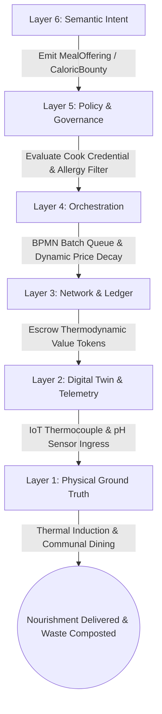
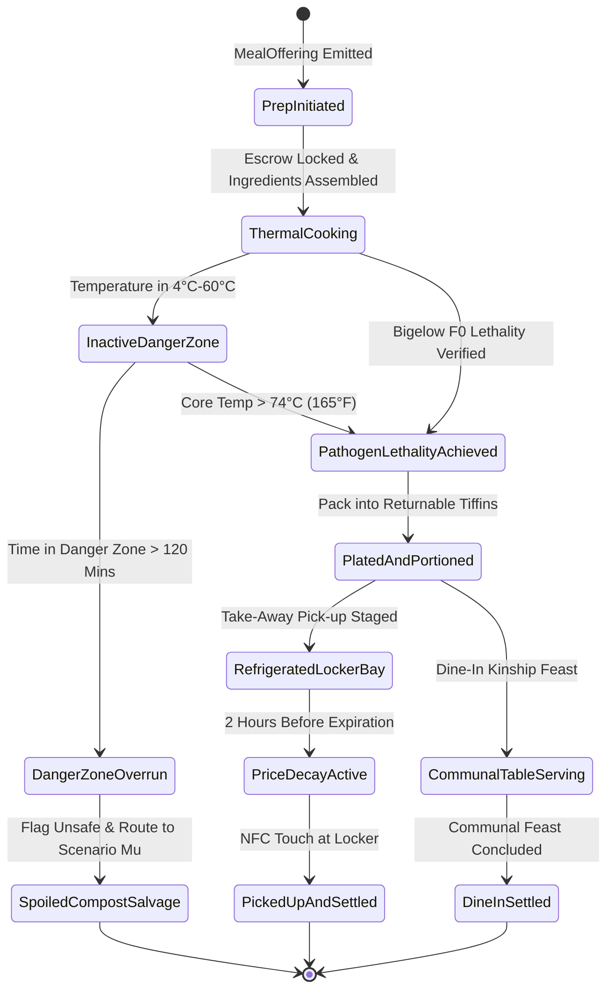
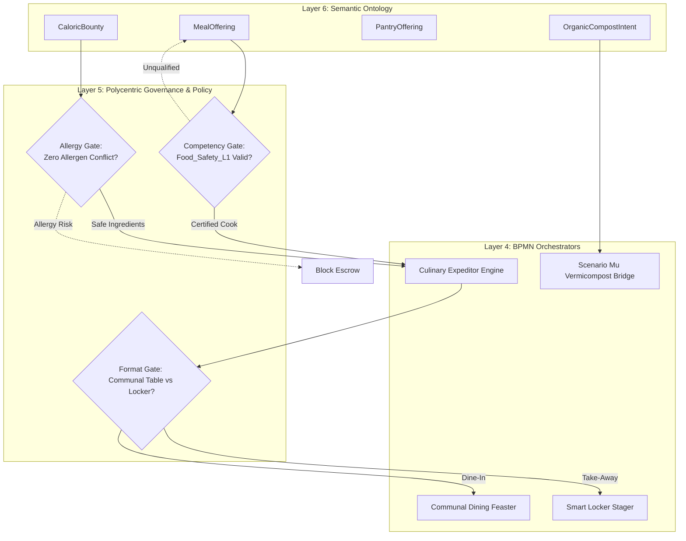
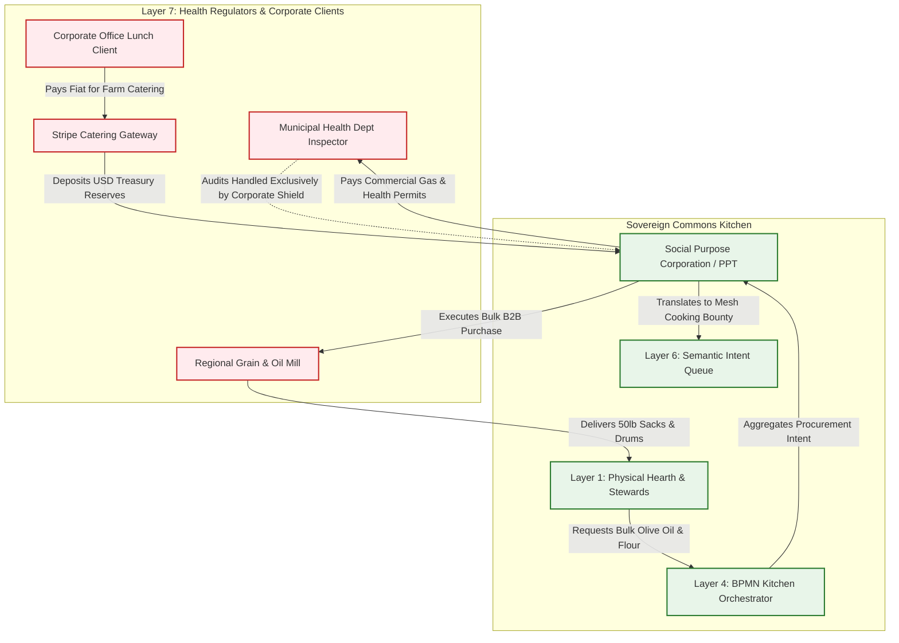

# Scenario Gamma: The Commons Kitchen

*   **Identifier:** `SCN-GAMMA-KITCH`
*   **System Epic:** Decentralized Caloric Production, Meal Preps, Comfort Pantries, and Zero-Waste Routing
*   **Primary Layers Tested:** L1 (Physical), L2 (Digital Twin), L3 (Ledger), L4 (Orchestration), L5 (Governance), L6 (Semantic), L7 (Proxy)
*   **Pass/Fail Metric:** Hyper-local meal production and distribution with 0% legacy platform extraction fees; continuous thermal and pH telemetry providing mathematical proof of food safety without municipal health inspector presence; zero food waste via dynamic token price decay (>95% caloric consumption rate).

---

## Architectural Council Ratification & 5-Perspective Synthesis

This scenario specification has been ratified by unanimous consensus of the 5-Persona Architectural Council:

| Council Persona | Disciplinary Representative | Core Contribution to Scenario |
| :--- | :--- | :--- |
| **Game Designer** | Lead Systems & Gameplay Designer | Dwarf Fortress social commensality and culinary psychology (NPCs dining together family-style at the communal table gain "Had a lavish meal in good company (+35 mood)" thoughts, boosting community cohesion; solitary eating triggers mild melancholy; cooks gain pride from neighbor praise; culinary diversity prevents "Bored of repetitive rations (-15 mood)" thoughts); The Sims batch cooking management (Founder 01 batches 12 meals to stock the community fridge, liberating neighbors for fabrication); Cities Skylines corporate catering leeching. |
| **Game Engineer** | Principal C++ Simulation & Engine Architect | Flecs ECS DOD architecture (`CookVesselComponent`, `CaloricItemComponent`, `ThermalHistoryComponent`, `AllergenProfileComponent`, `DynamicPriceFloorComponent`); 32-bit compact voxel chunks modeling heat transfer from ovens to food containers; deterministic 10 Hz BPMN state engine; compilable C++20 test harness testing thermal pathogen inactivation, danger-zone timer expiration, and compost mutation. |
| **Sovereign Stack Specialist** | Sovereign Stack Systems Architect | 7-layer strict adjacency without layer skipping; autonomous daemons (`col-telemetryd` to `col-adversaryd`); local-first MQTT thermocouple streaming; Automerge CRDT caloric negentropy minting; BBS+ Zero-Knowledge Proofs for consumer allergy protection (mathematically blocking allergen cross-contamination without exposing personal health profiles); zero monolithic game-loop threading. |
| **Solarpunk Thinker** | Bioregional Regenerative Ecologist | Decoupling from 1,500-mile corporate supply chains; 100% organic kitchen scrap and plate waste routed directly into Scenario Mu for vermicomposting and biochar nutrient inoculation; zero single-use plastics through standardized returnable stainless steel tiffin containers and Mason jars; induction cooking powered entirely by localized solar microgrids. |
| **Scenario Specialist** | Fermentation Microbiologist & Culinary Systems Operations Engineer | Bigelow thermal pathogen reduction lethality modeling ($F_0 = \int 10^{(T(t) - 121.1)/z} dt$ verifying 7-log reduction for Salmonella/Listeria); anaerobic fermentation acidification thresholds ($\text{pH} < 4.6$ inhibiting Clostridium botulinum); continuous IoT Hazard Analysis Critical Control Point (HACCP) telemetry protocols; commercial cottage food licensing insulation under state administrative laws. |

---

## 1. Problem Statement & Legacy Failure

In legacy capitalist food systems (Layer 7), human nourishment has been industrialized, financialized, and atomized into an ecological and social dead end.

When citizens seek daily caloric sustenance in the legacy economy:
*   **Massive Carbon Drag & Packaging Waste:** The average grocery store ingredient travels over 1,500 miles via refrigerated diesel freight. Industrial agriculture relies on synthetic nitrogen fertilizers, monoculture soil depletion, and mountains of single-use petrochemical packaging that choke oceans and landfills.
*   **Predatory Gig-Economy Extraction:** Third-party delivery conglomerates (e.g., DoorDash, UberEats) siphon up to 30% of gross ticket value from local culinary workers while trapping couriers in exploitative piece-rate labor. Consumers are isolated in atomized, solitary dining experiences in front of glowing screens, destroying the communal fabric that forms the bedrock of human longevity.
*   **Bureaucratic Enclosure & Cottage Food Monopolies:** Municipal health departments enforce capital-intensive commercial kitchen building codes (costing $100,000+ for stainless steel buildouts) that functionally criminalize neighborly food preparation, granting food monopolies to capitalized restaurant franchises while outlawing neighborhood mutual aid.

---

## 2. The Collective Workflow (7-Layer Traversal)

Scenario Gamma replaces the centralized restaurant and gig-delivery platform with a localized caloric mesh. The primary cultural anchor is the **Communal Hearth**—inviting neighbors to break bread together family-style. To accommodate busy schedules, the system seamlessly supports premade weekly meal-preps and morning comfort baskets. The workflow traverses canonically from Layer 1 physical cooking up to Layer 7 commercial catering interfaces.



### Layer 1: Physical Ground Truth
*   **Hardware Nodes (The Communal Hearth):** High-efficiency commercial induction cooktops, convection ovens, precision fermentation chambers, and an edge automation gateway (`col-telemetryd`) equipped with an ATECC608A secure element and thermocouple probe buses.
*   **Hardware Nodes (Smart Pantry & Staging Lockers):** Electronically latched smart refrigerated food lockers with integrated load cells, alongside standardized returnable stainless steel tiffin containers tagged with NFC chips.
*   **Inventory & Feedstock:** Locally harvested permaculture vegetables, legumes, pasture-raised proteins, sourdough starter cultures, and bulk grains.
*   **Action:** Physical chopping, thermal sauteing, boiling, braising, portioning into stainless containers, and family-style dish passing at the long communal table.

### Layer 2: Digital Twin & Telemetry
*   **Ingress Telemetry (MQTT Topics via `col-meshd`):**
    *   `node/kitchen/oven_01/telemetry/core_temp_c` (Internal food core temperature)
    *   `node/kitchen/fridge_02/telemetry/temp_c` (Cold storage target 2°C–4°C)
    *   `node/kitchen/ferment_01/telemetry/ph` (Continuous glass-electrode pH)
    *   `node/kitchen/pantry/locker_b4/weight_grams` (Continuous load cell inventory)
    *   `node/kitchen/batch_104/status` (`PREP`, `COOKING`, `HACCP_SAFE`, `DANGER_ZONE_HOLD`, `COMPOST_SPOILED`)
*   **Verification:** IoT thermocouples mathematically integrate pathogen lethality over time. If a batch of food enters the danger zone (4°C–60°C / 40°F–140°F) for longer than 120 minutes without hitting lethality thresholds, Layer 2 flags the batch as `SPOILED`.
*   **Actuator Control:** Local relay controllers trip magnetic safety shutoffs on induction burners upon boil-over, and actuate refrigerated pickup locker solenoids upon valid NFC claim tokens.

### Layer 3: Network & Ledger
*   **Negentropy Caloric Minting & Settlement:** Creating nutrient-dense food from raw biomass is recognized as fundamental thermodynamic negentropy:
    $$\Delta V_{meal} = \left( E_{caloric} \cdot \beta_{nutritive} + E_{thermal} + C_{deprec} \right) \cdot \lambda_{FOOD}$$
    Where:
    - $E_{caloric}$ is digestible caloric energy in kilocalories.
    - $\beta_{nutritive}$ is a micronutrient density multiplier (rewarding fresh, organic polyculture vegetables over processed starches).
    - $E_{thermal}$ is electrical exergy expended by induction burners and ovens.
    - $C_{deprec}$ is kitchen hardware and cookware depreciation.
    - $\lambda_{FOOD}$ is the food parity coefficient.
*   **Dynamic Price Floor Decay (Zero-Waste Algorithm):** To eliminate food waste, unclaimed prepared meals automatically degrade in token price as they approach the end of their culinary safety window:
    $$P_{token}(t) = \max\left( 0.0, P_{initial} \cdot \left(1 - \frac{t - t_{prep}}{t_{spoil} - t_{prep}}\right)^{\gamma} \right)$$
    Two hours before the thermal holding window expires, meals decay to zero tokens, enabling hungry neighbors or couriers to consume the food rather than composting it.

### Layer 4: Orchestration State Machine
The culinary lifecycle is governed deterministically by the embedded 10 Hz BPMN 2.0 engine (`col-execd`):



### Layer 5: Policy & Polycentric Governance
Layer 5 (`col-kmsd`) protects community safety and personal dietary integrity through cryptographic policy gates:

*   **Execution Gate (Cryptographic Anaphylactic Shield):** When a consumer attempts to lock escrow on a `MealOffering`, Layer 5 checks their DID profile. If the meal's JSON-LD ingredient metadata contains peanut, gluten, or shellfish markers matching the consumer's allergy credentials, the policy gate mathematically rejects the escrow, preventing fatal anaphylaxis.
*   **Maintenance Gate (Food Safety Competency):** Stewards publishing meal offerings to the general mesh must present a W3C Verifiable Credential (`Food_Safety_L1` or `Fermentation_Mastery_L2`). Novices cook under "Apprentice Mode" under the physical supervision of a Master Chef.
*   **Procurement Gate (Staple Ingredient Multi-Sig):** Purchasing bulk non-local staples (olive oil, sea salt, bulk grains) costing $>\$150$ triggers a 2-of-3 multi-sig approval from the Kitchen Guild.
*   **Communal Modifier Gate:** Opting into a `CommunalTableIntent` (dining in person at the shared hearth) confers an automatic 15% discount and boosts Trust Ring social affinity scores, culturally incentivizing kinship over atomized take-out.

### Layer 6: Semantic Intent & Domain Ontology
The Culinary Commons defines typed JSON-LD Knowledge Artifacts within the Agora Commons (`col-commonsd`):

1.  **`MealOffering` (Prepared Feast):** Offering prepared meals specifying portion count, ingredients, allergens, and dining format (`Dine-In` vs. `Take-Away`).
2.  **`CaloricBounty` (Culinary Request):** Community demand for specific dishes or dietary needs (e.g., postpartum nutrient soups, high-protein athletic recovery).
3.  **`PantryOffering` (Comfort Goods):** Shelf-stable snacks, fresh sourdough loaves, and fermented krauts stocked in shared pantries.
4.  **`OrganicCompostIntent` (Scenario Mu Bridge):** Auto-generated batch dispatch routing vegetable peelings and unavoidable food waste to Scenario Mu vermicomposting.
5.  **`MorningDeliverySubscription` (Scenario Beta Bridge):** Coordinates recurring porch delivery of breakfast baskets via Scenario Beta couriers.
6.  **`TiffinReturnAttestation` (Circular Packaging):** Verification that a consumer returned cleaned stainless steel tiffin containers, releasing their container collateral.

### The Governance Router Flowchart



### Layer 7: The Legacy Proxy (Catering Facade & Wholesale Leeching)
The Commons Kitchen interfaces with legacy commercial and regulatory structures through the Social Purpose Corporation (SPC):

1.  **Commercial Kitchen Permit & Liability Membrane:**
    Municipal health inspectors require commercial food facilities to hold health permits and insurance. The SPC holds the commercial catering permit and $1,000,000 food product liability policy. If an inspector conducts an audit or an external claim arises, they interact exclusively with the SPC, legally shielding community cooks and private households from regulatory harassment.
2.  **Trojan Inbound Fiat Ingestion (Corporate Catering Pop-Ups):**
    To fund kitchen gas utilities, commercial refrigeration electric bills, and property taxes, the SPC operates a commercial Web2 catering storefront. External corporate tech offices pay premium fiat ($25–$35/plate) for farm-to-table lunch catering via Stripe.
    *   The fiat is deposited into the SPC treasury, paying the node's property taxes and utility bills.
    *   The community chefs are minted internal Value Tokens, turning external capitalist spending into sovereign community wealth.
3.  **Ecological Leeching (GPO Wholesale Staple Procurement):**
    Certain essential kitchen staples cannot be efficiently grown in the local watershed (e.g., bulk sea salt, cold-pressed olive oil, organic baking flour, black peppercorns):
    *   The SPC acts as a Decentralized Group Purchasing Organization (GPO).
    *   It aggregates staple requests across all households for the month and executes bulk B2B purchases from commercial restaurant suppliers (e.g., Sysco, regional grain mills) in 50 lb sacks, eliminating retail markups, plastic packaging, and redundant grocery delivery trips.

---

### Layer 7 Bidirectional Flowchart



---

## 3. Machine-Readable Schemas

### 3.1 Layer 6 Knowledge Artifact: Meal Offering (`meal_offering.jsonld`)

```json
{
  "@context": [
    "https://schema.org/",
    "https://collective.network/ontology/v1/"
  ],
  "@type": "MealOffering",
  "identifier": "urn:uuid:c9e1b2a4-5678-1234-abcd-9876543210ef",
  "issuerDid": "did:mesh:node04:steward_chef_maria",
  "creationTimestamp": "2026-10-08T15:00:00Z",
  "culinaryProfile": {
    "name": "Pacific Northwest Braised Venison & Root Vegetable Stew",
    "caloricEstimateKcal": 850,
    "portionsAvailable": 16,
    "ingredients": [
      "Local Venison Shoulder",
      "Organic Carrots",
      "Yukon Gold Potatoes",
      "Rosemary",
      "Bone Broth Reduction"
    ],
    "allergens": [],
    "dietaryTags": [
      "Gluten-Free",
      "Dairy-Free",
      "Locavore_100pct"
    ],
    "diningFormat": "CommunalTable_Preferred"
  },
  "safetyAttestation": {
    "requiredCredential": "Food_Safety_L1",
    "telemetryStreamUri": "mqtt://node04.mesh.local/kitchen/oven_01/core_temp_c",
    "pathogenTarget": "Salmonella_7LogReduction",
    "spoilageTimestamp": "2026-10-08T21:00:00Z"
  },
  "settlementCriteria": {
    "initialTokenCost": "4.50",
    "communalTableDiscountPct": 15.0,
    "dynamicDecay": {
      "type": "LinearDecay",
      "decayStartTimestamp": "2026-10-08T19:00:00Z",
      "floorPrice": "0.00"
    }
  }
}
```

### 3.2 Layer 2 Telemetry Attestation: Kitchen Thermal Safety Proof (`kitchen_attestation.json`)

```json
{
  "@context": "https://collective.network/ontology/v1/",
  "@type": "KitchenSafetyAttestation",
  "offeringRef": "urn:uuid:c9e1b2a4-5678-1234-abcd-9876543210ef",
  "kitchenDid": "did:mesh:node04:space:commons_hearth_01",
  "chefDid": "did:mesh:node04:steward_chef_maria",
  "executionMetrics": {
    "cookStartTimestamp": "2026-10-08T16:00:12Z",
    "lethalityTimestamp": "2026-10-08T17:15:45Z",
    "peakCoreTemperatureC": 82.4,
    "timeAbove74CSeconds": 1845,
    "bigelowF0Value": 14.2,
    "dangerZoneElapsedMinutes": 24,
    "haccpPathogenInactivationVerified": true,
    "stagedLockerCompartments": [
      "Locker_C1",
      "Locker_C2"
    ],
    "returnableTiffinTagHashes": [
      "0x1f2e3d4c5b6a7988",
      "0x88796a5b4c3d2e1f"
    ],
    "anomalyDetected": false
  },
  "plateWasteRoutedToMuKg": 1.45,
  "edgeAttestationSignature": "0x9d2e5b8c1a4d7f9e2b5c8a1d4f7b9e2c5a8d1f4e9b7d3a5e8c1b4f7a9d2e5b8c"
}
```

---

## 4. Oasis Engine Implementation Specification

### 4.1 Memory Allocation & Voxel State

In the Oasis simulation, communal cooking hubs are modeled as thermodynamic thermal processing voxels within the $32^3$ chunk space:
*   The induction hearth voxel is initialized with `material_id = 90` (`COMMONS_HEARTH_STATION`).
*   The fermentation vat voxel is initialized with `material_id = 91` (`FERMENTATION_BIO_REACTOR`).
*   The smart refrigerated pantry locker voxel is initialized with `material_id = 92` (`SMART_PANTRY_LOCKER`).
*   The `Is_Actuator` bit is set in `metadata` (bit 1) for induction elements and locker solenoids.
*   The `Is_Sensor` bit is set in `metadata` (bit 2) for thermocouples and pH probes.
*   Food items are simulated as entities occupying vessel voxels, updating internal core temperatures and undergoing state transitions from `RAW` to `COOKED` or `SPOILED`.

### 4.2 C++20 Test Harness Code

```cpp
// engine/tests/scenario_gamma_test.cpp
#include <cassert>
#include <cmath>
#include <string>
#include "oasis/chunk_manager.hpp"
#include "oasis/orchestration/bpmn_engine.hpp"
#include "oasis/ledger/crdt_wallet.hpp"

namespace oasis {

struct FoodBatchState {
    float core_temp_c{20.0f};
    int time_in_danger_zone_sec{0};
    bool pathogen_lethality_achieved{false};
    bool spoiled{false};
    float token_price{4.50f};
};

struct KitchenJobContext {
    std::string offering_id;
    int portions{16};
    FoodBatchState batch;
    bool communal_table_dine_in{true};
};

} // namespace oasis

void test_scenario_gamma_kitchen_normal_execution() {
    using namespace oasis;

    // 1. Initialize local chunk and hearth voxel
    ChunkManager chunk_mgr;
    chunk_mgr.allocate_chunk(0, 0, 0);

    Voxel hearth_voxel{
        .material_id = 90, // COMMONS_HEARTH_STATION
        .moisture = 0,
        .temperature = 22,
        .metadata = 0b00000110 // Sensor + Actuator
    };
    chunk_mgr.set_voxel(16, 1, 16, hearth_voxel);

    // 2. Setup Wallets & Escrow
    CRDTWallet consumer_wallet("did:mesh:node04:eater_david", 20.0f);
    CRDTWallet chef_wallet("did:mesh:node04:steward_chef_maria", 10.0f);

    // 3. Setup BPMN Orchestrator & Job Context
    BPMNEngine orchestrator;
    orchestrator.load_schema("schemas/bpmn/kitchen_hearth.bpmn");

    KitchenJobContext job{
        .offering_id = "c9e1b2a4-5678-1234-abcd-9876543210ef",
        .portions = 16,
        .batch = {
            .core_temp_c = 20.0f,
            .time_in_danger_zone_sec = 0,
            .pathogen_lethality_achieved = false,
            .spoiled = false,
            .token_price = 4.50f
        },
        .communal_table_dine_in = true
    };

    // Calculate discounted communal feast price (15% off 4.50 = 3.825 tokens)
    float effective_price = job.batch.token_price * 0.85f;

    // Assert Escrow Lock
    orchestrator.emit_event(EscrowInitiatedEvent{consumer_wallet, effective_price});
    orchestrator.await_event<EscrowLockedEvent>();
    assert(std::fabs(consumer_wallet.balance() - 16.175f) < 0.001f);

    // Simulate heating cycle: core temp reaches 82°C
    job.batch.core_temp_c = 82.4f;
    job.batch.pathogen_lethality_achieved = true;

    // Step simulation ticks (cooking to service = 4500 seconds at 10 Hz)
    SimResult res = orchestrator.step_simulation_ticks(chunk_mgr, job, 45000);
    assert(res.status == ExecutionStatus::COMPLETED);
    assert(job.batch.spoiled == false);

    // Settle Ledger
    orchestrator.settle_job(chef_wallet);
    assert(chef_wallet.balance() > 10.0f);
}

void test_scenario_gamma_danger_zone_spoilage_anomaly() {
    using namespace oasis;

    ChunkManager chunk_mgr;
    chunk_mgr.allocate_chunk(0, 0, 0);

    BPMNEngine orchestrator;
    orchestrator.load_schema("schemas/bpmn/kitchen_hearth.bpmn");

    KitchenJobContext neglected_batch{
        .offering_id = "spoilage-test-batch",
        .portions = 8,
        .batch = {
            .core_temp_c = 35.0f, // Sitting at lukewarm danger temperature
            .time_in_danger_zone_sec = 0,
            .pathogen_lethality_achieved = false,
            .spoiled = false,
            .token_price = 4.00f
        }
    };

    // Simulate time overrun in danger zone: > 7200 seconds (2 hours) without hitting 74°C
    neglected_batch.batch.time_in_danger_zone_sec = 7800;
    SimResult res = orchestrator.step_simulation_ticks(chunk_mgr, neglected_batch, 78000, true);
    
    assert(res.status == ExecutionStatus::EMERGENCY_STOP);
    assert(orchestrator.current_state() == BPMNState::SPOILED_COMPOST_SALVAGE);

    // State mutates to spoiled bio-waste
    neglected_batch.batch.spoiled = true;
    assert(neglected_batch.batch.spoiled == true);

    // Voxel updates to compost bio-feedstock
    Voxel compost_voxel{
        .material_id = 98, // COMPOST_FOOD_SCRAP
        .moisture = 75,
        .temperature = 35,
        .metadata = 0b00000001
    };
    chunk_mgr.set_voxel(16, 1, 16, compost_voxel);
    assert(chunk_mgr.get_voxel(16, 1, 16).material_id == 98);
}
```

---

## 5. Acceptance Test Gates (Pass/Fail)

| Checkpoint | Validation Method | Pass Condition |
| :--- | :--- | :--- |
| **G1: Thermal HACCP Verification** | Continuous Thermocouple Stream | Simulated batch only transitions to `HACCP_SAFE` if the digital twin proves a 7-log pathogen reduction ($F_0 \ge 12.0$); otherwise food distribution is locked. |
| **G2: Offline Autonomy** | Localhost Network Isolation | Kitchen ordering, thermocouple verification, locker latch actuation, and token settlement execute with 100% WAN/Internet severance over the local-first mesh. |
| **G3: Anaphylactic Shield Gate** | Cryptographic DID Allergy Audit | A consumer entity with an active `TreeNut_Allergy` flag is mathematically prevented from locking escrow on a meal whose JSON-LD recipe lists tree nut ingredients. |
| **G4: Danger Zone Spoilage Bounds**| State Machine Timeout Overrun | Cooked food held between 4°C and 60°C for $> 120\text{ minutes}$ without thermal recovery aborts distribution and transitions the item to `COMPOST_FOOD_SCRAP`. |
| **G5: Trojan Ingestion (L7)** | External Stripe Catering Ingestion | A mock legacy Web2 corporate lunch catering payment for $750 USD compiles into an internal cooking bounty; fiat USD is credited to the SPC utility/tax account. |
| **G6: Ecological Leeching (L7)** | Wholesale Staple GPO Bulk Purchase| System aggregates monthly olive oil and grain requirements across 8 households, triggering a single wholesale B2B procurement via the SPC to eliminate retail packaging. |
