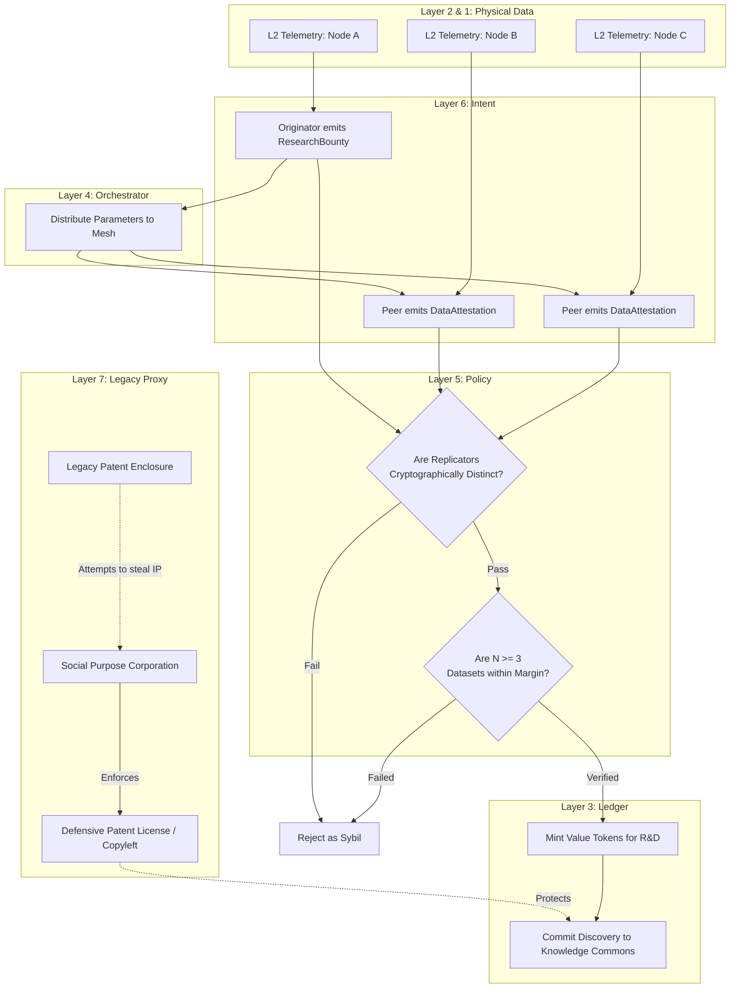

# Scenario Iota: The Epistemic Mesh (R&D)

*   **Identifier:** `SCN-IOTA-EPISTEMIC`
*   **System Epic:** Decentralized Science (DeSci), Distributed R&D, and the Knowledge Commons
*   **Primary Layers Tested:** L2 (Twin), L3 (Ledger), L5 (Governance), L6 (Semantic), L7 (Proxy)
*   **Pass/Fail Metric:** Successful replication of a local experiment across at least three independent nodes; cryptographic consensus reached on the resulting dataset; automated token minting for all participating researchers; legal insulation of the discovery from legacy patent enclosure.

---

## 1. Problem Statement & Legacy Failure

In the legacy system, human knowledge is increasingly enclosed. Scientific research is locked behind prohibitive academic paywalls, while corporate entities use the patent system to monopolize ecological and mechanical innovations. The "publish or perish" academic model incentivizes novel, flashy studies over rigorous replication, leading to a massive replication crisis across multiple scientific fields.
Furthermore, localized, indigenous, or micro-climatic knowledge (e.g., "what specific soil amendment maximizes tomato yields in the Duvall watershed?") is dismissed because it cannot be scaled into a global corporate product. 

## 2. The Collective Workflow (7-Layer Traversal)

Scenario Iota establishes a peer-to-peer epistemic engine. It treats verifiable data as thermodynamic negentropy, mathematically rewarding citizens who run experiments, replicate findings, and share ground-truth data with the global Gossipsub mesh.

### Layer 7: The Legacy Proxy (The Copyleft Shield)
*   **IP Defense:** To prevent a legacy corporation from scraping the mesh's R&D (e.g., an optimized 3D-printed valve design or a biochar synthesis method) and patenting it, the Social Purpose Corporation (SPC) acts as a legal anchor. All data generated on the mesh is automatically wrapped in a rigorous Copyleft or Defensive Patent License (DPL) structure. This ensures the knowledge remains permanently in the public domain while legally forbidding legacy enclosure.

### Layer 6: Semantic Intent
*   A citizen or node emits a `ResearchBounty` (e.g., requesting data on the tensile strength of recycled PETG printed at 250°C, or the moisture retention of a 10% biochar soil mix).
*   Participating citizens emit a `DataAttestation` containing their methodology, raw sensor data, and outcomes.

### Layer 5: Policy & Web of Trust (The Replication Gate)
*   **Cryptographic Peer Review:** A single dataset is an anecdote. Layer 5 policy demands consensus. A `DataAttestation` is not accepted into the "Canon" (the shared epistemic ledger) until the exact experiment is independently replicated by at least $N$ distinct Trust Rings or nodes.
*   **Sybil Resistance:** To prevent a single user from faking multiple nodes to collect research bounties, the Web of Trust ensures that replicating nodes have distinct physical and cryptographic identities.

### Layer 4: Orchestration (Experimental Scheduling)
*   The BPMN engine coordinates the distributed experiment. If a `ResearchBounty` requires data across four different microclimates, the orchestrator routes the intent to nodes physically located in those specific GIS zones, managing the timeline for data collection.

### Layer 3: Ledger (Minting the Knowledge Commons)
*   Information that reduces systemic entropy has immense value. When the Layer 5 consensus confirms a successful replication, the originating researcher and all replicating peers are newly minted Value Tokens. 
*   This funds the "R&D Department" of The Collective without relying on fiat grants.

### Layer 2 & 1: Digital Twin & Physical Reality
*   **Telemetry (L2):** To prevent human falsification, data must be anchored by IoT telemetry. A biochar experiment pulls automated moisture and pH readings from local sensors via MQTT, creating a tamper-proof cryptographic hash of the raw environmental data.
*   **Physical (L1):** The actual soil, plants, hardware, 3D printers, and localized physical environment where the experiment occurs.

---



---

## 3. Oasis Engine Implementation Specification

In the C++ Oasis engine, this scenario forms the core of the "Tech Tree" mechanics, replacing traditional game progression with simulated scientific consensus:

*   **Hypothesis Formulation:** The engine must allow a player to define a `Hypothesis` object linking independent variables (e.g., `WATER_TICK_RATE`) to dependent variables (e.g., `CROP_YIELD_MASS`).
*   **Distributed Simulation:** In multiplayer (Gossipsub) mode, Player A's engine broadcasts the `ResearchBounty`. Player B's engine must run the identical chunk configuration.
*   **Consensus Verification:** The C++ core must compare the hash of Player A's resulting chunk state with Player B's resulting chunk state. If the delta is within the defined `margin_of_error`, the engine unlocks the new epistemic data globally and updates both CRDT ledgers.

---

```json
{
  "@context": [
    "[https://schema.org/](https://schema.org/)",
    "[https://collective.network/ontology/v1/](https://collective.network/ontology/v1/)"
  ],
  "@type": "ResearchBounty",
  "identifier": "urn:uuid:4f5a6b7c-8d9e-0f1a-2b3c-4d5e6f7a8b9c",
  "issuerDid": "did:mesh:node04:agronomist_lee",
  "researchDomain": "Permaculture_Soil_Science",
  "hypothesis": {
    "description": "Amending local clay-heavy soil with 15% crushed biochar (by volume) will increase retained moisture sensor readings by >20% during August desiccation without nitrogen draw-down.",
    "independentVariables": ["Biochar_Volume_Percent"],
    "dependentVariables": ["Soil_Moisture_Capacitance", "Fruiting_Yield_Grams"]
  },
  "replicationRequirements": {
    "minimumIndependentNodes": 3,
    "requiredSensors": ["Capacitive_Moisture_L2", "Temperature_Probe"],
    "durationDays": 60
  },
  "epistemicReward": {
    "originatorTokens": "25.00",
    "replicatorTokens": "15.00"
  },
  "legalWrapper": "[https://creativecommons.org/publicdomain/zero/1.0/](https://creativecommons.org/publicdomain/zero/1.0/)"
}
```

---

## 4. Acceptance Test Gates (Pass/Fail)

| Checkpoint | Validation Method | Pass Condition |
| :--- | :--- | :--- |
| **G1: Cryptographic Sybil Defense** | Identity Spoofing Test | Simulated attempts by a single node to submit three different `DataAttestations` using spoofed keys are rejected by the Trust Ring graph distance validator. |
| **G2: Telemetry Anchoring** | L2 Hash Verification | A `DataAttestation` submitted without a valid accompanying stream of hashed L2 sensor data (simulated MQTT logs) is flagged as "Anecdotal" and denied Value Token minting. |
| **G3: Consensus Minting** | Ledger State | The CRDT wallet of the original proposer and all valid replicators correctly increment with the defined Value Token bounty only *after* the $N$th replication is verified. |
| **G4: The Copyleft Output** | Schema Generation | The final accepted dataset successfully generates a JSON-LD payload tagged with the `CreativeCommonsZero` or defined defensive license URI. |
