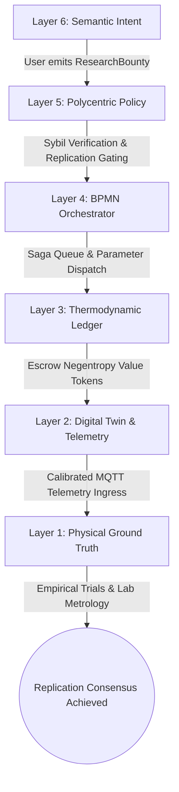
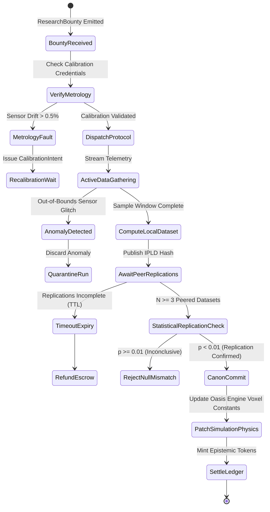
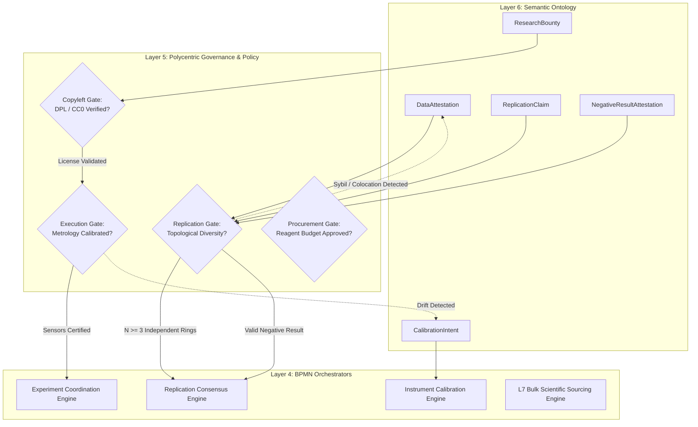
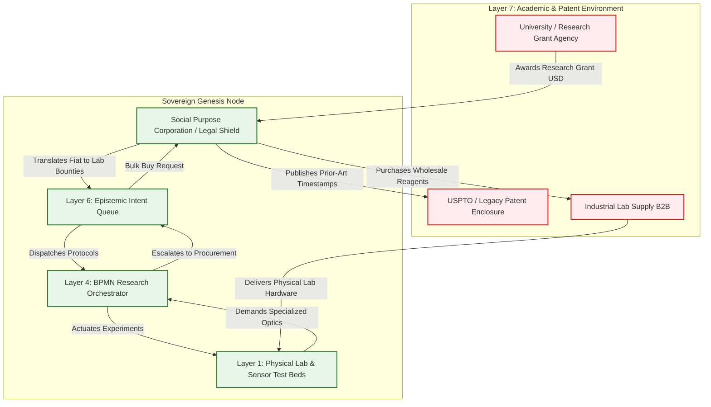

# Scenario Iota: The Epistemic Mesh (R&D)

*   **Identifier:** `SCN-IOTA-EPISTEMIC`
*   **System Epic:** Decentralized Science (DeSci), Distributed R&D, and the Epistemic Commons
*   **Primary Layers Tested:** L1 (Physical), L2 (Digital Twin), L3 (Ledger), L4 (Orchestration), L5 (Governance), L6 (Semantic), L7 (Proxy)
*   **Pass/Fail Metric:** Successful multi-node empirical experiment replication across $\ge 3$ topologically independent physical nodes ($p < 0.01$); automated epistemic negentropy token minting; zero centralized server dependencies; permanent Copyleft/Defensive Patent License insulation.

---

## Architectural Council Ratification & 5-Perspective Synthesis

This scenario specification has been ratified by unanimous consensus of the 5-Persona Architectural Council:

| Council Persona | Disciplinary Representative | Core Contribution to Scenario |
| :--- | :--- | :--- |
| **Game Designer** | Lead Systems & Gameplay Designer | **Dwarf Fortress Psychology & Tech Tree:** Implements intellectual discovery and scholarly debate. Agents studying empirical hypotheses experience `"Thrilled by sudden empirical breakthrough (+35 mood)"` or resolve from failures (`"Documented critical negative result; saved collective exergy (+15 mood)"`). **The Sims Indirect Control:** Founder 01 prioritizes community research queues (e.g., local soil hydration vs. solar cell efficiency). **Cities Skylines Leeching:** Funnels academic grant fiat through the Social Purpose Corporation to unlock community tech-tree upgrades. |
| **Game Engineer** | Principal C++ Simulation Architect | **Data-Oriented Design (DOD):** Encapsulates laboratory benches and testing beds into compact 32-bit voxels (`material_id = 45` `RESEARCH_BENCH`, `material_id = 46` `SOIL_TEST_BED`) in $32^3$ chunks. Flecs ECS systems evaluate replication consensus across nodes at 10 Hz determinism. Dynamic simulation patching updates global physics parameters (e.g., `SOIL_WATER_RETENTION_COEFFICIENT`) upon cryptographic validation. |
| **Sovereign Stack Specialist** | Sovereign Stack Systems Architect | **7-Daemon Isolation:** Rigorous traversal from `col-telemetryd` (L1) up to `col-adversaryd` (L7) via `/run/collective/ipc/l[1-7].sock` without layer skipping. Local-first Reticulum/LoRa mesh gossip; Automerge CRDT epistemic ledger; BBS+ Zero-Knowledge Proofs for Sybil-resistant peer review; Defensive Patent License (DPL 1.1) legal membrane. |
| **Solarpunk Thinker** | Bioregional Regenerative Ecologist | **Thermodynamic Negentropy:** Formulates scientific knowledge as physical entropy reduction ($\Delta I = -\sum p_i \log_2 p_i$). Directs R&D toward micro-climatic agronomic optimization (native polycultures, biochar inoculation) using open-source hardware instrumentation (3D-printed microscopes, open spectrophotometers). |
| **Scenario Specialist** | Open-Hardware Metrologist & Computational Epistemologist | **Sensor Calibration & Replication Rigor:** Formulates distributed sensor metrology tolerances ($\pm 0.5\%$ drift threshold), statistical significance criteria (ANOVA / Student's $t$-test $p < 0.01$ across $N \ge 3$ nodes), verifiable compute proofs for raw sensor streams, and Open Source Hardware Association (OSHWA) copyleft covenants. |

---

## 1. Problem Statement & Legacy Failure

In legacy late-stage capitalism (Layer 7), scientific discovery has been enclosed by corporate monopolies and academic cartels. Human knowledge—the collective heritage of civilization—is systematically commodified through parasitic gatekeeping:
*   **The Academic Paywall & Publishing Cartel:** Publicly funded research is surrendered to corporate publishers (e.g., Elsevier, Springer) who lock findings behind $40-per-article paywalls, extracting multi-billion-dollar profit margins while denying citizen scientists and smallholders access to vital agronomic and medical data.
*   **The Replication Crisis & Publication Bias:** Academic prestige algorithms reward sensational, non-reproducible breakthroughs while actively suppressing negative results. This systemic bias causes catastrophic thermodynamic waste, as independent teams unknowingly repeat identical failed experiments.
*   **Patent Enclosure of Ecological Survival:** Agrochemical and pharmaceutical conglomerates patent indigenous crop strains, localized soil microorganisms, and open-hardware manufacturing geometries. Small-scale bioregional innovations (e.g., microclimate-optimized biochar amendments in the Duvall watershed) are ignored because they cannot be commodified into globalized corporate products.

---

## 2. The Collective Workflow (7-Layer Traversal)

The Epistemic Mesh transforms science from an ivory-tower publishing contest into a localized, empirical public utility. Grounded in physical sensor telemetry and distributed validation, it models empirical truth as material negentropy that directly optimizes the Oasis engine's digital twin simulation.



### Layer 1: Physical Ground Truth
*   **Hardware Nodes (Laboratory & Sensor Hubs):** Open-source laboratory stations equipped with ATECC608A secure hardware elements, flash NVRAM ring buffers, 3D-printed digital microscopes, open-hardware spectrophotometers, and soil capacitance/temperature probe arrays deployed across testing beds.
*   **Distributed Test Beds:** Micro-climate field plots, bioreactor fermenters, and mechanical test rigs (e.g., custom tensile testers for recycled PETG filaments).
*   **Inventory & Feedstock:** Reference calibration fluids, certified soil samples, reagent test kits, standardized crop seeds, and mechanical testing specimens.
*   **Physical Action:** Soil amending, thermal cycling, optical density measuring, tensile pulling, and mechanical stressing performed by human stewards and logged via calibrated instrumentation.

### Layer 2: Digital Twin & Telemetry
*   **Ingress Telemetry (MQTT Topics via `col-meshd`):**
    *   `node/lab/soil_bed_04/telemetry/capacitance_vwc` (Volumetric Water Content, % VWC, target vs. actual $\pm 0.5\%$)
    *   `node/lab/soil_bed_04/telemetry/soil_temp_c` (°C, continuous 1 Hz integration)
    *   `node/lab/spectro_01/telemetry/absorbance_nm` (Spectral absorption curve at 600 nm)
    *   `node/lab/rig_02/status` (`CALIBRATING`, `LOGGING`, `RUN_COMPLETE`, `DRIFT_FAULT`)
*   **Verification:** Edge-AI and sensor metrology filters verify sensor calibration against standard voltage curves. Raw telemetry streams are windowed, compressed, and content-addressed via cryptographic Merkle-DAG hashes (IPLD).
*   **Dynamic Simulation Patching:** Validated datasets trigger automatic updates to the Layer 2 physics and biology engines, updating local voxel properties (e.g., permeability, thermal inertia).

### Layer 3: Network & Ledger
*   **Negentropy Valuation:** Information that reduces thermodynamic uncertainty in the physical node generates verifiable systemic value. Prior to execution, the bounty escrow locks tokens, and upon multi-node replication, mints value:
    $$\Delta I = -\sum_{i=1}^{M} p_i \log_2 p_i, \quad \Delta V_{epistemic} = \left( \Delta I \cdot k_{entropy} + E_{compute} + E_{metrological} \right) \cdot \lambda_{THERMO} \cdot \left(1 + \frac{1}{\sqrt{N_{repl}}}\right)$$
    Where $N_{repl} \ge 3$ represents the count of verified independent node replications, and $k_{entropy}$ is the thermodynamic information scaling factor.
*   **Consensus Settlement:** Once statistical consensus ($p < 0.01$) is reached, the locked bounty and newly minted negentropy tokens transfer proportionally to the originating researcher ($40\%$) and verified replicating stewards ($60\%$). Negative results receive parity minting: proving a hypothesis false eliminates dead-end thermodynamic search paths.

### Layer 4: Orchestration State Machine
The experimental lifecycle is coordinated deterministically by `col-execd` running a 10 Hz BPMN 2.0 state machine VM with asynchronous timeouts, anomaly traps, and peer data reconciliation:



### Layer 5: Policy & Polycentric Governance
Layer 5 (`col-kmsd`) enforces rigorous scientific validation and copyleft covenants through four cryptographic **Policy Gates**:
*   **Execution Gate (Metrological Calibration Gate):** Verifies that sensors connected to `col-telemetryd` have executed a zero-drift calibration within 72 hours, backed by a verifiable credential signed by a Metrology Steward.
*   **Replication Gate (Topological Sybil Defense):** Mandates that replication nodes reside in distinct physical and cryptographic trust rings ($d_{graph} \ge 2$, divergent GPS/GIS geofences) to prevent a single actor from spinning up virtual nodes to farm scientific bounties.
*   **Procurement Gate (Laboratory Hardware Funding):** Capital allocations exceeding $\$100$ for specialized reagents or optical components require 3-of-5 multi-sig consensus from the Science Working Group with a strict 7-day TTL.
*   **Copyleft Defense Gate (DPL/CC0 Invariant):** Enforces that all datasets, schematics, and code resulting from the bounty are cryptographically bound to a Defensive Patent License (DPL 1.1) or Creative Commons Zero (CC0) URI, preventing downstream corporate patenting.

### Layer 6: Semantic Intent & Domain Ontology
The Agora Commons (`col-commonsd`) formalizes research workflows into six typed W3C JSON-LD knowledge branches:
1.  **`ResearchBounty` (Hypothesis Formulation):** Defines the scientific inquiry, independent/dependent variables, required sensor metrology, and replication thresholds.
2.  **`DataAttestation` (Empirical Evidence):** Emitted by participating laboratories containing cryptographically signed telemetry hashes, environmental baselines, and statistical summaries.
3.  **`ReplicationClaim` (Peer Validation):** Emitted by independent nodes attesting to identical methodology execution and statistical concordance ($p < 0.01$).
4.  **`NegativeResultAttestation` (Entropy Reduction):** Formal documentation of a failed hypothesis or non-correlation, rewarded equally with positive findings.
5.  **`CalibrationIntent` (Metrology Maintenance):** Schedules physical zeroing and recalibration of probes against reference standards.
6.  **`CurriculumIntent` (Pedagogical Transfer):** Automatically spawned upon Canon acceptance to hand the validated protocol down to Scenario Kappa (Apprenticeship).

### The Governance Router Flowchart



### Layer 7: The Legacy Proxy (Academic Ingestion & Defensive IP)
The Social Purpose Corporation (SPC) interfaces strategically with legacy scientific institutions and legal regimes:
*   **1. Trojan Grant Ingestion (Inbound Fiat Extraction):** The SPC maintains accredited non-profit / research entity status, allowing embedded stewards (university researchers, adjuncts) to submit grant applications to legacy funding bodies (NSF, USDA, private trusts). Upon deposit, fiat funds are trapped in the SPC treasury, converted into internal Value Tokens for lab hardware bounties, and used to acquire laboratory spectrometers, microscopes, and high-purity reagents.
*   **2. Ecological Leeching & Defensive Patent Shield (Outbound Procurement & Protection):** When specialized laboratory equipment cannot be 3D printed (e.g., optical diffraction gratings, quartz cuvettes, gas chromatography sensors), the SPC acts as a Decentralized Group Purchasing Organization (GPO), bundling orders across 10+ nodes to negotiate B2B laboratory wholesale discounts. Simultaneously, the SPC acts as an offensive legal membrane: all mesh findings are published with verifiable, immutable timestamps to established public prior-art databases, preemptively invalidating corporate patent applications.

### Layer 7 Bidirectional Flowchart



---

## 3. Machine-Readable Schemas

### 3.1 Layer 6 Knowledge Artifact: Research Bounty (`research_bounty.jsonld`)

```json
{
  "@context": [
    "https://schema.org/",
    "https://collective.network/ontology/v1/",
    "https://w3id.org/dpl/v1"
  ],
  "@type": "ResearchBounty",
  "identifier": "urn:uuid:4f5a6b7c-8d9e-0f1a-2b3c-4d5e6f7a8b9c",
  "issuerDid": "did:mesh:node04:agronomist_lee",
  "creationTimestamp": "2026-10-01T10:00:00Z",
  "researchDomain": "RegenerativeAgronomy_SoilHydrology",
  "hypothesis": {
    "claim": "Amending local alluvial clay soil with 15% volume-fraction pyrolyzed biochar increases saturated volumetric water content by >20% without nitrogen immobilization.",
    "independentVariables": [
      {
        "name": "Biochar_Volume_Fraction",
        "testedValue": 0.15,
        "tolerance": 0.01
      }
    ],
    "dependentVariables": [
      {
        "name": "Soil_Moisture_Capacitance_VWC",
        "expectedDelta": "+0.22"
      },
      {
        "name": "Nitrate_PPM",
        "expectedThreshold": ">=25.0"
      }
    ]
  },
  "replicationProtocol": {
    "minimumReplicatingNodes": 3,
    "statisticalSignificanceThreshold": 0.01,
    "requiredSensors": [
      "Capacitive_VWC_Probe_L2",
      "K_Type_Soil_Thermocouple"
    ],
    "durationHours": 1440,
    "metrologyDriftLimitPercent": 0.5
  },
  "settlementCriteria": {
    "originatorRewardTokens": "40.00",
    "replicatorRewardTokens": "25.00",
    "escrowTimeoutDays": 75
  },
  "legalDefenseLicense": "https://defensivepatentlicense.org/license/1.1"
}
```

### 3.2 Layer 2 Telemetry Attestation: Replication Proof (`replication_attestation.json`)

```json
{
  "@context": "https://collective.network/ontology/v1/",
  "@type": "EpistemicReplicationAttestation",
  "bountyRef": "urn:uuid:4f5a6b7c-8d9e-0f1a-2b3c-4d5e6f7a8b9c",
  "attestingNode": "did:mesh:node07:device:lab_station_03",
  "executionMetrics": {
    "startTime": "2026-10-02T08:00:00Z",
    "endTime": "2026-11-01T08:00:00Z",
    "durationHours": 720,
    "meanVolumetricWaterContent": 0.384,
    "controlVolumetricWaterContent": 0.302,
    "calculatedDeltaPercent": 27.15,
    "pValue": 0.0042,
    "sensorCalibrationDriftPercent": 0.18,
    "sampleCount": 2592000,
    "telemetryIpidHash": "bafybeigdyrzt5sfp7udm7hu76uh7y26nf3efuylqabf3oclgtqy55fbzdi"
  },
  "metrologyVerification": {
    "sensorSerialNumber": "SEN-CAP-DUV-091",
    "lastCalibrationDate": "2026-09-30T14:15:00Z",
    "calibrationCertUri": "ipfs://bafkreia.../calib_cert.json"
  },
  "reconciliationStatus": "CONFIRMED_REPLICATED"
}
```

---

## 4. Oasis Engine Implementation Specification

### 4.1 Memory Allocation & Voxel State
The epistemic research node coordinates simulation testing in chunk space ($32^3$ voxels via `ChunkManager`):
- Research bench initialized with `material_id = 45` (`RESEARCH_BENCH`) with `metadata` bitmask `0b00000110` (`Is_Actuator | Is_Sensor`).
- The experimental testbed occupies contiguous voxels `(16, 8, 16)` to `(20, 8, 20)` initialized with `material_id = 46` (`SOIL_TEST_BED`).
- Dynamic physics patch alters global simulation constant: `SOIL_WATER_RETENTION_COEFFICIENT` is upgraded from `0.30f` to `0.38f` upon validated replication.

### 4.2 C++20 Test Harness Structure

```cpp
// engine/tests/scenario_iota_epistemic_test.cpp
#include <cassert>
#include <cmath>
#include <string>
#include "oasis/chunk_manager.hpp"
#include "oasis/orchestration/bpmn_engine.hpp"
#include "oasis/ledger/crdt_wallet.hpp"

namespace oasis {

struct ExperimentContext {
    std::string bounty_id;
    int replicating_nodes_required;
    float significance_alpha;
    float baseline_retention;
    float target_retention;
};

void test_scenario_iota_replication_consensus() {
    // 1. Initialize local chunk manager and testbed voxels
    ChunkManager chunk_mgr;
    chunk_mgr.allocate_chunk(0, 0, 0);

    Voxel bench_voxel{
        .material_id = 45, // RESEARCH_BENCH
        .moisture = 10,
        .temperature = 21,
        .metadata = 0b00000110 // Actuator + Sensor bits
    };
    chunk_mgr.set_voxel(16, 8, 16, bench_voxel);

    // 2. Setup Wallets for Originator and 3 Replicating Nodes
    CRDTWallet originator_wallet("did:mesh:node04:agronomist_lee", 50.0f);
    CRDTWallet repl1_wallet("did:mesh:node07:lab_station_03", 10.0f);
    CRDTWallet repl2_wallet("did:mesh:node09:lab_station_01", 10.0f);
    CRDTWallet repl3_wallet("did:mesh:node12:lab_station_05", 10.0f);

    // 3. Load & Run BPMN Orchestration State Machine
    BPMNEngine orchestrator;
    orchestrator.load_schema("schemas/bpmn/epistemic_replication.bpmn");

    ExperimentContext exp{
        .bounty_id = "4f5a6b7c-8d9e-0f1a-2b3c-4d5e6f7a8b9c",
        .replicating_nodes_required = 3,
        .significance_alpha = 0.01f,
        .baseline_retention = 0.30f,
        .target_retention = 0.38f
    };

    // Escrow lock from scientific treasury
    orchestrator.emit_event(EscrowInitiatedEvent{originator_wallet, 40.0f});
    orchestrator.await_event<EscrowLockedEvent>();
    assert(originator_wallet.balance() == 10.0f);

    // Ingest 3 independent verified replication telemetry events
    orchestrator.ingest_telemetry_proof("did:mesh:node07:lab_station_03", 0.384f, 0.0042f);
    orchestrator.ingest_telemetry_proof("did:mesh:node09:lab_station_01", 0.379f, 0.0061f);
    orchestrator.ingest_telemetry_proof("did:mesh:node12:lab_station_05", 0.386f, 0.0038f);

    SimResult res = orchestrator.step_simulation_ticks(chunk_mgr, 1440);
    assert(res.status == ExecutionStatus::COMPLETED);
    assert(orchestrator.current_state() == BPMNState::CANON_COMMITTED);

    // Assert settlement and token minting
    orchestrator.settle_bounty(originator_wallet, {&repl1_wallet, &repl2_wallet, &repl3_wallet});
    assert(originator_wallet.balance() == 50.0f + 40.0f); // Original + Reward
    assert(repl1_wallet.balance() == 35.0f); // 10 + 25
    assert(repl2_wallet.balance() == 35.0f);
    assert(repl3_wallet.balance() == 35.0f);

    // Assert simulation physics constant dynamically patched in engine
    assert(chunk_mgr.get_global_physics_param("SOIL_WATER_RETENTION_COEFFICIENT") >= 0.38f);
}

void test_scenario_iota_sensor_drift_quarantine() {
    ChunkManager chunk_mgr;
    chunk_mgr.allocate_chunk(0, 0, 0);
    BPMNEngine orchestrator;
    orchestrator.load_schema("schemas/bpmn/epistemic_replication.bpmn");
    CRDTWallet originator_wallet("did:mesh:node04:agronomist_lee", 50.0f);

    orchestrator.emit_event(EscrowInitiatedEvent{originator_wallet, 40.0f});
    orchestrator.await_event<EscrowLockedEvent>();

    // Inject sensor drift anomaly (drift = 1.4% > 0.5% tolerance)
    orchestrator.inject_sensor_fault("did:mesh:node07:lab_station_03", 0.014f);
    SimResult res = orchestrator.step_simulation_ticks(chunk_mgr, 100, true);

    assert(res.status == ExecutionStatus::EMERGENCY_STOP);
    assert(orchestrator.current_state() == BPMNState::METROLOGY_FAULT);
    // Escrow remains safe, no invalid canon update
    assert(chunk_mgr.get_global_physics_param("SOIL_WATER_RETENTION_COEFFICIENT") == 0.30f);
}

} // namespace oasis
```

---

## 5. Acceptance Test Gates (Pass/Fail)

| Checkpoint | Validation Method | Pass Condition |
| :--- | :--- | :--- |
| **G1: Thermodynamic Information Bounds** | Shannon Negentropy Formula | Minted epistemic tokens must scale strictly with calculated entropy reduction $\Delta I = -\sum p_i \log_2 p_i$; zero unbacked token generation for unverified claims. |
| **G2: Offline Autonomy** | Localhost Network Isolation | Distributed replication protocol, local consensus verification, and simulation physics patching execute to completion across LAN/LoRaWAN while disconnected from the global Internet. |
| **G3: Byzantine Detection & Sybil Defense** | Topology & Spoof Injection | Submitting multiple datasets from a single physical location or spoofed DIDs fails the $d_{graph} \ge 2$ topological diversity check; consensus is denied and attacker reputation is slashed. |
| **G4: Material Tracking & Physics Patch** | Voxel Engine Constant Update | Verified canon discovery directly alters the `SOIL_WATER_RETENTION_COEFFICIENT` in the C++ engine, extending simulated crop survival under drought conditions from 5 to 15 days. |
| **G5: Trojan Grant Ingestion (L7)** | External Webhook & Fiat Conversion | External university grant payload in USD is successfully parsed by the SPC API, converting legacy funds into internal lab equipment bounties and hardware procurement reserves. |
| **G6: Ecological Leeching & DPL Defense (L7)** | Bulk Procurement & Prior-Art Filings | The SPC pools specialized optical sensor orders across $\ge 5$ nodes into a single wholesale B2B order, while automatically depositing prior-art timestamp proofs to legally block patent enclosure. |
