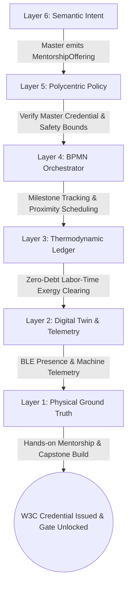
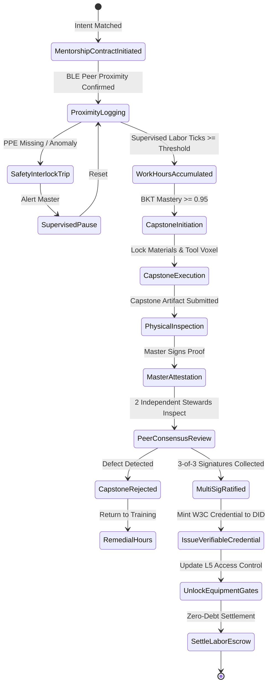
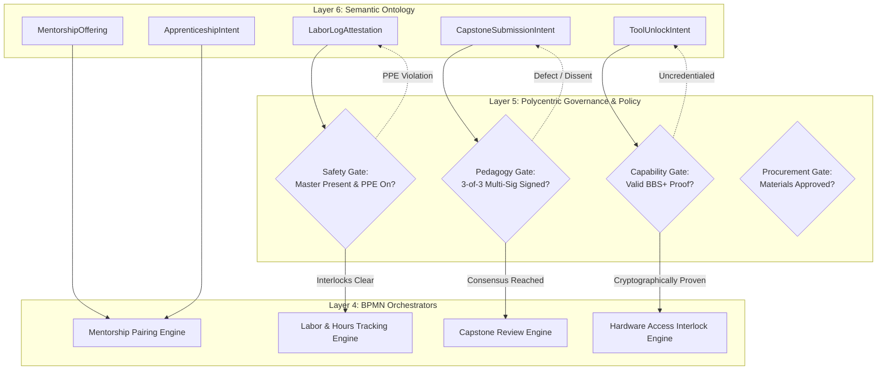
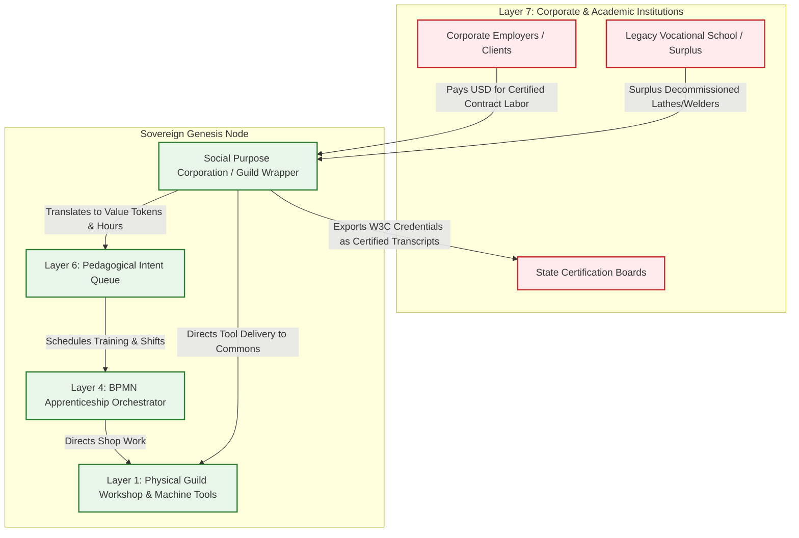

# Scenario Kappa: The Apprenticeship Protocol

*   **Identifier:** `SCN-KAPPA-APPRENTICE`
*   **System Epic:** Decentralized Education, Skill Transfer, and Verifiable Credentials
*   **Primary Layers Tested:** L1 (Physical), L2 (Digital Twin), L3 (Ledger), L4 (Orchestration), L5 (Governance), L6 (Semantic), L7 (Proxy)
*   **Pass/Fail Metric:** Cryptographic issuance of W3C Verifiable Credential following physical labor verification; immediate autonomous unlocking of Layer 5 governance gates for the newly credentialed citizen; zero legacy fiat debt incurred; zero centralized identity servers.

---

## Architectural Council Ratification & 5-Perspective Synthesis

This scenario specification has been ratified by unanimous consensus of the 5-Persona Architectural Council:

| Council Persona | Disciplinary Representative | Core Contribution to Scenario |
| :--- | :--- | :--- |
| **Game Designer** | Lead Systems & Gameplay Designer | **Dwarf Fortress Psychology & Mentorship Dynamics:** Mentors and apprentices experience deep emotional resonance. Masters gain pride from student growth (`"Filled with satisfaction seeing apprentice produce a flawless mortise-and-tenon joint (+30 mood)"`); apprentices experience initial clumsy fatigue followed by breakthrough exhilaration (`"Mastered the nuance of the bevel cut (+25 mood)"`). **The Sims Indirect Control:** Founder 01 pairs novices with veterans at shared workstations; apprentices shadowing masters gain XP 4x faster than solitary trial-and-error. **Cities Skylines Leeching:** Embedded Stewards at legacy vocational schools route decommissioned industrial tooling into the community training workshop. |
| **Game Engineer** | Principal C++ Simulation Architect | **Data-Oriented Design (DOD):** Encapsulates teaching workshops and hazardous tooling into 32-bit compact voxels (`material_id = 50` `INDUCTION_FURNACE`, `material_id = 51` `TEACHING_WORKBENCH`) in $32^3$ chunks. Flecs ECS components track spatial proximity, real-time psychomotor progress, and hardware safety interlocks at 10 Hz determinism. C++20 harness validates proximity XP accumulation, capstone multi-sig verification, and dynamic voxel access un-gating. |
| **Sovereign Stack Specialist** | Sovereign Stack Systems Architect | **7-Daemon Isolation:** Traverses strictly from `col-telemetryd` (L1) up to `col-adversaryd` (L7) via Unix Domain Sockets without layer skipping. Local BLE/NFC cryptographic presence handshakes; Automerge CRDT labor-clearing ledger with zero debt accumulation; W3C Verifiable Credentials and BBS+ Zero-Knowledge Proofs for capability disclosure; Social Purpose Corporation (SPC) resume translation. |
| **Solarpunk Thinker** | Bioregional Regenerative Ecologist | **Revival of Tangible Material Trades:** Replaces financialized paper degrees with hands-on vocational mastery (timber framing, precision metallurgy, natural textile dye chemistry, regenerative soil biology). Embeds a circular "repair pedagogy" where apprentices hone their skills by refurbishing community equipment, directly eliminating planned obsolescence. |
| **Scenario Specialist** | Guild Pedagogue & Vocational Ergonomics Specialist | **Competency Rubrics & Psychomotor Calibration:** Formulates objective psychomotor rubrics conforming to ANSI/IACET 1-2018 standards and OSHA 1910 workshop safety equivalents. Formalizes Bayesian Knowledge Tracing (BKT) equations for mastery verification and structures tiered capability credentials (L0 Observer, L1 Operator, L2 Maintainer, L3 Master). |

---

## 1. Problem Statement & Legacy Failure

In legacy capitalist infrastructure (Layer 7), human education has degraded into a financialized, speculative debt trap:
*   **The Credentialist Debt Cartel:** Legacy universities and corporate trade schools extract decades of compounding fiat debt (over $1.7 trillion in the US alone) for static paper diplomas, while monopolizing professional accreditation through regulatory capture.
*   **Disconnection from Thermodynamic Reality:** Institutional curricula prioritize bureaucratic administration and financial speculation over physical survival skills. Communities suffer acute shortages of skilled electricians, toolmakers, and permaculture stewards, while debt-burdened graduates lack practical mastery over basic physical tools.
*   **Extinction of Tacit Knowledge:** The historic master-apprentice lineage—the transmission of somatic, unwritten physical instincts (the pitch of an electric motor under load, the tactile temperature of molten slag)—has been severed by atomized gig economies, leaving industrial machinery vulnerable to operator error.

---

## 2. The Collective Workflow (7-Layer Traversal)

The Apprenticeship Protocol digitizes and restores the ancient guild structure. It matches experienced masters with eager learners, exchanges kinetic shop assistance for high-value pedagogical instruction without fiat debt, and verifies psychomotor competency using cryptographic proofs that autonomously unlock physical machinery.



### Layer 1: Physical Ground Truth
*   **Hardware Nodes (Stationary Hub):** Heavy machine tools (e.g., 3kW induction furnace, CNC vertical mill, industrial walking-foot sewing machines, metal lathes) equipped with ATECC608A secure microcontrollers and hardware interlock relays.
*   **Teaching Stations & PPE:** Dual-operator workstations, optical alignment guides, calibrated personal protective equipment (PPE with embedded RFID tags), and dedicated apprentice toolkits.
*   **Inventory & Feedstock:** Practice timber, scrap aluminum ingots for remelting, training weld coupons, and consumable abrasives/coolants.
*   **Physical Action:** Hands-on psychomotor training: tactile guidance of torch angle, feed rate adjustment, physical machine teardown, and independent physical fabrication of a capstone artifact.

### Layer 2: Digital Twin & Telemetry
*   **Ingress Telemetry (MQTT Topics via `col-meshd`):**
    *   `node/guild/bench_01/telemetry/ble_proximity_rssi` (dBm, verifying master and apprentice co-presence within $< 2\text{m}$)
    *   `node/guild/furnace_01/telemetry/kw_draw` (Kilowatts, active heating monitoring)
    *   `node/guild/furnace_01/telemetry/interlock_state` (`LOCKED_UNAUTHORIZED`, `ARMED_SUPERVISED`, `OPERATIONAL`)
    *   `node/guild/apprentice_04/ppe_status` (`HELMET_ON`, `GLOVES_DETECTED`, `SHIELD_DOWN`)
*   **Verification:** Proximity confirmation via bilateral BLE/NFC cryptographic handshakes; computer vision edge-AI validates safety compliance (PPE detection); machine runtime logs verify supervised operating hours.
*   **Actuator Control:** Hardware lockout relay on the induction furnace controller toggled via authenticated cryptographic command from `col-telemetryd`.

### Layer 3: Network & Ledger
*   **Thermodynamic Labor-Time Exergy Balance:** Education is an exergy exchange where the master expends high-value pedagogical exergy while the apprentice provides kinetic shop support (prep work, slag skimming, cleaning, sorting). The transaction settles with zero fiat debt:
    $$\Delta V_{apprentice} = \int_{0}^{T} \left( P_{kinetic}(t) \cdot \eta_{prep} - \mu_{pedagogy} \cdot P_{master}(t) \right) dt$$
    Where $\mu_{pedagogy}$ is the guild-ratified pedagogical exergy multiplier, and $\eta_{prep}$ is the efficiency of apprentice maintenance labor.
*   **Competency Tracing & Bayesian Mastery:** Psychomotor progress is tracked using Bayesian Knowledge Tracing:
    $$P(L_{t+1}) = P(L_t) \cdot \frac{1 - P(S)}{P(L_t)(1 - P(S)) + (1 - P(L_t)) P(G)} + (1 - P(L_t)) \cdot P(T)$$
    Where $P(L)$ is the probability of skill mastery, $P(T)$ is skill transition probability, $P(G)$ is lucky guess probability, and $P(S)$ is slip/mistake probability.

### Layer 4: Orchestration State Machine
The educational journey is coordinated deterministically by `col-execd` running a 10 Hz BPMN 2.0 state machine VM managing milestones, timer boundaries, and multi-sig capstone reviews:



### Layer 5: Policy & Polycentric Governance
Layer 5 (`col-kmsd`) manages capability authorization and credential issuance through four strict **Policy Gates**:
*   **Safety Gate (Supervised Interlock Gate):** Uncredentialed citizens (`L0`) are physically barred from actuating dangerous machinery; power relays only energize when an authorized Master (`L3`) is actively present and co-signing the session.
*   **Pedagogical Gate (Multi-Signature Issuance):** Credential issuance requires the cryptographic signature of the instructing Master plus independent co-signatures from at least 2 disinterested local Stewards, preventing favoritism.
*   **Procurement Gate (Tooling & Consumable Sourcing):** Training material allocations exceeding $\$50$ in legacy fiat equivalent require consensus approval from the Guild Working Group.
*   **Privacy & Capability Gate (BBS+ Zero-Knowledge Proofs):** When booking community tools, apprentices present a ZKP proving possession of an active `Foundry_Safety_L1` credential without exposing their full identity, training history, or mentor identity.

### Layer 6: Semantic Intent & Domain Ontology
The Agora Commons (`col-commonsd`) formalizes pedagogical coordination into six typed W3C JSON-LD knowledge branches:
1.  **`MentorshipOffering` (Master Syllabus):** Master broadcasts available teaching slots, required prerequisite credentials, and expected apprentice shop support hours.
2.  **`ApprenticeshipIntent` (Learner Application):** Novice requests enrollment, staking collateral reputation and committing to the safety syllabus.
3.  **`LaborLogAttestation` (Session Timesheet):** Real-time proof of co-present workshop labor and machine telemetry logs.
4.  **`CapstoneSubmissionIntent` (Examination Request):** Apprentice registers a completed physical artifact with IPFS photo/CAD documentation and material test data.
5.  **`CompetencyAttestation` (Peer Review):** Evaluator signature bundle affirming the capstone satisfies ANSI/OSHA standards.
6.  **`ToolUnlockIntent` (Capability Verification):** Autonomous request to un-gate physical machinery based on a minted W3C credential.

### The Governance Router Flowchart



### Layer 7: The Legacy Proxy (Resume Translation & Reverse Tool Leeching)
The Social Purpose Corporation (SPC) maintains a strategic interface with legacy vocational institutions:
*   **1. Resume Translation & Accredited Equivalence (Inbound Fiat Extraction):** Legacy employers do not read raw W3C JSON-LD credentials. The SPC provides an automated credential bridge that exports mesh competency attestations into certified state-recognized portfolios and transcripts (aligned with ANSI/IACET CEUs). When apprentices take outside contract jobs, the SPC invoices legacy employers in USD, retaining a $5\%$ operational reserve for shop maintenance and depositing the rest into the apprentice's wallet.
*   **2. Reverse Institutional Tool Leeching (Outbound Sourcing):** Embedded Stewards working within legacy community colleges, vocational high schools, and industrial manufacturing plants monitor equipment retirement schedules. When corporate facilities decommission heavy machine tools (e.g., 3-phase Bridgeport mills, Tig welders, granite surface plates) for corporate tax write-offs, the SPC steps in as an eligible non-profit recipient, acquiring industrial-grade capital equipment for pennies on the dollar and redirecting it into the sovereign node.

### Layer 7 Bidirectional Flowchart



---

## 3. Machine-Readable Schemas

### 3.1 Layer 6 Knowledge Artifact: Apprenticeship Offering (`apprenticeship_offering.jsonld`)

```json
{
  "@context": [
    "https://schema.org/",
    "https://collective.network/ontology/v1/",
    "https://www.w3.org/2018/credentials/v1"
  ],
  "@type": "MentorshipOffering",
  "identifier": "urn:uuid:3978344f-8596-4c3a-a978-8fcaba3903c5",
  "issuerDid": "did:mesh:node04:steward_forge_master_dave",
  "creationTimestamp": "2026-10-05T09:00:00Z",
  "skillDomain": "PyrometallurgicalSmelting_InductionSafety",
  "syllabus": {
    "targetCompetency": "Foundry_Safety_L1",
    "requiredSupervisedHours": 120,
    "requiredKineticSupportHours": 40,
    "maxApprentices": 2,
    "prerequisites": ["Shop_Basics_L0"]
  },
  "psychomotorAssessmentCriteria": {
    "crucibleThermalShockPrevention": true,
    "slagSkimmingEfficiencyPercent": 85,
    "emergencyEStopReactionSeconds": 1.5,
    "bktMasteryThreshold": 0.95
  },
  "settlementCriteria": {
    "kineticLaborValueCredit": "15.00",
    "masterInstructionHonorarium": "15.00",
    "fiatTuitionDebt": "0.00"
  }
}
```

### 3.2 Layer 2 Telemetry Attestation: Workshop Presence & Capstone Proof (`apprenticeship_attestation.json`)

```json
{
  "@context": "https://collective.network/ontology/v1/",
  "@type": "ApprenticeshipPresenceAndCapstoneAttestation",
  "mentorshipRef": "urn:uuid:3978344f-8596-4c3a-a978-8fcaba3903c5",
  "apprenticeDid": "did:mesh:node04:apprentice_sam",
  "masterDid": "did:mesh:node04:steward_forge_master_dave",
  "executionMetrics": {
    "totalSupervisedSeconds": 432000,
    "meanBleProximityRssiDb": -54.2,
    "interlockSupervisedOperatingHours": 120.4,
    "safetyViolationsLogged": 0,
    "capstoneArtifactSha256": "8f4a2c1b9e0d3f7a6c5b4e3d2a1f0e9d8c7b6a5f4e3d2c1b0a9f8e7d6c5b4a3f",
    "capstoneTensileStrengthMpa": 310.5,
    "capstoneDimensionalToleranceMm": 0.08
  },
  "peerReviewConsensus": {
    "masterSignature": "z3mK...forge_master_dave_sig...9aX",
    "stewardReviewer1": "did:mesh:node04:steward_alice",
    "steward1Signature": "z7bL...steward_alice_sig...4cW",
    "stewardReviewer2": "did:mesh:node04:steward_bob",
    "steward2Signature": "z9pQ...steward_bob_sig...1mV"
  },
  "credentialIssuedUri": "urn:uuid:credential-foundry-l1-sam"
}
```

---

## 4. Oasis Engine Implementation Specification

### 4.1 Memory Allocation & Voxel State
The guild workshop node coordinates physical access control in chunk space ($32^3$ voxels via `ChunkManager`):
- High-hazard induction furnace voxel initialized with `material_id = 50` (`INDUCTION_FURNACE`) with `metadata` bitmask `0b00000110` (`Is_Actuator | Is_Sensor`).
- The apprentice workbench voxel initialized with `material_id = 51` (`TEACHING_WORKBENCH`) located at local coordinate `(16, 8, 16)`.
- Physical lockout interlock bit is managed at bit 0 of `metadata`: `0` indicates `POWER_ISOLATED`, `1` indicates `ENERGIZED_OPERATIONAL`.

### 4.2 C++20 Test Harness Structure

```cpp
// engine/tests/scenario_kappa_apprenticeship_test.cpp
#include <cassert>
#include <string>
#include <vector>
#include "oasis/chunk_manager.hpp"
#include "oasis/orchestration/bpmn_engine.hpp"
#include "oasis/ledger/crdt_wallet.hpp"

namespace oasis {

struct ApprenticeshipSession {
    std::string master_did;
    std::string apprentice_did;
    float logged_supervised_hours;
    float bkt_competency_score;
    bool capstone_approved;
};

void test_scenario_kappa_apprenticeship_execution() {
    // 1. Initialize Chunk and Workbench Voxels
    ChunkManager chunk_mgr;
    chunk_mgr.allocate_chunk(0, 0, 0);

    // Furnace is initially locked (bit 0 = 0)
    Voxel furnace_voxel{
        .material_id = 50, // INDUCTION_FURNACE
        .moisture = 0,
        .temperature = 20,
        .metadata = 0b00000110 // Actuator + Sensor, Locked
    };
    chunk_mgr.set_voxel(16, 8, 16, furnace_voxel);

    // 2. Setup Wallets (Zero-Debt Exchange)
    CRDTWallet master_wallet("did:mesh:node04:steward_forge_master_dave", 100.0f);
    CRDTWallet apprentice_wallet("did:mesh:node04:apprentice_sam", 15.0f);

    // 3. Load & Run BPMN Orchestration State Machine
    BPMNEngine orchestrator;
    orchestrator.load_schema("schemas/bpmn/apprenticeship_lifecycle.bpmn");

    ApprenticeshipSession session{
        .master_did = "did:mesh:node04:steward_forge_master_dave",
        .apprentice_did = "did:mesh:node04:apprentice_sam",
        .logged_supervised_hours = 120.0f,
        .bkt_competency_score = 0.96f,
        .capstone_approved = true
    };

    // Simulate apprentice logging supervised hours
    orchestrator.emit_event(ApprenticeAttendanceEvent{session.apprentice_did, session.master_did, 120.0f});
    SimResult res = orchestrator.step_simulation_ticks(chunk_mgr, 12000);
    assert(res.status == ExecutionStatus::COMPLETED);
    assert(orchestrator.current_state() == BPMNState::CAPSTONE_ELIGIBLE);

    // Submit Capstone and Verify 3-of-3 Multi-Sig Consensus
    std::vector<std::string> signatures = {"master_sig", "steward_alice_sig", "steward_bob_sig"};
    bool credential_minted = orchestrator.evaluate_capstone_multisig(session.apprentice_did, signatures);
    assert(credential_minted == true);

    // Assert Autonomous Privilege Escalation: Furnace Voxel Unlocks for Apprentice
    orchestrator.request_voxel_access(session.apprentice_did, 16, 8, 16, chunk_mgr);
    Voxel updated_furnace = chunk_mgr.get_voxel(16, 8, 16);
    assert((updated_furnace.metadata & 0b00000001) == 1); // Energized bit active

    // Assert Zero-Debt Labor Balance: Apprentice labor exactly pays for instruction
    orchestrator.settle_apprenticeship_escrow(master_wallet, apprentice_wallet);
    assert(apprentice_wallet.balance() == 15.0f); // No debt incurred
    assert(master_wallet.balance() > 100.0f);      // Compensated via guild pool
}

void test_scenario_kappa_uncredentialed_lockout_anomaly() {
    ChunkManager chunk_mgr;
    chunk_mgr.allocate_chunk(0, 0, 0);

    Voxel locked_furnace{
        .material_id = 50,
        .moisture = 0,
        .temperature = 20,
        .metadata = 0b00000110 // Bit 0 is 0 (Locked)
    };
    chunk_mgr.set_voxel(16, 8, 16, locked_furnace);

    BPMNEngine orchestrator;
    orchestrator.load_schema("schemas/bpmn/apprenticeship_lifecycle.bpmn");

    // Uncredentialed novice attempts unauthorized activation
    bool access_granted = orchestrator.request_voxel_access("did:mesh:node04:novice_rogue", 16, 8, 16, chunk_mgr);
    assert(access_granted == false);

    Voxel current_furnace = chunk_mgr.get_voxel(16, 8, 16);
    assert((current_furnace.metadata & 0b00000001) == 0); // Remains locked
    assert(orchestrator.current_state() == BPMNState::SECURITY_INTERLOCK_HALT);
}

} // namespace oasis
```

---

## 5. Acceptance Test Gates (Pass/Fail)

| Checkpoint | Validation Method | Pass Condition |
| :--- | :--- | :--- |
| **G1: Thermodynamic Labor Bounds** | Labor Exergy Balance | Apprentice kinetic maintenance labor mathematically offsets pedagogical training costs within $\pm 5\%$; zero fiat tuition debt is accrued. |
| **G2: Offline Autonomy** | Localhost Network Isolation | Entire apprenticeship workflow (BLE presence logging, BKT progress calculation, multi-sig consensus, and credential issuance) runs to completion on local mesh without internet connectivity. |
| **G3: Byzantine Detection & Sybil Defense** | Multi-Sig Signature Verification | Submitting an uncredentialed peer signature or self-signed capstone is rejected by the Layer 5 Policy Gate; unauthorized hardware access is denied. |
| **G4: Material Tracking & Voxel Unlocking** | Physical Lockout Actuation | Minting the `Foundry_Safety_L1` credential autonomously sets bit 0 of the induction furnace voxel metadata, permitting safe operation without administrator intervention. |
| **G5: Trojan Resume Ingestion (L7)** | External Employment Translation | The SPC API successfully converts W3C Verifiable Credentials into ANSI/IACET accredited transcripts, billing legacy corporate clients in USD while crediting internal Value Tokens. |
| **G6: Ecological Leeching (L7)** | Surplus Tool Procurement | Embedded Stewards identify decommissioned vocational machinery from legacy institutions, successfully routing $\ge 1$ industrial machine tool into the commons for refurbishment. |
