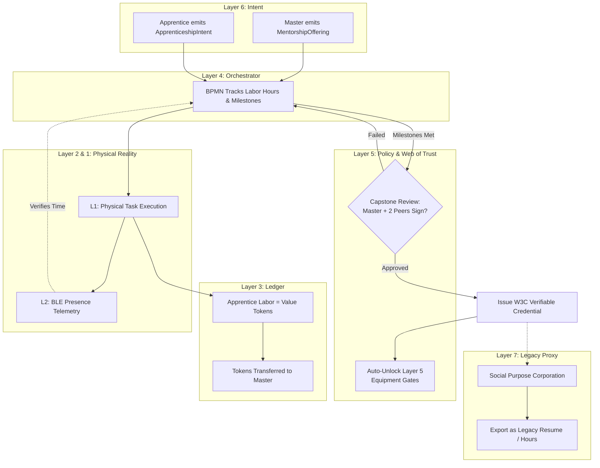

# Scenario Kappa: The Apprenticeship Protocol

*   **Identifier:** `SCN-KAPPA-APPRENTICE`
*   **System Epic:** Decentralized Education, Skill Transfer, and Verifiable Credentials
*   **Primary Layers Tested:** L1 (Physical), L3 (Ledger), L4 (Orchestrator), L5 (Governance), L6 (Semantic), L7 (Proxy)
*   **Pass/Fail Metric:** Successful cryptographic issuance of a W3C Verifiable Credential following physical labor verification; immediate unlocking of Layer 5 governance gates for the newly credentialed citizen; zero legacy fiat debt incurred.

---

## 1. Problem Statement & Legacy Failure

The legacy educational system (Layer 7) has devolved into a financialized debt trap. Legacy universities act as centralized gatekeepers, issuing static, easily forged paper degrees while extracting decades of fiat debt from students. Furthermore, this "credentialism" is entirely disconnected from local thermodynamic reality—a community may be starving for a skilled electrician or permaculture steward, while legacy institutions continue to produce debt-burdened graduates with no physical survival skills.
Local, hands-on skill transfer (Apprenticeship) is the oldest and most efficient method of human education, but in the modern era, it lacks the formal "legibility" required to prove competency across a wider network.

## 2. The Collective Workflow (7-Layer Traversal)

Scenario Kappa digitizes the ancient master-apprentice relationship. It utilizes the Web of Trust (Layer 5) to issue mathematically verifiable, tamper-proof credentials that natively integrate with the Node's operational infrastructure.

### Layer 7: The Legacy Proxy (Translation & Compliance)
*   **Resume Translation:** The legacy capitalist world does not yet read W3C Verifiable Credentials. The Social Purpose Corporation (SPC) API acts as a translator, allowing a citizen to export their cryptographic mesh credentials into state-recognized formats (e.g., converting a `Forestry_L2` into formal volunteer hours, or translating mesh labor into an official corporate apprenticeship record).

### Layer 6: Semantic Intent
*   A Master (a citizen holding an L3 or higher credential) emits a `MentorshipOffering` (e.g., "Will teach advanced FDM 3D printing in exchange for 20 hours of shop cleanup").
*   An Apprentice emits an `ApprenticeshipIntent` to accept the terms.

### Layer 5: Policy & Web of Trust (Cryptographic Issuance)
*   **Multi-Signature Attestation:** A credential is not handed out arbitrarily. To upgrade a citizen from `Fabrication_L0` to `Fabrication_L1`, the Web of Trust requires the digital signature of the Master, plus an *n-of-m* consensus vouch (e.g., 2 other local Stewards must inspect and cryptographically sign off on the apprentice's final physical capstone project).
*   **Immediate Systemic Unlock:** Once the Verifiable Credential is added to the citizen's decentralized identity (DID), Layer 5 automatically unlocks restricted mesh privileges. The citizen can now independently book the Fabrication Commons (Scenario Alpha) without a chaperone.

### Layer 4: Orchestration (Milestone Tracking)
*   The BPMN engine acts as the syllabus and time-tracker. It orchestrates the lifecycle of the apprenticeship: logging hours worked, triggering the Capstone Review phase, and managing the escrow of Value Tokens.

### Layer 3: Ledger (The Thermodynamic Exchange)
*   Education is an exchange of exergy. The Master spends high-value teaching energy; the Apprentice provides low-level kinetic energy (sweeping, prepping materials, organizing).
*   **Zero-Debt Settlement:** The BPMN engine orchestrates a Value Token swap. The Apprentice's labor earns tokens that are mathematically routed to the Master, rendering the educational transaction completely free of fiat debt.

### Layer 2 & 1: Digital Twin & Physical Reality
*   **Telemetry (L2):** BLE/NFC check-ins at the physical workshop verify the apprentice was physically present for the required hours. 
*   **Physical (L1):** The actual transfer of tacit knowledge—holding a soldering iron, listening to the pitch of an induction furnace, feeling the moisture of biochar soil.

---



---

## 3. Oasis Engine Implementation Specification

In the C++ Oasis engine, this replaces the traditional RPG "skill tree" with a peer-to-peer credentialing system:

*   **Proximity XP Allocation:** An `NPC_APPRENTICE` entity can only increment their hidden `skill_progress` byte when physically located within the same Chunk as an `NPC_MASTER` entity who actively holds the target credential.
*   **BPMN Capstone Trigger:** Once `skill_progress` reaches the threshold (e.g., 10,000 ticks), the engine spawns a `CAPSTONE_EVENT`. 
*   **Credential Minting:** If the Capstone is resolved successfully, the engine generates a mock W3C Verifiable Credential JSON, attaches it to the Apprentice's internal DID profile, and dynamically updates the collision/access rules so they can now interact with previously locked voxels (e.g., the `INDUCTION_FURNACE` voxel).

---

```json
{
  "@context": [
    "[https://www.w3.org/2018/credentials/v1](https://www.w3.org/2018/credentials/v1)",
    "[https://collective.network/ontology/v1/skills](https://collective.network/ontology/v1/skills)"
  ],
  "id": "urn:uuid:3978344f-8596-4c3a-a978-8fcaba3903c5",
  "type": ["VerifiableCredential", "SkillAttestation"],
  "issuer": "did:mesh:node04:steward_forge_master_dave",
  "issuanceDate": "2026-10-15T14:30:00Z",
  "credentialSubject": {
    "id": "did:mesh:node04:apprentice_sam",
    "skillAchieved": {
      "type": "Competency",
      "name": "Foundry_Safety_L1",
      "description": "Demonstrated safe operation, PPE utilization, and thermodynamic management of a 3kW induction furnace for aluminum smelting.",
      "hoursLogged": 120,
      "capstoneArtifactUri": "ipfs://QmProjectDocumentationHash..."
    }
  },
  "proof": {
    "type": "Ed25519Signature2020",
    "created": "2026-10-15T14:35:00Z",
    "verificationMethod": "did:mesh:node04:steward_forge_master_dave#keys-1",
    "proofPurpose": "assertionMethod",
    "proofValue": "z5aKk2x...cryptographic_signature...8jL3p"
  }
}
```

---

## 4. Acceptance Test Gates (Pass/Fail)

| Checkpoint | Validation Method | Pass Condition |
| :--- | :--- | :--- |
| **G1: Cryptographic Sybil Defense** | Did Authentication | A simulated user cannot self-sign an `L1` credential; the engine mathematically rejects the JSON-LD payload unless it contains the private key signature of a verified `L2` or `L3` Master. |
| **G2: Milestone Verification** | L2 Telemetry Summation | The BPMN orchestrator refuses to trigger the Capstone event if the accumulated physical presence (simulated NFC check-ins) falls short of the required time vector. |
| **G3: Autonomous Privilege Escalation** | Governance Gate Test | Upon successful credential minting, a previously blocked user is immediately granted L2 actuator access to a restricted tool without requiring human admin intervention. |
| **G4: Zero-Debt Settlement** | CRDT Ledger Check | The final Value Token balance for the Apprentice shows no negative fiat debt; all educational costs were successfully offset by logged physical maintenance labor. |
