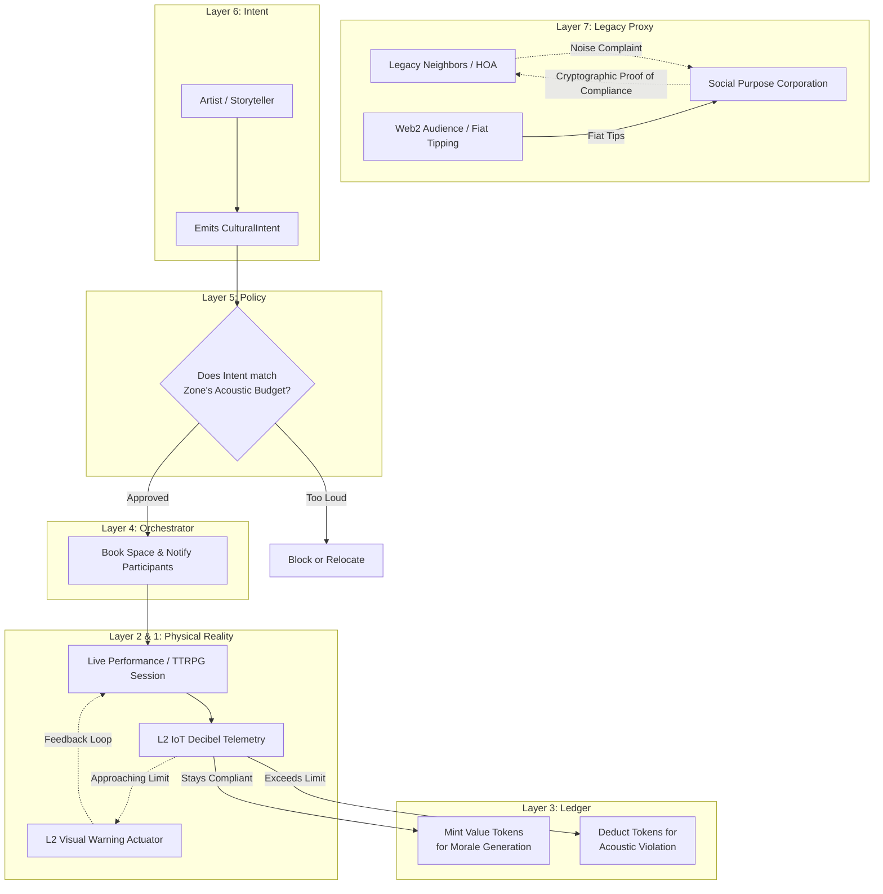

# Scenario Lambda: Cultural Commons (Morale & Sound)

*   **Identifier:** `SCN-LAMBDA-CULTURE`
*   **System Epic:** Decentralized Arts, Acoustic Budgeting, and Morale as Negentropy
*   **Primary Layers Tested:** L2 (Twin), L3 (Ledger), L4 (Orchestrator), L5 (Governance), L6 (Semantic), L7 (Proxy)
*   **Pass/Fail Metric:** Successful orchestration of a cultural event (live music, tabletop storytelling, or art) where active decibel telemetry remains strictly below the Node's cryptographically agreed-upon Acoustic Budget; Value Tokens minted for the creators without third-party extraction.

---

## 1. Problem Statement & Legacy Failure

In the legacy system, culture is passively consumed rather than actively created. Corporate platforms (Spotify, Netflix) extract maximum fiat rent while artists starve. Locally, the legacy suburban environment actively suppresses cultural creation—Homeowner Associations (HOAs) and municipal noise ordinances weaponize the police against citizens practicing instruments or hosting community gatherings.
Without active cultural creation, human psychological entropy (demoralization, burnout, isolation) increases, ultimately collapsing the resilience of the community. Morale is not a luxury; it is the psychological negentropy required to sustain the physical mesh.

## 2. The Collective Workflow (7-Layer Traversal)

Scenario Lambda reclaims culture by treating psychological well-being as a systemic asset. It uses the mesh to coordinate collaborative creation, mathematically compensating artists while utilizing Layer 2 telemetry to guarantee neighbors are not disturbed.

### Layer 7: The Legacy Proxy (Performance Rights & HOA Shield)
*   **HOA Shield:** The Social Purpose Corporation (SPC) maintains a transparent, immutable log of decibel telemetry at the property line. If a legacy neighbor or HOA issues a noise complaint regarding a rehearsal, the SPC provides cryptographic proof that the event never exceeded the municipal legal limit of 55 dBA.
*   **Fiat Tip Jar:** If a cultural event (e.g., a localized play or concert) is open to the legacy public, the SPC processes Web2 fiat ticket sales or tips, transferring the economic energy into the mesh.

### Layer 6: Semantic Intent
*   Creators emit a `CulturalIntent`. This could be a request for collaborators (e.g., "Seeking a cellist and pianist to accompany an electronic drum set for a fusion jam") or an invitation (e.g., "Hosting a 6-player tabletop RPG campaign tonight").
*   The intent defines the acoustic profile, space requirements, and temporal bounds.

### Layer 5: Policy & Web of Trust (The Acoustic Budget)
*   **Acoustic Zoning:** The Trust Ring defines dynamic acoustic budgets for different physical chunks. A soundproofed garage may have a 90 dBA internal limit, while the outdoor permaculture commons may drop to 40 dBA after 9:00 PM. 
*   Layer 5 automatically rejects any `CulturalIntent` that attempts to book a loud instrument or PA system in a quiet zone during restricted hours.

### Layer 4: Orchestration (Spatial & Temporal Phasing)
*   The BPMN engine acts as the stage manager. It books the appropriate physical space (linking to Scenario Epsilon's spatial multiplexing) and notifies all participating DIDs. 
*   It arms the Layer 2 acoustic monitors for the duration of the event.

### Layer 3: Ledger (Minting Morale)
*   Generating culture is labor. Citizens who perform, run a complex tabletop campaign, or teach an art class are minted Value Tokens directly from the community's Morale Fund, or via peer-to-peer escrow from attendees. 
*   There is zero platform extraction; 100% of the energy flows to the creators.

### Layer 2 & 1: Digital Twin & Physical Reality
*   **Telemetry (L2):** Calibrated IoT decibel meters situated at the boundary lines of the Node continuously stream audio volume (not raw audio recordings, preserving privacy) via MQTT. If the volume spikes near the acoustic budget ceiling, the system triggers a localized visual alert (e.g., pulsing a smart LED bulb red in the rehearsal room) so the musicians can dynamically adjust their volume before a violation occurs.
*   **Physical (L1):** Cellos, electronic drums, pianos, amplifiers, canvases, dice, human voices, and the physical propagation of soundwaves.

---



---

## 3. Oasis Engine Implementation Specification

In the C++ Oasis engine, this scenario requires simulating the physics of sound propagation and the abstract metric of NPC morale:

*   **Wave Propagation:** The engine must implement a localized breadth-first search (BFS) to simulate acoustic decay. An entity playing a `DRUM_KIT` in voxel (X, Y, Z) emits a sound value of 80. The engine degrades this value based on the `acoustic_resistance` metadata of surrounding voxels (e.g., `DRYWALL` degrades it by 10, `AIR` by 2).
*   **Boundary Enforcement:** If the propagated sound value exceeds the `Max_Decibel` property of a `PROPERTY_LINE` voxel, the engine flags an `ACOUSTIC_VIOLATION` event, halting the BPMN orchestration and penalizing the originating entity's CRDT wallet.
*   **Morale Buff:** Entities within the optimal radius of a successfully orchestrated `CulturalIntent` receive a status buff to their `Morale` variable, increasing their physical work efficiency in other scenarios (like Farming or Harvesting).

---

```json
{
  "@context": [
    "[https://schema.org/](https://schema.org/)",
    "[https://collective.network/ontology/v1/](https://collective.network/ontology/v1/)"
  ],
  "@type": "CulturalIntent",
  "identifier": "urn:uuid:6a7b8c9d-0e1f-2a3b-4c5d-6e7f8a9b0c1d",
  "issuerDid": "did:mesh:node04:creator_jules",
  "eventProfile": {
    "title": "Acoustic & Electronic Fusion Rehearsal",
    "culturalType": "LiveMusic",
    "requestedAssets": ["Piano_Upright", "Electronic_Drum_Monitor", "Cello_Space"],
    "expectedParticipants": 3
  },
  "acousticParameters": {
    "targetZone": "did:mesh:node04:space:soundproof_garage",
    "estimatedPeakDecibels": 85,
    "propertyLineLimitDecibels": 55,
    "feedbackActuator": "mqtt://node04.mesh.local/garage/hue_warning_light"
  },
  "temporalVector": {
    "startTime": "2026-10-18T19:00:00Z",
    "endTime": "2026-10-18T21:30:00Z",
    "totalHours": 2.5
  },
  "settlementCriteria": {
    "moraleBountyRequested": "10.00",
    "violationCollateralLocked": "50.00"
  }
}
```

---

## 4. Acceptance Test Gates (Pass/Fail)

| Checkpoint | Validation Method | Pass Condition |
| :--- | :--- | :--- |
| **G1: Sound Propagation Physics** | Voxel Acoustic Sim | Sound values generated by a high-decibel source are successfully contained and mathematically decayed by surrounding high-resistance voxels, never breaching the simulated property line threshold. |
| **G2: Dynamic L2 Feedback** | Telemetry Alerting | When simulated volume reaches 90% of the allowable acoustic budget, the BPMN engine successfully triggers a localized L2 visual warning actuator. |
| **G3: Morale Yield** | Entity State Update | Successful completion of the event without acoustic violations correctly applies the calculated Morale multiplier to all attending NPC/Player entities. |
| **G4: Cryptographic HOA Defense** | Audit Trail Generation | The engine generates an immutable JSON array of hashed decibel readings that mathematically prove the noise floor remained legal throughout the temporal block. |
