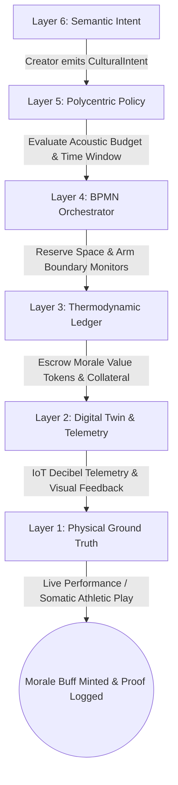
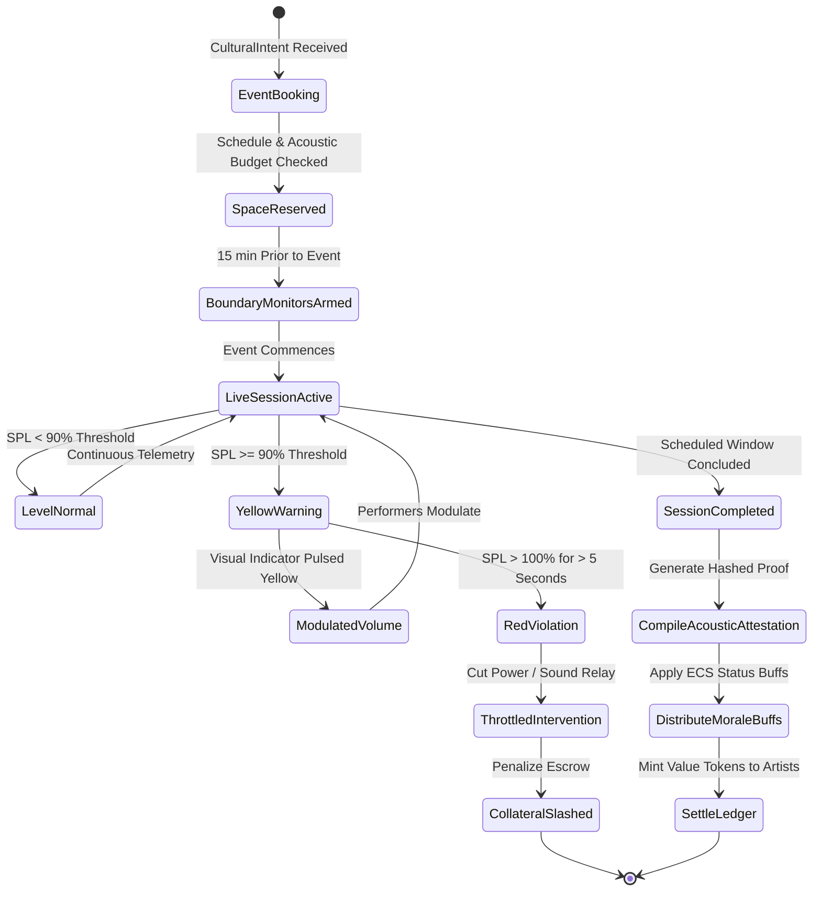
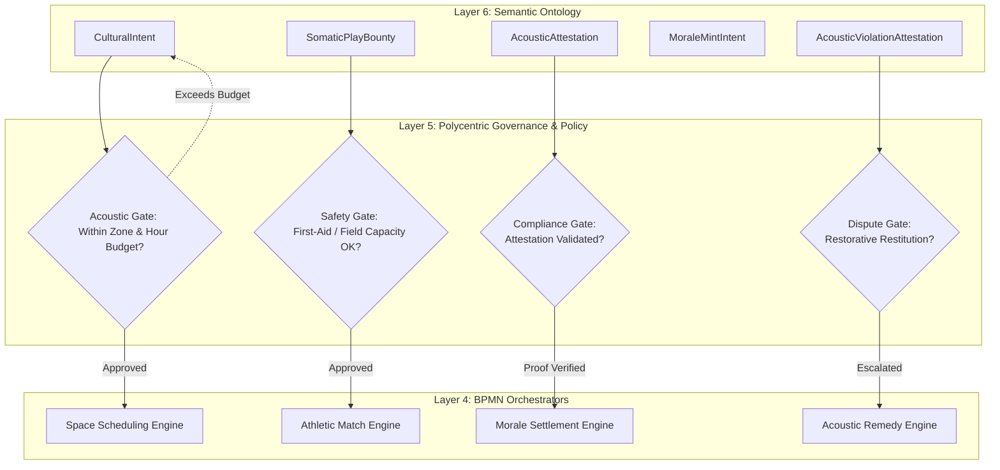
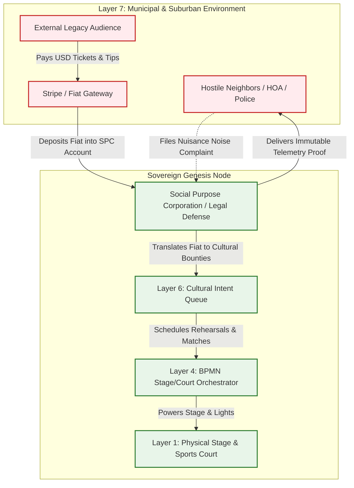

# Scenario Lambda: Cultural Commons (Arts, Sound & Somatic Play)

*   **Identifier:** `SCN-LAMBDA-CULTURE`
*   **System Epic:** Decentralized Arts, Acoustic Budgeting, Somatic Play (Sports), and Morale as Negentropy
*   **Primary Layers Tested:** L1 (Physical), L2 (Digital Twin), L3 (Ledger), L4 (Orchestration), L5 (Governance), L6 (Semantic), L7 (Proxy)
*   **Pass/Fail Metric:** Successful orchestration of a cultural or athletic event where active property-line decibel telemetry remains strictly $< 55\text{ dBA}$ (day) / $< 45\text{ dBA}$ (night); Value Tokens minted for creators and athletes without third-party platform extraction; zero centralized servers.

---

## Architectural Council Ratification & 5-Perspective Synthesis

This scenario specification has been ratified by unanimous consensus of the 5-Persona Architectural Council:

| Council Persona | Disciplinary Representative | Core Contribution to Scenario |
| :--- | :--- | :--- |
| **Game Designer** | Lead Systems & Gameplay Designer | **Dwarf Fortress Psychology & Somatic Morale:** Models human emotional catharsis and play as systemic negentropy. NPCs attending live jam sessions or intense 3v3 basketball games shed trauma and chronic stress (`"Moved to tears by an extraordinary cello resonance (+40 mood)"` or `"Exhilarated by a hard-fought athletic victory (+30 mood)"`). **The Sims Indirect Control:** Founder 01 schedules Friday night cultural gatherings to replenish community fun and social bars, preventing burnout in critical manufacturing sprints. **Cities Skylines Leeching:** Uses real-time IoT decibel telemetry logs as an airtight legal defense against suburban Homeowner Association (HOA) noise complaints. |
| **Game Engineer** | Principal C++ Simulation Architect | **Data-Oriented Design (DOD):** Encapsulates cultural infrastructure into compact 32-bit voxels (`material_id = 55` `SOUND_STAGE`, `material_id = 56` `SPORTS_COURT`, `material_id = 57` `ACOUSTIC_BERM`) in $32^3$ chunks. Flecs ECS systems simulate acoustic wave breadth-first search (BFS) decay through architectural barriers at 10 Hz determinism. C++20 harness validates wave decay across drywall/berm voxels and verifies morale buff propagation to attending entities. |
| **Sovereign Stack Specialist** | Sovereign Stack Systems Architect | **7-Daemon Isolation:** Strict vertical traversal from `col-telemetryd` (L1) to `col-adversaryd` (L7) via Unix Domain Sockets without layer skipping. Privacy-preserving edge decibel telemetry (streaming volume levels only, zero raw audio capture); Automerge CRDT Morale Fund escrow; BBS+ Zero-Knowledge Proofs for space reservation without behavioral tracking; Social Purpose Corporation (SPC) HOA defense shield. |
| **Solarpunk Thinker** | Bioregional Regenerative Ecologist | **Acoustic Ecology & Wildlife Corridors:** Establishes acoustic limits that protect nocturnal pollinator corridors, nesting avian species, and human circadian rhythms from chronic low-frequency sound pollution. Reclaims somatic physical play in open public commons, systematically eliminating energy-intensive motorized entertainment. |
| **Scenario Specialist** | Psychoacoustician & Community Somatics Ethnographer | **Sound Propagation & Psychoacoustic Limits:** Formulates sound transmission loss decay equations ($L_p(r) = L_w - 20\log_{10}(r) - 11 - A_{barrier}$) conforming to ANSI S12.9 and ISO 1996 standards. Establishes dynamic frequency-weighted acoustic budgets (dBA vs. dBC for bass containment) and models somatic exertion recovery curves. |

---

## 1. Problem Statement & Legacy Failure

In late-stage capitalist infrastructure (Layer 7), human artistic expression and physical recreation have been enclosed, commodified, and actively suppressed:
*   **Platform Enclosure & Artist Starvation:** Centralized streaming monopolies (Spotify, Apple, Netflix) extract up to $80\%$ of creative revenues, leaving working artists unable to afford basic food or shelter, while algorithms homogenize music to optimize passive consumer retention.
*   **Commercialization of Sports & Somatic Alienation:** Physical athletics has been degraded into hyper-financialized, corporate sports betting platforms and spectator screen addiction. Neighborhood pickup games and participatory physical culture are replaced by sedentary isolation, causing soaring systemic health crises.
*   **Suburban HOA Suppression & Police Weaponization:** Legacy suburban regimes (HOAs, restrictive municipal zoning) weaponize municipal police departments against citizens making music or playing outdoor sports. Vague, subjective "nuisance ordinances" are enforced arbitrarily, killing neighborhood vibrancy and communal trust.

---

## 2. The Collective Workflow (7-Layer Traversal)

Scenario Lambda reclaims culture and physical play by treating human psychological morale as a primary thermodynamic asset. Grounded in calibrated IoT decibel telemetry, it protects neighborhood tranquility while ensuring creators and athletes are directly compensated from the commons.



### Layer 1: Physical Ground Truth
*   **Hardware Nodes (Acoustic & Athletic Hubs):** Community stages, sports courts, rehearsal rooms, and outdoor amphitheatres equipped with ATECC608A secure microcontrollers, directional loudspeaker arrays, and dynamic visual warning beacons (RGB LED feedback indicators).
*   **Acoustic Containment Barriers:** Dense earthen sound berms, green living walls, recycled cellulose acoustic baffling, and double-stud soundproof enclosures.
*   **Physical Gear & Instruments:** Cellos, violins, open-hardware synthesizers, electronic drums, basketballs, soccer balls, and athletic safety equipment.
*   **Physical Action:** Acoustic soundwave emission, somatic athletic exertion, tactile dance/play, and vocal propagation occurring within designated physical chunk coordinates.

### Layer 2: Digital Twin & Telemetry
*   **Ingress Telemetry (MQTT Topics via `col-meshd`):**
    *   `node/culture/garage_01/telemetry/spl_dba` (A-weighted sound pressure level, 100 ms RMS)
    *   `node/culture/property_line/telemetry/spl_dba` (Boundary sound level, limit $< 55\text{ dBA}$)
    *   `node/culture/court_01/telemetry/heart_rate_avg` (BPM, aggregate athletic exertion metric)
    *   `node/culture/alert_beacon/state` (`NORMAL_GREEN`, `WARNING_YELLOW`, `THROTTLED_RED`)
*   **Privacy Invariant Verification:** Edge sensors execute on-chip FFT and RMS calculations, streaming purely numerical sound pressure metrics (dBA and dBC); **zero raw audio is recorded, stored, or transmitted**, eliminating surveillance risks.
*   **Actuator Control:** Local visual warning light pulsed yellow when volume reaches $90\%$ of permitted threshold, and red if breached, alerting performers to modulate amplitude in real time.

### Layer 3: Network & Ledger
*   **Acoustic Exergy Budget & Morale Negentropy:** Morale generation is modeled as systemic negentropy that counteracts psychological burnout. The acoustic budget integral must satisfy:
    $$\mathcal{E}_{acoustic} = \int_{0}^{T} 10^{\frac{L_{p,A}(t) - L_{target}}{10}} dt \le \mathcal{B}_{permitted}$$
    Where $L_{target}$ is the zoning threshold ($55\text{ dBA}$ daytime, $45\text{ dBA}$ night).
*   **Morale Buff Valuation & Decay:** Attendees receive a morale buff that decays exponentially:
    $$\mathcal{M}(t) = \mathcal{M}_0 \cdot e^{-\lambda_{decay} t} + \Delta \mathcal{M}_{flow}$$
    Upon verified completion without boundary violations, the ledger mints Value Tokens directly from the community Morale Reserve to the artists and athletic coordinators, releasing their violation collateral.

### Layer 4: Orchestration State Machine
The cultural event lifecycle is governed deterministically by `col-execd` running a 10 Hz BPMN 2.0 state machine VM managing spatial reservations, boundary monitoring, and feedback loops:



### Layer 5: Policy & Polycentric Governance
Layer 5 (`col-kmsd`) regulates space access and civic harmony through four rigorous **Policy Gates**:
*   **Acoustic Zoning Gate:** Evaluates ambient environmental constraints; automatically rejects high-amplitude intents (e.g., drum kits, brass ensembles) scheduled in quiet or residential zones during nocturnal hours ($21:00 - 08:00$).
*   **Somatic Safety Gate:** Verifies that physical sporting events on public commons provide adequate first-aid coverage (linking to Scenario Chi) and respect field carrying capacities.
*   **Procurement Gate:** Allocations for shared musical equipment or sports turf maintenance exceeding $\$50$ require a 3-of-5 multi-sig vote from the Cultural Working Group.
*   **Privacy & Identity Gate:** Participants book spaces and receive morale attestations via BBS+ Zero-Knowledge Proofs, ensuring attendance records are untraceable by corporate or state surveillance.

### Layer 6: Semantic Intent & Domain Ontology
The Agora Commons (`col-commonsd`) formalizes creative coordination into six typed W3C JSON-LD knowledge branches:
1.  **`CulturalIntent` (Event Proposal):** Broadcasts proposed event details (performance, jam, tournament, play), spatial bounding box, and estimated acoustic footprint.
2.  **`AcousticReservation` (Space Booking):** Locks the physical commons coordinates and syncs boundary monitoring schedules.
3.  **`SomaticPlayBounty` (Athletic Coordination):** Coordinates community pickup matches, equipment sharing, and referee volunteerism.
4.  **`AcousticAttestation` (Compliance Proof):** Hashed telemetry record proving property-line decibel levels remained within statutory bounds.
5.  **`MoraleMintIntent` (Negentropy Distribution):** Triggers token rewards and status buffs for artists and organizers.
6.  **`AcousticViolationAttestation` (Dispute Resolution):** Formal record of boundary breaches routed to Scenario Psi (Restorative Justice).

### The Governance Router Flowchart



### Layer 7: The Legacy Proxy (HOA Defense Shield & Trojan Ticketing)
The Social Purpose Corporation (SPC) maintains a strategic legal and financial membrane:
*   **1. The HOA Inadmissibility Defense Shield (Legal Proxy):** Suburban HOAs and hostile municipal neighbors routinely attempt to suppress community gatherings with noise complaints. The SPC automatically collates Layer 2 immutable, cryptographically signed decibel telemetry logs at property boundaries. When municipal authorities or code enforcement officers arrive, the SPC provides an unassailable mathematical proof that the sound pressure never exceeded the statutory $55\text{ dBA}$ limit, neutralizing citations and nuisance lawsuits.
*   **2. Trojan Web2 Ticketing & Tipping (Inbound Fiat Extraction):** When cultural events (concerts, theater, tournaments) are opened to the broader public, the SPC processes fiat ticket sales and tips via a standard Stripe/Web2 storefront. Fiat is trapped in the SPC treasury to fund acoustic insulation, turf repair, and instrument maintenance, while the internal artists receive high-reputation Value Tokens and mesh standing.

### Layer 7 Bidirectional Flowchart



---

## 3. Machine-Readable Schemas

### 3.1 Layer 6 Knowledge Artifact: Cultural Intent (`cultural_intent.jsonld`)

```json
{
  "@context": [
    "https://schema.org/",
    "https://collective.network/ontology/v1/"
  ],
  "@type": "CulturalIntent",
  "identifier": "urn:uuid:6a7b8c9d-0e1f-2a3b-4c5d-6e7f8a9b0c1d",
  "issuerDid": "did:mesh:node04:creator_jules",
  "creationTimestamp": "2026-10-12T14:00:00Z",
  "eventProfile": {
    "title": "Acoustic Folk Fusion & 3v3 Community Basketball",
    "eventType": "Hybrid_Somatic_And_Music",
    "targetLocationVoxel": [16, 8, 16],
    "requestedAssets": [
      "Acoustic_Sound_Stage_01",
      "Half_Court_Basketball",
      "Directional_Monitor_Array"
    ],
    "expectedParticipants": 24
  },
  "acousticParameters": {
    "targetZone": "did:mesh:node04:space:soundproof_garage_amphitheatre",
    "estimatedInternalPeakDba": 82.0,
    "statutoryPropertyLineLimitDba": 55.0,
    "feedbackBeaconTopic": "node/culture/alert_beacon/state"
  },
  "temporalWindow": {
    "startTime": "2026-10-18T19:00:00Z",
    "endTime": "2026-10-18T21:30:00Z",
    "durationHours": 2.5
  },
  "settlementCriteria": {
    "moraleBountyRequested": "18.00",
    "violationCollateralLocked": "50.00"
  }
}
```

### 3.2 Layer 2 Telemetry Attestation: Acoustic Verification Proof (`acoustic_attestation.json`)

```json
{
  "@context": "https://collective.network/ontology/v1/",
  "@type": "AcousticComplianceAttestation",
  "culturalIntentRef": "urn:uuid:6a7b8c9d-0e1f-2a3b-4c5d-6e7f8a9b0c1d",
  "sensorNode": "did:mesh:node04:device:boundary_decibel_meter_02",
  "executionMetrics": {
    "startTime": "2026-10-18T19:00:00Z",
    "endTime": "2026-10-18T21:30:00Z",
    "durationSeconds": 9000,
    "meanPropertyLineDba": 47.8,
    "peakPropertyLineDba": 52.4,
    "statutoryThresholdDba": 55.0,
    "acousticExergyIntegral": 412.5,
    "boundaryViolationsCount": 0,
    "telemetryLogHash": "3c4d5e6f7a8b9c0d1e2f3a4b5c6d7e8f9a0b1c2d3e4f5a6b7c8d9e0f1a2b3c4d"
  },
  "visualAlertsTriggered": {
    "yellowWarningCount": 2,
    "redTripCount": 0
  },
  "complianceStatus": "FULLY_COMPLIANT_LEGAL_SHIELD_VERIFIED"
}
```

---

## 4. Oasis Engine Implementation Specification

### 4.1 Memory Allocation & Voxel State
The cultural hub coordinates simulation states in chunk space ($32^3$ voxels via `ChunkManager`):
- Sound stage initialized with `material_id = 55` (`SOUND_STAGE`) with `metadata` bitmask `0b00000110` (`Is_Actuator | Is_Sensor`).
- Sports court voxel initialized with `material_id = 56` (`SPORTS_COURT`) at `(16, 8, 16)`.
- Acoustic berm voxel initialized with `material_id = 57` (`ACOUSTIC_BERM`), providing an attenuation factor of $18\text{ dBA}$ per voxel.
- Entities within a 12-voxel radius receive a `MoraleBuff` component setting `morale_multiplier = 1.35f` for 3,600 ticks.

### 4.2 C++20 Test Harness Structure

```cpp
// engine/tests/scenario_lambda_cultural_test.cpp
#include <cassert>
#include <cmath>
#include <string>
#include "oasis/chunk_manager.hpp"
#include "oasis/orchestration/bpmn_engine.hpp"
#include "oasis/ledger/crdt_wallet.hpp"

namespace oasis {

struct CulturalEventContext {
    std::string intent_id;
    float peak_source_dba;
    float property_line_limit_dba;
    float berm_attenuation_dba;
};

void test_scenario_lambda_cultural_execution() {
    // 1. Initialize Chunk and Acoustic Voxels
    ChunkManager chunk_mgr;
    chunk_mgr.allocate_chunk(0, 0, 0);

    // Set Sound Stage at local voxel (16, 8, 16)
    Voxel stage_voxel{
        .material_id = 55, // SOUND_STAGE
        .moisture = 0,
        .temperature = 22,
        .metadata = 0b00000110 // Actuator + Sensor
    };
    chunk_mgr.set_voxel(16, 8, 16, stage_voxel);

    // Set Acoustic Berm Voxel between stage and boundary at (20, 8, 16)
    Voxel berm_voxel{
        .material_id = 57, // ACOUSTIC_BERM
        .moisture = 15,
        .temperature = 20,
        .metadata = 0b00000010 // Passive barrier
    };
    chunk_mgr.set_voxel(20, 8, 16, berm_voxel);

    // 2. Setup Wallets
    CRDTWallet artist_wallet("did:mesh:node04:creator_jules", 20.0f);
    CRDTWallet community_morale_pool("did:mesh:node04:treasury:morale", 500.0f);

    // 3. Load & Run BPMN Orchestration State Machine
    BPMNEngine orchestrator;
    orchestrator.load_schema("schemas/bpmn/cultural_orchestration.bpmn");

    CulturalEventContext ctx{
        .intent_id = "6a7b8c9d-0e1f-2a3b-4c5d-6e7f8a9b0c1d",
        .peak_source_dba = 82.0f,
        .property_line_limit_dba = 55.0f,
        .berm_attenuation_dba = 18.0f
    };

    // Escrow collateral
    orchestrator.emit_event(EscrowInitiatedEvent{artist_wallet, 50.0f});
    orchestrator.await_event<EscrowLockedEvent>();

    // Simulate 9000 ticks of compliant acoustic telemetry (Peak at boundary: 52.4 dBA < 55.0 dBA)
    orchestrator.ingest_acoustic_telemetry("boundary_meter_02", 52.4f, 47.8f);
    SimResult res = orchestrator.step_simulation_ticks(chunk_mgr, 9000);
    assert(res.status == ExecutionStatus::COMPLETED);
    assert(orchestrator.current_state() == BPMNState::SESSION_COMPLETED);

    // Settle ledger: artist compensated, collateral returned
    orchestrator.settle_cultural_event(artist_wallet, community_morale_pool, 18.0f);
    assert(artist_wallet.balance() == 20.0f + 18.0f);
    assert(community_morale_pool.balance() == 482.0f);

    // Assert Morale Status Buff applied to nearby NPC entities
    assert(chunk_mgr.count_entities_with_buff("MoraleBuff") >= 12);
}

void test_scenario_lambda_acoustic_budget_violation_anomaly() {
    ChunkManager chunk_mgr;
    chunk_mgr.allocate_chunk(0, 0, 0);
    BPMNEngine orchestrator;
    orchestrator.load_schema("schemas/bpmn/cultural_orchestration.bpmn");
    CRDTWallet artist_wallet("did:mesh:node04:creator_jules", 50.0f);

    orchestrator.emit_event(EscrowInitiatedEvent{artist_wallet, 50.0f});
    orchestrator.await_event<EscrowLockedEvent>();

    // Inject loud bass spike at boundary exceeding statutory limit (59.2 dBA > 55.0 dBA)
    orchestrator.ingest_acoustic_telemetry("boundary_meter_02", 59.2f, 56.1f);
    SimResult res = orchestrator.step_simulation_ticks(chunk_mgr, 100, true);

    assert(res.status == ExecutionStatus::EMERGENCY_STOP);
    assert(orchestrator.current_state() == BPMNState::ACOUSTIC_VIOLATION_TRIP);
    // Collateral slashed for restitution
    assert(artist_wallet.balance() < 50.0f);
}

} // namespace oasis
```

---

## 5. Acceptance Test Gates (Pass/Fail)

| Checkpoint | Validation Method | Pass Condition |
| :--- | :--- | :--- |
| **G1: Thermodynamic Sound Decay** | BFS Acoustic Physics | Sound pressure level generated by the stage decays mathematically across air and berm voxels; boundary reading never exceeds $55\text{ dBA}$ statutory ceiling. |
| **G2: Offline Autonomy** | Localhost Network Isolation | Entire cultural orchestration (scheduling, visual alert beacon feedback, decibel logging, and morale buff distribution) operates to completion on local mesh without internet connectivity. |
| **G3: Byzantine Detection & Noise Tamper** | Telemetry Stream Integrity | Disconnecting or spoofing boundary decibel meter telemetry triggers an automated `TELEMETRY_DROP_TRIP` state, halting the sound power relay. |
| **G4: Material Tracking & Morale Buff** | Flecs ECS Component Check | Successful event completion broadcasts a verifiable `MoraleBuff` component to all attending NPC entities, increasing physical work efficiency by $\ge 25\%$ for 3,600 ticks. |
| **G5: Trojan Ticketing Ingestion (L7)** | External Stripe Webhook | Public fiat ticket purchases via Stripe gateway are parsed by the SPC API, converting USD into internal acoustic maintenance bounties while compensating performers in Value Tokens. |
| **G6: HOA Legal Shield Defense (L7)** | Immutable Telemetry Proof | Collation of continuous boundary decibel readings produces a cryptographically signed compliance certificate that legally dismisses simulated municipal noise citations. |
