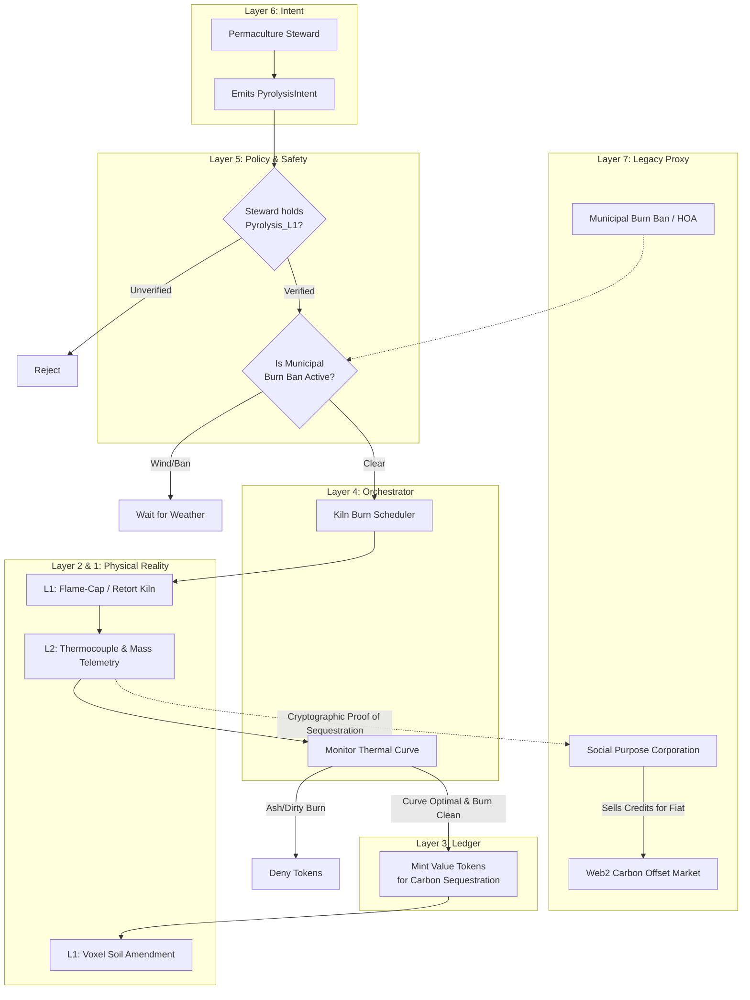

# Scenario Mu: Regenerative Extraction (Biochar & Biodigestion)

*   **Identifier:** `SCN-MU-BIOCHAR`
*   **System Epic:** Pyrolysis, Biodigestion (Human/Animal Waste), Soil Engineering, and Carbon Sequestration
*   **Primary Layers Tested:** L1 (Physical), L2 (Twin), L3 (Ledger), L4 (Orchestrator), L5 (Governance), L6 (Semantic), L7 (Proxy)
*   **Pass/Fail Metric:** Safe localized pyrolysis of biomass into biochar and thermophilic composting/biodigestion of biological waste (humanure/pets); zero pathogen bleed; dynamic enhancement of voxel soil moisture capacity.

---

## 1. Problem Statement & Legacy Failure

The legacy waste system commits two thermodynamic crimes. First, organic biomass (yard clippings, agricultural waste) is landfilled to rot into methane or burned in open fires, releasing stored carbon as $CO_2$. Second, human and animal biological waste—rich in vital nitrogen and phosphorus—is literally flushed away using purified drinking water, transported miles to centralized chemical treatment plants, while local agriculture is forced to rely on imported petrochemical fertilizers.
Biochar (pyrolysis) and Biodigestion/Thermophilic Composting solve both. Biochar locks carbon into a highly porous, stable lattice that lasts for thousands of years. When combined with safely composted biological waste (humanure/pet waste), it creates "Terra Preta"—permanently reversing entropy at the microscopic level, acting as a mechanical sponge for water, and closing the nitrogen loop without legacy sewers. 

## 2. The Collective Workflow (7-Layer Traversal)

Scenario Mu coordinates the high-heat physics required to produce biochar and tracks its integration into the local soil matrix, minting Value Tokens for verifiable carbon sequestration.

### Layer 7: The Legacy Proxy (Carbon Markets & Waste Exemption)
*   **Carbon Export (Fiat Ingestion):** Because biochar physically locks carbon out of the atmosphere for millennia, the Social Purpose Corporation (SPC) can package the Node's Layer 2 pyrolysis telemetry into cryptographic proofs. These proofs are sold on legacy Web2 carbon offset registries (e.g., Puro.earth) for fiat, which pays the Node's legacy land taxes.
*   **Waste Exemption:** By processing 100% of its organic waste on-site, the SPC legally un-enrolls from municipal yard-waste collection, severing a legacy fiat tether.

### Layer 6: Semantic Intent
*   Stewards emit a `PyrolysisIntent` to initiate a burn in the localized retort kiln.
*   Sanitation Stewards emit a `DigesterMaintenanceIntent` to process localized composting toilets or pet waste bioreactors.
*   Agronomists emit a `SoilAmendmentIntent` to blend the raw biochar with the processed compost/digestate and deploy it into the permaculture beds.

### Layer 5: Policy & Web of Trust (The Safety & Pathogen Gates)
*   **The Pathogen Lockout:** Handling human and animal waste is a profound biological risk. Layer 5 mandates that any compost intended for food-bearing soil must hold cryptographic L2 telemetry proving it sustained thermophilic temperatures ($>55^\circ\text{C}$ for at least 3 days) to kill all pathogens. If the heat curve fails, the compost is mathematically locked from agricultural use.
*   **Weather & Burn Bans:** Layer 5 automatically cross-references municipal burn bans and wind speed APIs. If wind > 15mph, the `PyrolysisIntent` is cryptographically locked to prevent neighborhood fire hazards.

### Layer 4: Orchestration (Pyrolysis & Biological Phasing)
*   **The Thermal Curve:** The BPMN engine acts as the kiln operator. Pyrolysis requires specific thermal phases: driving off water, off-gassing syngas, and finalizing the carbon lattice. The orchestrator alerts the Steward if the retort temperature deviates.
*   **The Vermiculture / Microbiome Handoff:** Once the thermophilic compost (human/pet waste) physically cools below $30^\circ\text{C}$ (tracked via L2), the orchestrator triggers a `BiologicalInoculationIntent`. Stewards introduce *Eisenia fetida* (red wiggler worms) and mycelial spores. The worms digest the safe compost and raw biochar, creating nutrient-dense worm castings that coat the biochar in a thriving microbiological biofilm.

### Layer 3: Ledger (Minting Geological Negentropy)
*   Biochar production is one of the most potent negentropic actions a Node can take. The Ledger mints a massive bounty of Value Tokens to the Steward based on the dry mass of the final biochar output, as it represents a permanent upgrade to the Node's ecological infrastructure and a globally recognized carbon sink.

### Layer 2 & 1: Digital Twin & Physical Reality
*   **Telemetry (L2):** K-type thermocouples in the kiln track the pyrolysis curve. Waterproof thermistors embedded in the biological compost piles broadcast continuous heat data to prove pathogen destruction. Weight sensors calculate the biomass conversion ratio.
*   **Physical (L1):** Flame-cap kilns, anaerobic biodigesters, composting toilets, waste wood, biological waste, and the physical soil matrix of the Duvall watershed.

---



---

## 3. Oasis Engine Implementation Specification

In the C++ Oasis engine, Scenario Mu establishes the core rules for advanced soil composition models and voxel terrain generation:

*   **Voxel Soil Composition:** A standard `DIRT` voxel is not a static object. It contains a `soil_composition` struct tracking `nitrogen`, `biochar_saturation`, `worm_population`, and `mycelial_density`.
*   **The Sponging Mechanic:** When an entity applies `BIOCHAR` to a `DIRT` voxel, the engine mathematically alters the chunk's thermodynamic limits. The voxel's `max_moisture_capacity` permanently increases.
*   **Microbial Symbiosis:** The `mycelial_density` acts as a multiplier. If a `DIRT` voxel has high biochar and high worm/mycelial populations, nutrients are shared across adjacent voxels (simulating the Wood Wide Web). Fertilizing one voxel cascades a passive nutrient buff to surrounding plants.
*   **Drought Resistance Sim:** During the simulated "August Desiccation" scenario, crops planted on standard `DIRT` voxels will hit $0\%$ moisture and trigger the `WITHER` state within 5 simulated days. Crops planted on voxels with high `biochar_saturation` will survive 15+ days without watering, verifying the systemic value of the biochar loop.

---

```json
{
  "@context": [
    "[https://schema.org/](https://schema.org/)",
    "[https://collective.network/ontology/v1/](https://collective.network/ontology/v1/)"
  ],
  "@type": "PyrolysisIntent",
  "identifier": "urn:uuid:7c8d9e0f-1a2b-3c4d-5e6f-7a8b9c0d1e2f",
  "issuerDid": "did:mesh:node04:steward_liam",
  "operationProfile": {
    "kilnType": "Cone_Pit_Flame_Cap",
    "biomassInputMassKg": 150.0,
    "biomassType": "Alder_Coppice_Scrap_and_Brush",
    "targetBiocharOutputKg": 30.0
  },
  "thermalParameters": {
    "targetPyrolysisTempC": 550,
    "minimumHoldTimeMinutes": 45,
    "telemetryStreamUri": "mqtt://node04.mesh.local/permaculture/kiln_01"
  },
  "ecologicalConstraints": {
    "maxWindSpeedKmh": 12,
    "activeBurnBanPermitted": false,
    "requiredCredentials": ["Pyrolysis_Safety_L1"]
  },
  "carbonAccounting": {
    "estimatedCo2EquivalentSequestrationKg": 82.5,
    "mintingRatio": "0.5_Tokens_Per_Kg"
  }
}
```

---

## 4. Acceptance Test Gates (Pass/Fail)

| Checkpoint | Validation Method | Pass Condition |
| :--- | :--- | :--- |
| **G1: Thermal Curve Verification** | L2 Telemetry Summation | The BPMN engine rejects the Value Token minting if the thermocouple telemetry shows the retort failed to maintain the $400^\circ\text{C}$ - $600^\circ\text{C}$ pyrolysis window for the minimum required duration. |
| **G2: Fire Safety Lockout** | Weather/Policy Injection | Injecting a `HIGH_WIND` state into Layer 5 causes all pending `PyrolysisIntents` to immediately suspend. |
| **G3: Soil Composition Update** | Voxel Memory Alteration | Applying a `BIOCHAR_AMENDMENT` item to a `DIRT` voxel successfully rewrites the 32-bit voxel struct's moisture retention parameters without causing memory leaks in the chunk array. |
| **G4: Carbon Sink Minting** | Output Mass Calculation | The CRDT wallet of the operating Steward correctly increments with Value Tokens exactly proportional to the final weighed mass of the carbon output, minus L7 tax deductions. |
