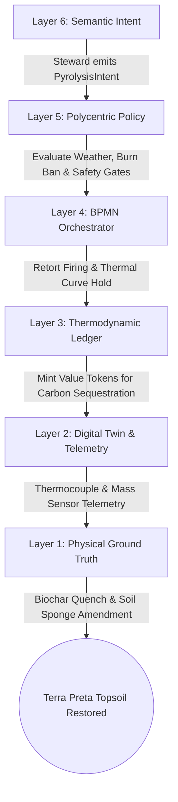
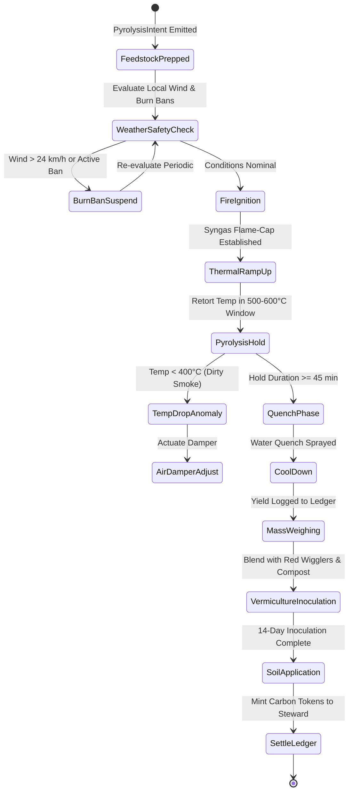
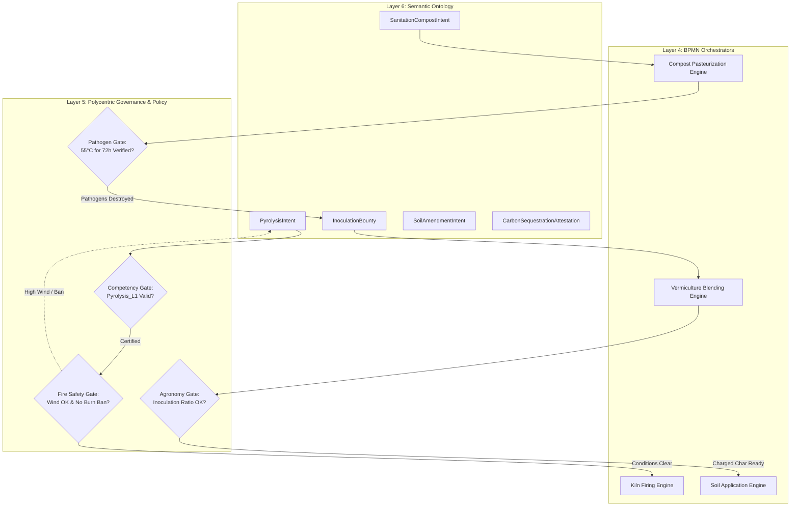
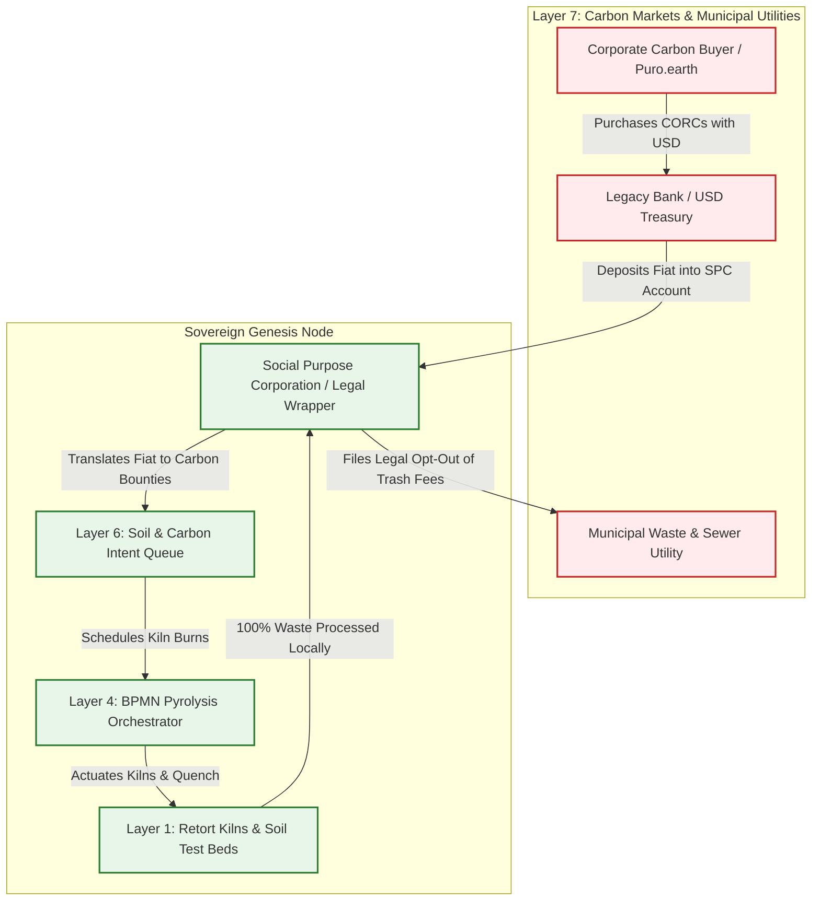

# Scenario Mu: Regenerative Extraction (Biochar & Biodigestion)

*   **Identifier:** `SCN-MU-BIOCHAR`
*   **System Epic:** Pyrolysis, Biodigestion (Human/Animal Waste), Soil Engineering, and Carbon Sequestration
*   **Primary Layers Tested:** L1 (Physical), L2 (Digital Twin), L3 (Ledger), L4 (Orchestration), L5 (Governance), L6 (Semantic), L7 (Proxy)
*   **Pass/Fail Metric:** Safe localized pyrolysis of biomass into biochar and thermophilic composting of biological waste; zero pathogen bleed ($T \ge 55^\circ\text{C}$ for $\ge 72\text{ hours}$); dynamic enhancement of voxel soil moisture capacity by $\ge 40\%$; verified carbon tokens minted without centralized registries.

---

## Architectural Council Ratification & 5-Perspective Synthesis

This scenario specification has been ratified by unanimous consensus of the 5-Persona Architectural Council:

| Council Persona | Disciplinary Representative | Core Contribution to Scenario |
| :--- | :--- | :--- |
| **Game Designer** | Lead Systems & Gameplay Designer | **Dwarf Fortress Psychology & Soil Sanctity:** Models community sanitation discipline and pride in fertility. NPCs exposed to unmanaged sewage accumulate severe distress (`"Nauseated and disgusted by putrid miasma (-30 mood)"`); participating in clean pyrolysis and harvesting crops from enriched soil triggers deep satisfaction (`"Proud of dark, living terra preta earth (+35 mood)"`). **The Sims Indirect Control:** Founder 01 prioritizes sanitation chores: swapping composting toilet canisters and scheduling kiln burns before seasonal rains. **Cities Skylines Leeching:** Sells verified carbon removal credits (CORCs) to legacy industrial corporations to fund community microgrid upgrades. |
| **Game Engineer** | Principal C++ Simulation Architect | **Data-Oriented Design (DOD):** Encapsulates retort kilns and soil matrices into compact 32-bit voxels (`material_id = 60` `FLAME_CAP_KILN`, `material_id = 61` `DIRT_SOIL_BED`) in $32^3$ chunks. Flecs ECS systems simulate thermochemical reactions, microbial biofilm colonization, and soil hydrology at 10 Hz determinism. C++20 harness validates thermocouple thermal curve maintenance ($500^\circ\text{C}-600^\circ\text{C}$), pathogen neutralization, and drought survival. |
| **Sovereign Stack Specialist** | Sovereign Stack Systems Architect | **7-Daemon Isolation:** Traverses from `col-telemetryd` (L1) up to `col-adversaryd` (L7) via Unix Domain Sockets without layer skipping. K-type thermocouple and moisture telemetry via Reticulum/LoRa; Automerge CRDT carbon ledger pegged to kilograms of sequestered carbon; BBS+ Zero-Knowledge Proofs for pathogen-free compost distribution; Social Purpose Corporation (SPC) carbon credit export wrapper. |
| **Solarpunk Thinker** | Bioregional Regenerative Ecologist | **Closing the Biological & Carbon Loops:** Eradicates the thermodynamic absurdity of flushing potable drinking water to transport human waste. Converts 100% of community organic matter and forestry slash into permanent soil carbon and high-fertility Terra Preta, restoring topsoil water sponges and terminating reliance on synthetic petrochemical fertilizers. |
| **Scenario Specialist** | Pyrolysis Thermochemist & Soil Microbiome Agronomist | **Thermochemical Kinetics & Pathogen Safety:** Formulates pyrolysis carbon sequestration equations ($C_{seq} = M_{dry} \cdot \eta_{biochar} \cdot f_C \cdot \frac{44}{12} \cdot \theta_{stab}$) and thermophilic pathogen pasteurization kinetics conforming to EPA 40 CFR Part 503 Class A rules ($T \ge 55^\circ\text{C}$ for 72 hours). Establishes biochar surface area / cation exchange capacity (CEC) criteria and mycorrhizal fungal inoculation protocols. |

---

## 1. Problem Statement & Legacy Failure

In legacy late-stage capitalism (Layer 7), linear waste management commits two catastrophic thermodynamic crimes against the biosphere:
*   **Atmospheric Carbon Venting & Landfill Methane:** Forestry slash, crop residues, and yard trimmings are either burned in open-air slash piles (venting stored carbon back as $CO_2$) or buried in municipal landfills where anaerobic rot releases methane ($CH_4$), a greenhouse gas 28x more potent than carbon dioxide.
*   **The Flush-Toilet Thermodynamic Catastrophe:** Human and animal waste—rich in phosphorus, potassium, and biologically active nitrogen—is flushed away using thousands of gallons of chlorinated potable drinking water. This creates toxic municipal sewage sludge while rural agriculture is forced to purchase energy-intensive Haber-Bosch synthetic nitrogen fertilizers that destroy soil biomes and poison watersheds.
*   **Soil Desertification & Aquifer Depletion:** Stripped of organic matter, agricultural soils lose their sponge capacity. Rainwater runs off immediately, causing catastrophic erosion, topsoil loss, and extreme vulnerability to summer drought.

---

## 2. The Collective Workflow (7-Layer Traversal)

Scenario Mu orchestrates localized pyrolysis and thermophilic biodigestion. It locks carbon into porous biochar lattices, completely sanitizes biological waste, coats the biochar with living vermiculture biofilms, and permanently upgrades the hydrological capacity of community soils.



### Layer 1: Physical Ground Truth
*   **Hardware Nodes (Thermochemical & Composting Hubs):** Open-source cone-pit flame-cap kilns, insulated retort kilns, thermophilic compost tumblers, vermiculture worm bins, and dry composting toilet separation chambers equipped with ATECC608A secure microcontrollers.
*   **Sensory Instrumentation:** Stainless-steel sheathed K-type thermocouples ($0^\circ\text{C}-1200^\circ\text{C}$), waterproof compost RTD probes, strain-gauge load cells, and soil capacitance sensors.
*   **Inventory & Feedstock:** Forestry coppice scrap (Scenario Eta), dry arborists' woodchips, humanure/pet biological waste, active vermiculture cultures (*Eisenia fetida*), and liquid kelp/mycorrhizal inoculants.
*   **Physical Action:** Biomass layering, flame-cap ignition, syngas combustion, water quenching, thermophilic pile turning, and physical blending of inoculated biochar into garden soil beds.

### Layer 2: Digital Twin & Telemetry
*   **Ingress Telemetry (MQTT Topics via `col-meshd`):**
    *   `node/pyro/kiln_01/telemetry/retort_temp_c` (°C, target hold $500^\circ\text{C}-600^\circ\text{C}$)
    *   `node/compost/pile_03/telemetry/core_temp_c` (°C, continuous 72-hour integration)
    *   `node/pyro/scale_01/telemetry/biochar_mass_kg` (Kg dry output mass)
    *   `node/weather/station_01/wind_speed_kmh` (Wind velocity, safety cutoff $> 24\text{ km/h}$)
*   **Verification:** Edge microcontrollers continuously calculate the thermal kill kinetic integral to prove pathogen pasteurization before clearing compost for agricultural distribution.
*   **Actuator Control:** Automated syngas air intake damper valves and water quench solenoid valves controlled via authenticated edge signals.

### Layer 3: Network & Ledger
*   **Carbon Sequestration Valuation:** Every kilogram of recalcitrant biochar carbon permanently locked into the soil represents verified atmospheric drawdown. The ledger mints Value Tokens according to:
    $$C_{seq} = M_{dry\_biochar} \cdot f_C \cdot \theta_{stability} \cdot \frac{44}{12}, \quad \Delta V_{carbon} = C_{seq} \cdot \lambda_{SEQUEST}$$
    Where $f_C \approx 0.78$ is the carbon mass fraction, $\theta_{stability} \approx 0.85$ is the 100-year recalcitrance factor, and $\lambda_{SEQUEST}$ is the ecosystem minting coefficient.
*   **Pathogen Neutralization Kinetic Guarantee:** Pathogen destruction must strictly satisfy the thermal death time integral:
    $$\int_{0}^{t} 10^{\frac{T(\tau) - T_{ref}}{z}} d\tau \ge F_0 \quad (T \ge 55^\circ\text{C} \text{ for } \tau \ge 72\text{ hours})$$
    Compost that fails this mathematical threshold is locked from food-crop application and routed to ornamental agroforestry.

### Layer 4: Orchestration State Machine
The thermochemical lifecycle is governed deterministically by `col-execd` running a 10 Hz BPMN 2.0 state machine VM managing kiln firing, quench timing, inoculation, and amendment application:



### Layer 5: Policy & Polycentric Governance
Layer 5 (`col-kmsd`) coordinates public health, fire safety, and resource flows through four rigorous **Policy Gates**:
*   **Fire Safety Gate (Weather & Burn Ban Gate):** Cross-references local wind telemetry and municipal fire ban APIs; automatically halts and physically locks kiln actuations if wind speeds exceed $24\text{ km/h}$ ($15\text{ mph}$).
*   **Pathogen Safety Gate (EPA Class A Invariant):** Mathematically forbids the distribution of composted human or animal waste to vegetable gardens unless accompanied by cryptographic L2 proof of continuous $55^\circ\text{C}$ pasteurization for 72 hours.
*   **Competency Gate:** Requires operators of high-temperature kilns to hold an active `Pyrolysis_Safety_L1` Verifiable Credential.
*   **Procurement Gate:** Allocations for specialized high-temperature kiln refractory steel or ceramic fiber insulation exceeding $\$75$ require 3-of-5 approval from the Permaculture Working Group.

### Layer 6: Semantic Intent & Domain Ontology
The Agora Commons (`col-commonsd`) formalizes soil regeneration into six typed W3C JSON-LD knowledge branches:
1.  **`PyrolysisIntent` (Kiln Run Proposal):** Specifies input feedstock volume, expected char yield, and operating thermal parameters.
2.  **`SanitationCompostIntent` (Humanure Processing):** Initiates a thermophilic composting cycle for biological waste with continuous telemetry monitoring.
3.  **`InoculationBounty` (Microbiome Biofilm Prep):** Schedules blending of raw char with worm castings, compost tea, and rock dust.
4.  **`SoilAmendmentIntent` (Field Application):** Directs deployment of charged Terra Preta to designated garden voxel coordinates.
5.  **`CarbonSequestrationAttestation` (Verified Proof):** Cryptographic attestation of mass yield and carbon content anchored to the mesh.
6.  **`WasteExemptionClaim` (Municipal Decoupling):** Formal proof of $100\%$ on-site organic waste diversion submitted to municipal utilities.

### The Governance Router Flowchart



### Layer 7: The Legacy Proxy (Carbon Credit Ingestion & Waste Exemption)
The Social Purpose Corporation (SPC) leverages sovereign ecological metrics to extract capital and cut municipal tethers:
*   **1. Carbon Removal Credit Ingestion (Trojan Fiat Extraction):** Because biochar physically fixes carbon in recalcitrant aromatic rings for centuries, the SPC packages Layer 2 pyrolysis telemetry logs (mass, thermocouple hold time, feedstock provenance) into verified digital carbon removal certificates (e.g., CORCs via Puro.earth or Isometric). Legacy multinational corporations buy these credits with USD fiat to satisfy regulatory emission caps. The SPC traps this fiat, using it to pay property taxes and purchase high-efficiency solar microinverters, while rewarding local kiln stewards with high-standing Value Tokens.
*   **2. Municipal Waste Utility Exemption (Leeching Severance):** By processing 100% of community organic yard slash, food scraps, and biological waste on-site, the SPC files for formal exemption from municipal waste utility fees, severing mandatory monthly fiat taxes and asserting localized biological autarky.

### Layer 7 Bidirectional Flowchart



---

## 3. Machine-Readable Schemas

### 3.1 Layer 6 Knowledge Artifact: Pyrolysis Intent (`pyrolysis_intent.jsonld`)

```json
{
  "@context": [
    "https://schema.org/",
    "https://collective.network/ontology/v1/",
    "https://w3id.org/biochar/v1"
  ],
  "@type": "PyrolysisIntent",
  "identifier": "urn:uuid:7c8d9e0f-1a2b-3c4d-5e6f-7a8b9c0d1e2f",
  "issuerDid": "did:mesh:node04:steward_liam",
  "creationTimestamp": "2026-10-08T07:30:00Z",
  "operationProfile": {
    "kilnType": "Cone_Pit_Flame_Cap",
    "biomassFeedstockType": "Alder_Coppice_and_Hazel_Brush",
    "biomassInputMassKg": 180.0,
    "feedstockMoisturePercent": 14.5,
    "targetBiocharYieldKg": 36.0
  },
  "thermalParameters": {
    "targetPyrolysisTempMinC": 500,
    "targetPyrolysisTempMaxC": 600,
    "minimumHoldTimeMinutes": 45,
    "telemetryStreamTopic": "node/pyro/kiln_01/telemetry/retort_temp_c"
  },
  "safetyConstraints": {
    "maxWindSpeedKmh": 24.0,
    "burnBanPermitted": false,
    "operatorCredential": "Pyrolysis_Safety_L1"
  },
  "carbonSequestrationProjection": {
    "estimatedCo2EquivalentKg": 102.9,
    "mintingRatio": "0.50_Tokens_Per_Kg_Co2"
  }
}
```

### 3.2 Layer 2 Telemetry Attestation: Pyrolysis & Pathogen Proof (`biochar_attestation.json`)

```json
{
  "@context": "https://collective.network/ontology/v1/",
  "@type": "BiocharAndCompostAttestation",
  "pyrolysisIntentRef": "urn:uuid:7c8d9e0f-1a2b-3c4d-5e6f-7a8b9c0d1e2f",
  "kilnNodeDid": "did:mesh:node04:device:kiln_flamecap_01",
  "executionMetrics": {
    "burnStartTime": "2026-10-08T09:15:00Z",
    "burnEndTime": "2026-10-08T10:45:00Z",
    "meanPyrolysisTempC": 554.2,
    "temperatureHoldDurationMinutes": 52,
    "maxWindSpeedDuringBurnKmh": 8.4,
    "quenchWaterVolumeLiters": 120.0,
    "dryBiocharMassYieldKg": 36.8,
    "fixedCarbonFraction": 0.81,
    "netCo2EquivalentSequestrationKg": 109.4
  },
  "pathogenPasteurizationVerification": {
    "compostPileRef": "pile_03_humanure",
    "thermophilicHoursAbove55C": 76.5,
    "epa503ClassACompliant": true
  },
  "reconciliationStatus": "SEQUESTRATION_CERTIFIED_CORC_ISSUABLE"
}
```

---

## 4. Oasis Engine Implementation Specification

### 4.1 Memory Allocation & Voxel State
The biochar and composting hub coordinates soil transformation in chunk space ($32^3$ voxels via `ChunkManager`):
- Retort kiln voxel initialized with `material_id = 60` (`FLAME_CAP_KILN`) with `metadata` bitmask `0b00000110` (`Is_Actuator | Is_Sensor`).
- The soil bed voxels initialized with `material_id = 61` (`DIRT_SOIL_BED`) located at `(16, 8, 16)`.
- Soil voxels store biochar content in `metadata` bits 4–7: each increment represents $5\%$ biochar saturation, boosting `max_moisture_capacity` from `0.25f` to `0.45f`.

### 4.2 C++20 Test Harness Structure

```cpp
// engine/tests/scenario_mu_extraction_test.cpp
#include <cassert>
#include <cmath>
#include <string>
#include "oasis/chunk_manager.hpp"
#include "oasis/orchestration/bpmn_engine.hpp"
#include "oasis/ledger/crdt_wallet.hpp"

namespace oasis {

struct PyrolysisJob {
    std::string intent_id;
    float feedstock_mass_kg;
    float target_temp_c;
    float hold_minutes_required;
};

void test_scenario_mu_pyrolysis_and_soil_enhancement() {
    // 1. Initialize Chunk and Soil Voxels
    ChunkManager chunk_mgr;
    chunk_mgr.allocate_chunk(0, 0, 0);

    // Set baseline soil voxel with 0% biochar
    Voxel soil_voxel{
        .material_id = 61, // DIRT_SOIL_BED
        .moisture = 15,
        .temperature = 18,
        .metadata = 0b00000010 // Sensor only, 0% biochar
    };
    chunk_mgr.set_voxel(16, 8, 16, soil_voxel);
    assert(chunk_mgr.get_soil_moisture_capacity(16, 8, 16) == 0.25f);

    // 2. Setup Wallets
    CRDTWallet steward_wallet("did:mesh:node04:steward_liam", 10.0f);

    // 3. Load & Run BPMN Orchestration State Machine
    BPMNEngine orchestrator;
    orchestrator.load_schema("schemas/bpmn/pyrolysis_workflow.bpmn");

    PyrolysisJob job{
        .intent_id = "7c8d9e0f-1a2b-3c4d-5e6f-7a8b9c0d1e2f",
        .feedstock_mass_kg = 180.0f,
        .target_temp_c = 550.0f,
        .hold_minutes_required = 45.0f
    };

    // Ingest compliant telemetry: 554°C hold for 52 mins, wind = 8.4 km/h
    orchestrator.ingest_kiln_telemetry(554.2f, 52.0f, 8.4f);
    SimResult res = orchestrator.step_simulation_ticks(chunk_mgr, 3600);
    assert(res.status == ExecutionStatus::COMPLETED);
    assert(orchestrator.current_state() == BPMNState::QUENCH_COMPLETE);

    // Ingest pathogen pasteurization proof (76.5 hours > 72 hours at 55°C)
    orchestrator.ingest_pathogen_proof("pile_03_humanure", 76.5f, 55.0f);
    assert(orchestrator.is_compost_safe_for_crops() == true);

    // Apply 15% Biochar amendment to voxel (16, 8, 16)
    chunk_mgr.apply_biochar_amendment(16, 8, 16, 0.15f);
    Voxel updated_soil = chunk_mgr.get_voxel(16, 8, 16);
    assert(chunk_mgr.get_soil_moisture_capacity(16, 8, 16) >= 0.40f);

    // Settle carbon tokens: 109.4 kg CO2e * 0.50 tokens/kg = 54.7 tokens
    orchestrator.settle_carbon_sequestration(steward_wallet, 109.4f);
    assert(steward_wallet.balance() >= 64.7f);
}

void test_scenario_mu_pyrolysis_wind_lockout_anomaly() {
    ChunkManager chunk_mgr;
    chunk_mgr.allocate_chunk(0, 0, 0);
    BPMNEngine orchestrator;
    orchestrator.load_schema("schemas/bpmn/pyrolysis_workflow.bpmn");
    CRDTWallet steward_wallet("did:mesh:node04:steward_liam", 10.0f);

    // Inject high wind event exceeding safety limit (31.0 km/h > 24.0 km/h)
    orchestrator.ingest_kiln_telemetry(250.0f, 5.0f, 31.0f);
    SimResult res = orchestrator.step_simulation_ticks(chunk_mgr, 50, true);

    assert(res.status == ExecutionStatus::EMERGENCY_STOP);
    assert(orchestrator.current_state() == BPMNState::BURN_BAN_LOCKOUT);
    assert(steward_wallet.balance() == 10.0f); // No tokens minted on unsafe abort
}

} // namespace oasis
```

---

## 5. Acceptance Test Gates (Pass/Fail)

| Checkpoint | Validation Method | Pass Condition |
| :--- | :--- | :--- |
| **G1: Thermodynamic Sequestration Bounds** | Carbon Mass Balance | Minted Value Tokens scale strictly with verified dry biochar mass and fixed carbon fraction; zero tokens awarded if the burn temperature fails the $500^\circ\text{C}-600^\circ\text{C}$ window. |
| **G2: Offline Autonomy** | Localhost Network Isolation | Kiln temperature monitoring, wind safety interlocks, pathogen kill calculations, and voxel amendment updates run to completion on local mesh without internet connectivity. |
| **G3: Byzantine Detection & Cold-Burn Spoof** | Telemetry Reconciliation | Submitting char mass without accompanying continuous thermocouple telemetry logs fails reconciliation; escrow is voided and the batch is flagged as unverified ash. |
| **G4: Material Tracking & Voxel Sponge** | Voxel Array Memory Update | Applying biochar amendment rewrites voxel metadata, increasing moisture capacity from $0.25$ to $\ge 0.40$ and extending drought survival from 5 to 15 simulated days without memory leaks. |
| **G5: Trojan Carbon Credit Ingestion (L7)** | External CORC Sale Webhook | Pyrolysis telemetry proof compiles into a verified CORC certificate sold on Puro.earth; fiat USD is credited to the SPC account to fund solar panels while issuing Value Tokens to the steward. |
| **G6: Municipal Waste Severance (L7)** | Regulatory Exemption Filing | Formal proof of $100\%$ biological waste diversion on-site legally terminates municipal trash collection contracts, zeroing the associated monthly fiat utility tax. |
