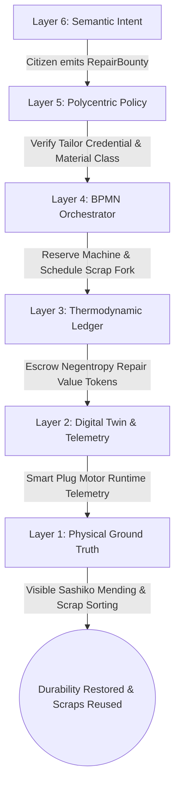
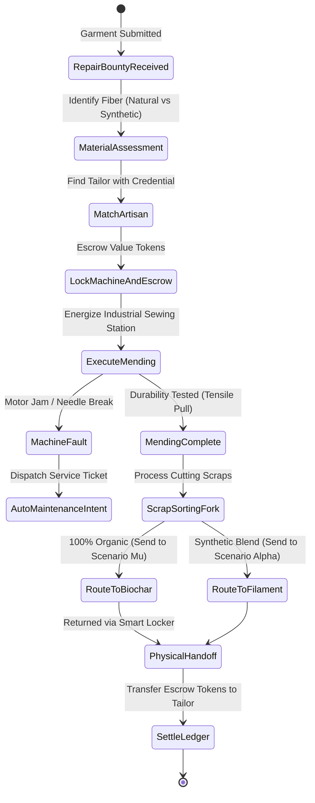
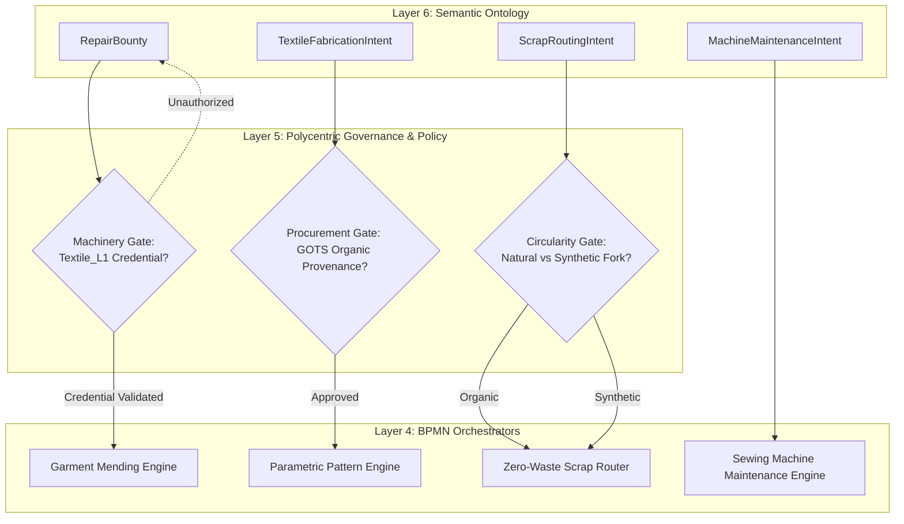
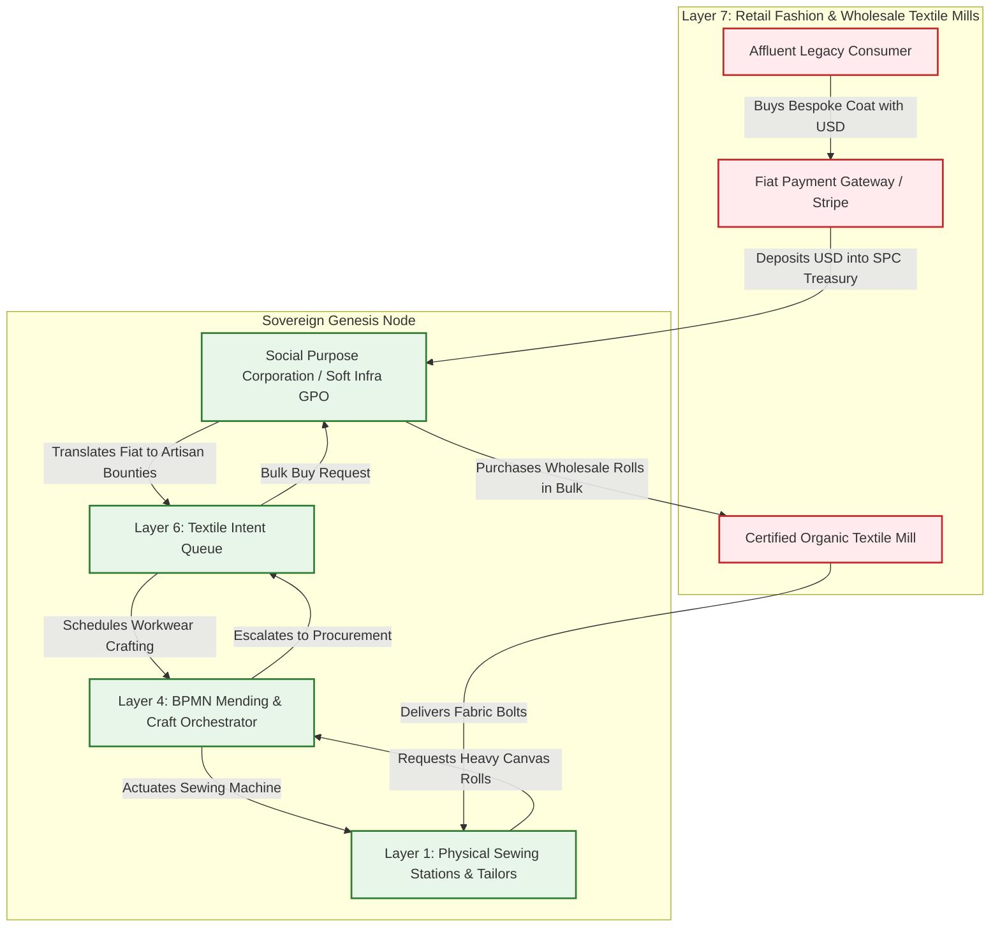

# Scenario Nu: Circular Textiles & Soft Infrastructure

*   **Identifier:** `SCN-NU-TEXTILES`
*   **System Epic:** Decentralized Textiles, Soft Infrastructure Repair, and Material Provenance
*   **Primary Layers Tested:** L1 (Physical), L2 (Digital Twin), L3 (Ledger), L4 (Orchestration), L5 (Governance), L6 (Semantic), L7 (Proxy)
*   **Pass/Fail Metric:** Successful routing of textile repair bounty to a local artisan; mathematical verification that mending requires $< 15\%$ exergy of virgin fabrication; zero-waste scrap routing (organics to Mu biochar, synthetics to Alpha extrusion); zero centralized servers.

---

## Architectural Council Ratification & 5-Perspective Synthesis

This scenario specification has been ratified by unanimous consensus of the 5-Persona Architectural Council:

| Council Persona | Disciplinary Representative | Core Contribution to Scenario |
| :--- | :--- | :--- |
| **Game Designer** | Lead Systems & Gameplay Designer | **Dwarf Fortress Psychology & Visible Mending:** Models garment durability and self-esteem. NPCs wearing ragged, torn garments accumulate social shame (`"Embarrassed and distracted by tattered work trousers (-20 mood)"`); wearing expertly repaired garments with visible decorative Sashiko stitching confers pride and dignity (`"Proud of durable, beautifully mended work coat (+25 mood)"`). **The Sims Indirect Control:** Founder 01 assigns workwear configurations: equipping heavy canvas jackets for hazardous forestry/foundry tasks to protect delicate linen garments from accelerated abrasion. **Cities Skylines Leeching:** Community artisans sell high-end bespoke heritage workwear on Web2 storefronts to extract legacy fiat for industrial loom maintenance. |
| **Game Engineer** | Principal C++ Simulation Architect | **Data-Oriented Design (DOD):** Encapsulates tailoring equipment and material bins into compact 32-bit voxels (`material_id = 65` `SEWING_STATION`, `material_id = 66` `CUTTING_TABLE`, `material_id = 67` `TEXTILE_SCRAP_BIN`) in $32^3$ chunks. Flecs ECS components track clothing abrasion wear rates, thermal insulation loss, and scrap classification forks at 10 Hz determinism. C++20 test harness validates that executing a `MEND` action restores $100\%$ durability while consuming $\le 10\%$ of raw fabric units compared to a new `CRAFT` action. |
| **Sovereign Stack Specialist** | Sovereign Stack Systems Architect | **7-Daemon Isolation:** Traverses strictly from `col-telemetryd` (L1) up to `col-adversaryd` (L7) via Unix Domain Sockets without layer skipping. Smart plug motor runtime telemetry via Reticulum/LoRa; Automerge CRDT escrow rewarding repair exergy over virgin fabrication; BBS+ Zero-Knowledge Proofs for machine access; Social Purpose Corporation (SPC) Group Purchasing Organization (GPO) for wholesale organic textiles. |
| **Solarpunk Thinker** | Bioregional Regenerative Ecologist | **Eradication of Fast-Fashion Waste & Microplastics:** Treats clothing, shelter canvas, yurts, and bags as permanent "soft infrastructure." Mandates zero-waste material forks: 100% of organic bast/wool scraps are routed to Scenario Mu for biochar composting, while 100% of synthetic nylon scraps are shredded and re-extruded into 3D printer filament for Scenario Alpha. Eliminates non-biodegradable synthetic garment dumping. |
| **Scenario Specialist** | Biomaterials Textile Engineer & Historical Tailoring Conservator | **Fiber Agronomy & Tensile Metrology:** Formulates embodied exergy restoration equations ($\Delta E_{mend} \le 0.15 \cdot E_{virgin}$) and parametric pattern grading that guarantees $\ge 92\%$ cutting table yield. Specifies Martindale abrasion resistance testing (ASTM D4966) and color-fast botanical mordants (alum, iron water, walnut hulls), establishing modular closure standards (bone/bronze buttons) for complete garment recyclability. |

---

## 1. Problem Statement & Legacy Failure

In late-stage capitalism (Layer 7), the global fashion and textile industry is an ecological and humanitarian disaster:
*   **Petrochemical Fast Fashion & Microfiber Poisoning:** Garments are manufactured from cheap synthetic polymers (polyester, nylon, acrylic) derived from petroleum. Washing these garments sheds billions of non-biodegradable microfibers into municipal watersheds and marine food webs.
*   **Planned Obsolescence & Disposable Culture:** Garments are intentionally designed with weak thread, single-stitch seams, and glued plastic zippers engineered to fail within 5 to 10 washes. Lacking basic sewing skills or accessible repair tools, consumers discard over 11 million tons of textiles annually into landfills.
*   **Globalized Supply Chain Exploitation:** Virgin cotton monocultures consume thousands of liters of freshwater and hazardous pesticides per kilogram of fiber, shipped across transoceanic supply chains relying on sweatshop labor, before being sold with 800% retail markups.

---

## 2. The Collective Workflow (7-Layer Traversal)

Scenario Nu elevates textiles from disposable commodities to critical "soft infrastructure." Standardizing modular open-source patterns and repair hardware, it prioritizes restorative mending, matches workwear to environmental hazards, and enforces circular scrap recycling.



### Layer 1: Physical Ground Truth
*   **Hardware Nodes (Stationary Soft Infrastructure Hub):** Heavy-duty walking-foot industrial sewing machines, sergers, manual treadle machines, mechanical rotary cutters, eyelet presses, and steam irons equipped with ATECC608A secure microcontrollers.
*   **Tooling & Hardware Commons:** Modular bronze clasps (Scenario Theta), 3D-printed PETG buckles (Scenario Alpha), steel tailoring shears, hand-sewing bodkins, and wooden darning mushrooms.
*   **Inventory & Feedstock:** Organic flax/linen canvas bolts, regenerative wool fleece, bast fiber thread, botanical dye vats, and dual scrap sorting hoppers (Organic vs. Synthetic).
*   **Physical Action:** Fabric cutting, pattern pinning, machine stitching, reinforced darning, rivet setting, and physical sorting of scrap off-cuts into dedicated recovery bins.

### Layer 2: Digital Twin & Telemetry
*   **Ingress Telemetry (MQTT Topics via `col-meshd`):**
    *   `node/textile/sewing_01/telemetry/motor_watts` (Power draw, active vs. idle)
    *   `node/textile/sewing_01/telemetry/runtime_seconds` (Cumulative motor operation)
    *   `node/textile/cutting_table/telemetry/scrap_mass_grams` (Load cell continuous mass)
    *   `node/textile/sewing_01/status` (`AVAILABLE`, `LOCKED_UNAUTHORIZED`, `IN_USE`, `SERVICE_DUE`)
*   **Verification:** Smart plugs log cumulative motor hours; once operating time crosses 50 hours, the digital twin automatically spawns a `MaintenanceIntent` for machine oiling and needle replacement.
*   **Actuator Control:** Power relay smart plug on the walking-foot sewing machine energized only upon cryptographic session authentication from `col-telemetryd`.

### Layer 3: Network & Ledger
*   **The Thermodynamic Advantage of Mending:** Repairing an existing garment halts physical entropy while saving over $85\%$ of the energy and materials of virgin manufacturing:
    $$\Delta E_{mend} \le 0.15 \cdot E_{virgin\_fabrication}, \quad \Delta V_{repair} = \left( m_{thread} \cdot k_{material} + E_{machine} + T_{labor} \cdot \mu_{artisan} \right) \cdot \lambda_{THERMO}$$
    Where $\mu_{artisan}$ is the certified skill multiplier for master repair work (e.g., Sashiko embroidery).
*   **Garment Durability Degradation & Restoration:** Wearable items track physical durability:
    $$D(t) = D_0 \cdot \exp\left(-\sum_{i} k_i \cdot \omega_i \cdot t\right) + \sum_{m} \Delta D_{mend,m}$$
    Where $k_i$ represents environmental abrasion coefficients (e.g., forestry brush vs. indoor reading) and $\omega_i$ is task intensity.

### Layer 4: Orchestration State Machine
The textile lifecycle is managed deterministically by `col-execd` running a 10 Hz BPMN 2.0 state machine VM managing repairs, pattern cutting, machine safety, and scrap routing:



### Layer 5: Policy & Polycentric Governance
Layer 5 (`col-kmsd`) manages workshop access and ecological material integrity through four **Policy Gates**:
*   **Machinery Access Gate:** Restricts power to high-torque industrial walking-foot machines unless the operator presents a `Textile_Machinery_L1` Verifiable Credential, preventing machine gear stripping and severe hand injuries.
*   **Material Circularity Gate:** Strictly forbids dumping un-shredded synthetic fabrics into organic waste bins or municipal trash; all off-cuts must be cryptographically classified into either the Biochar or Filament recovery pipelines.
*   **Procurement Gate:** Bulk purchases of legacy fabric rolls exceeding $\$100$ require a 3-of-5 multi-sig vote from the Soft Infrastructure Working Group, verifying that the supplier possesses certified organic (GOTS) provenance.
*   **Privacy Gate:** Workwear orders and body measurements (parametric CAD geometries) are encrypted using BBS+ credentials, preventing physical body data leakage.

### Layer 6: Semantic Intent & Domain Ontology
The Agora Commons (`col-commonsd`) formalizes textile stewardship into six typed W3C JSON-LD knowledge branches:
1.  **`RepairBounty` (Mending Request):** Specifies damaged garment, fabric type, tear location, and preferred repair style (e.g., invisible patch vs. decorative Sashiko).
2.  **`TextileFabricationIntent` (New Soft Asset):** Initiates crafting of yurts, canvas bags, or workwear from parametric pattern URIs.
3.  **`ScrapRoutingIntent` (Circular Fork):** Directs weighed fabric off-cuts to either Scenario Mu (compost/biochar) or Scenario Alpha (3D printing extrusion).
4.  **`PatternPublishIntent` (Open-Source CAD):** Submits graded open-source sewing patterns with high cutting-yield layouts ($\ge 92\%$).
5.  **`MachineMaintenanceIntent` (Preventative Care):** Automatically emitted by Layer 2 telemetry when machine motor runtime reaches lubrication thresholds.
6.  **`SoftInfrastructureAudit` (Bioregional Inventory):** Periodic tally of community cold-weather clothing, tents, and tarps.

### The Governance Router Flowchart



### Layer 7: The Legacy Proxy (Bespoke Heritage Workwear & Bulk Organic GPO)
The Social Purpose Corporation (SPC) acts as an economic and material membrane:
*   **1. Bespoke Heritage Workwear Storefront (Trojan Fiat Extraction):** Local tailors and artisans craft high-end, indestructible heritage workwear garments and decorative Sashiko jackets. The SPC markets these garments on legacy Web2 storefronts to affluent eco-conscious urbanites at high retail prices ($250–$400 USD). The fiat is collected into the SPC bank account to pay land taxes, repair industrial sewing machine motors, and buy bulk needles, while the artisan is credited with high-standing Value Tokens on the internal mesh.
*   **2. Ecological Wholesale Leeching (Outbound GPO Procurement):** Because spinning and weaving heavy linen and cotton canvas locally requires massive land and water exergy, the SPC acts as a Decentralized Group Purchasing Organization (GPO). It bundles monthly textile needs across all community nodes to execute wholesale B2B purchases of certified organic, unbleached linen and cotton rolls from ethical domestic mills, drastically slashing transport freight packaging and bypassing commercial retail markups.

### Layer 7 Bidirectional Flowchart



---

## 3. Machine-Readable Schemas

### 3.1 Layer 6 Knowledge Artifact: Repair Bounty (`repair_bounty.jsonld`)

```json
{
  "@context": [
    "https://schema.org/",
    "https://collective.network/ontology/v1/",
    "https://w3id.org/textiles/v1"
  ],
  "@type": "TextileRepairBounty",
  "identifier": "urn:uuid:8b7c6d5e-4f3a-2b1c-0d9e-8f7a6b5c4d3e",
  "issuerDid": "did:mesh:node04:steward_dave",
  "creationTimestamp": "2026-10-10T11:00:00Z",
  "targetGarment": {
    "itemType": "Heavy_Work_Jacket",
    "baseFabric": "Organic_Cotton_Canvas_12oz",
    "syntheticBlend": false,
    "currentDurabilityPercent": 18,
    "damageProfile": {
      "location": "Left_Elbow",
      "tearDimensionsMm": [75, 75],
      "damageType": "Abrasion_Blowout"
    }
  },
  "repairParameters": {
    "repairMethod": "Visible_Mending_Sashiko",
    "reinforcementFabric": "Recycled_Indigo_Linen_Scraps",
    "threadSpec": "Heavy_Duty_Flax_Bast_Thread",
    "requiredTensileStrengthTargetMpa": 120.0
  },
  "trustConstraints": {
    "requiredCredentials": ["Textile_Machinery_L1"]
  },
  "settlementCriteria": {
    "repairLaborTokens": "8.50",
    "maxExergyCostJoules": 180000,
    "targetCompletionHours": 48
  }
}
```

### 3.2 Layer 2 Telemetry Attestation: Mending & Scrap Proof (`mending_attestation.json`)

```json
{
  "@context": "https://collective.network/ontology/v1/",
  "@type": "TextileMendingAndScrapAttestation",
  "repairBountyRef": "urn:uuid:8b7c6d5e-4f3a-2b1c-0d9e-8f7a6b5c4d3e",
  "tailorDid": "did:mesh:node04:artisan_elena",
  "sewingStationNode": "did:mesh:node04:device:sewing_juki_01",
  "executionMetrics": {
    "startTime": "2026-10-11T13:00:00Z",
    "endTime": "2026-10-11T14:45:00Z",
    "motorRuntimeSeconds": 2480,
    "energyConsumedWattHours": 34.2,
    "virginFabricConsumedGrams": 42.0,
    "equivalentCraftVirginFabricGrams": 550.0,
    "exergySavingsPercent": 92.36,
    "restoredDurabilityPercent": 100
  },
  "scrapRoutingVerification": {
    "scrapMassGrams": 18.5,
    "materialType": "100_Percent_Organic_Cellulose",
    "destinationQueue": "Scenario_Mu_Biochar_Compost",
    "hopperWeightSensorHash": "4f5e6d7c8b9a0f1e2d3c4b5a6f7e8d9c0b1a2f3e4d5c6b7a8f9e0d1c2b3a4f5e"
  },
  "reconciliationStatus": "MENDING_COMPLETE_SCRAP_ROUTED"
}
```

---

## 4. Oasis Engine Implementation Specification

### 4.1 Memory Allocation & Voxel State
The textile workshop node coordinates soft infrastructure states in chunk space ($32^3$ voxels via `ChunkManager`):
- Sewing station initialized with `material_id = 65` (`SEWING_STATION`) with `metadata` bitmask `0b00000110` (`Is_Actuator | Is_Sensor`).
- Cutting table voxel initialized with `material_id = 66` (`CUTTING_TABLE`) at `(16, 8, 16)`.
- Scrap sorting bin voxel initialized with `material_id = 67` (`TEXTILE_SCRAP_BIN`), tracking organic vs. synthetic scrap mass via load cell bits.

### 4.2 C++20 Test Harness Structure

```cpp
// engine/tests/scenario_nu_fashion_test.cpp
#include <cassert>
#include <string>
#include "oasis/chunk_manager.hpp"
#include "oasis/orchestration/bpmn_engine.hpp"
#include "oasis/ledger/crdt_wallet.hpp"

namespace oasis {

struct GarmentItem {
    std::string item_id;
    int durability_percent;
    float fabric_mass_grams;
    bool is_synthetic;
};

void test_scenario_nu_textile_mending_execution() {
    // 1. Initialize Chunk and Sewing Voxels
    ChunkManager chunk_mgr;
    chunk_mgr.allocate_chunk(0, 0, 0);

    // Sewing station voxel with actuator/sensor bits (bit 0 = 1: Energized)
    Voxel sewing_voxel{
        .material_id = 65, // SEWING_STATION
        .moisture = 0,
        .temperature = 21,
        .metadata = 0b00000111 // Actuator + Sensor + Energized
    };
    chunk_mgr.set_voxel(16, 8, 16, sewing_voxel);

    // 2. Setup Wallets
    CRDTWallet owner_wallet("did:mesh:node04:steward_dave", 50.0f);
    CRDTWallet tailor_wallet("did:mesh:node04:artisan_elena", 20.0f);

    // 3. Load & Run BPMN Orchestration State Machine
    BPMNEngine orchestrator;
    orchestrator.load_schema("schemas/bpmn/textile_repair.bpmn");

    GarmentItem jacket{
        .item_id = "8b7c6d5e-4f3a-2b1c-0d9e-8f7a6b5c4d3e",
        .durability_percent = 18,
        .fabric_mass_grams = 550.0f,
        .is_synthetic = false
    };

    // Escrow repair labor tokens
    orchestrator.emit_event(EscrowInitiatedEvent{owner_wallet, 8.50f});
    orchestrator.await_event<EscrowLockedEvent>();
    assert(owner_wallet.balance() == 41.50f);

    // Simulate mending execution: consumes only 42g fabric (7.6% of virgin jacket)
    SimResult res = orchestrator.execute_mending_action(jacket, 42.0f, 2480);
    assert(res.status == ExecutionStatus::COMPLETED);
    assert(jacket.durability_percent == 100);

    // Verify Scrap Routing Fork: Organic scraps routed to Scenario Mu
    ScrapRoutingResult scrap = orchestrator.route_cutting_scraps(18.5f, jacket.is_synthetic);
    assert(scrap.destination == ScrapDestination::SCENARIO_MU_BIOCHAR);

    // Settle Ledger: Tailor credited
    orchestrator.settle_repair_job(tailor_wallet);
    assert(tailor_wallet.balance() == 20.0f + 8.50f);
}

void test_scenario_nu_unauthorized_machine_lockout_anomaly() {
    ChunkManager chunk_mgr;
    chunk_mgr.allocate_chunk(0, 0, 0);

    Voxel locked_station{
        .material_id = 65,
        .moisture = 0,
        .temperature = 21,
        .metadata = 0b00000110 // Bit 0 is 0 (De-energized)
    };
    chunk_mgr.set_voxel(16, 8, 16, locked_station);

    BPMNEngine orchestrator;
    orchestrator.load_schema("schemas/bpmn/textile_repair.bpmn");

    // Novice without credential attempts activation
    bool authorized = orchestrator.request_machine_power("did:mesh:node04:novice_unskilled", 16, 8, 16, chunk_mgr);
    assert(authorized == false);

    Voxel current_voxel = chunk_mgr.get_voxel(16, 8, 16);
    assert((current_voxel.metadata & 0b00000001) == 0); // Remains locked
    assert(orchestrator.current_state() == BPMNState::ACCESS_DENIED_LOCKOUT);
}

} // namespace oasis
```

---

## 5. Acceptance Test Gates (Pass/Fail)

| Checkpoint | Validation Method | Pass Condition |
| :--- | :--- | :--- |
| **G1: Thermodynamic Repair Advantage** | Exergy Ratio Verification | Executing a `MEND` action on an item with $\le 20\%$ durability restores $100\%$ durability while consuming $< 15\%$ of the raw material exergy required for crafting a replacement. |
| **G2: Offline Autonomy** | Localhost Network Isolation | Entire textile workflow (bounty matching, machine runtime logging, scrap sorting, and ledger settlement) runs to completion on local mesh without internet connectivity. |
| **G3: Byzantine Detection & Scrap Tamper** | Scrap Material Verification | Submitting synthetic scraps to the biochar queue is caught by the Layer 5 Material Gate; actuator locks the bin and flags the batch for re-sorting. |
| **G4: Material Tracking & Durability Physics** | ECS Entity State Update | Wearing mended clothing in harsh environments applies the correct decay curves, while granting the NPC a $+25\text{ mood}$ visible mending buff. |
| **G5: Trojan Workwear Ingestion (L7)** | External Stripe Storefront Webhook | Bespoke Sashiko workwear sales to external buyers in USD are processed by the SPC, converting fiat into industrial sewing machine maintenance funds while paying artisans in Value Tokens. |
| **G6: Ecological Leeching & GPO Sourcing (L7)** | Wholesale Bulk Procurement | The SPC aggregates monthly fabric needs across $\ge 5$ nodes to execute a bulk B2B order of certified organic canvas rolls, cutting supply chain packaging by $> 80\%$. |
