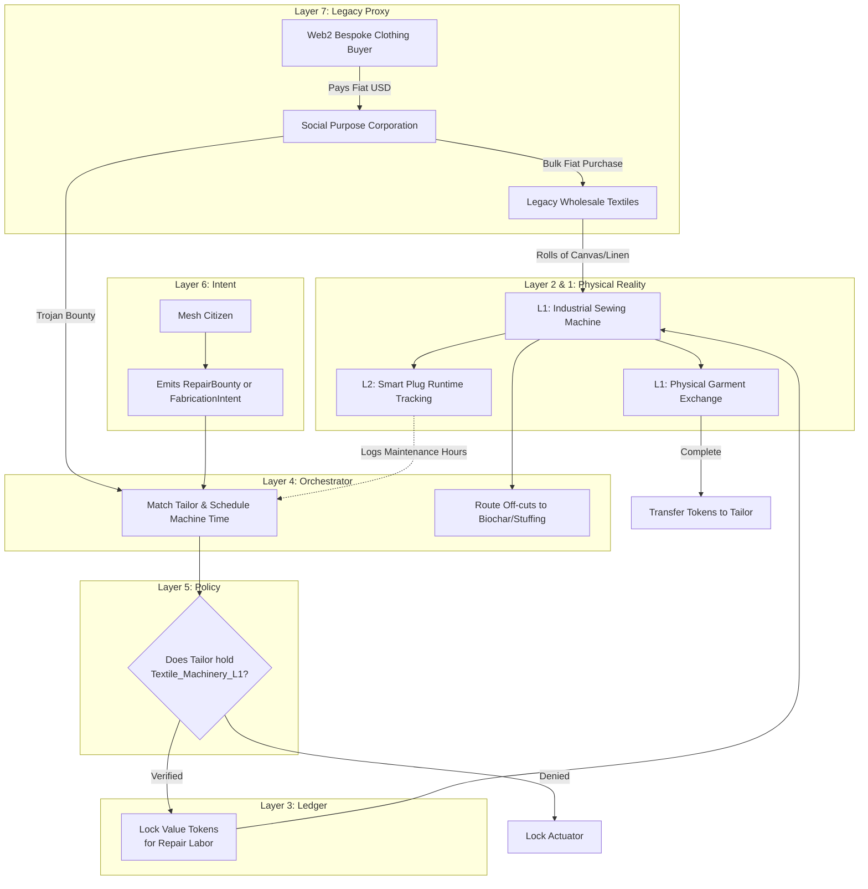

# Scenario Nu: Circular Modular Fashion

*   **Identifier:** `SCN-NU-FASHION`
*   **System Epic:** Decentralized Textiles, Modular Garments, and Repair as Negentropy
*   **Primary Layers Tested:** L1 (Physical), L3 (Ledger), L4 (Orchestrator), L6 (Semantic), L7 (Proxy)
*   **Pass/Fail Metric:** Successful routing of a garment repair bounty to a local artisan; mathematical verification that extending garment lifespan requires $< 15\%$ of the exergy/resources of fabricating a new garment; zero waste routing of textile scraps.

---

## 1. Problem Statement & Legacy Failure

Legacy "fast fashion" is an ecological and humanitarian catastrophe. Supply chains exploit offshore labor to produce petrochemical synthetics (polyester, nylon) that shed microplastics into the watershed. Furthermore, garments are designed for planned obsolescence—when a zipper breaks or a seam tears, the legacy consumer lacks the skills or tools to repair it, resulting in the entire garment being sent to a landfill.
The legacy state treats clothing as a disposable commodity. In a sovereign Node, clothing is thermodynamic infrastructure. It protects the human entity from the elements. 

## 2. The Collective Workflow (7-Layer Traversal)

Scenario Nu transitions the Node away from disposable fast fashion toward a localized, modular textile hub. It relies on open-source parametric patterns, standardized hardware (so zippers and buttons can be scavenged and reused), and heavily incentivizes repair as a high-value thermodynamic service.

### Layer 7: The Legacy Proxy (Bulk Fibers & Trojan Tailoring)
*   **Ecological Leeching:** While the Node can produce biochar and 3D printed parts, growing and milling high-quality organic cotton or linen locally requires massive land acreage. The Social Purpose Corporation (SPC) acts as a Decentralized Group Purchasing Organization (GPO). It aggregates citizen demand and uses fiat to bulk-purchase wholesale rolls of natural fibers, avoiding individual packaging waste.
*   **Trojan Tailoring (Fiat Extraction):** Local tailors can offer bespoke garments or high-end visible mending (e.g., Sashiko repair) to legacy consumers via Web2 storefronts, extracting fiat to fund the Node's textile equipment maintenance.

### Layer 6: Semantic Intent
*   Citizens emit a `RepairBounty` (e.g., "My heavy canvas work jacket has a torn left elbow").
*   Citizens can also emit a `FabricationIntent` using an open-source parametric pattern URI (e.g., requesting a pair of modular work pants scaled precisely to their 3D body scan measurements).

### Layer 5: Policy & Web of Trust (Equipment Gating)
*   **Machinery Access:** Industrial walking-foot sewing machines or heavy-duty sergers can cause serious physical injury or be easily broken if mistreated. Layer 5 restricts physical power to these Layer 1 tools unless the user holds a `Textile_Machinery_L1` Verifiable Credential.

### Layer 4: Orchestration (The Repair & Scrap Router)
*   The BPMN engine routes repair bounties to Stewards who hold the appropriate skill attestations (e.g., routing heavy canvas to a Steward with an industrial machine, and delicate knits to a hand-mender).
*   **Zero-Waste Routing:** The orchestrator manages off-cuts. Textile scraps too small to be sewn are mathematically logged and routed to a stuffing queue (for pillows/insulation) or to Scenario Mu (Biochar) if they are 100% natural fiber.

### Layer 3: Ledger (The Value of Mending)
*   Repairing a coat stops the entropic decay of a valuable physical asset. 
*   The Ledger mathematically incentivizes mending over replacement. If fabricating a new canvas jacket costs 50 Value Tokens in raw material and labor, repairing the elbow might cost 5 Value Tokens. The citizen locks the escrow, and the artisan is minted the tokens upon completion.

### Layer 2 & 1: Digital Twin & Physical Reality
*   **Telemetry (L2):** Smart plugs on the industrial sewing machines log motor runtime (hours) to track when the machine requires oiling, timing adjustments, or needle replacement, emitting autonomous `MaintenanceIntents`.
*   **Physical (L1):** Canvas, linen, wool, heavy-duty thread, shears, needles, and the localized human skill of tailoring and mending.

---



---

## 3. Oasis Engine Implementation Specification

In the C++ Oasis engine, Scenario Nu tests the advanced entity inventory and item degradation systems:

*   **Item Durability Physics:** Wearable items in an NPC/Player's equipment slots contain a `durability` integer and a `wear_rate` parameter based on their `material_id`. A `LINEN_SHIRT` degrades faster during physical labor (e.g., chopping wood) than a `CANVAS_JACKET`.
*   **The Mending Mechanic:** When `durability` drops below $20\%$, the item applies a "Thermal Leak" debuff to the entity. Instead of destroying the item, a player with the `Tailoring` skill can execute a `MEND` action at a `SEWING_STATION` voxel.
*   **Resource Efficiency:** The `MEND` action must restore $100\%$ of the item's durability while consuming $\le 10\%$ of the raw materials required by the original `CRAFT` action.

---

```json
{
  "@context": [
    "[https://schema.org/](https://schema.org/)",
    "[https://collective.network/ontology/v1/](https://collective.network/ontology/v1/)"
  ],
  "@type": "RepairBounty",
  "identifier": "urn:uuid:8b7c6d5e-4f3a-2b1c-0d9e-8f7a6b5c4d3e",
  "issuerDid": "did:mesh:node04:steward_dave",
  "targetGarment": {
    "itemType": "Heavy_Work_Jacket",
    "baseMaterial": "Cotton_Canvas_12oz",
    "syntheticContent": false,
    "damageDescription": "Left elbow blown out, approx 3x3 inch tear."
  },
  "repairParameters": {
    "preferredMethod": "Visible_Mending_Sashiko",
    "requiredThreadType": "Heavy_Duty_Cotton",
    "structuralIntegrityRequired": "High"
  },
  "trustConstraints": {
    "requiredCredentials": ["Tailoring_L1"]
  },
  "settlementCriteria": {
    "maxValueTokens": "6.00",
    "completionDeadline": "2026-10-15T18:00:00Z"
  }
}
```

---

## 4. Acceptance Test Gates (Pass/Fail)

| Checkpoint | Validation Method | Pass Condition |
| :--- | :--- | :--- |
| **G1: Thermodynamic Repair Advantage** | Craft vs. Mend Cost | The C++ engine mathematically verifies that executing a `MEND` action on a degraded garment consumes an order of magnitude less raw material than crafting a replacement. |
| **G2: Equipment Lockout** | L2 Actuator Defense | A simulated user without the `Textile_Machinery_L1` credential is cryptographically denied power to the `SEWING_STATION` voxel. |
| **G3: Scrap Lifecycle Routing** | BPMN Zero-Waste | When a new garment is fabricated, the engine automatically generates a `TEXTILE_SCRAP` item entity and routes it to the compost/biochar queue if its metadata reads `synthetic = false`. |
| **G4: The Maker's Escrow** | Ledger Settlement | The BPMN engine successfully locks Value Tokens from the requester's wallet and transfers them to the tailor upon the NFC-logged physical handoff of the repaired garment. |
