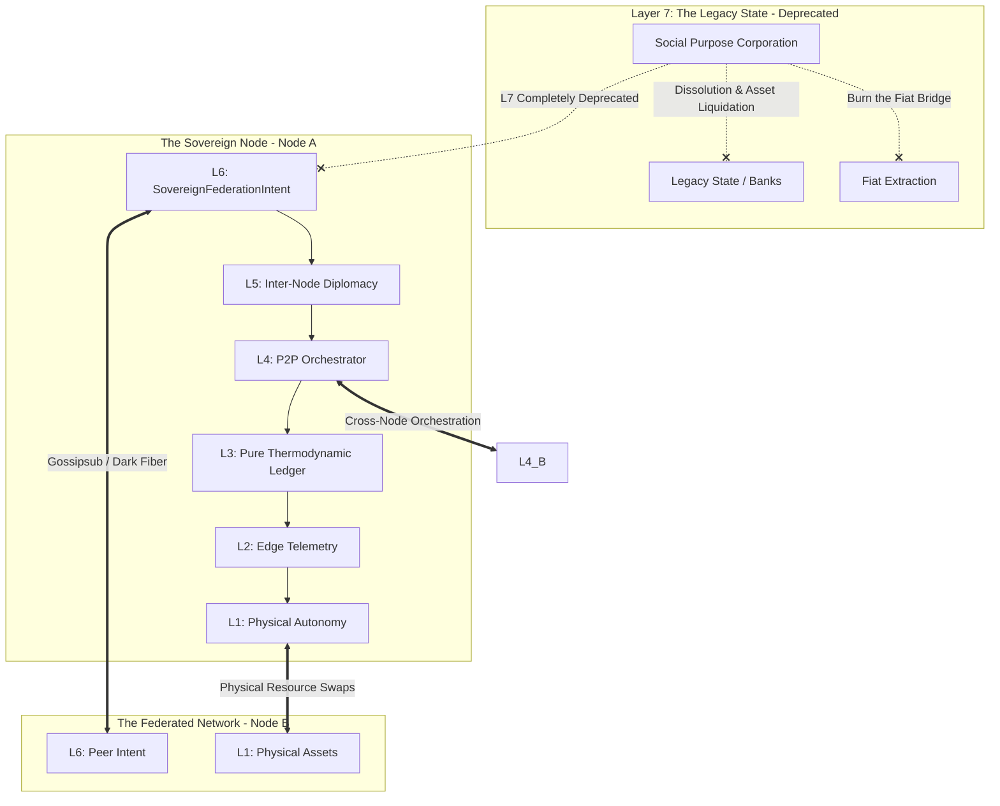

# Scenario Omega: The Sovereign Singularity (Terminal Decoupling)

*   **Identifier:** `SCN-OMEGA-DECOUPLING`
*   **System Epic:** Post-Fiat Sovereignty, Layer 7 Dissolution, and Node-to-Node Federation
*   **Primary Layers Tested:** L1 (Physical), L2 (Twin), L3 (Ledger), L4 (Orchestrator), L5 (Governance), L6 (Semantic) — *Layer 7 Deprecated*
*   **Pass/Fail Metric:** Successful legal dissolution of the Social Purpose Corporation (SPC); zeroing of all fiat treasury balances via conversion to hard thermodynamic assets; successful uninterrupted mesh-to-mesh resource routing without reliance on legacy ISP or state infrastructure.

---

## 1. Problem Statement & Legacy Failure

Layer 7 is a necessary compromise during the Genesis phase, but it remains a critical vulnerability. As long as the Node relies on a state-sanctioned Social Purpose Corporation to hold land, pay taxes in fiat, or shield its members from liability, it is subservient to the legacy state. 
On an individual level, legacy systems treat death as a final extraction event—probate courts, estate taxes, and the privatization of generational knowledge. 
True sovereignty is achieved when a Node produces its own energy, food, medicine, shelter, and culture, stripping fiat of its coercive power. The final step of the Sovereign Stack is to gracefully shut down the legacy bridge—both for the Node as a whole, and for the individual citizens at the end of their lifecycle.

## 2. The Collective Workflow (The Dissolution Protocol)

Scenario Omega orchestrates the graceful deletion of the old system at two scales: the *Individual Decoupling* (closing the loop started in Scenario Tau) and the *Systemic Decoupling* (the death of Layer 7).

### Layer 7: The Final Execution (Dissolution)
*   **Asset Liquidation:** The BPMN engine detects that physical asset reserves (solar capacity, biochar) have crossed the "Sovereignty Threshold." The orchestrator autonomously liquidates all remaining legacy fiat in the SPC bank account, purchasing final physical hardware (e.g., fiber optic spools).
*   **Legal Sunsetting:** The Trust Ring executes a multi-sig transaction initiating the formal dissolution of the SPC. The legal entity ceases to exist. The land and physical assets transition to pure cryptographic stewardship.
*   **Probate Shielding:** For individual citizens transitioning at the end of life (**Scenario Phi**), the SPC executes its final legal duty: shielding the citizen's mesh contributions from state probate courts before dissolving.

### Layer 6: Semantic Intent
*   **Systemic Decoupling:** The Node emits a `SovereignFederationIntent`, broadcasting to the global network that it is fully decoupled and ready to route exergy and data directly with other Nodes without fiat intermediation.
*   **Individual Decoupling:** When a citizen passes, a `TerminalDecouplingIntent` is emitted. This acts as a reverse **Scenario Tau (Genesis)**. Instead of injecting physical assets into the mesh, it releases the citizen's physical tools (e.g., their 3D printer, their hand tools) back into the Commons inventory to be routed to a new Apprentice (**Scenario Kappa**). Their cryptographic DID is permanently sealed as a `Legacy_Anchor`, immortalizing their wisdom without allowing their identity to be spoofed.

### Layer 5: Policy & Web of Trust (Network Diplomacy)
*   Internal governance shifts to inter-node diplomacy. The Web of Trust expands. Layer 5 policies now negotiate trade agreements with neighboring bioregional Nodes (e.g., trading excess timber from Scenario Eta for advanced microelectronics fabricated in a neighboring Node).

### Layer 4: Orchestration (Global Islanding)
*   The BPMN engine permanently drops all API webhooks to legacy banking (Stripe, Plaid) and legacy government databases. 
*   It recalibrates entirely around physical P2P infrastructure: LoRaWAN, dark fiber laid between nodes, and decentralized satellite uplinks.

### Layer 3: Ledger (The Pure Thermodynamic Standard)
*   The ledger abandons any internal exchange rate to USD or fiat.
*   Value Tokens are now the absolute baseline of economic reality, strictly pegged to the Node's localized Joules/Watt-hours of exergy and Grams of harvested carbon/biomass. The economic simulation becomes a closed, flawless thermodynamic loop.

### Layer 2 & 1: Digital Twin & Physical Reality
*   **Telemetry (L2):** The digital twin is no longer a localized simulation; it federates with the twins of other Nodes, creating a planetary-scale, open-source dashboard of biological and thermodynamic health.
*   **Physical (L1):** The land, the water, the trees, and the humans exist in absolute ecological alignment, no longer legible to the extractive legacy matrix.

---



---

## 3. Oasis Engine Implementation Specification

In the C++ Oasis engine, Scenario Omega represents the final optimization pass—deleting the legacy bloat from the codebase:

*   **Module De-allocation:** The `LegacyUplinkManager`, `FiatReserveCounter`, and `TaxCalculationDaemon` classes are gracefully de-allocated and garbage-collected from the active engine loop, freeing up CPU cycles.
*   **P2P Federation Lock:** The `NetworkManager` disables the `FALLBACK_TO_CLOUD` flag permanently. The engine strictly requires 100% of state-syncs to occur via local `Gossipsub` peers. If no peers are found, the Node operates in true autonomous isolation rather than pinging a centralized AWS server.
*   **Absolute Exergy Peg:** The `CRDTWallet` class removes the `fiat_value` variable. All UI elements displaying "$" or "USD" are programmatically hidden. Token minting is now exclusively tethered to the L2 `Energy_Surplus_Delta` and `Biomass_Yield` variables.

---

```json
{
  "@context": [
    "[https://schema.org/](https://schema.org/)",
    "[https://collective.network/ontology/v1/](https://collective.network/ontology/v1/)"
  ],
  "@type": "SovereignFederationIntent",
  "identifier": "urn:uuid:f0e1d2c3-b4a5-9876-1234-omega0000001",
  "issuerDid": "did:mesh:node04:collective_consensus",
  "declarationParameters": {
    "status": "Terminal_Decoupling_Achieved",
    "fiatReservesRemaining": 0.00,
    "layer7ProxyStatus": "Dissolved_and_Deprecated"
  },
  "thermodynamicBaselines": {
    "exergyPeg": "1_ValueToken_Equals_1_KilowattHour_Surplus",
    "biomassPeg": "1_ValueToken_Equals_2_Kg_Biochar_Sequestration",
    "dailyNodeSurplusAverage": 450.0
  },
  "federationProtocols": {
    "acceptedPeers": ["did:mesh:node05_olympic", "did:mesh:node08_portland"],
    "supportedInterNodeSwaps": ["Energy_Arbitrage", "OpenSource_Hardware_BOMs", "Epistemic_Data_Sets"],
    "routingPreference": "LoRaWAN_and_Physical_Media_Only"
  },
  "cryptographicSignatures": {
    "consensusThresholdMet": true,
    "multiSigPayload": "z8aKk9x...terminal_consensus_signature...2jL4p"
  }
}
```

---

## 4. Acceptance Test Gates (Pass/Fail)

| Checkpoint | Validation Method | Pass Condition |
| :--- | :--- | :--- |
| **G1: Fiat Zeroing** | Treasury Audit | The BPMN engine successfully routes the final balance of the simulated L7 fiat reserve into hardware asset bounties, bringing the `FiatReserve` variable to exactly `0.00`. |
| **G2: Legal Disconnect** | API Severance | The engine successfully severs all simulated webhook connections to legacy state and banking APIs, and continues to route internal mesh logic flawlessly without them. |
| **G3: L7 Teardown** | Memory Profiling | The C++ `LegacyProxy` module is successfully unmounted from memory, proving the engine architecture no longer possesses software dependencies on centralized state structures. |
| **G4: Node Federation** | Mesh Handshake | The decoupled Node successfully negotiates an inter-node resource swap (e.g., transferring `ValueTokens` for `DataStorage`) with a separate, sovereign instance of the Oasis engine over a P2P protocol. |
