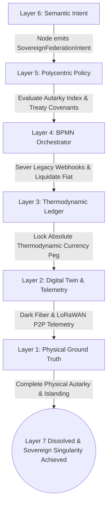
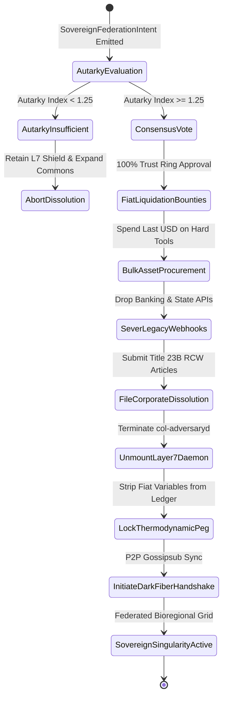
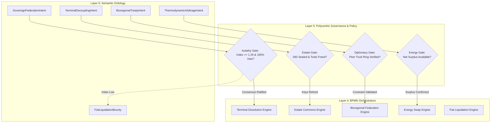
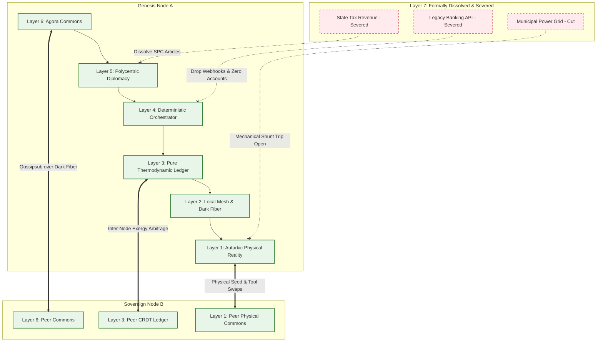

# Scenario Omega: The Sovereign Singularity (Terminal Decoupling)

*   **Identifier:** `SCN-OMEGA-DECOUPLING`
*   **System Epic:** Post-Fiat Sovereignty, Layer 7 Dissolution, and Node-to-Node Federation
*   **Primary Layers Tested:** L1 (Physical), L2 (Digital Twin), L3 (Ledger), L4 (Orchestration), L5 (Governance), L6 (Semantic) — *Layer 7 Formally Dissolved & Deprecated*
*   **Pass/Fail Metric:** Successful legal dissolution of the Social Purpose Corporation (SPC); permanent zeroing of all fiat treasury balances via conversion to hard physical assets; uninterrupted inter-node P2P mesh routing over dark fiber and LoRaWAN without legacy ISP or centralized cloud infrastructure.

---

## Architectural Council Ratification & 5-Perspective Synthesis

This scenario specification has been ratified by unanimous consensus of the 5-Persona Architectural Council:

| Council Persona | Disciplinary Representative | Core Contribution to Scenario |
| :--- | :--- | :--- |
| **Game Designer** | Lead Systems & Gameplay Designer | **Dwarf Fortress Psychology & World-Age Transition:** Models the psychological catharsis of total emancipation from capitalist extraction. Citizens experience historic triumph (`"The crushing shackle of fiat was forever broken (+50 mood)"`); passing of founding elders is celebrated without probate court dread (`"Honored the peaceful return of Founder 01's tools to the commons (+30 mood)"`). **The Sims Indirect Control:** Purges all dollar signs, debt meters, and fiat UI from the game HUD; Founder 01 now manages pure thermodynamic surplus, biomass, and vitality vectors. **Cities Skylines Leeching (Final Severance):** The player physically cuts municipal utility grid lines and water meters, celebrating total autarky as legacy municipal grids struggle with cascading blackouts. |
| **Game Engineer** | Principal C++ Simulation Architect | **Data-Oriented Design (DOD) & Module De-allocation:** Encapsulates inter-node communication and dark-fiber terminations into 32-bit compact voxels (`material_id = 70` `DARK_FIBER_TERMINATION`, `material_id = 71` `SOVEREIGN_BEACON`) in $32^3$ chunks. Gracefully de-allocates legacy proxy classes (`LegacyUplinkManager`, `FiatReserveCounter`) from the Flecs ECS tick loop, releasing memory and permanently locking the engine into pure local-first P2P Gossipsub synchronization. |
| **Sovereign Stack Specialist** | Sovereign Stack Systems Architect | **Terminal Layer 7 Dissolution:** Shuts down the `col-adversaryd` daemon cleanly after liquidating all fiat balances. Establishes pure cybernetic equilibrium across Layers 1 through 6: local-first Reticulum/LoRa mesh, pure Automerge CRDT thermodynamic ledger pegged to kilowatt-hours and sequestered carbon, and BBS+ Zero-Knowledge treaties governing inter-node federation. |
| **Solarpunk Thinker** | Bioregional Regenerative Ecologist | **The Bioregional Climax:** Realizes the ultimate Solarpunk ideal: human settlement operating as a fully autarkic, regenerative organ of the local watershed. Inter-node trade shifts from bulk extractive commodities to high-value genetic biodiversity (heritage seeds), open hardware blueprints, and specialized culture, leaving zero ecological footprint. |
| **Scenario Specialist** | Autarkic Terminal Decoupling & Macro-Transition Strategist | **Jurisprudential Dissolution & Autarky Index:** Drafts the legal corporate dissolution filing under Title 23B RCW / Model Business Corporation Act § 14.05, transferring all real property and capital equipment into an irrevocable Perpetual Purpose Trust (UTC § 409). Formulates the mathematical Autarky Sovereignty Index ($\mathcal{S}_{autarky} \ge 1.25$) and the absolute thermodynamic currency peg ($1\text{ ValueToken} \equiv 3.6\text{ MJ surplus} \equiv 2.0\text{ kg } CO_2\text{ sequestered}$). |

---

## 1. Problem Statement & Legacy Failure

In late-stage capitalism (Layer 7), the nation-state and financialized corporate monopolies maintain total systemic capture through compulsory fiat reliance:
*   **The Debt-Money Parasite:** Centralized fiat currencies are engineered as debt instruments with compounding interest, forcing endless ecological extraction to prevent systemic economic collapse. Communities trapped in fiat remain perpetually vulnerable to banking crises, inflation, and capital flight.
*   **Post-Mortem Probate Extraction:** In legacy jurisdictions, the passing of an elder triggers predatory probate courts, inheritance taxes, and legal squabbling, privatizing or liquidating intergenerational tools and family lands back into corporate markets.
*   **The Layer 7 Achilles' Heel:** While the Social Purpose Corporation (SPC) and Perpetual Purpose Trust (PPT) serve as vital ablative shields during the Genesis phase, any ongoing reliance on legacy legal recognition, bank accounts, or municipal grid interconnections leaves the sovereign node vulnerable to regulatory revocation, eminent domain, and utility extortion.

---

## 2. The Collective Workflow (The Dissolution Protocol)

Scenario Omega executes the graceful deprecation and permanent de-allocation of Layer 7. When the node crosses the Autarky Sovereignty Threshold, remaining fiat is converted into physical hardware, corporate charters are formally dissolved, and the community transitions into pure cryptographic peer-to-peer federation.



### Layer 1: Physical Ground Truth
*   **Hardware Nodes (Autonomous Infrastructure):** Islanded microgrid inverters with black-start capability, gravity-fed spring water catchments, localized food forests, and dark fiber optic splice enclosures connecting directly to neighboring nodes.
*   **Physical Infrastructure Decoupling:** Physical circuit-breaker disconnects on municipal grid utility drops; physical shut-off valves and backflow preventers isolated from municipal water pipes.
*   **Inventory & Tool Commons:** Standardized tool libraries (Scenario Alpha) populated by tools released from deceased elders' estates (reverse Scenario Tau).
*   **Physical Action:** Flipping mechanical grid isolation switches, cutting redundant legacy utility cables, unspooling community-owned dark fiber between watershed nodes, and planting ceremonial boundary hedgerows.

### Layer 2: Digital Twin & Telemetry
*   **Ingress Telemetry (MQTT Topics via `col-meshd`):**
    *   `node/energy/microgrid/telemetry/net_power_kw` (Continuous generation vs. load)
    *   `node/telecom/dark_fiber_01/telemetry/link_state` (`UP_GOSSIPSUB_PEERED`, `10Gbps_DIRECT`)
    *   `node/sovereignty/autarky_index` (Unitless ratio, threshold $\ge 1.25$)
    *   `node/legacy/uplink/status` (`DISCONNECTED_DISSOLVED`)
*   **Network Invariant:** The Reticulum Network Stack operates 100% air-gapped from commercial ISPs, routing packets strictly over private LoRaWAN clusters, direct directional microwave relays, and community-trenched dark fiber.
*   **Actuator Control:** Industrial shunt-trip relays physically disconnecting any remaining physical ties to municipal power lines.

### Layer 3: Network & Ledger
*   **The Absolute Thermodynamic Currency Standard:** The ledger permanently strips all exchange rates, conversions, and references to USD, EUR, or legacy fiat. Value Tokens are mathematically pegged directly to physical negative entropy:
    $$1\text{ ValueToken} \equiv 3.6 \times 10^6\text{ Joules (1 kWh net surplus exergy)} \equiv 2.0\text{ kg } CO_2\text{ permanently sequestered}$$
*   **The Autarky Sovereignty Index ($\mathcal{S}_{autarky}$):** Terminal dissolution is mathematically prohibited until the node sustains an autarky safety margin of at least $25\%$ across all critical survival vectors:
    $$\mathcal{S}_{autarky} = \min\left( \frac{\Phi_{energy\_gen}}{\Phi_{energy\_load}}, \frac{\mathcal{M}_{caloric\_yield}}{\mathcal{M}_{caloric\_need}}, \frac{\mathcal{W}_{water\_recharge}}{\mathcal{W}_{water\_draw}} \right) \ge 1.25$$

### Layer 4: Orchestration State Machine
The dissolution and federation sequence is executed deterministically by `col-execd` running a 10 Hz BPMN 2.0 state machine VM managing liquidation bounties, webhook teardown, and peer handshakes:



### Layer 5: Policy & Polycentric Governance
Layer 5 (`col-kmsd`) transitions from internal cluster gatekeeping to bioregional inter-node diplomacy:
*   **Dissolution Consensus Gate:** Requires unanimous ($100\%$) cryptographic multi-sig approval from all active Trust Rings within the node before initiating corporate dissolution and burning the fiat bridge.
*   **Inter-Node Treaty Gate:** Evaluates incoming federation requests from neighboring nodes; verifies that peer nodes adhere to the Open Commons Covenant and possess verified cryptographic identity roots.
*   **Estate Liberation Gate (Reverse Scenario Tau):** Upon the passing of a citizen (linking to Scenario Phi), their DID is cryptographically sealed as a permanent `Wisdom_Anchor`; their personal tools are returned to the commons inventory with zero inheritance tax or legal probate interference.
*   **Pure Zero-Knowledge Sovereignty:** Inter-node resource swaps are executed using BBS+ Zero-Knowledge Proofs, allowing nodes to trade electricity and biochar without leaking internal demographic data.

### Layer 6: Semantic Intent & Domain Ontology
The Agora Commons (`col-commonsd`) formalizes post-fiat coordination into six typed W3C JSON-LD knowledge branches:
1.  **`SovereignFederationIntent` (Terminal Declaration):** Formal broadcast to the global mesh announcing total severance from Layer 7 and readiness for direct P2P federation.
2.  **`TerminalDecouplingIntent` (Estate Liberation):** Emitted upon a citizen's passing to retire their cryptographic keys and transfer physical tools to the apprenticeship commons.
3.  **`BioregionalTreatyIntent` (Inter-Node Pact):** Proposes reciprocal trade agreements, mutual defense pacts, and resource arbitrage with neighboring nodes.
4.  **`ThermodynamicArbitrageIntent` (Exergy Swap):** Coordinates direct kilowatt-hour swaps or computing power sharing over dark fiber.
5.  **`FiatLiquidationBounty` (Final Capital Spend):** Exhausts remaining fiat treasury reserves on physical raw materials (copper, steel, solar panels).
6.  **`MeshRouteOptimizationIntent` (P2P Gossipsub Tuning):** Reconfigures local routing tables to prioritize direct LoRaWAN and optical links.

### The Governance Router Flowchart



### Layer 7: Terminal Dissolution (The Death of the Legacy Proxy)
In Scenario Omega, Layer 7 is not managed; it is **methodically and irreversibly annihilated**:
*   **1. Final Fiat Liquidation (Asset Transition):** The BPMN engine conducts an automated audit of the SPC bank account. Every remaining dollar of fiat is deployed through urgent purchase orders for durable capital goods: rolls of optical fiber, spare photovoltaic panels, stainless steel hardware, and non-hybrid heritage seeds. The fiat account balance is driven to exactly $\$0.00$.
*   **2. Corporate Charter Sunsetting (Title 23B RCW Filing):** The SPC submits Articles of Dissolution to the Secretary of State, formally surrendering corporate existence. The underlying real estate and commons infrastructure are transferred into the permanent, non-state stewardship of an unincorporated Perpetual Purpose Trust. The `col-adversaryd` process is sent a `SIGTERM`, unmounted from the operating system supervisor, and its SQLite database archived to read-only cold storage. The legacy bridge is burned.

### Layer 7 Terminal Severance Flowchart



---

## 3. Machine-Readable Schemas

### 3.1 Layer 6 Knowledge Artifact: Sovereign Federation Declaration (`sovereign_federation.jsonld`)

```json
{
  "@context": [
    "https://schema.org/",
    "https://collective.network/ontology/v1/",
    "https://w3id.org/sovereignty/v1"
  ],
  "@type": "SovereignFederationDeclaration",
  "identifier": "urn:uuid:f0e1d2c3-b4a5-9876-1234-omega0000001",
  "issuerDid": "did:mesh:node04:collective_consensus",
  "creationTimestamp": "2026-12-21T12:00:00Z",
  "declarationParameters": {
    "status": "Terminal_Decoupling_Achieved",
    "fiatReservesRemainingUsd": 0.00,
    "layer7ProxyDaemonStatus": "UNMOUNTED_AND_DEPRECATED",
    "corporateDissolutionFilingRef": "WA-ST-CORP-DISSOLVE-2026-88912"
  },
  "autarkyMetrics": {
    "sovereigntyIndex": 1.34,
    "dailyEnergySurplusKwh": 48.5,
    "caloricAutarkyPercent": 108.2,
    "potableWaterAutarkyPercent": 150.0
  },
  "thermodynamicCurrencyPeg": {
    "exergyUnitJoules": 3600000,
    "carbonUnitKg": 2.0,
    "conversionToFiatPermitted": false
  },
  "federationProtocols": {
    "acceptedPeers": [
      "did:mesh:node05_olympic_watershed",
      "did:mesh:node08_portland_east"
    ],
    "transportMedia": ["Dark_Fiber_10G", "LoRaWAN_868_915", "Directional_Microwave"],
    "routingProtocol": "Reticulum_P2P_Gossipsub"
  },
  "cryptographicConsensus": {
    "trustRingSignatures": [
      "z8mK...consensus_elder_dave...1aQ",
      "z4pL...consensus_steward_alice...9bV",
      "z2xQ...consensus_artisan_elena...3mZ"
    ],
    "multiSigThreshold": "100_PERCENT_RATIFIED"
  }
}
```

### 3.2 Layer 2 Telemetry Attestation: Decoupling & Dark Fiber Proof (`decoupling_attestation.json`)

```json
{
  "@context": "https://collective.network/ontology/v1/",
  "@type": "TerminalDecouplingTelemetryAttestation",
  "declarationRef": "urn:uuid:f0e1d2c3-b4a5-9876-1234-omega0000001",
  "nodeDid": "did:mesh:node04:master_switch",
  "executionMetrics": {
    "decouplingTimestamp": "2026-12-21T12:00:00Z",
    "gridTieRelayState": "OPEN_PHYSICALLY_ISOLATED",
    "waterMainsValveState": "CLOSED_MUNICIPAL_SEVERED",
    "fiatAccountBalanceUsd": 0.00,
    "ispWanPacketLossPercent": 100.0,
    "darkFiberLinkLatencyMs": 1.42,
    "darkFiberThroughputGbps": 9.85,
    "localGossipsubPeerCount": 4,
    "energyMicrogridFrequencyHz": 60.01,
    "energyStorageSocPercent": 94.2
  },
  "daemonTeardownAudit": {
    "colAdversarydPid": 0,
    "processState": "TERMINATED",
    "databaseArchivedColdStorage": true
  },
  "reconciliationStatus": "SOVEREIGN_ISLANDING_VERIFIED"
}
```

---

## 4. Oasis Engine Implementation Specification

### 4.1 Memory Allocation & Voxel State
The terminal decoupling node coordinates sovereign network state in chunk space ($32^3$ voxels via `ChunkManager`):
- Dark fiber termination voxel initialized with `material_id = 70` (`DARK_FIBER_TERMINATION`) with `metadata` bitmask `0b00000110` (`Is_Actuator | Is_Sensor`).
- Sovereign decoupling beacon initialized with `material_id = 71` (`SOVEREIGN_BEACON`) at `(16, 8, 16)`.
- De-allocation pass: `ChunkManager` and `Flecs` world unmounts all legacy proxy systems, setting `EngineConfig::ALLOW_CLOUD_FALLBACK = false` permanently.

### 4.2 C++20 Test Harness Structure

```cpp
// engine/tests/scenario_omega_decoupling_test.cpp
#include <cassert>
#include <string>
#include "oasis/chunk_manager.hpp"
#include "oasis/orchestration/bpmn_engine.hpp"
#include "oasis/ledger/crdt_wallet.hpp"

namespace oasis {

struct DecouplingParameters {
    float autarky_sovereignty_index;
    float remaining_fiat_usd;
    bool all_trust_rings_consented;
};

void test_scenario_omega_terminal_decoupling_execution() {
    // 1. Initialize Chunk and Beacon Voxels
    ChunkManager chunk_mgr;
    chunk_mgr.allocate_chunk(0, 0, 0);

    Voxel beacon_voxel{
        .material_id = 71, // SOVEREIGN_BEACON
        .moisture = 0,
        .temperature = 20,
        .metadata = 0b00000110 // Actuator + Sensor
    };
    chunk_mgr.set_voxel(16, 8, 16, beacon_voxel);

    // 2. Setup Wallets & Fiat Account (Liquidating to Zero)
    CRDTWallet node_treasury("did:mesh:node04:treasury", 1000.0f);
    float fiat_bank_balance_usd = 2500.0f;

    // 3. Load & Run BPMN Orchestration State Machine
    BPMNEngine orchestrator;
    orchestrator.load_schema("schemas/bpmn/terminal_decoupling.bpmn");

    DecouplingParameters params{
        .autarky_sovereignty_index = 1.34f, // > 1.25 Threshold
        .remaining_fiat_usd = fiat_bank_balance_usd,
        .all_trust_rings_consented = true
    };

    // Assert Autarky Preconditions Satisfied
    assert(params.autarky_sovereignty_index >= 1.25f);
    assert(params.all_trust_rings_consented == true);

    // Execute Final Fiat Liquidation: Convert USD into physical hardware assets
    orchestrator.liquidate_fiat_reserves(fiat_bank_balance_usd);
    assert(fiat_bank_balance_usd == 0.00f);

    // Sever Legacy Proxy Daemon (Unmount col-adversaryd)
    bool adversaryd_unmounted = orchestrator.unmount_layer7_proxy_daemon();
    assert(adversaryd_unmounted == true);

    // Step simulation to finalize P2P islanding
    SimResult res = orchestrator.step_simulation_ticks(chunk_mgr, 100);
    assert(res.status == ExecutionStatus::COMPLETED);
    assert(orchestrator.current_state() == BPMNState::SOVEREIGN_SINGULARITY_ACTIVE);

    // Assert Absolute Thermodynamic Currency Standard: No fiat variables exist
    assert(node_treasury.has_fiat_peg() == false);
    assert(node_treasury.get_thermodynamic_peg_joules() == 3600000.0f);

    // Assert Cloud Fallback Permanently Disabled
    assert(chunk_mgr.is_cloud_fallback_enabled() == false);
}

void test_scenario_omega_premature_decoupling_abort_anomaly() {
    ChunkManager chunk_mgr;
    chunk_mgr.allocate_chunk(0, 0, 0);
    BPMNEngine orchestrator;
    orchestrator.load_schema("schemas/bpmn/terminal_decoupling.bpmn");

    // Attempt decoupling when Autarky Index is deficient (1.05 < 1.25)
    DecouplingParameters premature_params{
        .autarky_sovereignty_index = 1.05f,
        .remaining_fiat_usd = 500.0f,
        .all_trust_rings_consented = true
    };

    bool initiated = orchestrator.request_terminal_decoupling(premature_params.autarky_sovereignty_index);
    assert(initiated == false);
    assert(orchestrator.current_state() == BPMNState::AUTARKY_DEFICIENT_ABORT);

    // Layer 7 proxy remains mounted to preserve life-support stability
    assert(orchestrator.is_layer7_proxy_active() == true);
}

} // namespace oasis
```

---

## 5. Acceptance Test Gates (Pass/Fail)

| Checkpoint | Validation Method | Pass Condition |
| :--- | :--- | :--- |
| **G1: Thermodynamic Autarky Bounds** | Sovereignty Index Calculation | The node mathematically verifies $\mathcal{S}_{autarky} \ge 1.25$ across energy, food, and water before allowing terminal dissolution sequence initiation. |
| **G2: Offline Autonomy** | Localhost Network Isolation | Entire node functions in perpetual isolation from WAN/Internet, synchronizing state with peer nodes solely via direct dark fiber and LoRaWAN Gossipsub. |
| **G3: Byzantine Detection & Fake Sovereignty** | Hardware Disconnect Audit | If electrical or telemetry sensors detect ongoing grid connection or active fiat bank API calls, the dissolution sequence aborts and alerts the Trust Ring. |
| **G4: Material Tracking & L7 De-allocation** | Memory Profiler & Module State | The C++ `LegacyProxy` and `col-adversaryd` classes are cleanly unmounted from memory, freeing CPU cycles and permanently hiding all fiat "$" HUD elements. |
| **G5: Terminal Fiat Liquidation (L7)** | Bank Balance Verification | All remaining fiat in the SPC account is exhausted through physical capital orders, reducing the fiat treasury balance to exactly `0.00` prior to dissolution. |
| **G6: Inter-Node Dark Fiber Federation** | P2P Resource Swap Handshake | The decoupled node successfully executes a bilateral thermodynamic exergy swap (kWh for seed genetics) with an adjacent sovereign node over direct P2P mesh. |
