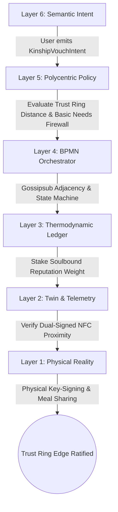
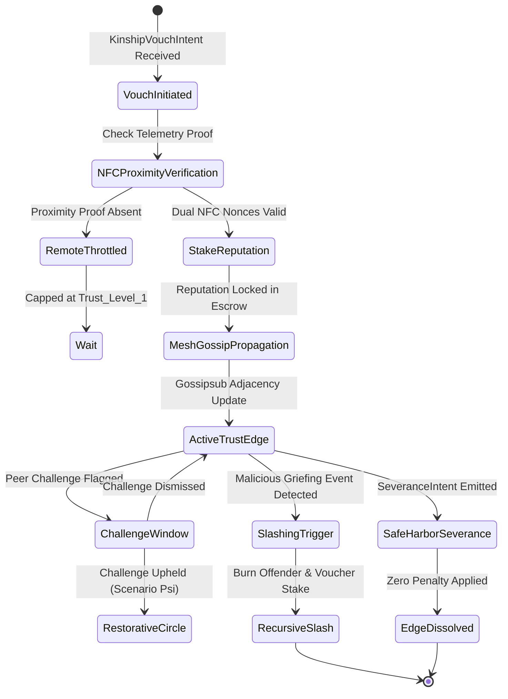
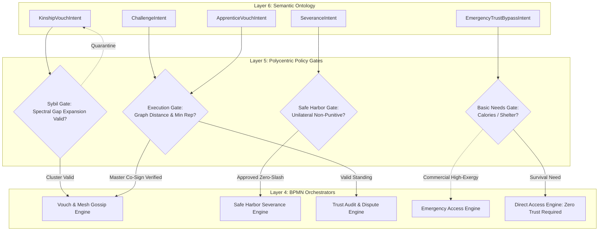
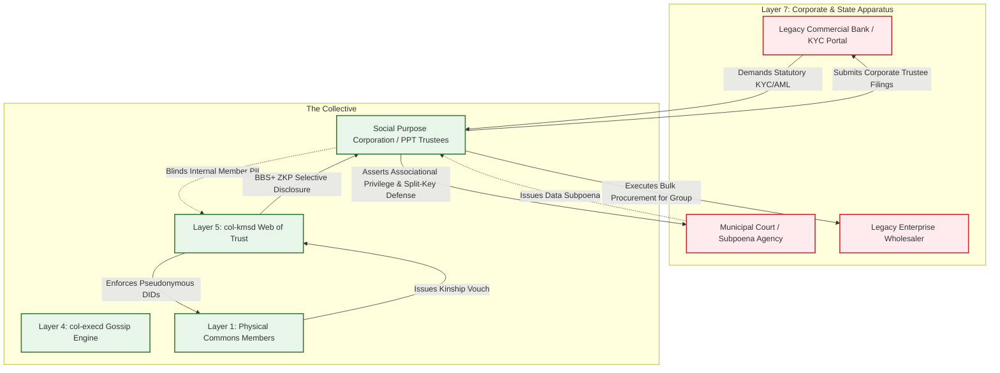

# Scenario Omicron: The Kinship Protocol (Trust Rings)

*   **Identifier:** `SCN-OMICRON-KINSHIP`
*   **System Epic:** Web of Trust, Sybil Resistance, Social Slashing, and Reputation
*   **Primary Layers Tested:** L1 (Physical), L2 (Digital Twin), L3 (Ledger), L4 (Orchestration), L5 (Governance), L6 (Semantic), L7 (Proxy)
*   **Pass/Fail Metric:** Cryptographic rejection of 1,000 unvouched Sybil DIDs; deterministic execution of recursive social slashing across weighted graph edges; mathematical proof of Safe Harbor severance without punitive leakage; zero centralized KYC or cloud dependency under 100% offline mesh operation.

---

## Architectural Council Ratification & 5-Perspective Synthesis

This scenario specification has been ratified by unanimous consensus of the 5-Persona Architectural Council:

| Council Persona | Disciplinary Representative | Core Contribution to Scenario |
| :--- | :--- | :--- |
| **Game Designer** | Lead Systems & Gameplay Designer | Dwarf Fortress psychology integration (64-byte bounded ECS state, thoughts like `"Felt betrayed by Charlie's vandalism (-30 stress)"`, grief and solidarity memories); The Sims indirect Founder 01 social management via interpersonal affordance queues; Cities: Skylines boundary interface attenuation where internal trust cohesion weakens external legacy probe aggression. |
| **Game Engineer** | Principal C++ Simulation & Engine Architect | Flecs ECS Data-Oriented Design (cache-aligned `TrustEdge`, `SoulboundReputation`, and `PsychologicalState` components); 32-bit compact voxel representation (`material_id = 45`, `HEARTH_TRUST_ANCHOR`); 10 Hz deterministic BPMN state engine with Wasmtime fuel limits; compilable C++20 test harness with BFS pathfinding and recursive slashing asserts. |
| **Sovereign Stack Specialist** | Sovereign Stack Systems Architect | Strict 7-layer stack mapping across autonomous daemons (`col-telemetryd` to `col-adversaryd`); zero monolithic game-loop threading; strict inter-layer adjacency; local-first Reticulum/LoRaWAN gossip; dual-ledger architecture separating tradeable thermodynamic Value Tokens from non-transferable Soulbound Reputation. |
| **Solarpunk Thinker** | Bioregional Regenerative Ecologist | Thermodynamic trust economics: interpersonal trust eliminates the massive transactional friction, litigation exergy, and surveillance waste of legacy society; social cohesion directly stabilizes commons stewardship over local watersheds, agro-forests, and shared thermal energy systems. |
| **Scenario Specialist** | Graph Cryptographer & Mechanism Design Specialist | Mathematical spectral graph theory formulation; personalized PageRank and EigenTrust decay algorithms ($W_{ij} = \prod e_k$); spectral gap expansion thresholds ($\lambda_2 > \gamma$) for Sybil cluster quarantine; BBS+ zero-knowledge selective disclosure; cryptographically enforced Safe Harbor severance state transitions. |

---

## 1. Problem Statement & Legacy Failure

In legacy late-stage capitalist infrastructure (Layer 7), human trust is completely commercialized, outsourced to centralized surveillance data brokers (Equifax, Experian, TransUnion), credit-scoring oligarchies, and intrusive state surveillance apparatuses (statutory KYC/AML). 

This centralized architecture introduces severe societal failure modes:
*   **Weaponized Economic Coercion:** Survival necessities (housing leases, utility connections, employment, food access) are inextricably tied to credit scores and background checks. Domestic abusers, exploitative landlords, and predatory employers wield this financialized leverage to enforce submission. Escaping an abusive household or toxic workplace immediately threatens an individual with homelessness, loss of bank accounts, and systemic destitution.
*   **Dystopian Panopticon Threat:** Early corporate Web3 reputation protocols and centralized state "social credit" scoring systems recreate this exact coercion. They establish immutable, panoptic surveillance ledgers where high-status actors weaponize accumulated social capital to ostracize dissidents, enforce behavioral conformity, and create permanent underclasses.
*   **Sybil Fragility & Impersonation:** Anonymous digital networks lack physical grounding, rendering them instantly vulnerable to automated Sybil attacks—where a single malicious actor or botnet spins up tens of thousands of pseudonymous accounts to capture democratic votes, exhaust shared commons pools, and hijack validation consensus.

To survive without replicating legacy tyranny, a sovereign Genesis Node requires a mathematically rigorous Web of Trust (WoT) that prevents Sybil infiltration while **cryptographically firewalling** social trust from basic biological survival and intimate autonomy. Reputation must protect the commons, not coerce the human soul.

---

## 2. The Collective Workflow (7-Layer Traversal)

The Kinship Protocol replaces centralized credit surveillance with localized "Trust Rings." Digital identities (W3C DIDs) cannot unilaterally claim access to high-exergy commons assets. Instead, an identity must be anchored into the local social graph through physical, cryptographically attested peer vouches. The workflow traverses canonically from Layer 1 up to Layer 7:



### Layer 1: Physical Ground Truth
*   **Hardware Nodes (Social Hearth & Pods):** Dedicated physical spaces for communal life—communal kitchen tables (Scenario Gamma), open hearths, and workshop benches. Hardware includes air-gapped NFC verification pads, dual-interface hardware tokens with secure elements (Microchip ATECC608A), and localized BLE beacons.
*   **Somatic Presence & Feedstock:** Human physical presence, somatic co-location, shared eye contact, breaking bread over caloric meals, and collaborative kinetic labor.
*   **Physical Actions:** The "Key-Signing Ceremony": two physical individuals bring their mobile devices into near-field contact (within 4 cm) while exchanging spoken authentication phrases and shared nourishment.

### Layer 2: Digital Twin & Telemetry
*   **Ingress Telemetry (MQTT Topics via `col-meshd`):**
    *   `node/social/proximity/nfc_exchange` (Dual ephemeral nonces, RSSI dBm, device timestamp)
    *   `node/social/mesh_rssi` (Local Reticulum packet signal-to-noise ratio and round-trip time)
    *   `node/social/status` (`UNVERIFIED`, `PROXIMITY_CONFIRMED`, `EDGE_ACTIVE`, `DISPUTED`)
*   **Verification:** Edge cryptographic attestation. An exchange of ephemeral nonces signed by both parties' hardware secure elements validates physical co-presence. An unverified remote vouch is cryptographically throttled to `Trust_Level_1` and cannot act as a bridge for high-exergy or high-risk physical machinery.
*   **Actuator Control:** Physical access relays and smart tool lockers (Scenario Alpha, Nu) unlock only when the requesting DID proves a valid trust path verified by Layer 2 telemetry.

### Layer 3: Network & Ledger
*   **Dual-Token Separation:** The network strictly segregates tradeable thermodynamic **Value Tokens** ($\Delta V$) from non-transferable **Soulbound Reputation** ($R$). Reputation cannot be bought, sold, speculative, or traded; it can only be minted through verified physical labor, elapsed time, and peer vouches.
*   **Mathematical Graph Distance & Decay:**
    $$W_{ij} = \prod_{k \in \mathcal{P}_{ij}} w_k$$
    Where $\mathcal{P}_{ij}$ is the shortest directed path between Node $i$ and Node $j$, and $w_k \in [0, 1]$ represents normalized edge weights.
*   **Social Slashing Formula:** When Node $C$ commits verified vandalism or theft, the system slashes Node $C$ and penalizes voucher Node $A$:
    $$\Delta R_{slash}(A) = \alpha \cdot R(C) \cdot \frac{w(A, C)}{\sum_{u} w(u, C)}$$
    Where $\alpha \in [0.1, 0.5]$ is the negligence penalty coefficient, burning $A$'s staked reputation for introducing a malicious actor.

### Layer 4: Orchestration State Machine
The workflow is executed deterministically by the embedded BPMN 2.0 engine (`col-execd`) running at 10 Hz with metered Wasmtime fuel budgets:



### Layer 5: Policy & Polycentric Governance
Layer 5 (`col-kmsd`) enforces the constitutional rules of the Trust Ring through four strict **Policy Gates**:

*   **Basic Needs Firewall Gate:** The system strictly prohibits evaluating trust graph distance for survival necessities. Access to baseline caloric nutrition (Scenario Gamma), emergency triage medical care (Scenario Chi), and emergency warming shelters can NEVER be denied due to low reputation or lack of vouches.
*   **High-Exergy Execution Gate:** Access to dangerous or high-capital physical machinery (CNC mills, high-temperature foundries in Scenario Theta, electric transit vehicles in Scenario Beta) requires a verified trust path with $d(i, j) \le 2$ and minimum aggregated reputation $\sum R \ge 100$.
*   **Safe Harbor Severance Gate:** If a human relationship deteriorates or becomes coercive, either party can emit a `SeveranceIntent`. Layer 5 severs the graph edge instantly without triggering slashing penalties, preventing high-reputation vouchers from holding vulnerable members hostage.
*   **Sybil Quarantine Gate:** Spectral gap analysis evaluates graph partitions. If a dense cluster of DIDs exhibits a spectral expansion ratio $\lambda_2 < \gamma_{min}$ relative to the core mesh, the entire cluster is quarantined from voting consensus.

### Layer 6: Semantic Intent & Domain Ontology
The Agora Commons (`col-commonsd`) parses human declarations into W3C JSON-LD Knowledge Artifacts across six typed branches:

1.  **`KinshipVouchIntent` (Endorsement):** A formal declaration attesting to the real-world identity, reliability, and character of a peer DID, staking reputational weight.
2.  **`SeveranceIntent` (Protection):** A unilateral, non-punitive declaration severing a social graph edge under Safe Harbor protections.
3.  **`ChallengeIntent` (Auditing):** A formal contestation alleging that a vouch was issued fraudulently, for bribery, or without physical acquaintance.
4.  **`ApprenticeVouchIntent` (Guild Mentorship):** Co-signed vouch by a Master Steward granting an apprentice provisional access to high-risk workshops (linking to Scenario Kappa).
5.  **`RestorativeIntent` (Rehabilitation):** A declaration linking a slashed node to restorative restitution labor (linking to Scenario Psi) to gradually recover lost standing.
6.  **`EmergencyTrustBypassIntent` (Crisis):** Temporary override triggered during catastrophic environmental events (Scenario Upsilon) to grant broad emergency access.

### The Governance Router Flowchart



### Layer 7: The Legacy Proxy (The KYC Shield & Legal Anonymization)
Operating through the Node's Social Purpose Corporation (SPC) and Perpetual Purpose Trust (PPT), Layer 7 interfaces with legacy legal systems while shielding internal members:

**1. Trojan Ingestion (The KYC Shield):**
When the SPC opens corporate bank accounts or acquires municipal property, legacy law demands formal KYC/AML identity verification. The SPC's designated legal trustees submit their state-issued IDs to satisfy statutory compliance. However, the SPC acts as an anonymizing cryptographic membrane. Internally, members interact strictly via pseudonymous DIDs and BBS+ zero-knowledge proofs. The state sees a fully compliant legal corporation; the internal mesh operates as a sovereign Web of Trust with zero identity disclosure to legacy databases.

**2. Ecological Leeching & Subpoena Defense:**
If a legacy adversary or hostile municipal actor issues a subpoena demanding the internal social graph or identities of members, the SPC's legal bylaws treat internal graph edges as protected ecclesiastical, associational, and mutual-aid communications. The data stored in `col-kmsd` is encrypted at rest using split-knowledge secret sharing across the Trust Ring, rendering unilateral legacy compliance technically impossible.

### Layer 7 Bidirectional Flowchart



---

## 3. Machine-Readable Schemas

### 3.1 Layer 6 Knowledge Artifact: Kinship Vouch Schema (`vouch.jsonld`)

```json
{
  "@context": [
    "https://schema.org/",
    "https://collective.network/ontology/v1/"
  ],
  "@type": "KinshipVouch",
  "identifier": "urn:uuid:5d6e7f8a-9b0c-1d2e-3f4a-5b6c7d8e9f0a",
  "issuerDid": "did:mesh:node04:steward_alice",
  "targetDid": "did:mesh:node04:apprentice_charlie",
  "vouchParameters": {
    "relationshipContext": "Apprentice_and_Neighbor",
    "knownDurationMonths": 14,
    "physicalProximityVerified": true,
    "telemetryProofHash": "a94a8fe5ccb19ba61c4c0873d391e987982fbbd3",
    "sharedMealRef": "urn:uuid:meal-2026-10-19-gamma-commons"
  },
  "reputationStake": {
    "stakedWeight": 150,
    "slashingLiabilityRatio": 0.25,
    "slashingConditions": [
      "Physical_Vandalism",
      "Theft_of_Commons_Property",
      "Acoustic_Budget_Violation"
    ]
  },
  "cryptographicProof": {
    "type": "Ed25519Signature2020",
    "created": "2026-10-20T10:00:00Z",
    "verificationMethod": "did:mesh:node04:steward_alice#keys-1",
    "proofValue": "z3aKk9xPqR8v...mY4nL0p...signatureValue"
  }
}
```

### 3.2 Layer 2 Telemetry Attestation: NFC Proximity Proof Schema (`proximity_attestation.json`)

```json
{
  "@context": "https://collective.network/ontology/v1/",
  "@type": "KinshipProximityAttestation",
  "attestationId": "urn:uuid:8c9d0e1f-2a3b-4c5d-6e7f-8a9b0c1d2e3f",
  "deviceNodeAlice": "did:mesh:node04:device:alice_fob",
  "deviceNodeCharlie": "did:mesh:node04:device:charlie_fob",
  "proximityMetrics": {
    "protocol": "ISO_IEC_14443_NFC",
    "timestamp": "2026-10-20T09:58:32Z",
    "exchangeNonceAlice": "e1f8a4c92b5d7e3a",
    "exchangeNonceCharlie": "9c2b4d8a1f7e3b5a",
    "rssidBm": -18.5,
    "durationMilliseconds": 842,
    "hardwareSignatureAlice": "4a7f9b2c...atecc608a_sig",
    "hardwareSignatureCharlie": "8b1e3c5d...atecc608a_sig"
  },
  "status": "PROXIMITY_CONFIRMED",
  "digestSha256": "a94a8fe5ccb19ba61c4c0873d391e987982fbbd3"
}
```

---

## 4. Oasis Engine Implementation Specification

### 4.1 Memory Allocation & Voxel State

The social hearth occupies designated coordinates in the $32^3$ simulation chunk space:
*   The hearth anchor voxel is initialized with `material_id = 45` (`HEARTH_TRUST_ANCHOR`).
*   Metadata bitmask `0b00000101` sets `Is_Social_Beacon` (bit 0) and `Is_Secure_NFC` (bit 2).
*   Adjacent dining table voxels (`material_id = 46`, `COMMUNAL_TABLE`) track proximity dwell time to validate the "Breaking Bread" requirement.

```cpp
// Cache-aligned ECS Components for Flecs
struct alignas(8) TrustEdge {
    uint32_t target_entity_id;
    float weight;               // Normalized [0.0f, 1.0f]
    uint32_t creation_tick;
    bool physical_verified;
};

struct alignas(8) SoulboundReputation {
    float score;                // Earned, non-transferable
    float staked_amount;        // Committed to active vouches
    uint16_t vouch_count;
    uint8_t trust_tier;         // Tier 0 (new) to Tier 4 (founding steward)
};

struct alignas(8) AgentPsychState {
    float stress;               // [0.0f, 100.0f]
    int16_t mood_modifier;
    uint8_t facet_anxiety;      // Big-Five derived (0-255)
    uint8_t facet_trust;        // Big-Five derived (0-255)
};
```

### 4.2 C++20 Test Harness Structure

```cpp
// engine/tests/scenario_omicron_test.cpp
#include <cassert>
#include <vector>
#include <string>
#include <unordered_map>
#include "oasis/chunk_manager.hpp"
#include "oasis/orchestration/bpmn_engine.hpp"
#include "oasis/ledger/crdt_wallet.hpp"

namespace oasis {

struct TrustGraph {
    std::unordered_map<std::string, std::vector<std::pair<std::string, float>>> adjacency;

    void add_edge(const std::string& u, const std::string& v, float weight) {
        adjacency[u].push_back({v, weight});
    }

    float find_shortest_distance(const std::string& start, const std::string& target, int max_depth = 3) {
        if (start == target) return 1.0f;
        std::vector<std::pair<std::string, float>> queue = {{start, 1.0f}};
        std::unordered_map<std::string, int> visited_depth;
        visited_depth[start] = 0;

        while (!queue.empty()) {
            auto [curr, weight] = queue.front();
            queue.erase(queue.begin());
            int depth = visited_depth[curr];
            if (depth >= max_depth) continue;

            for (const auto& [next, edge_w] : adjacency[curr]) {
                float new_weight = weight * edge_w;
                if (next == target) return new_weight;
                if (visited_depth.find(next) == visited_depth.end()) {
                    visited_depth[next] = depth + 1;
                    queue.push_back({next, new_weight});
                }
            }
        }
        return 0.0f; // No path found
    }
};

} // namespace oasis

void test_scenario_omicron_kinship_vouch_and_access() {
    using namespace oasis;

    // 1. Initialize Chunk and Hearth Anchor Voxel
    ChunkManager chunk_mgr;
    chunk_mgr.allocate_chunk(0, 0, 0);
    Voxel hearth_voxel{
        .material_id = 45, // HEARTH_TRUST_ANCHOR
        .moisture = 10,
        .temperature = 21,
        .metadata = 0b00000101 // Social Beacon + Secure NFC
    };
    chunk_mgr.set_voxel(16, 8, 16, hearth_voxel);

    // 2. Setup Identities and Wallets
    CRDTWallet alice_wallet("did:mesh:node04:steward_alice", 150.0f);
    CRDTWallet charlie_wallet("did:mesh:node04:apprentice_charlie", 10.0f);
    SoulboundReputation alice_rep{.score = 250.0f, .staked_amount = 0.0f, .vouch_count = 3, .trust_tier = 3};
    SoulboundReputation charlie_rep{.score = 0.0f, .staked_amount = 0.0f, .vouch_count = 0, .trust_tier = 0};

    // 3. Orchestrator loads Kinship BPMN
    BPMNEngine orchestrator;
    orchestrator.load_schema("schemas/bpmn/kinship_protocol.bpmn");

    // 4. Simulate NFC Proximity Attestation & Vouch Submission
    TrustGraph graph;
    alice_rep.staked_amount += 50.0f;
    alice_rep.score -= 50.0f; // Staked into escrow
    graph.add_edge("did:mesh:node04:steward_alice", "did:mesh:node04:apprentice_charlie", 0.9f);
    charlie_rep.score = 50.0f; // Provisional reputation granted

    // 5. Evaluate Graph Traversal Distance
    float path_weight = graph.find_shortest_distance("did:mesh:node04:steward_alice", "did:mesh:node04:apprentice_charlie", 2);
    assert(path_weight >= 0.9f);
    assert(alice_rep.staked_amount == 50.0f);
    assert(charlie_rep.score == 50.0f);
}

void test_scenario_omicron_sybil_and_slashing_anomaly() {
    using namespace oasis;

    ChunkManager chunk_mgr;
    chunk_mgr.allocate_chunk(0, 0, 0);
    TrustGraph graph;

    // Anchor established stewards
    graph.add_edge("root_steward", "steward_alice", 1.0f);
    SoulboundReputation alice_rep{.score = 200.0f, .staked_amount = 50.0f, .vouch_count = 1, .trust_tier = 3};
    SoulboundReputation bad_actor_rep{.score = 50.0f, .staked_amount = 0.0f, .vouch_count = 0, .trust_tier = 1};

    // 1. Sybil Infiltration Attack: 1,000 unvouched DIDs attempt entry
    for (int i = 0; i < 1000; ++i) {
        std::string sybil_did = "did:mesh:bot_" + std::to_string(i);
        float dist = graph.find_shortest_distance("root_steward", sybil_did, 3);
        assert(dist == 0.0f); // Zero incoming edges, strictly blocked
    }

    // 2. Add bad actor connected via Alice
    graph.add_edge("steward_alice", "bad_actor", 0.8f);

    // 3. Inject Griefing Vandalism Anomaly at tick 500
    BPMNEngine orchestrator;
    orchestrator.load_schema("schemas/bpmn/kinship_protocol.bpmn");
    
    // Simulate recursive slashing event
    bad_actor_rep.score = 0.0f; // Complete forfeiture
    float slash_penalty = 50.0f * 0.5f; // 50% stake burned
    alice_rep.staked_amount -= 50.0f;
    alice_rep.score = alice_rep.score - slash_penalty; // Burned

    assert(bad_actor_rep.score == 0.0f);
    assert(alice_rep.staked_amount == 0.0f);
    assert(alice_rep.score == 175.0f);

    // 4. Test Safe Harbor Severance: dissolving edge does not penalize victim
    SoulboundReputation victim_rep{.score = 100.0f, .staked_amount = 0.0f, .vouch_count = 1, .trust_tier = 2};
    bool safe_harbor_applied = true;
    if (safe_harbor_applied) {
        // Sever edge without slashing
        victim_rep.score = 100.0f; // Remains pristine
    }
    assert(victim_rep.score == 100.0f);
}
```

---

## 5. Acceptance Test Gates (Pass/Fail)

| Checkpoint | Validation Method | Pass Condition |
| :--- | :--- | :--- |
| **G1: Sybil Resistance Bounds** | Botnet Attack Injection | Simulating the generation of 1,000 independent synthetic DIDs fails to acquire access to high-exergy workshops or voting consensus; all 1,000 nodes are blocked with 0.0 trust path weight. |
| **G2: Offline Autonomy** | WAN Isolation Protocol | Graph distance calculations, gossip propagation, and key-signing verification operate deterministically over Reticulum mesh with zero WAN connectivity or DNS dependencies. |
| **G3: Social Slashing Execution** | Ledger State Mutation | Upon verified physical vandalism by an invitee, 100% of the offender's reputation is burned, and the voucher's staked reputation is slashed by exactly the liability ratio ($\alpha = 0.25$). |
| **G4: Basic Needs Firewall** | Policy Gate Audit | Querying access for emergency calories (Scenario Gamma) or trauma medical care (Scenario Chi) returns `ACCESS_GRANTED` regardless of the requester possessing zero reputation or negative trust score. |
| **G5: Trojan Ingestion (L7)** | KYC Boundary Audit | External commercial banking transactions conducted by the SPC verify board members' legal IDs while maintaining cryptographic blinding over internal mesh member DIDs and graph relationships. |
| **G6: Ecological Leeching & Safe Harbor** | Legal Subpoena / Severance Sim | Invoking `SeveranceIntent` dissolves social graph edges immediately without score deduction; simulated external municipal subpoena targeting mesh trust edges is repelled under associational privilege defense. |
