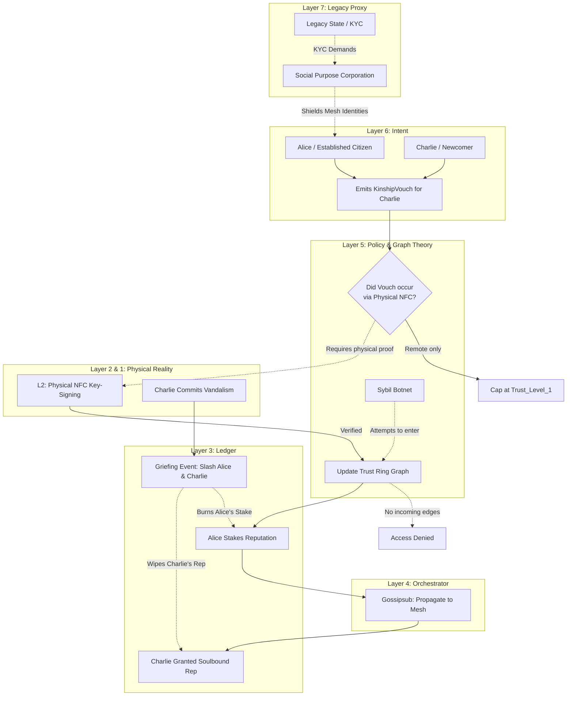

# Scenario Omicron: The Kinship Protocol (Trust Rings)

*   **Identifier:** `SCN-OMICRON-KINSHIP`
*   **System Epic:** Web of Trust, Sybil Resistance, Social Slashing, and Reputation
*   **Primary Layers Tested:** L3 (Ledger), L4 (Orchestrator), L5 (Governance), L6 (Semantic), L7 (Proxy)
*   **Pass/Fail Metric:** Successful cryptographic prevention of a Sybil attack (an entity creating 1,000 fake identities); mathematical execution of "Social Slashing" (where a voucher loses reputation when the person they vouched for acts maliciously); zero reliance on legacy state ID for internal mesh operations.

---

## 1. Problem Statement & Legacy Failure

In the legacy system, trust is outsourced to massive, centralized data brokers (Equifax, Experian) and state authorities (KYC laws, passports). These systems are routinely breached, highly exclusionary, and measure financial compliance rather than actual human trustworthiness. 
Conversely, early "Web3" attempts at decentralization relied on plutocracy (token-voting), which is fundamentally vulnerable to "Sybil attacks"—where a single malicious actor generates thousands of anonymous wallets to overwhelm a network's consensus or drain its resources. To survive, a sovereign Node requires a localized, mathematically rigorous method of establishing who is real and who is trustworthy, without recreating a centralized surveillance state.

## 2. The Collective Workflow (7-Layer Traversal)

Scenario Omicron establishes "Trust Rings." You cannot simply create a new digital identity and start booking 3D printers or participating in childcare. Your Decentralized Identifier (DID) must be cryptographically attached to the human social graph via physical "vouching."

### Layer 7: The Legacy Proxy (The KYC Shield)
*   **The Fiat Bridge:** To interface with legacy banks, the Social Purpose Corporation (SPC) must comply with federal KYC/AML laws. However, it acts as an anonymizing membrane. The SPC holds the legacy state IDs of its board members, but internally, the citizens operate purely on pseudonymous cryptographic reputation. The state sees a compliant corporation; the citizens see a sovereign Web of Trust.

### Layer 6: Semantic Intent
*   Citizens emit a `KinshipVouch` (cryptographically attesting to the real-world identity and character of another DID).
*   The intent defines the relationship context (e.g., "Coworker", "Family", "Neighbor") and the amount of reputation staked.

### Layer 5: Policy & Web of Trust (Social Slashing)
*   **The Kinship Graph:** Layer 5 calculates trust mathematically using graph theory. If Alice wants to borrow Bob's expensive power tool, Bob's node calculates the shortest path between them. If they share a mutual friend (1 degree of separation), the transaction is approved. If they are 4 degrees apart, the system demands a massive Value Token collateral lock.
*   **Social Slashing:** Trust is not cheap; it carries thermodynamic risk. When Alice vouches for Charlie, she stakes a portion of her own Reputational Weight. If Charlie subsequently vandalizes the Coworking space (Scenario Epsilon), Charlie's reputation is wiped out, *and* Alice's reputation is mathematically slashed for bringing a bad actor into the Trust Ring. This creates intense, localized accountability.

### Layer 4: Orchestration (Graph Propagation)
*   The BPMN engine does not use a central database. It utilizes Gossipsub to propagate `KinshipVouches` across the localized mesh, allowing individual edge nodes to independently calculate graph distances and update their local adjacency matrices.

### Layer 3: Ledger (Soulbound Reputation)
*   **Dual-Token Economy:** The mesh operates on two distinct ledgers. *Value Tokens* (Scenario Alpha) track thermodynamic energy and can be traded. *Reputation Weight* is "Soulbound"—it is attached permanently to a DID and cannot be bought, sold, or transferred. It can only be earned through physical labor, time, and the cryptographic vouches of peers.

### Layer 2 & 1: Digital Twin & Physical Reality
*   **Telemetry (L2):** A `KinshipVouch` is geometrically stronger if L2 telemetry proves the two DIDs share physical proximity. The highest-tier vouches require a physical "Key-Signing Party" where Alice and Charlie's mobile devices exchange NFC payloads in physical space, proving they are not remote bots.
*   **Physical (L1):** Real human relationships, physical eye contact, shared meals, and localized accountability.

---



---

## 3. Oasis Engine Implementation Specification

In the C++ Oasis engine, this scenario establishes the core NPC and Player relationship architecture using advanced graph algorithms:

*   **Adjacency Matrix:** The engine must maintain a directed, weighted graph of all active DIDs within the chunk cluster. 
*   **BFS Distance Calculation:** When `Player_A` attempts to interact with an `L5_LOCKED` voxel owned by `Player_B`, the engine must execute a Breadth-First Search (BFS) or Dijkstra’s algorithm to find the shortest trust path. If `distance > max_allowed_degrees`, the engine returns `ACCESS_DENIED`.
*   **Slashing Propagation:** If an entity commits a `GRIEFING_EVENT`, the engine must recursively traverse the graph backwards from the offender, applying a fractional negative multiplier to the `Reputation` integer of every entity that issued a `KinshipVouch` for them.

---

```json
{
  "@context": [
    "[https://schema.org/](https://schema.org/)",
    "[https://collective.network/ontology/v1/](https://collective.network/ontology/v1/)"
  ],
  "@type": "KinshipVouch",
  "identifier": "urn:uuid:5d6e7f8a-9b0c-1d2e-3f4a-5b6c7d8e9f0a",
  "issuerDid": "did:mesh:node04:steward_alice",
  "targetDid": "did:mesh:node04:apprentice_charlie",
  "vouchParameters": {
    "relationshipContext": "Apprentice_and_Neighbor",
    "knownDurationMonths": 14,
    "physicalProximityVerified": true,
    "l2ProximityHash": "a94a8fe5ccb19ba61c4c0873d391e987982fbbd3"
  },
  "reputationStake": {
    "stakedWeight": 150,
    "slashingConditions": [
      "Physical_Vandalism",
      "Theft_of_Commons_Property",
      "Acoustic_Budget_Violation"
    ]
  },
  "cryptographicProof": {
    "type": "Ed25519Signature2020",
    "created": "2026-10-20T10:00:00Z",
    "verificationMethod": "did:mesh:node04:steward_alice#keys-1",
    "proofValue": "z3aKk9x...cryptographic_signature...7jL2p"
  }
}
```

---

## 4. Acceptance Test Gates (Pass/Fail)

| Checkpoint | Validation Method | Pass Condition |
| :--- | :--- | :--- |
| **G1: Sybil Rejection** | Botnet Attack Sim | Simulating the creation of 500 new cryptographic DIDs fails to grant them any access to L5-gated resources because they possess zero incoming graph edges from established Trust Ring nodes. |
| **G2: Graph Traversal Limit** | Access Verification | A simulated request between two nodes separated by 3 degrees of trust (where the resource policy max is 2) is automatically rejected by the engine. |
| **G3: Social Slashing Execution** | Ledger State Update | When Node C is flagged for a severe violation, the C++ engine successfully slashes Node C's reputation to zero, and automatically deducts the calculated collateral percentage from Node B (Node C's voucher). |
| **G4: NFC Proximity Proof** | L2 Injection | A `KinshipVouch` submitted without a verified L2 physical proximity hash (simulated NFC bump) is capped at `Trust_Level_1` and cannot act as a bridge for high-risk assets. |
