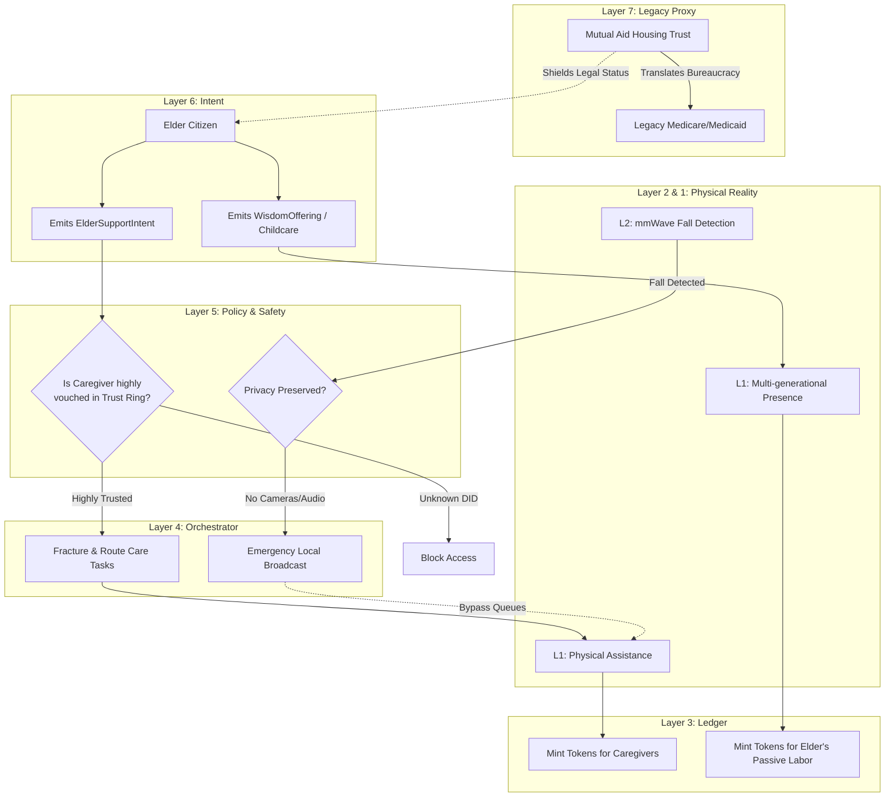

# Scenario Phi: The Elder Commons (The Golden Ratio)

*   **Identifier:** `SCN-PHI-ELDERCARE`
*   **System Epic:** Multi-Generational Integration, Wisdom Exchange, and Distributed Care
*   **Primary Layers Tested:** L1 (Physical), L2 (Twin), L3 (Ledger), L4 (Orchestrator), L5 (Governance), L6 (Semantic), L7 (Proxy)
*   **Pass/Fail Metric:** Successful decentralized routing of daily care tasks ensuring no single caregiver exceeds burnout thresholds; active integration of elders into daily community operations (childcare, mentorship); mathematical elimination of isolation and legacy institutionalization.

---

## 1. Problem Statement & Legacy Failure

In the legacy capitalist system, human beings are valued strictly by their capacity to generate industrial or fiat output. Once an individual ages or becomes physically vulnerable, they are deemed an "economic burden." Legacy society responds with institutionalization—locking elders away in for-profit nursing homes that drain generational wealth while subjecting them to extreme psychological isolation and neglect. 
Simultaneously, this deprives the younger generations of critical context, patience, and historical wisdom. The nuclear family model attempts to handle eldercare privately, resulting in catastrophic burnout for the primary caregiver (usually a daughter or spouse). A sovereign Node cannot survive without a structural, multi-generational loop where vulnerability is met with absolute respect and integration.

## 2. The Collective Workflow (7-Layer Traversal)

Scenario Phi operates on the principle of the Golden Ratio: perfect proportionality. It distributes the kinetic burden of physical care across the entire Trust Ring, while channeling the elder's passive wisdom and presence back into the center of the community.

### Layer 7: The Legacy Proxy (Medical & Legal Shielding)
*   **The Mutual Care Trust:** To avoid being classified by the legacy state as an "unlicensed assisted living facility," the Social Purpose Corporation (SPC) legally structures the living arrangement as a Multi-Generational Housing Cooperative or Mutual Aid Society. 
*   **Legacy Medical Routing:** The SPC handles the bureaucratic labyrinth of legacy Medicare, Medicaid, and hospice services, translating fiat medical requirements into internal mesh workflows.

### Layer 6: Semantic Intent
*   Elders or their advocates emit an `ElderSupportIntent` (requesting specific kinetic assistance: e.g., meal preparation, mobility help, or transportation).
*   Elders also emit `WisdomOfferings` (e.g., offering to passively monitor sleeping children, tell historical stories, or verbally mentor an apprentice in Scenario Kappa).

### Layer 5: Policy & Web of Trust (The Dignity Gate)
*   **Vulnerability Safeguards:** Trust Rings are drawn exceptionally tight around vulnerable citizens. Layer 5 requires maximum cryptographic vouching (Scenario Omicron) and verified background attestations before a citizen is allowed to accept an `ElderSupportIntent` involving personal care or medication management.
*   **Privacy & Autonomy:** The elder retains absolute sovereign control over their space. L5 policy strictly dictates that care is consensual, preserving dignity above all efficiency metrics.

### Layer 4: Orchestration (Fractional Caregiving)
*   The BPMN engine solves the caregiver burnout crisis. Instead of one person providing 40 hours of grueling, isolated care per week, the orchestrator fractures the requirement. It schedules 20 different trusted citizens to provide 2 hours of care each, seamlessly integrating eldercare into the daily flow of the Node. 
*   It routes Scenario Gamma (Meals) and Scenario Sigma (Cleaning) directly to the elder's living space.

### Layer 3: Ledger (Valuing Wisdom and Presence)
*   Physical caregiving is minted as highly valuable thermodynamic labor.
*   Crucially, the ledger values *passive negentropy*. An elder sitting in the courtyard, watching toddlers play (allowing the parents to execute high-exergy tasks), or teaching a teenager how to mend a fishing net, is minted Value Tokens. They are active economic participants, not charity cases.

### Layer 2 & 1: Digital Twin & Physical Reality
*   **Telemetry (L2):** Opt-in, privacy-preserving ambient sensors (e.g., mmWave radar fall detection, which detects movement without using cameras) are deployed in the elder's suite. If a fall or severe anomaly is detected, L2 bypasses normal queues and instantly broadcasts a high-priority P2P emergency alert to the local Trust Ring.
*   **Physical (L1):** Accessible architecture, ramps, physical touch, shared meals, storytelling, and the actual human presence of the community.

---



---

## 3. Oasis Engine Implementation Specification

In the C++ Oasis engine, Scenario Phi tests the complex simulation of entity lifecycle, passive buffs, and localized event handling:

*   **Age and Kinetic Constraints:** `NPCEntity` objects possess a `lifecycle_stage` and `kinetic_capacity` variable. As entities enter the `ELDER` stage, their `kinetic_capacity` (ability to lift, build, or travel quickly) decreases, but their `wisdom_stat` and `teaching_multiplier` increase.
*   **Passive Aura Buffs:** An `ELDER` entity generates a localized spatial buff (e.g., `COMMUNITY_ANCHOR`). When `CHILD` or `WORKER` entities perform tasks within the same chunk as the elder, their `morale_decay` rate is significantly slowed, and skill acquisition (Scenario Kappa) is accelerated by the `teaching_multiplier`.
*   **Fractional Task Routing:** The `BountyManager` must correctly break a `HIGH_BURDEN_TASK` (like daily medical care) into multiple `MICRO_TASKS`, distributing them to the action queues of multiple nearby trusted `WORKER` entities to prevent any single entity from hitting 100% `fatigue`.

---

```json
{
  "@context": [
    "[https://schema.org/](https://schema.org/)",
    "[https://collective.network/ontology/v1/](https://collective.network/ontology/v1/)"
  ],
  "@type": "ElderSupportIntent",
  "identifier": "urn:uuid:8f9a0b1c-2d3e-4f5a-6b7c-8d9e0f1a2b3c",
  "issuerDid": "did:mesh:node04:elder_marcus",
  "supportRequirements": {
    "kineticTasks": ["Meal_Preparation_Scenario_Gamma", "Physical_Mobility_Transfer"],
    "temporalBlock": "2026-10-27T08:00:00Z",
    "durationMinutes": 120
  },
  "reciprocalOfferings": {
    "passiveTasks": ["Child_Monitoring_Scenario_Delta", "Oral_History_Mentorship"],
    "availableDurationMinutes": 240
  },
  "trustConstraints": {
    "requiredCredentials": ["First_Aid_L1", "Elder_Advocacy_Vouch"],
    "minimumTrustGraphLevel": 3
  },
  "telemetryIntegration": {
    "ambientFallDetectionActive": true,
    "privacyMode": "Absolute_No_Cameras"
  }
}
```

---

## 4. Acceptance Test Gates (Pass/Fail)

| Checkpoint | Validation Method | Pass Condition |
| :--- | :--- | :--- |
| **G1: Fractional Burden Dispersion** | BPMN Queue Sim | A daily care schedule is successfully split and routed to at least 5 different verified DIDs, ensuring no single entity takes on more than 20% of the total temporal load. |
| **G2: Passive Negentropy Minting** | CRDT Ledger Check | An elder entity successfully earns Value Tokens by executing a zero-kinetic `WisdomOffering` (e.g., monitoring a designated child-safe zone for 3 hours). |
| **G3: Privacy-Preserving Alert** | L2 Anomaly Injection | Simulating a radar-based fall triggers an immediate localized emergency broadcast to the Trust Ring without transmitting any video or audio payloads, preserving dignity. |
| **G4: The Vulnerability Gate** | L5 Policy Validator | A simulated user attempting to accept a medication-management intent is mathematically blocked if they lack the requisite `Trust_Level_3` vouch and `Medical_Proxy` credential. |
