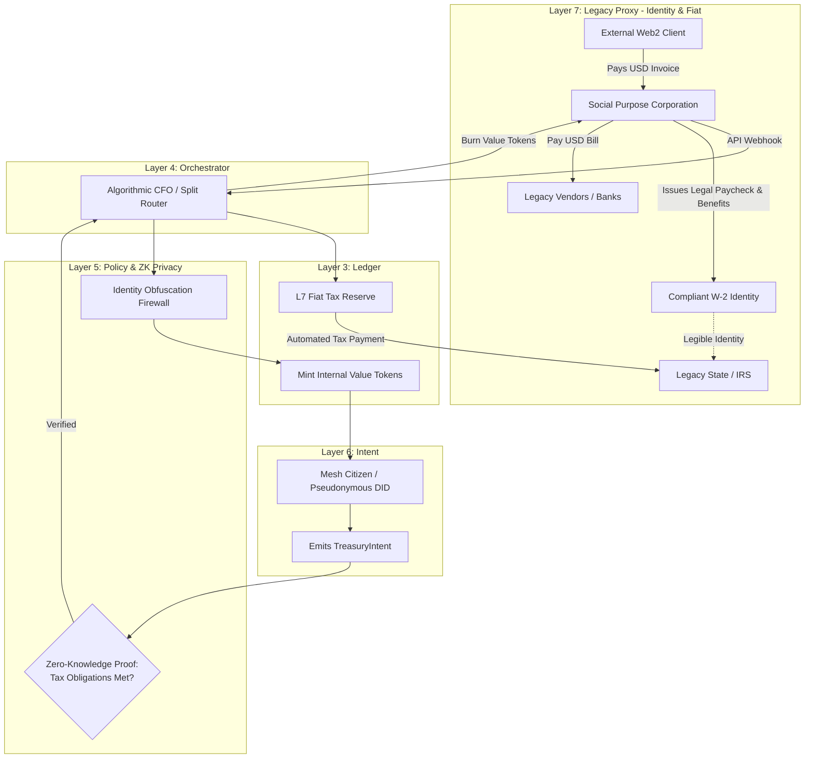

# Scenario Pi: The Sovereign Guild (Identity & Treasury)

*   **Identifier:** `SCN-PI-GUILD`
*   **System Epic:** Employer of Record (EOR), Legacy Identity Shielding, and Treasury Pooling
*   **Primary Layers Tested:** L3 (Ledger), L4 (Orchestrator), L5 (Governance), L6 (Semantic), L7 (Proxy)
*   **Pass/Fail Metric:** Successful routing of external fiat gig-labor into internal Value Tokens; generation of perfectly compliant, state-recognized W-2 tax forms for citizens; successful cryptographic blinding of internal mesh activities from legacy state surveillance.

---

## 1. Problem Statement & Legacy Failure

In the legacy capitalist system, independent laborers, creators, and freelancers are heavily penalized. They suffer from the "1099 Tax Trap" (paying double self-employment taxes), they cannot collectively bargain for health insurance, and they are frequently denied legacy housing (mortgages/leases) because banks deem gig income "irregular" or "illegible."
Simultaneously, the legacy state requires total surveillance of economic activity. It demands that a citizen's physical identity (SSN/KYC) be tied to every transaction. If a decentralized collective attempts to pool money without formal legal structures, legacy authorities classify it as tax evasion, money laundering, or an unregistered security.

## 2. The Collective Workflow (7-Layer Traversal)

Scenario Pi establishes the Node as a Sovereign Guild. It operates an internal algorithmic treasury that pools external fiat income, legally pays the legacy state its required taxes, and issues standardized, highly legible legacy identities to its citizens so they can interface with the old world safely.

### Layer 7: The Legacy Proxy (Employer of Record & Identity Representation)
*   **The W-2 Identity Shield:** The Social Purpose Corporation (SPC) acts as a legal Employer of Record (EOR). When a mesh citizen executes freelance work (coding, consulting, carpentry) for a legacy client, they do *not* bill as an individual. They bill as the SPC. The legacy client pays the SPC in fiat USD.
*   **Legacy Legibility:** The SPC takes the fiat, automatically pays the legacy payroll taxes to the IRS, and issues a standard, predictable W-2 paycheck to the citizen's legacy bank account. To a legacy landlord or mortgage broker, the citizen appears to be a stable, employed corporate worker with group health insurance. Their radical, decentralized lifestyle is completely obfuscated behind a boring, compliant corporate identity representation.

### Layer 6: Semantic Intent
*   Citizens emit a `TreasuryIntent` with two sub-types: `FiatIngress` (logging an external invoice paid to the SPC) or `ResourceDraw` (requesting mesh Value Tokens or fiat for legacy expenses).

### Layer 5: Policy & Web of Trust (Zero-Knowledge Privacy & Firewalling)
*   **Identity Segregation:** Layer 5 enforces a strict firewall between the L7 Legal Identity (SSN, Legal Name) and the L5 Mesh Identity (DID, Pseudonym). The internal mesh ledger does *not* record a citizen's legal name. It uses Zero-Knowledge (ZK) proofs to attest that "DID_04 has paid their share of the property tax" without revealing *who* DID_04 is.
*   **The Omicron Insulation:** Because of this strict firewall, if a citizen suffers a massive "Social Slashing" in **Scenario Omicron** (losing their internal trust ring reputation), their legacy W-2 employment, health insurance, and external fiat stability provided by the SPC are completely unaffected. The mesh does not destroy legacy survival.
*   **Tax Compliance Gate:** The system algorithmically rejects any `ResourceDraw` if the required fractional fiat reserves for legacy state taxes have not been met. The Guild never defaults on the state.

### Layer 4: Orchestration (The Fiat-to-Token Router)
*   The BPMN engine acts as the automated CFO. 
*   When a $1,000 legacy invoice clears the Stripe API, the BPMN engine executes a deterministic split: 20% to the legacy tax reserve, 10% to the Node's physical property lease (Scenario Epsilon), 10% to the group healthcare pool, and 60% minted as internal Value Tokens to the citizen's CRDT wallet.

### Layer 3: Ledger (The Osmotic Membrane)
*   The Ledger handles the bidirectional exchange. Citizens can burn their internal Value Tokens to have the SPC pay a legacy fiat bill on their behalf (e.g., paying for an AWS server or a legacy car repair). 

### Layer 2 & 1: Digital Twin & Physical Reality
*   **Telemetry (L2):** Secure APIs connect the L4 orchestrator to legacy banking infrastructure (e.g., Plaid/Stripe) to trigger internal state changes only when cryptographic proof of fiat settlement is received.
*   **Physical (L1):** The actual labor performed by the citizen in the physical or digital world to generate the external value.

---



---

## 3. Oasis Engine Implementation Specification

In the C++ Oasis engine, Scenario Pi introduces the "Fiat/Token Exchange" mechanics and identity masking:

*   **Dual-Ledger Wallet:** The `CRDTWallet` class must support a multi-asset struct: `ValueTokens` (internal thermodynamics) and `FiatReserve` (external legacy currency).
*   **Tax State Machine:** The engine must run a background daemon that periodically deducts `FiatReserve` from all active DIDs to satisfy the chunk's `Legacy_Tax_Burden` property. If a chunk cannot pay its legacy tax, the engine spawns a `FORECLOSURE_WARNING` event.
*   **ZK-Proof Mocking:** The engine implements a mock ZK-SNARK verification function. A player entity can prove they belong to the `Tax_Compliant_Group` to unlock a `COMMUNITY_VAULT` voxel, without exposing their entity ID to the vault's access logs.

---

```json
{
  "@context": [
    "[https://schema.org/](https://schema.org/)",
    "[https://collective.network/ontology/v1/](https://collective.network/ontology/v1/)"
  ],
  "@type": "TreasuryIntent",
  "identifier": "urn:uuid:11a2b3c4-d5e6-7f8a-9b0c-1d2e3f4a5b6c",
  "issuerDid": "did:mesh:node04:freelance_dev_jules",
  "intentType": "FiatIngress_Split",
  "externalTransaction": {
    "sourceEntity": "Legacy_Corporate_Client_LLC",
    "fiatAmountUsd": 1500.00,
    "stripeReferenceId": "ch_3M4xyz8a9b0c1d2e3f"
  },
  "algorithmicRouting": {
    "legacyTaxWithholdingPercent": 22.5,
    "commonsLeaseContributionPercent": 10.0,
    "healthcarePoolPercent": 7.5,
    "targetValueTokenMintPercent": 60.0
  },
  "privacyConstraints": {
    "zeroKnowledgeIdentifier": "zkp:proof_of_compliance:0x9f8e7d...",
    "exposeLegalIdentityToLedger": false
  }
}
```

---

## 4. Acceptance Test Gates (Pass/Fail)

| Checkpoint | Validation Method | Pass Condition |
| :--- | :--- | :--- |
| **G1: The W-2 Shield** | L7 API Webhook Sim | A mock fiat deposit from an external client successfully triggers the L4 BPMN split, withholding exactly the configured tax percentage before minting internal Value Tokens. |
| **G2: ZK Identity Blinding** | Log Verification | An audit of the C++ engine's internal transaction logs reveals zero instances of legacy strings (SSN, Legal Name) tied to specific DID Value Token transfers. |
| **G3: Property Tax Pooling** | Deficit Lockout | If the simulated chunk's aggregate `FiatReserve` is insufficient to pay the legacy state, the BPMN engine automatically suspends non-essential `ResourceDraw` intents until the deficit is cleared. |
| **G4: Bidirectional Liquidity** | Token Burn | A simulated user successfully burns internal Value Tokens, resulting in an automated mock API call to the SPC treasury to dispatch fiat USD to an external legacy vendor. |
