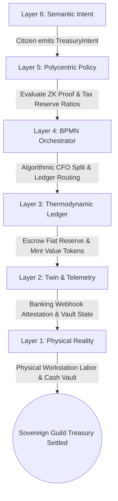
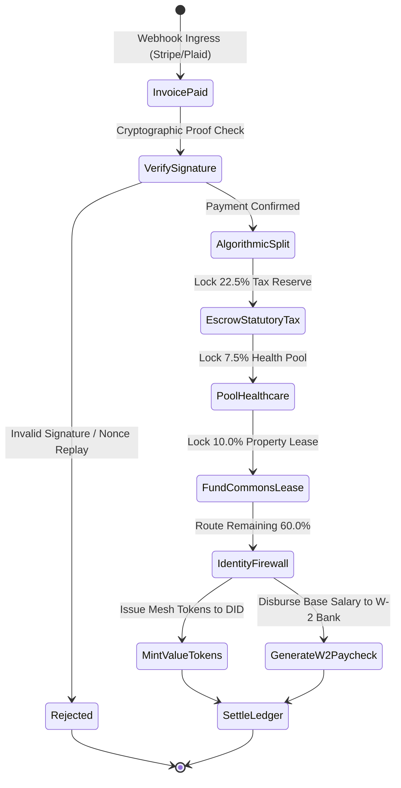
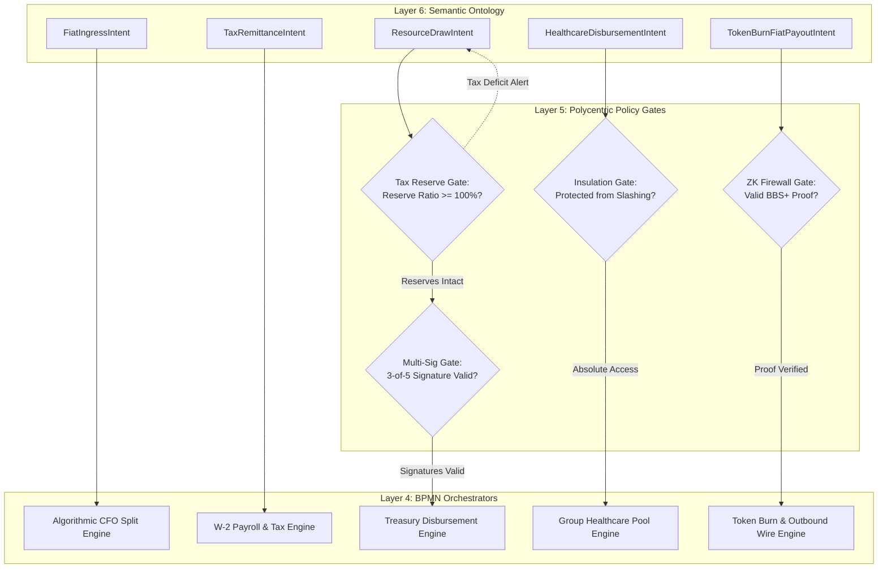
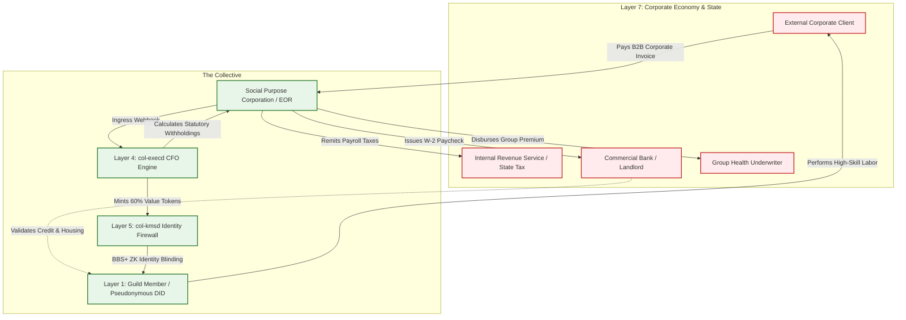

# Scenario Pi: The Sovereign Guild (Identity & Treasury)

*   **Identifier:** `SCN-PI-GUILD`
*   **System Epic:** Employer of Record (EOR), Legacy Identity Shielding, and Treasury Pooling
*   **Primary Layers Tested:** L1 (Physical), L2 (Digital Twin), L3 (Ledger), L4 (Orchestration), L5 (Governance), L6 (Semantic), L7 (Proxy)
*   **Pass/Fail Metric:** Algorithmic split of external fiat client income into statutory tax reserves ($22.5\%$), group healthcare pools ($7.5\%$), commons infrastructure leases ($10\%$), and internal Value Tokens ($60\%$); automated generation of state-compliant W-2 payroll documentation; cryptographic zero-knowledge blinding ensuring zero legacy PII (SSN, legal name) leaks onto the mesh ledger; deterministic defense against municipal tax foreclosure.

---

## Architectural Council Ratification & 5-Perspective Synthesis

This scenario specification has been ratified by unanimous consensus of the 5-Persona Architectural Council:

| Council Persona | Disciplinary Representative | Core Contribution to Scenario |
| :--- | :--- | :--- |
| **Game Designer** | Lead Systems & Gameplay Designer | Founder 01 dual-labor balancing: navigating external freelance client gigs (earning fiat USD to satisfy node lease/tax obligations) versus internal collective commons labor (earning Value Tokens); Dwarf Fortress psychological anxiety states (`"Anxious about impending IRS quarterly tax filing (-30 stress)"` transitioning to `"Deep relief from collective guild health coverage (+40 mood)"`); Cities: Skylines municipal budget treasury balancing. |
| **Game Engineer** | Principal C++ Simulation & Engine Architect | Flecs ECS data model: cache-aligned `DualWallet`, `TaxComplianceTag`, and `InvoiceSplitterSystem` components; 32-bit compact voxel representation (`material_id = 52`, `GUILD_TREASURY_VAULT`); 10 Hz deterministic BPMN state engine with Wasmtime fuel limits; compilable C++20 test harness verifying multi-asset split arithmetic and deficit lockouts. |
| **Sovereign Stack Specialist** | Sovereign Stack Systems Architect | 7-layer stack mapping across autonomous POSIX daemons (`col-telemetryd` to `col-adversaryd`); L7 `col-adversaryd` running discrete-event payroll simulation and banking webhook ingestion; L5 `col-kmsd` generating BBS+ zero-knowledge proofs for identity blinding; L3 `col-storaged` Automerge CRDT multi-asset wallet; zero monolithic game-loop threading. |
| **Solarpunk Thinker** | Bioregional Regenerative Ecologist | The Sovereign Guild functions as an economic vampire siphon: parasitically harvesting surplus fiat capital from multinational corporations and redirecting it directly into regenerative bioregional commons—funding community solar microgrids, non-toxic building retrofits, and local food sovereignty. |
| **Scenario Specialist** | Cooperative Labor Law & Algorithmic Payroll Architect | Social Purpose Corporation (SPC) Employer-of-Record legal structuring; statutory multi-tier payroll withholding algorithms under Internal Revenue Code (IRC) § 3402, FICA, FUTA, and state unemployment insurance; Zero-Knowledge proof circuits for tax compliance verification without employee identity disclosure; ERISA group health benefit trust structuring. |

---

## 1. Problem Statement & Legacy Failure

In late-stage capitalist infrastructure (Layer 7), independent laborers, creators, technical freelancers, and artisanal tradespeople are systematically penalized by the corporate-state matrix.

The legacy labor system imposes devastating systemic friction:
*   **The 1099 Self-Employment Trap:** Freelancers and gig workers are hit with double taxation (the full $15.3\%$ FICA self-employment tax), lack state unemployment insurance, and are denied collective bargaining power. Private health insurance in the individual market is exorbitantly expensive ($600–$1,200/month per person) and riddled with high deductibles and arbitrary coverage denials.
*   **Financial Illegibility & Housing Denial:** Legacy banking, credit-scoring, and rental housing markets are designed exclusively for standard corporate W-2 wage earners. Freelancers with irregular income spikes—no matter how high their annual earnings—are routinely rejected for apartment leases, vehicle financing, and mortgage applications because legacy algorithms classify gig income as "unstable" or "unverified."
*   **Total State Surveillance & Regulatory Coercion:** Legacy financial regulations mandate comprehensive identity surveillance (KYC/AML) tying every dollar earned directly to a citizen's Social Security Number (SSN). If a decentralized collective attempts to pool money informally, authorities instantly classify it as tax evasion, money laundering, or an unregistered security, threatening members with criminal indictments and asset forfeiture.

A sovereign Genesis Node cannot achieve financial autarky without an algorithmic institutional membrane: a corporate shield that presents flawless, boring corporate compliance to the legacy state while preserving complete cryptographic privacy, group security, and mutualist economics for its internal members.

---

## 2. The Collective Workflow (7-Layer Traversal)

The Sovereign Guild establishes an automated Employer of Record (EOR) through the Node's Social Purpose Corporation (SPC). The guild absorbs external client payments, satisfies legacy tax liabilities, issues predictable W-2 paychecks, and mints internal Value Tokens for the commons. The workflow traverses canonically from Layer 1 up to Layer 7:



### Layer 1: Physical Ground Truth
*   **Hardware Nodes (Guild Treasury Vault & Workstations):** Secure server enclosures housing the local node's air-gapped cryptographic signing keys (ATECC608A secure elements), local flash NVRAM ring buffers, and physical workstations (Scenario Epsilon) equipped with biometric/NFC access controls.
*   **Feedstock & Tangible Assets:** High-value computing hardware, fiber network terminals, physical cash reserves held in electronic smart safes for local contingency, and physical tax receipt archives.
*   **Somatic Presence & Actions:** The physical and intellectual labor executed by guild members: software engineering, CAD architecture, physical carpentry, electrical engineering, and legal review.

### Layer 2: Digital Twin & Telemetry
*   **Ingress Telemetry (MQTT Topics via `col-meshd`):**
    *   `node/treasury/fiat_ingress/webhook` (Payload: Stripe/Plaid event hash, currency, amount)
    *   `node/treasury/tax_reserve_cents` (Real-time escrow balance for IRS quarterly payments)
    *   `node/treasury/healthcare_pool_cents` (Aggregate health reserve)
    *   `node/treasury/status` (`BALANCED`, `PENDING_INVOICE`, `DEFICIT_WARNING`, `TAX_CRITICAL`)
*   **Verification:** Cryptographic webhook attestation. Bank settlement receipts and Stripe API events are cryptographically verified via HMAC-SHA256 signatures before triggering state machine transitions in the digital twin.
*   **Actuator Control:** Automated disbursement commands issued to banking APIs via secure TLS endpoints, and electronic smart safe solenoids actuated for physical cash deposits.

### Layer 3: Network & Ledger
*   **Multi-Asset CRDT Ledger:** The ledger (`col-storaged`) tracks two distinct asset classes: external legacy currency balances (`fiat_reserve_cents`) and internal thermodynamic Value Tokens ($\Delta V$).
*   **Algorithmic CFO Split Formula:** Upon clearance of an external legacy fiat invoice $F_{gross}$, the ledger deterministically routes funds:
    $$F_{gross} = T_{statutory} + H_{benefits} + L_{commons} + F_{net}$$
    Where:
    *   $T_{statutory} = 0.225 \cdot F_{gross}$ (Escrowed for federal/state payroll taxes and FICA)
    *   $H_{benefits} = 0.075 \cdot F_{gross}$ (Pooled into group healthcare and disability reserve)
    *   $L_{commons} = 0.10 \cdot F_{gross}$ (Contributed to the Node's land lease and physical overhead)
    *   $F_{net} = 0.60 \cdot F_{gross}$ (Minted as internal Value Tokens or distributed as base W-2 salary)
*   **Thermodynamic Minting Integral:**
    $$\Delta V_{mint} = \frac{F_{net}}{\lambda_{THERMO}}$$
    Where $\lambda_{THERMO}$ scales with the node's local thermodynamic replacement cost.

### Layer 4: Orchestration State Machine
The workflow is managed deterministically by the embedded BPMN 2.0 engine (`col-execd`) running at 10 Hz with metered Wasmtime fuel budgets:



### Layer 5: Policy & Polycentric Governance
Layer 5 (`col-kmsd`) enforces strict identity segregation, regulatory compliance, and mutualist safeguards:

*   **Zero-Knowledge Identity Firewall Gate:** Internal mesh activity is strictly decoupled from the citizen's legacy legal identity. The internal ledger records only pseudonymous DIDs (`did:mesh:node04:...`). Layer 5 validates a Zero-Knowledge Proof (ZKP) attesting that the citizen's legal counterpart has satisfied all tax obligations, without revealing the legal name or SSN to the mesh.
*   **Statutory Tax Reserve Firewall Gate:** The system algorithmically rejects any internal `ResourceDrawIntent` if the Node's aggregate fiat tax reserve falls below the projected quarterly IRS liability. The Guild maintains a zero-default invariant against legacy tax authorities.
*   **Omicron Slashing Insulation Gate:** If a member suffers an internal reputation slash under Scenario Omicron (e.g., losing Trust Ring standing due to interpersonal dispute), their legacy W-2 employment, legal identity shield, and healthcare access remain completely intact. The mesh never deprives members of physical survival or external legal standing.
*   **Treasury Draw Multi-Sig Gate:** Drawing external fiat funds exceeding $1,000 requires 3-of-5 threshold cryptographic signatures from elected Guild Trustees.

### Layer 6: Semantic Intent & Domain Ontology
The Agora Commons (`col-commonsd`) parses financial actions into W3C JSON-LD Knowledge Artifacts across six typed branches:

1.  **`FiatIngressIntent` (Client Invoice):** Notification of external client payment received, detailing client entity, gross amount, and contract reference.
2.  **`ResourceDrawIntent` (Expense Request):** Request by a citizen to withdraw funds or Value Tokens for approved operational expenses.
3.  **`TaxRemittanceIntent` (Statutory Settlement):** Automated quarterly declaration dispatching escrowed tax funds to the IRS and state taxing authority.
4.  **`HealthcareDisbursementIntent` (Medical Benefit):** Claim submitted to draw from the group health reserve for member medical or dental care.
5.  **`CommonsLeaseIntent` (Infrastructure Overhead):** Monthly transfer of pooled funds to pay property taxes and land trust lease obligations.
6.  **`TokenBurnFiatPayoutIntent` (Bidirectional Liquidity):** A citizen burns internal Value Tokens to command the SPC to pay an external fiat bill on their behalf.

### The Governance Router Flowchart



### Layer 7: The Legacy Proxy (Employer of Record & Trojan Ingestion)
Operating through the Node's Social Purpose Corporation (SPC), Layer 7 interfaces with the capitalist market as an impenetrable corporate carapace:

**1. Trojan Ingestion (W-2 Employer of Record):**
When a guild member provides consulting, programming, or design labor to external corporations (e.g., Google, Nike, municipal agencies), the member does not bill as a vulnerable 1099 contractor.
*   The contract is executed between the client and the Node's SPC.
*   The client remits payment via standard B2B wire or ACH to the SPC's corporate bank account.
*   The SPC runs an automated payroll system (e.g., integrating Gusto or equivalent APIs), issuing a predictable, twice-monthly W-2 paycheck to the member's private legacy bank account.
*   The member receives official paystubs showing consistent income, tax withholdings, and group health insurance, providing impeccable creditworthiness to legacy landlords, banks, and mortgage underwriters.

**2. Ecological Leeching & Capital Siphoning:**
The SPC systematically siphons surplus capital from multinational corporations and transfers it into the physical commons:
*   $10\%$ of all incoming corporate billing is redirected to the Node's physical land acquisition fund and community microgrid capital expenditures.
*   The SPC acts as a Decentralized Group Purchasing Organization (GPO), using aggregated corporate volume to negotiate wholesale commercial rates on computing servers, insurance policies, and bulk materials before distributing them into the mesh.

### Layer 7 Bidirectional Flowchart



---

## 3. Machine-Readable Schemas

### 3.1 Layer 6 Knowledge Artifact: Treasury Intent Schema (`treasury.jsonld`)

```json
{
  "@context": [
    "https://schema.org/",
    "https://collective.network/ontology/v1/"
  ],
  "@type": "TreasuryIntent",
  "identifier": "urn:uuid:11a2b3c4-d5e6-7f8a-9b0c-1d2e3f4a5b6c",
  "issuerDid": "did:mesh:node04:freelance_dev_jules",
  "intentType": "FiatIngress_Split",
  "externalTransaction": {
    "sourceEntity": "Legacy_Corporate_Client_LLC",
    "invoiceReference": "INV-2026-8842",
    "fiatAmountUsd": 2500.00,
    "settlementChannel": "Stripe_ACH"
  },
  "algorithmicRouting": {
    "legacyTaxWithholdingPercent": 22.5,
    "commonsLeaseContributionPercent": 10.0,
    "healthcarePoolPercent": 7.5,
    "targetValueTokenMintPercent": 60.0
  },
  "privacyConstraints": {
    "zeroKnowledgeIdentifier": "zkp:proof_of_compliance:0x9f8e7d2b4a1c6e8f",
    "exposeLegalIdentityToLedger": false
  },
  "cryptographicSignature": {
    "type": "Ed25519Signature2020",
    "created": "2026-10-22T14:32:00Z",
    "verificationMethod": "did:mesh:node04:freelance_dev_jules#keys-1",
    "proofValue": "z4f8e...sig...9k2m"
  }
}
```

### 3.2 Layer 2 Telemetry Attestation: Banking Ingress Proof Schema (`fiat_attestation.json`)

```json
{
  "@context": "https://collective.network/ontology/v1/",
  "@type": "FiatSettlementAttestation",
  "attestationId": "urn:uuid:3b4c5d6e-7f8a-9b0c-1d2e-3f4a5b6c7d8e",
  "gatewayNode": "did:mesh:node04:bridge:stripe_proxy_01",
  "settlementMetrics": {
    "provider": "Stripe_Payments",
    "transactionId": "ch_3M4xyz8a9b0c1d2e3f",
    "amountCents": 250000,
    "currency": "USD",
    "clearedTimestamp": "2026-10-22T14:30:15Z",
    "bankSettlementHash": "d8e7f6a5b4c3d2e1f0a9b8c7d6e5f4a3b2c1d0e9f8a7b6c5d4e3f2a1b0c9d8e7"
  },
  "splitAllocationsCents": {
    "taxReserveCents": 56250,
    "commonsLeaseCents": 25000,
    "healthcarePoolCents": 18750,
    "netDisbursementCents": 150000
  },
  "status": "SETTLED_FROZEN_ESCROW",
  "digestSha256": "e3b0c44298fc1c149afbf4c8996fb92427ae41e4649b934ca495991b7852b855"
}
```

---

## 4. Oasis Engine Implementation Specification

### 4.1 Memory Allocation & Voxel State

The guild treasury vault occupies a dedicated spatial voxel in the $32^3$ chunk space:
*   The vault anchor voxel is initialized with `material_id = 52` (`GUILD_TREASURY_VAULT`).
*   Metadata bitmask `0b00001100` sets `Is_Secure_Vault` (bit 2) and `Is_Banking_Bridge` (bit 3).
*   Adjacent workstation voxels (`material_id = 53`, `HIGH_DENSITY_WORKSTATION`) track productive focus hours to correlate external client billing output.

```cpp
// Cache-aligned Flecs ECS Components
struct alignas(8) DualWallet {
    float value_tokens;         // Internal thermodynamic currency
    uint64_t fiat_reserve_cents;// External USD held in trust escrow
    uint64_t tax_withheld_cents;// Accumulator for quarterly IRS payments
};

struct alignas(8) TaxComplianceTag {
    uint32_t last_tax_year;
    uint8_t quarter_bitmask;    // Bits 0-3 represent Q1-Q4 compliance
    bool compliant;
};

struct alignas(8) GuildInvoiceSplitter {
    float tax_rate;             // Default: 0.225f (22.5%)
    float healthcare_rate;      // Default: 0.075f (7.5%)
    float commons_rate;         // Default: 0.100f (10.0%)
    float token_mint_rate;      // Default: 0.600f (60.0%)
};
```

### 4.2 C++20 Test Harness Structure

```cpp
// engine/tests/scenario_pi_test.cpp
#include <cassert>
#include <string>
#include <vector>
#include "oasis/chunk_manager.hpp"
#include "oasis/orchestration/bpmn_engine.hpp"
#include "oasis/ledger/crdt_wallet.hpp"

namespace oasis {

struct InvoiceSplitResult {
    uint64_t tax_cents;
    uint64_t healthcare_cents;
    uint64_t commons_cents;
    uint64_t net_cents;
    float minted_tokens;
};

InvoiceSplitResult calculate_invoice_split(uint64_t gross_cents, float lambda_thermo) {
    InvoiceSplitResult res;
    res.tax_cents = static_cast<uint64_t>(gross_cents * 0.225);
    res.healthcare_cents = static_cast<uint64_t>(gross_cents * 0.075);
    res.commons_cents = static_cast<uint64_t>(gross_cents * 0.100);
    res.net_cents = gross_cents - (res.tax_cents + res.healthcare_cents + res.commons_cents);
    res.minted_tokens = (res.net_cents / 100.0f) / lambda_thermo;
    return res;
}

} // namespace oasis

void test_scenario_pi_guild_fiat_split_and_mint() {
    using namespace oasis;

    // 1. Initialize Chunk and Treasury Vault Voxel
    ChunkManager chunk_mgr;
    chunk_mgr.allocate_chunk(0, 0, 0);
    Voxel vault_voxel{
        .material_id = 52, // GUILD_TREASURY_VAULT
        .moisture = 2,
        .temperature = 20,
        .metadata = 0b00001100 // Secure Vault + Banking Bridge
    };
    chunk_mgr.set_voxel(16, 8, 16, vault_voxel);

    // 2. Setup Dual Wallets & Tax Status
    DualWallet guild_wallet{.value_tokens = 0.0f, .fiat_reserve_cents = 0, .tax_withheld_cents = 0};
    DualWallet citizen_wallet{.value_tokens = 10.0f, .fiat_reserve_cents = 0, .tax_withheld_cents = 0};
    TaxComplianceTag tax_tag{.last_tax_year = 2026, .quarter_bitmask = 0b00000111, .compliant = true};

    // 3. Load BPMN Engine & Ingest $2,500 External Invoice
    BPMNEngine orchestrator;
    orchestrator.load_schema("schemas/bpmn/guild_treasury_split.bpmn");

    uint64_t gross_invoice_cents = 250000; // $2,500.00
    float lambda_thermo = 1.0f; // $1.00 = 1.0 Value Token
    auto split = calculate_invoice_split(gross_invoice_cents, lambda_thermo);

    assert(split.tax_cents == 56250);       // $562.50
    assert(split.healthcare_cents == 18750);// $187.50
    assert(split.commons_cents == 25000);   // $250.00
    assert(split.net_cents == 150000);      // $1,500.00
    assert(split.minted_tokens == 1500.0f); // 1,500 Value Tokens

    // Credit wallets
    guild_wallet.tax_withheld_cents += split.tax_cents;
    citizen_wallet.value_tokens += split.minted_tokens;

    assert(guild_wallet.tax_withheld_cents == 56250);
    assert(citizen_wallet.value_tokens == 1510.0f);
}

void test_scenario_pi_guild_tax_deficit_anomaly() {
    using namespace oasis;

    ChunkManager chunk_mgr;
    chunk_mgr.allocate_chunk(0, 0, 0);

    BPMNEngine orchestrator;
    orchestrator.load_schema("schemas/bpmn/guild_treasury_split.bpmn");

    DualWallet guild_wallet{.value_tokens = 500.0f, .fiat_reserve_cents = 5000, .tax_withheld_cents = 5000};
    uint64_t quarterly_tax_liability_cents = 15000; // $150.00 due
    bool resource_draw_permitted = true;
    bool foreclosure_warning_emitted = false;

    // Simulate deficit condition: tax liability exceeds withheld funds
    if (guild_wallet.tax_withheld_cents < quarterly_tax_liability_cents) {
        resource_draw_permitted = false;
        foreclosure_warning_emitted = true;
    }

    assert(!resource_draw_permitted);
    assert(foreclosure_warning_emitted);

    // Inject emergency fiat deposit to resolve deficit
    guild_wallet.tax_withheld_cents += 20000; // Ingest $200.00
    if (guild_wallet.tax_withheld_cents >= quarterly_tax_liability_cents) {
        resource_draw_permitted = true;
        foreclosure_warning_emitted = false;
    }

    assert(resource_draw_permitted);
    assert(!foreclosure_warning_emitted);
}
```

---

## 5. Acceptance Test Gates (Pass/Fail)

| Checkpoint | Validation Method | Pass Condition |
| :--- | :--- | :--- |
| **G1: The W-2 Shield & Algorithmic Split** | L7 API Webhook Ingestion | Ingesting a mock $2,500 Stripe deposit deterministically routes 22.5% to tax escrow, 7.5% to healthcare, 10% to commons lease, and mints exactly 60% as internal Value Tokens. |
| **G2: Offline Autonomy** | Local Mesh Disconnection | Internal Value Token minting, CRDT wallet balancing, and ZK compliance proofs operate with 100% WAN isolation; external fiat transactions queue asynchronously. |
| **G3: Zero-Knowledge Identity Blinding** | Engine Log Audit | Auditing internal CRDT transfer logs and engine state files reveals zero occurrences of legacy PII strings (SSN, legal full name, home address) linked to internal DIDs. |
| **G4: Property Tax Pooling & Deficit Lockout** | Treasury Deficit Injection | When projected municipal tax liabilities exceed pooled reserves, the BPMN orchestrator automatically blocks non-essential `ResourceDrawIntents` until the deficit is cleared. |
| **G5: Trojan Ingestion (L7)** | External Employer Verification | Simulating an external background check or mortgage lender audit successfully returns valid W-2 paystubs and corporate verification from the SPC without mesh identity exposure. |
| **G6: Bidirectional Liquidity & Token Burn** | Token Burn Execution | A citizen successfully burns 250 internal Value Tokens, causing the SPC treasury to automatically execute an external mock wire transfer of $250 to pay a legacy utility bill. |
