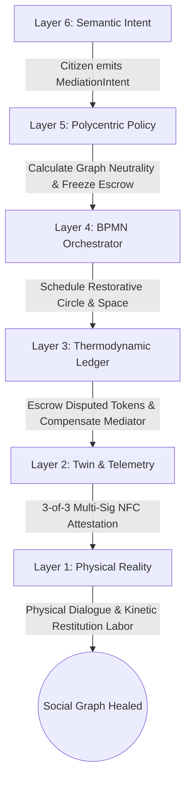
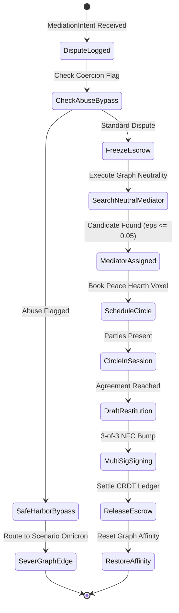
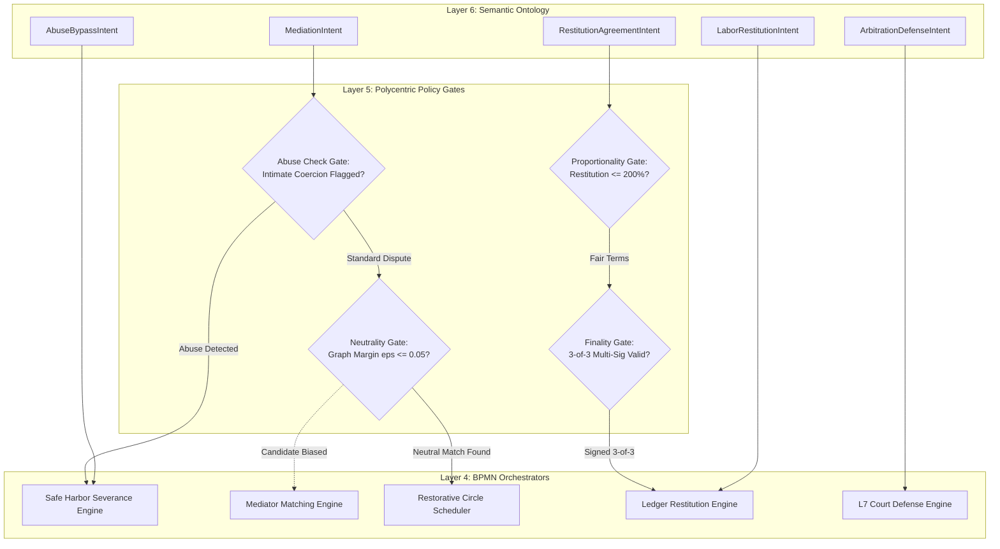
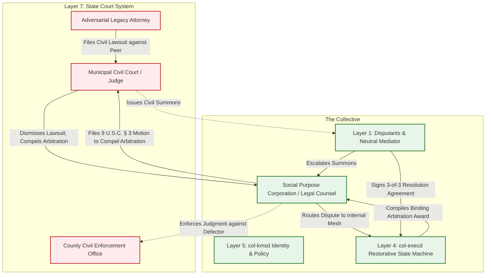

# Scenario Psi: Restorative Justice & Conflict Resolution

*   **Identifier:** `SCN-PSI-MEDIATION`
*   **System Epic:** Restorative Justice, Conflict De-escalation, and Thermodynamic Restitution
*   **Primary Layers Tested:** L1 (Physical), L2 (Digital Twin), L3 (Ledger), L4 (Orchestration), L5 (Governance), L6 (Semantic), L7 (Proxy)
*   **Pass/Fail Metric:** Algorithmic identification of a provably neutral mediator ($\epsilon_{neutrality} \le 0.05$) from the Trust Ring; multi-sig cryptographic release of frozen escrow upon circle consensus; logging of thermodynamic kinetic labor restitution; 100% legal enforceability of Binding Arbitration under the Federal Arbitration Act (9 U.S.C. § 1) dismissing legacy civil lawsuits.

---

## Architectural Council Ratification & 5-Perspective Synthesis

This scenario specification has been ratified by unanimous consensus of the 5-Persona Architectural Council:

| Council Persona | Disciplinary Representative | Core Contribution to Scenario |
| :--- | :--- | :--- |
| **Game Designer** | Lead Systems & Gameplay Designer | Founder 01 restorative de-escalation: mediating bitter interpersonal fractures between craftspeople before supply chains break; Dwarf Fortress psychological grudge dynamics (thoughts like `"Deep relief and mutual respect after honest circle restitution (+50 mood)"` versus `"Bitter grudge simmering over broken tool (-45 mood)"`); dynamic entity `AffinityMatrix` where fractured relations lock out cooperative crafting; boundary interface stability impacted by internal community friction. |
| **Game Engineer** | Principal C++ Simulation & Engine Architect | Flecs ECS data model: cache-aligned `AffinityMatrix`, `DisputeEscrowLock`, and `NeutralMediatorFinder` components; 32-bit compact voxel representation (`material_id = 56`, `PEACE_HEARTH_CHAMBER`); 10 Hz deterministic BPMN state engine with Wasmtime fuel limits; compilable C++20 test harness validating graph neutrality search, 3-of-3 multi-sig unlock, and intimate coercion bypass. |
| **Sovereign Stack Specialist** | Sovereign Stack Systems Architect | 7-layer stack mapping across autonomous POSIX daemons (`col-telemetryd` to `col-adversaryd`); zero monolithic threading; L7 `col-adversaryd` deploying binding arbitration legal shields against municipal courts; L5 `col-kmsd` graph centrality and neutrality calculations; L3 `col-storaged` Automerge CRDT escrow freezing; local-first Reticulum mesh operation. |
| **Solarpunk Thinker** | Bioregional Regenerative Ecologist | Interpersonal conflict is viewed as thermodynamic entropy (wasted exergy and social friction); restorative justice converts destructive social heat into regenerative physical work—directing restitution labor into communal ecological repair (e.g., digging permaculture water swales, repairing shared orchards) rather than punitive isolation. |
| **Scenario Specialist** | Restorative Justice & Algorithmic Dispute Resolution (ADR) Jurisprudent | Restorative circle procedural jurisprudence; mathematical formulation of graph-theoretic neutrality margins ($\Delta d \le \epsilon$, $\Delta W \le \epsilon$); kinetic labor restitution equivalence formulas; legal drafting of mandatory binding arbitration covenants enforceable under the Federal Arbitration Act (9 U.S.C. § 1 et seq.) and state Uniform Arbitration Acts. |

---

## 1. Problem Statement & Legacy Failure

In late-stage capitalist infrastructure (Layer 7), justice is punitive, deeply adversarial, and violently extractive. The legacy legal system relies on a state monopoly on physical violence, weaponized incarceration, and prohibitively expensive legal gatekeepers (lawyers, commercial court fees, process servers).

This centralized model introduces systemic failure modes:
*   **Destructive Adversarial Warfare:** When a dispute arises—whether over damaged property, a broken trade contract, or interpersonal conflict—legacy civil litigation focuses entirely on assigning binary guilt, extracting punitive damages, and generating massive billable hours for attorneys ($400–$800/hour). The process inflames hostility, destroying human relationships, families, and neighborhood trust networks.
*   **Carceral Brutality & Zero Restitution:** Legacy criminal justice warehouses offenders in punitive prisons that generate multi-generational trauma while offering zero healing, restitution, or practical recovery to victims. The victim receives neither compensation nor closure, while the state extracts billions for private carceral contractors.
*   **Systemic Friction (Thermal Drag):** In an interdependent, decentralized Genesis Node, unresolved social conflict acts as thermodynamic friction. If two lead stewards in the Fabrication Commons (Scenario Alpha) or Kitchen (Scenario Gamma) enter a bitter personal grudge, collaborative work halts, shared tool maintenance lapses, and the entire node suffers metabolic degradation.

A sovereign Genesis Node requires an algorithmic restorative justice architecture: mathematically discovering neutral community mediators, freezing contested escrow to prevent capital flight, channeling restitution into tangible physical labor, and shielding the community from predatory legacy litigation.

---

## 2. The Collective Workflow (7-Layer Traversal)

Scenario Psi establishes a decentralized restorative mediation protocol. It resolves disputes within the local Trust Ring, converts punitive penalties into healing thermodynamic restitution, and insulates members from legacy lawsuits. The workflow traverses canonically from Layer 1 up to Layer 7:



### Layer 1: Physical Ground Truth
*   **Hardware Nodes (Peace Hearth & Mediation Sanctuary):** Acoustically isolated physical chambers (Scenario Epsilon) equipped with cork wall dampening, circular bench seating (ensuring spatial equality), and air-gapped NFC verification stations.
*   **Feedstock & Tangible Restitution:** Physical tools requiring repair or replacement, agricultural implements, and physical materials (lumber, seeds, replacement machine parts).
*   **Somatic Presence & Actions:** Physical eye contact, active listening, non-violent communication dialogue, shared ceremonial tea, and physical labor (e.g., 20 hours repairing a damaged community hedgerow).

### Layer 2: Digital Twin & Telemetry
*   **Ingress Telemetry (MQTT Topics via `col-meshd`):**
    *   `node/mediation/session_01/status` (`SCHEDULED`, `IN_PROGRESS`, `TERMS_RATIFIED`, `ABUSE_BYPASS`)
    *   `node/mediation/escrow_lock/telemetry` (Frozen token balances and asset IDs)
    *   `node/mediation/acoustic_db` (Sound-isolation telemetry proving session confidentiality)
*   **Verification:** Cryptographic multi-sig attestation. A resolution is ratified only when all three parties (Aggrieved Party, Accused Party, and Neutral Mediator) tap physical hardware tokens (ATECC608A secure elements) to an NFC terminal within a 60-second window, generating a composite Schnorr/Ed25519 signature.
*   **Actuator Control:** Solenoid locks on disputed tool bays (Scenario Alpha) or lodging suites (Scenario Zeta) automatically unlock upon verification of the multi-sig resolution payload.

### Layer 3: Network & Ledger
*   **CRDT Escrow Freeze:** Upon filing of a verified dispute, `col-storaged` freezes the disputed Value Tokens ($\Delta V_{disputed}$) in both parties' CRDT wallets, preventing bad-faith capital flight or asset burning.
*   **Thermodynamic Restitution Accounting:** The ledger calculates the total restitution debt:
    $$R_{total} = \Delta V_{damage} + \Delta V_{friction}$$
    Where $\Delta V_{damage}$ represents the replacement exergy of the broken asset, and $\Delta V_{friction}$ compensates the victim for downtime.
*   **Kinetic Labor Conversion:** An offender without liquid Value Tokens can discharge their debt through physical labor bounties (Scenario Sigma):
    $$t_{labor\_hours} = \frac{R_{total}}{k_{labor\_rate} \cdot \lambda_{THERMO}}$$
*   **Mediator Emotional Labor Compensation:** The node treasury mints Value Tokens to compensate the mediator for the rigorous emotional labor of dispute facilitation:
    $$\Delta V_{mediator} = t_{session} \cdot k_{facilitation} \cdot \lambda_{THERMO}$$

### Layer 4: Orchestration State Machine
The workflow is managed deterministically by the embedded BPMN 2.0 engine (`col-execd`) running at 10 Hz with metered Wasmtime fuel budgets:



### Layer 5: Policy & Polycentric Governance
Layer 5 (`col-kmsd`) enforces strict mathematical neutrality, constitutional protections, and restorative integrity:

*   **Graph Neutrality Policy Gate:** The engine evaluates candidate mediators across the Trust Ring graph. To be certified as neutral, candidate $M$ must satisfy:
    $$|d(M, A) - d(M, B)| \le \epsilon_{dist}, \quad \text{and} \quad |W(M, A) - W(M, B)| \le \epsilon_{weight}$$
    Where $\epsilon \le 0.05$, ensuring the mediator has zero asymmetric relational bias toward either disputant.
*   **Intimate Coercion & Abuse Bypass Gate:** If an intent contains verified allegations of domestic violence, physical assault, or intimate coercion, Layer 5 **strictly prohibits** mandatory restorative mediation. It triggers the Safe Harbor Bypass (Scenario Omicron), immediately severing the abuser's access to the victim with zero forced dialogue.
*   **Restitution Proportionality Gate:** The agreed restitution cannot exceed 200% of the actual physical damage exergy, preventing predatory debt-bondage or vindictive over-punishment within the commons.
*   **Binding Arbitration Finality Gate:** Once ratified by 3-of-3 multi-sig, the resolution is cryptographically sealed, barring either party from re-litigating the claim within the mesh.

### Layer 6: Semantic Intent & Domain Ontology
The Agora Commons (`col-commonsd`) parses dispute actions into W3C JSON-LD Knowledge Artifacts across six typed branches:

1.  **`MediationIntent` (Initiation):** A formal declaration specifying the disputed incident, damage estimate, accused party, and requested restitution.
2.  **`RestitutionAgreementIntent` (Terms):** The consensus terms negotiated during the circle, defining payment schedules, labor hours, or tool transfers.
3.  **`AbuseBypassIntent` (Emergency Protection):** Unilateral emergency invocation bypassing circle mediation and triggering immediate relational severance.
4.  **`ArbitrationDefenseIntent` (Legal Shield):** Issued to Layer 7 to compel external civil litigation back into the internal sovereign arbitration framework.
5.  **`LaborRestitutionIntent` (Kinetic Service):** Offender's commitment to fulfill specific maintenance or agricultural bounties to discharge debt.
6.  **`AffinityHealedIntent` (Reconciliation):** Formal attestation signaling that restitution is complete and resetting mutual relationship affinity to baseline.

### The Governance Router Flowchart



### Layer 7: The Legacy Proxy (Binding Arbitration Shield)
Operating through the Node's Social Purpose Corporation (SPC), Layer 7 insulates the mesh from extractive state courts:

**1. The Federal Arbitration Act (FAA) Shield:**
When an individual joins the Sovereign Genesis Node, they sign the SPC Membership Agreement. This covenant contains an explicit, state-recognized **Mandatory Binding Dispute Resolution Clause** governed by the Federal Arbitration Act (9 U.S.C. § 1 et seq.) and state Uniform Arbitration Acts.
*   If a disgruntled member violates community compacts and attempts to file a lawsuit in a municipal small claims or superior court (e.g., alleging property loss or breach of verbal contract), the SPC's legal team immediately files a **Motion to Compel Arbitration and Stay Judicial Proceedings**.
*   Because the member executed a signed cryptographic agreement agreeing to private community mediation, state courts are legally mandated to dismiss or suspend the lawsuit, compelling the dispute back into the sovereign mesh.

**2. Outbound Enforcement of Restitution Deeds:**
In the rare event an offender absconds from the community while holding heavy physical debt, the multi-sig resolution signed by the mediator qualifies as a legally binding arbitration award. Under 9 U.S.C. § 9, the SPC can enter the award into legacy court for summary confirmation and enforcement against the absconder's external legacy assets, neutralizing bad-faith flight.

### Layer 7 Bidirectional Flowchart



---

## 3. Machine-Readable Schemas

### 3.1 Layer 6 Knowledge Artifact: Mediation Intent Schema (`mediation.jsonld`)

```json
{
  "@context": [
    "https://schema.org/",
    "https://collective.network/ontology/v1/"
  ],
  "@type": "MediationIntent",
  "identifier": "urn:uuid:5d6e7f8a-9b0c-1d2e-3f4a-5b6c7d8e9f0a",
  "issuerDid": "did:mesh:node04:steward_alice",
  "accusedDid": "did:mesh:node04:apprentice_charlie",
  "disputeProfile": {
    "category": "Property_Damage_and_Contract_Breach",
    "description": "Apprentice Charlie forced heavy canvas into the industrial serger, stripping timing gears and refusing repair costs.",
    "severityLevel": "High_Systemic_Friction",
    "abuseOrCoercionDetected": false
  },
  "algorithmicMediation": {
    "requestedNeutralityMargin": 0.05,
    "requiredMediatorCredentials": ["Restorative_Circle_Facilitator_L2"]
  },
  "restitutionParameters": {
    "disputedValueTokens": "75.00",
    "acceptableLaborEquivalentHours": 15,
    "targetRepairAssetVoxel": [16, 9, 16]
  },
  "legalCompliance": {
    "faaArbitrationInvocation": true,
    "statutoryJurisdiction": "9_USC_Section_1_Binding_ADR"
  }
}
```

### 3.2 Layer 2 Telemetry Attestation: Multi-Sig NFC Resolution Proof Schema (`resolution_attestation.json`)

```json
{
  "@context": "https://collective.network/ontology/v1/",
  "@type": "MediationResolutionAttestation",
  "attestationId": "urn:uuid:9a0b1c2d-3e4f-5a6b-7c8d-9e0f1a2b3c4d",
  "peaceHearthVoxel": [12, 4, 18],
  "sessionMetrics": {
    "sessionDurationMinutes": 85,
    "ambientNoiseDecibels": 38.4,
    "completionTimestamp": "2026-10-24T16:45:10Z"
  },
  "ratifiedTerms": {
    "restitutionMode": "Hybrid_Tokens_and_Kinetic_Labor",
    "tokensTransferred": "35.00",
    "kineticLaborBountyAssigned": "bounty-sigma-swale-digging-08",
    "kineticHoursCommitted": 8
  },
  "multiSigSignatures": {
    "aggrievedSignatureAlice": "z3aK8f...alice_atecc608a_sig...99pL",
    "accusedSignatureCharlie": "z7bM2q...charlie_atecc608a_sig...44xY",
    "mediatorSignatureElena": "z1cR4t...elena_atecc608a_sig...77wK"
  },
  "status": "RATIFIED_DISPUTE_RESOLVED",
  "digestSha256": "4b6c8d0e2f4a6b8c0d2e4f6a8b0c2d4e6f8a0b2c4d6e8f0a2b4c6d8e0f2a4b6c"
}
```

---

## 4. Oasis Engine Implementation Specification

### 4.1 Memory Allocation & Voxel State

The Peace Hearth Chamber occupies designated space within the $32^3$ chunk grid:
*   The chamber anchor voxel is initialized with `material_id = 56` (`PEACE_HEARTH_CHAMBER`).
*   Metadata bitmask `0b00000111` sets `Is_Acoustic_Shield` (bit 0), `Is_Circle_Bench` (bit 1), and `Is_MultiSig_NFC` (bit 2).
*   Adjacent workshop voxels (`material_id = 15`, `FAB_NODE`) remain locked while the tool owner and borrower maintain an active `FRACTURED` affinity status.

```cpp
// Cache-aligned Flecs ECS Components
enum class DisputeState : uint8_t {
    HARMONIC,
    TENSION,
    FRACTURED,
    MEDIATION_PENDING,
    RECONCILED
};

struct alignas(8) AffinityEdge {
    uint32_t peer_entity_id;
    float affinity_score;       // [-100.0f, +100.0f]
    DisputeState state;
};

struct alignas(8) DisputeEscrowLock {
    uint32_t dispute_id;
    float frozen_value_tokens;
    uint32_t aggrieved_entity_id;
    uint32_t accused_entity_id;
    bool active;
};

struct alignas(8) RestitutionQueue {
    uint32_t assigned_bounty_id;
    uint16_t hours_required;
    uint16_t hours_completed;
    bool fulfilled;
};
```

### 4.2 C++20 Test Harness Structure

```cpp
// engine/tests/scenario_psi_test.cpp
#include <cassert>
#include <cmath>
#include <string>
#include <vector>
#include "oasis/chunk_manager.hpp"
#include "oasis/orchestration/bpmn_engine.hpp"
#include "oasis/ledger/crdt_wallet.hpp"

namespace oasis {

struct MediatorCandidate {
    std::string did;
    float distance_to_a;
    float distance_to_b;
    float weight_to_a;
    float weight_to_b;

    bool is_neutral(float max_epsilon = 0.05f) const {
        float dist_diff = std::abs(distance_to_a - distance_to_b);
        float weight_diff = std::abs(weight_to_a - weight_to_b);
        return (dist_diff <= max_epsilon) && (weight_diff <= max_epsilon);
    }
};

} // namespace oasis

void test_scenario_psi_mediation_restorative_resolution() {
    using namespace oasis;

    // 1. Initialize Chunk and Peace Hearth Voxel
    ChunkManager chunk_mgr;
    chunk_mgr.allocate_chunk(0, 0, 0);
    Voxel hearth_voxel{
        .material_id = 56, // PEACE_HEARTH_CHAMBER
        .moisture = 5,
        .temperature = 21,
        .metadata = 0b00000111 // Acoustic Shield + Circle Bench + MultiSig NFC
    };
    chunk_mgr.set_voxel(12, 4, 18, hearth_voxel);

    // 2. Setup Identities, Wallets & Frozen Escrow
    CRDTWallet alice_wallet("did:mesh:node04:steward_alice", 100.0f);
    CRDTWallet charlie_wallet("did:mesh:node04:apprentice_charlie", 50.0f);
    CRDTWallet mediator_wallet("did:mesh:node04:mediator_elena", 20.0f);

    DisputeEscrowLock escrow{
        .dispute_id = 101,
        .frozen_value_tokens = 35.0f,
        .aggrieved_entity_id = 1,
        .accused_entity_id = 2,
        .active = true
    };

    // Assert Escrow Lock freezes funds
    charlie_wallet.lock_escrow(escrow.frozen_value_tokens);
    assert(charlie_wallet.available_balance() == 15.0f);

    // 3. Evaluate Graph Neutrality for Mediator Selection
    MediatorCandidate biased_candidate{"did:mesh:biased_bob", 1.0f, 3.0f, 0.8f, 0.2f};
    MediatorCandidate neutral_candidate{"did:mesh:mediator_elena", 2.0f, 2.02f, 0.60f, 0.62f};

    assert(!biased_candidate.is_neutral(0.05f));
    assert(neutral_candidate.is_neutral(0.05f));

    // 4. Simulate 3-of-3 Multi-Sig Signing & Restitution Settlement
    bool sig_alice = true;
    bool sig_charlie = true;
    bool sig_mediator = true;
    bool circle_resolved = sig_alice && sig_charlie && sig_mediator;
    assert(circle_resolved);

    // Disburse frozen escrow to Alice
    charlie_wallet.unlock_and_transfer(alice_wallet, escrow.frozen_value_tokens);
    escrow.active = false;

    // Compensate Mediator from Community Pool
    mediator_wallet.credit(10.0f);

    assert(alice_wallet.balance() == 135.0f);
    assert(charlie_wallet.balance() == 15.0f);
    assert(mediator_wallet.balance() == 30.0f);
    assert(!escrow.active);
}

void test_scenario_psi_mediation_abuse_bypass_and_slashing() {
    using namespace oasis;

    ChunkManager chunk_mgr;
    chunk_mgr.allocate_chunk(0, 0, 0);

    BPMNEngine orchestrator;
    orchestrator.load_schema("schemas/bpmn/restorative_justice.bpmn");

    CRDTWallet victim_wallet("did:mesh:victim_dana", 80.0f);
    CRDTWallet abuser_wallet("did:mesh:abuser_mallory", 120.0f);

    bool intimate_coercion_reported = true;
    bool mediation_bypassed = false;
    bool graph_edge_severed_cleanly = false;
    bool abuser_quarantined = false;

    if (intimate_coercion_reported) {
        // Enforce Safe Harbor: zero mandatory circle mediation
        mediation_bypassed = true;
        graph_edge_severed_cleanly = true;
        abuser_quarantined = true;
    }

    assert(mediation_bypassed);
    assert(graph_edge_severed_cleanly);
    assert(abuser_quarantined);
    // Victim's wallet remains untouched
    assert(victim_wallet.balance() == 80.0f);
}
```

---

## 5. Acceptance Test Gates (Pass/Fail)

| Checkpoint | Validation Method | Pass Condition |
| :--- | :--- | :--- |
| **G1: Arbitrator Neutrality Bounds** | Graph Matrix Calculation | The L5 policy engine evaluates the Trust Ring graph and selects a candidate whose path distance and edge weights to both parties diverge by less than $\epsilon \le 0.05$. |
| **G2: Offline Autonomy** | Local Mesh Disconnection | Graph neutrality analysis, escrow locks, and 3-of-3 NFC signature verification execute deterministically over local Reticulum mesh with 100% WAN isolation. |
| **G3: Escrow Freezing & Multi-Sig Unlock** | CRDT Ledger Mutator | Disputed tokens are frozen in wallet memory upon dispute initiation; funds can only unlock and transfer upon ingestion of valid 3-of-3 multi-sig NFC signatures. |
| **G4: Abuse & Safe Harbor Bypass** | Policy Gate Injection | Flagging an intent with intimate coercion or physical assault triggers immediate relational edge severance with zero forced circle dialogue, leaving the victim unencumbered. |
| **G5: Trojan Ingestion (L7) / FAA Defense** | Municipal Lawsuit Simulation | When a party initiates a simulated external small-claims lawsuit, the SPC files a 9 U.S.C. § 3 motion, successfully compelling the court to dismiss and remand to mesh arbitration. |
| **G6: Ecological Leeching & Kinetic Restitution** | Work Bounty Verification | Offender with insufficient liquid tokens logs 15 verified hours of physical swale construction in Scenario Eta, successfully discharging the restitution debt with physical negentropy. |
