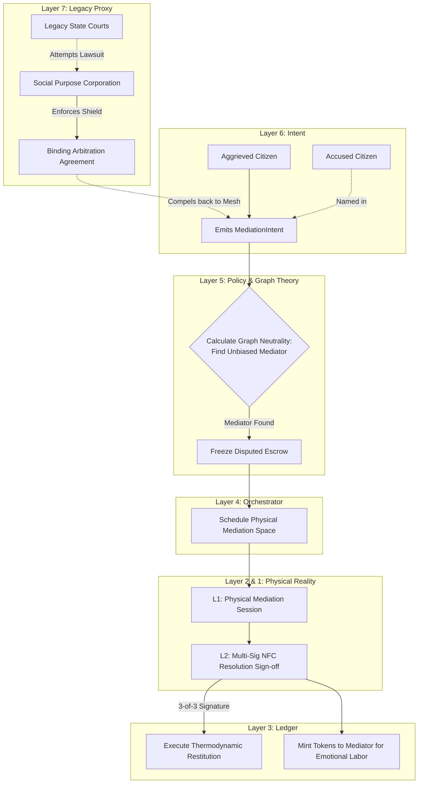

# Scenario Psi: Restorative Justice & Conflict Resolution

*   **Identifier:** `SCN-PSI-MEDIATION`
*   **System Epic:** Restorative Justice, Conflict De-escalation, and Thermodynamic Restitution
*   **Primary Layers Tested:** L3 (Ledger), L4 (Orchestrator), L5 (Governance), L6 (Semantic), L7 (Proxy)
*   **Pass/Fail Metric:** Successful cryptographic resolution of a peer-to-peer dispute without legacy state intervention; algorithmic selection of a mathematically neutral mediator from the Trust Ring; successful transfer of thermodynamic restitution (labor/tokens) to repair the breach.

---

## 1. Problem Statement & Legacy Failure

The legacy justice system is punitive, adversarial, and violently extractive. It relies on a state monopoly on violence (police) and ruinously expensive legacy gatekeepers (lawyers, courts). When a dispute occurs—whether a broken contract, a property boundary issue, or an interpersonal betrayal—legacy courts focus on assigning blame and extracting fiat fines, fundamentally destroying the human relationship in the process. 
In a highly interdependent, decentralized mesh, unresolved interpersonal conflict acts as systemic friction (heat). If two Stewards who operate the Fabrication Commons refuse to speak to each other, the entire Node's supply chain fractures. The Node requires a method to resolve disputes that repairs the social graph rather than severing it.

## 2. The Collective Workflow (7-Layer Traversal)

Scenario Psi establishes a decentralized arbitration and restorative justice protocol. It uses graph theory to find truly neutral mediators and values restitution in terms of thermodynamic labor rather than fiat punishment.

### Layer 7: The Legacy Proxy (Binding Arbitration Shield)
*   **The Legal Firewall:** Legacy state courts do not natively respect "mesh mediation." To protect the Node from destructive internal legacy lawsuits, the Social Purpose Corporation (SPC) membership agreement contains a strict Binding Arbitration clause.
*   **Arbitration Enforcement:** Any internal dispute is legally classified as private arbitration. If a disgruntled citizen attempts to bypass the Trust Ring and sue another citizen in a legacy municipal court, the SPC deploys the signed cryptographic agreement to immediately compel the case out of the state system and back into the sovereign mesh.

### Layer 6: Semantic Intent
*   A citizen emits a `MediationIntent` (e.g., "DID_02 accidentally destroyed my borrowed power tool and is refusing to replace it," or "Deep interpersonal conflict requiring de-escalation").
*   The intent defines the nature of the fracture and the desired restitution.

### Layer 5: Policy & Web of Trust (Neutrality & The Abuse Bypass)
*   **Graph-Calculated Neutrality:** When the intent is filed, Layer 5 analyzes the Trust Ring graph. It mathematically searches for a Mediator who has the exact same graph distance (degrees of separation and vouch weight) from *both* conflicting parties, ensuring absolute cryptographic neutrality. 
*   **Temporary Escrow Lock:** To prevent capital flight, Layer 5 temporarily freezes the disputed Value Tokens in both parties' CRDT wallets.
*   **The Safe Harbor Bypass:** If the intent flags physical or psychological abuse (Intimate Coercion), Layer 5 bypasses mediation entirely. It immediately bridges to **Scenario Omicron (The Safe Harbor Severance)**, legally and mathematically severing the abuser's access to the victim without requiring the victim to sit in a room with them.

### Layer 4: Orchestration (The Council Fire & Restitution Routing)
*   **The Council Fire:** The BPMN engine routes the intent to the neutral mediators and schedules a physical sit-down (booking a secure, acoustically private space via **Scenario Epsilon**).
*   **Labor Restitution:** If the resolution requires thermodynamic restitution instead of tokens, Layer 4 routes the offender to **Scenario Sigma (Maintenance Commons)**, assigning them low-status cleaning bounties until the kinetic debt is paid.
*   **The Slashing Bridge:** If a party completely refuses arbitration or acts maliciously, Layer 4 escalates to **Scenario Rho (Adversarial Mesh)**, initiating a cascade that slashes their reputation and exiles them from the Node.

### Layer 3: Ledger (Thermodynamic Restitution)
*   Legacy courts extract fiat. The mesh requires thermodynamic restitution. If Alice broke Bob's tool, she doesn't just pay a fine to a central authority; the ledger facilitates a direct transfer of Value Tokens, or orchestrates a `MaintenanceBounty` (Scenario Sigma) where Alice performs physical labor for Bob to make him whole. 
*   The Mediator is minted Value Tokens by the Node Treasury for performing the grueling emotional labor of de-escalating the conflict.

### Layer 2 & 1: Digital Twin & Physical Reality
*   **Telemetry (L2):** Once physical mediation concludes and restitution is agreed upon, the Mediator's L2 device generates a multi-sig cryptographic contract. Both conflicting parties tap their NFC devices to sign the resolution, permanently recording the repaired state to the mesh.
*   **Physical (L1):** A quiet room, active listening, emotional regulation, physical labor for restitution, and the physical restoration of a human relationship.

---



---

## 3. Oasis Engine Implementation Specification

In the C++ Oasis engine, Scenario Psi introduces social friction and resolution mechanics to the NPC/Player relationship matrices:

*   **Relationship Degradation:** If `Player_A` and `Player_B` have a collision event that results in property damage (e.g., destroying a placed voxel belonging to the other), their mutual `Affinity_Score` drops below 0, entering a `FRACTURED` state.
*   **Interaction Lockout:** While in a `FRACTURED` state, the engine prevents the two entities from executing joint tasks or sharing inventory, simulating a breakdown in mutual aid.
*   **Neutral Pathfinding:** The `GraphManager` must execute a bidirectional Breadth-First Search (BFS) from both entities to find a third entity (`Mediator`) where the edge weights and distances are mathematically equal.
*   **State Restoration:** The Mediator entity executes a `RESOLVE_DISPUTE` action, which triggers the escrow transfer and resets the `Affinity_Score` to a functional baseline, unlocking their ability to cooperate.

---

```json
{
  "@context": [
    "[https://schema.org/](https://schema.org/)",
    "[https://collective.network/ontology/v1/](https://collective.network/ontology/v1/)"
  ],
  "@type": "MediationIntent",
  "identifier": "urn:uuid:5d6e7f8a-9b0c-1d2e-3f4a-5b6c7d8e9f0a",
  "issuerDid": "did:mesh:node04:steward_alice",
  "targetDid": "did:mesh:node04:apprentice_charlie",
  "disputeProfile": {
    "category": "Property_Damage_and_Breach_of_Trust",
    "description": "Charlie borrowed the industrial serger and sheared the timing belt by forcing heavy canvas, currently refusing accountability.",
    "severityLevel": "High_Systemic_Friction"
  },
  "algorithmicMediation": {
    "requestedNeutralityMargin": 0.05,
    "requiredMediatorCredentials": ["Conflict_Resolution_L2"]
  },
  "restitutionParameters": {
    "disputedValueTokens": "45.00",
    "acceptableLaborAlternative": "MaintenanceBounty_Equivalent"
  },
  "legacyCompliance": {
    "bindingArbitrationInvocation": true,
    "l7EnforcementFallback": "Active"
  }
}
```

---

## 4. Acceptance Test Gates (Pass/Fail)

| Checkpoint | Validation Method | Pass Condition |
| :--- | :--- | :--- |
| **G1: Arbitrator Neutrality** | Graph Distance Calculation | The L5 policy engine successfully identifies a third-party DID whose shortest path and reputation weight to both conflicting parties differ by less than a 5% margin of error. |
| **G2: Escrow Freezing** | CRDT State Lock | Upon issuance of a high-severity `MediationIntent`, the disputed Value Tokens are successfully locked in both users' wallets and cannot be burned or transferred externally. |
| **G3: L7 Legal Shielding** | Document Generation | The engine successfully compiles the multi-sig resolution into a PDF formatted with the state's required Binding Arbitration boilerplate language, ready for legacy enforcement if necessary. |
| **G4: Restitution Execution** | Multi-Sig Unlock | The locked tokens are only transferred/released when the engine receives a cryptographic 3-of-3 signature payload (Party A, Party B, and the Mediator) via L2 NFC bump. |
