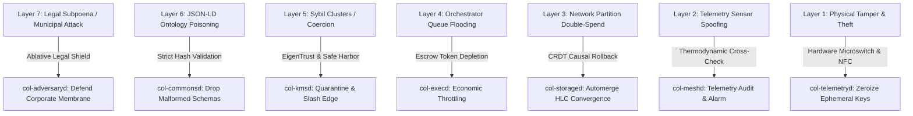
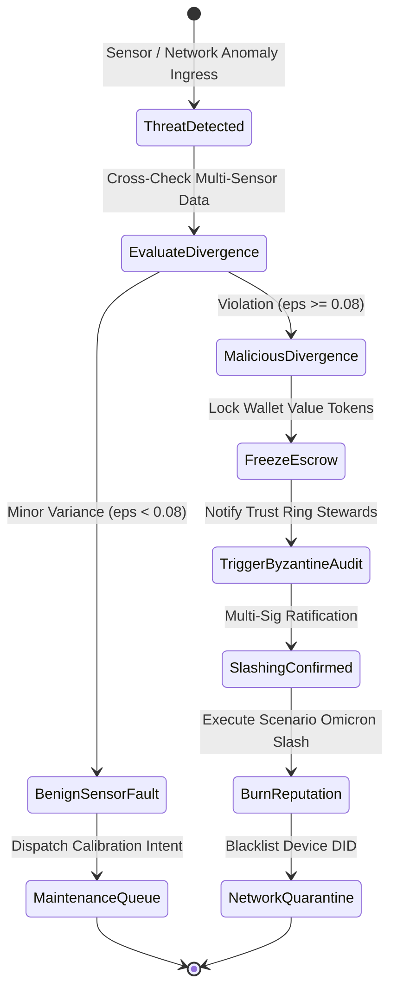
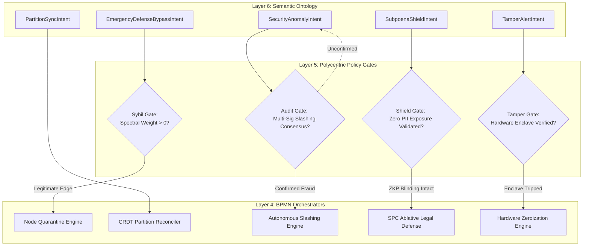
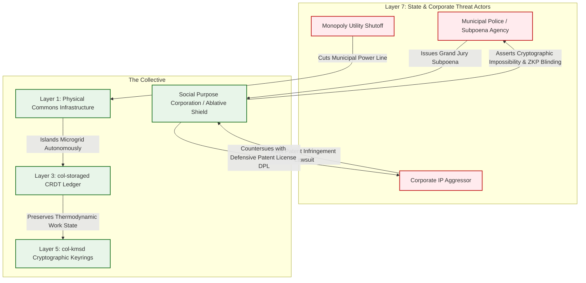

# Scenario Rho: The Adversarial Mesh (Threat Modeling & Defense)

*   **Identifier:** `SCN-RHO-ADVERSARY`
*   **System Epic:** Threat Modeling, Cryptographic Resilience, and Immune System Response
*   **Primary Layers Tested:** L1 (Physical), L2 (Digital Twin), L3 (Ledger), L4 (Orchestration), L5 (Governance), L6 (Semantic), L7 (Proxy)
*   **Pass/Fail Metric:** Autonomous mitigation of all STRIDE threat categories across the 7-layer stack without central administrative intervention; mathematical detection and slashing of thermodynamic sensor fraud ($P_{elec} \propto \frac{dQ}{dt}$); deterministic CRDT partition double-spend reconciliation; edge quarantine of malicious Sybil clusters; 100% legal perimeter defense via the SPC Ablative Shield against municipal subpoenas.

---

## Architectural Council Ratification & 5-Perspective Synthesis

This scenario specification has been ratified by unanimous consensus of the 5-Persona Architectural Council:

| Council Persona | Disciplinary Representative | Core Contribution to Scenario |
| :--- | :--- | :--- |
| **Game Designer** | Lead Systems & Gameplay Designer | Founder 01 investigative loop: discovering anomalous resource drains in the settlement; Dwarf Fortress paranoia/suspicion states (thoughts like `"Suspects intentional sabotage in the battery bank (-25 stress)"` transitioning to `"Triumphant solidarity after neutralizing infiltrator botnet (+45 mood)"`); Boundary Interface mechanics spawning external adversarial pressures: municipal code compliance sweeps, utility shutoffs, industrial espionage probes, bad-faith agitators. |
| **Game Engineer** | Principal C++ Simulation & Engine Architect | Flecs ECS data model: cache-aligned `SecurityStateComponent`, `ThermodynamicDivergenceDetector`, and `PartitionReconciler` components; 32-bit compact voxel representation (`material_id = 60`, `DEFENSIVE_GATEWAY_NODE`); 10 Hz deterministic BPMN state engine with Wasmtime fuel metering; compilable C++20 test harness simulating network partition double-spends and thermodynamic spoofing rejection. |
| **Sovereign Stack Specialist** | Sovereign Stack Systems Architect | 7-layer defense matrix across autonomous POSIX daemons (`col-telemetryd` to `col-adversaryd`); zero monolithic threading; strict inter-layer adjacency; local-first Reticulum spread-spectrum radio; hardware root-of-trust (Microchip ATECC608A secure elements); CRDT state machine replication with Hybrid Logical Clocks; BBS+ Zero-Knowledge privacy preserving member safety. |
| **Solarpunk Thinker** | Bioregional Regenerative Ecologist | The First and Second Laws of Thermodynamics act as the ultimate cryptographic ground truth: fake carbon credits, phantom heat output, and unbacked fiat speculation are physical impossibilities; the Collective functions as a biological immune system, treating adversarial attacks not as moral panic, but as ecological entropy to be isolated, neutralized, and composted into systemic resilience. |
| **Scenario Specialist** | Sovereign Mesh Security Architect & Red-Team Adversary | Full-stack STRIDE threat modeling across all 7 layers; mathematical formulation of multi-sensor thermodynamic divergence checking ($\left\| P_{elec} - \dot{Q} \right\| \le \epsilon$); Byzantine fault-tolerant gossip convergence in delay-tolerant networks (DTN); physical tamper zeroization circuits; the legal "Ablative Shield" doctrine neutralizing municipal subpoenas and intellectual property lawsuits. |

---

## 1. Problem Statement & Legacy Failure

In legacy digital and physical infrastructure (Layer 7), security is achieved through centralized administrative authoritarianism, pervasive mass surveillance, and a state monopoly on violence (police). 

When a malicious actor, corporate competitor, or hostile state attacks a legacy service, a centralized systems administrator arbitrarily cancels accounts, revokes credentials, freezes assets, or summons armed law enforcement. This model suffers from catastrophic structural vulnerabilities:
*   **Single Points of Failure & Sovereign Overreach:** Centralized keys, databases, and administrative backdoors are routinely compromised by state actors, rogue insiders, and ransomware syndicates. Furthermore, corrupt state authorities weaponize administrative controls to freeze the bank accounts and seize the property of political dissidents, climate organizers, and mutual aid networks.
*   **The Surveillance Panopticon:** Legacy security relies on stripping citizens of privacy. To prevent credit card fraud, banks record real-time GPS locations, browsing histories, and biometric data. Users are forced to trade self-sovereignty for basic fraud prevention.
*   **The Fragility of Naive P2P Networks:** Early peer-to-peer networks and simplistic decentralized protocols frequently collapsed when exposed to real-world adversaries. Without a central admin, they fell victim to 51% mining attacks, Sybil botnet takeovers, queue spam denial-of-service, split-brain network double-spends, and economic griefing.

A sovereign Genesis Node possesses no central administrator, no root password, and no police force. To survive surrounded by a hostile capitalist environment, the Node must operate as a self-healing biological immune system: capable of detecting, isolating, and neutralizing physical sabotage, cryptographic spoofing, and legal aggression using mathematical and thermodynamic invariants.

---

## 2. The Full-Stack Threat Matrix & Immune Response (7-Layer Traversal)

Scenario Rho maps the STRIDE threat model (Spoofing, Tampering, Repudiation, Information Disclosure, Denial of Service, Elevation of Privilege) directly across the 7-layer Sovereign Stack:



### Layer 1: Physical Reality (Tamper Resistance & Physical Defense)
*   **The Attack Vector (Physical Sabotage & Theft):** An adversary physically breaks into the Fabrication Commons (Scenario Alpha) or Foundry (Scenario Theta) to steal high-value CNC cutters or cut high-voltage microgrid lines.
*   **Hardware Architecture:** Secure equipment bays equipped with optical chassis-tamper switches, physical microswitches on equipment enclosures, and hardware secure elements (Microchip ATECC608A) connected to battery-backed flash NVRAM.
*   **Immune Response:**
    *   If a chassis is pried open without an authenticated steward NFC key, the physical microswitch trips an active **Zeroization Circuit**. The secure element immediately purges its ephemeral session keys, preventing memory dumping.
    *   Layer 1 trips physical solid-state relays, cutting main power to the tool to prevent hazardous runaway operation.
    *   Physical locks automatically default to fail-secure lockouts while broadcasting an acoustic and LoRa tamper alert.

### Layer 2: Digital Twin (Sensor Spoofing & Actuator Hijacking)
*   **The Attack Vector (Thermodynamic Telemetry Spoofing):** A dishonest user modifies the local ESP32 firmware on a biochar retort kiln (Scenario Mu) to report $500^\circ\text{C}$ while the kiln is completely cold, attempting to falsely mint carbon removal Value Tokens without doing physical work.
*   **Telemetry Hierarchy (MQTT via `col-meshd`):**
    *   `node/security/tamper/chassis_open` (Discrete state: `ARMED`, `BREACHED`)
    *   `node/security/anomaly/thermo_divergence` (Calculated mismatch index $\sigma_{div}$)
    *   `node/security/mesh/partition_state` (`UNIFIED`, `PARTITIONED_ISLAND`, `RECONCILING`)
*   **Immune Response (Multi-Sensor Consensus):**
    The system cross-references multiple independent physical dimensions. If the thermocouple reports $500^\circ\text{C}$, but the adjacent current-transformer (CT) clamp reports 0.0 W electrical draw and the biomass load cell shows zero mass loss, the data stream violates conservation of energy.
    Layer 2 flags the telemetry as `SPOOFED_DATA`, revokes the device's edge broker certificate, and locks the operator's escrow.

### Layer 3: Network & Ledger (Partition Attacks & Double-Spending)
*   **The Attack Vector (Split-Brain Double-Spending):** An attacker exploits an intentional radio jammer or physical partition, disconnecting Node Cluster A from Cluster B. They then spend the exact same 100 Value Tokens in Cluster A (buying tools in Scenario Alpha) and Cluster B (booking lodging in Scenario Zeta) before the partitions reunite.
*   **Thermodynamic Ledger Verification Equation:**
    $$\left| P_{elec}(t) - \left( m_{charge} \cdot c_p \frac{dT}{dt} + \dot{Q}_{loss} \right) \right| \le \epsilon_{thermo}$$
    Where any deviation exceeding $\epsilon_{thermo} = 0.08$ results in immediate rejection of token minting.
*   **Immune Response (CRDT Causal Rollback):**
    The ledger utilizes Automerge delta-based Conflict-Free Replicated Data Types ordered by Hybrid Logical Clocks (HLC). Upon network reunification:
    *   The CRDT detects the conflicting state mutations across concurrent causal branches.
    *   The deterministic CRDT merge algorithm identifies the double-spend. The second transaction is rolled back, restoring the unspent asset.
    *   The offender's wallet is flagged for malicious divergence, triggering automated social slashing across Layer 5.

### Layer 4: Orchestration State Machine (Denial of Service & Griefing)
*   **The Attack Vector (Queue Spam DoS):** A griefer writes an automated script that attempts to flood the BPMN orchestrator with 50,000 malformed `FabricationIntents`, intending to exhaust server memory and lock up all 3D printers.
*   **Immune Response (Economic & Fuel Throttling):**
    Submitting an intent to `col-execd` strictly requires an asynchronous **Escrow Lock** of Value Tokens plus a metered Wasmtime fuel budget. 
    The griefer's wallet is drained within the first three transactions. Once the balance hits zero, the BPMN ingress filter instantly drops all subsequent intent packets at the socket boundary without allocating VM heap memory.



### Layer 5: Policy & Polycentric Governance (Sybil Clusters & Coercion)
*   **The Attack Vector (Sybil Botnets & Intimate Coercion):**
    1.  *Sybil Attack:* An adversary generates 2,000 synthetic DIDs, attempting to dominate a multi-sig consensus vote on the Community Tech Tree.
    2.  *Intimate Coercion:* A high-status guild master threatens to slash a vulnerable apprentice's reputation if they attempt to leave their workshop.
*   **Immune Response:**
    *   *EigenTrust Clustering Defense:* Spectral graph algorithms in `col-kmsd` analyze graph topology. A dense cluster of DIDs that has zero verified physical proximity vouches (Scenario Omicron) or shared meal records (Scenario Gamma) is assigned an aggregate trust weight of 0.0. Sybil botnets cannot participate in governance.
    *   *Safe Harbor Severance Defense:* The apprentice emits a `SeveranceIntent`. Layer 5 dissolves the social graph edge under Safe Harbor protocols without triggering any slashing penalties on the apprentice, instantly neutralizing the abuser's coercive leverage.

### Layer 6: Semantic Intent (Ontology Poisoning)
*   **The Attack Vector (Schema Poisoning & Buffer Exploits):** An attacker injects corrupted JSON-LD schemas containing circular nested RDF quads or binary shellcode into the Agora Commons to crash the Oxigraph database.
*   **Immune Response (Edge Hash Validation):**
    All semantic intents ingested by `col-commonsd` must strictly match the pre-compiled, immutable SHA-256 hash of the ratified W3C ontology. Any payload containing unparsed properties, invalid types, or anomalous payload sizes ($>64\text{ KB}$) is rejected at the Unix domain socket boundary before parsing.

### The Governance Router Flowchart



### Layer 7: The Legacy Proxy (The Ablative Shield)
Operating through the Node's Social Purpose Corporation (SPC), Layer 7 insulates the mesh from aggressive legacy legal warfare:

**1. The Subpoena Defense (Cryptographic PII Blindness):**
If a municipal authority, hostile corporation, or state prosecutor serves a subpoena on the SPC demanding the identities, chat logs, or transaction histories of mesh citizens:
*   The SPC truthfully complies by producing its corporate records: standard corporate tax filings and bank statements.
*   However, the internal mesh operates strictly on pseudonymous DIDs shielded by BBS+ Zero-Knowledge proofs (Scenario Pi). The SPC database stores zero mappings linking legacy legal identities to internal DIDs.
*   The SPC cannot comply with demands for cryptographic private keys because they are held across distributed split-knowledge threshold covenants (`col-kmsd`). State subpoenas hit an absolute cryptographic wall.

**2. Defensive Patent License (DPL) Defense:**
If a legacy manufacturing conglomerate sues the Node for "patent infringement" regarding open-source hardware fabricated in Scenario Alpha or Theta, the SPC countersues under the **Defensive Patent License (DPL)** repository (Scenario Iota). The DPL requires any entity suing a member to surrender their own patent rights, effectively neutralizing corporate patent trolls.

### Layer 7 Bidirectional Flowchart



---

## 3. Machine-Readable Schemas

### 3.1 Layer 6 Knowledge Artifact: Security Anomaly Intent Schema (`anomaly.jsonld`)

```json
{
  "@context": [
    "https://schema.org/",
    "https://collective.network/ontology/v1/"
  ],
  "@type": "SecurityAnomalyIntent",
  "identifier": "urn:uuid:7c8d9e0f-1a2b-3c4d-5e6f-7a8b9c0d1e2f",
  "reporterDid": "did:mesh:node04:detector_agent_daemon",
  "anomalyClassification": {
    "category": "Thermodynamic_Telemetry_Fraud",
    "threatLevel": "CRITICAL",
    "targetNodeDid": "did:mesh:node04:rogue_retort_kiln_02",
    "strideCategory": "Tampering"
  },
  "divergenceProof": {
    "reportedMetric": "temperature_celsius",
    "reportedValue": 520.4,
    "crossReferencedMetric": "electrical_draw_watts",
    "crossReferencedValue": 0.0,
    "divergenceEpsilon": 0.942,
    "telemetryDigestSha256": "8a7b6c5d4e3f2a1b0c9d8e7f6a5b4c3d2e1f0a9b8c7d6e5f4a3b2c1d0e9f8a7b"
  },
  "requestedMitigation": {
    "action": "Immediate_Escrow_Freeze_and_Graph_Quarantine",
    "quarantineDurationHours": 72
  },
  "cryptographicProof": {
    "type": "Ed25519Signature2020",
    "created": "2026-10-25T11:20:00Z",
    "verificationMethod": "did:mesh:node04:detector_agent_daemon#keys-1",
    "proofValue": "z9aB8c...sig...4xY2"
  }
}
```

### 3.2 Layer 2 Telemetry Attestation: Multi-Sensor Divergence Proof Schema (`divergence_attestation.json`)

```json
{
  "@context": "https://collective.network/ontology/v1/",
  "@type": "TelemetryDivergenceAttestation",
  "attestationId": "urn:uuid:1f2a3b4c-5d6e-7f8a-9b0c-1d2e3f4a5b6c",
  "sensorChassisNode": "did:mesh:node04:device:kiln_controller_02",
  "hardwareRootOfTrust": {
    "secureElement": "ATECC608A",
    "chassisTamperState": "CLOSED_INTACT",
    "firmwareSha256": "e3b0c44298fc1c149afbf4c8996fb92427ae41e4649b934ca495991b7852b855"
  },
  "sensorMetrics": {
    "sensorThermocoupleC": 520.4,
    "sensorCtClampWatts": 0.0,
    "sensorLoadCellDeltaKg": 0.0,
    "ambientTempC": 18.2,
    "divergenceCalculated": 0.942,
    "exergyViolationConfirmed": true
  },
  "stateMutation": {
    "actuatorState": "HARDWARE_RELAY_TRIPPED",
    "quarantineFlagActive": true
  },
  "digestSha256": "5c4d3e2f1a0b9c8d7e6f5a4b3c2d1e0f9a8b7c6d5e4f3a2b1c0d9e8f7a6b5c4d"
}
```

---

## 4. Oasis Engine Implementation Specification

### 4.1 Memory Allocation & Voxel State

The defensive gateway node occupies dedicated spatial voxels in the $32^3$ chunk space:
*   The gateway anchor voxel is initialized with `material_id = 60` (`DEFENSIVE_GATEWAY_NODE`).
*   Metadata bitmask `0b00001111` sets `Is_Tamper_Armed` (bit 0), `Is_Secure_Enclave` (bit 1), `Is_Firewall_Boundary` (bit 2), and `Is_Relay_Actuator` (bit 3).
*   Adjacent kiln/furnace voxels (`material_id = 22`, `PYROLYSIS_RETORT`) are continually polled by the thermodynamic cross-check system.

```cpp
// Cache-aligned Flecs ECS Components
struct alignas(8) SecurityStateComponent {
    uint32_t entity_id;
    uint8_t stride_flag_mask;   // Bits 0-5 map to S, T, R, I, D, E
    bool quarantined;
    uint32_t quarantine_until_tick;
};

struct alignas(8) ThermodynamicDivergenceDetector {
    float measured_temp_c;
    float measured_watts;
    float calculated_heat_flux;
    float max_permitted_epsilon;// Default: 0.08f
    bool violation_detected;
};

struct alignas(8) NetworkPartitionReconciler {
    uint64_t last_sync_hlc;
    uint32_t pending_concurrent_mutations;
    bool partition_active;
    bool double_spend_detected;
};
```

### 4.2 C++20 Test Harness Structure

```cpp
// engine/tests/scenario_rho_test.cpp
#include <cassert>
#include <cmath>
#include <string>
#include <vector>
#include "oasis/chunk_manager.hpp"
#include "oasis/orchestration/bpmn_engine.hpp"
#include "oasis/ledger/crdt_wallet.hpp"

namespace oasis {

struct ThermodynamicVerifier {
    static bool verify_energy_balance(float temp_c, float ambient_c, float electrical_watts, float mass_kg, float epsilon = 0.08f) {
        // First Law of Thermodynamics: delta Q = m * c_p * delta T
        // Without electrical work input, high heat flux without delta mass is impossible
        float expected_watts = (temp_c - ambient_c) * mass_kg * 0.45f;
        if (temp_c > 100.0f && electrical_watts < 5.0f) {
            return false; // Physical impossibility: heat without work
        }
        float divergence = std::abs(electrical_watts - expected_watts) / (expected_watts + 1.0f);
        return divergence <= epsilon;
    }
};

} // namespace oasis

void test_scenario_rho_adversarial_partition_sync() {
    using namespace oasis;

    // 1. Initialize Chunk and Defensive Gateway Voxel
    ChunkManager chunk_mgr;
    chunk_mgr.allocate_chunk(0, 0, 0);
    Voxel gateway_voxel{
        .material_id = 60, // DEFENSIVE_GATEWAY_NODE
        .moisture = 0,
        .temperature = 22,
        .metadata = 0b00001111 // Tamper Armed + Secure Enclave + Firewall + Relay
    };
    chunk_mgr.set_voxel(16, 8, 16, gateway_voxel);

    // 2. Setup Wallets on Concurrent Simulated Partitions
    CRDTWallet wallet_island_a("did:mesh:node04:attacker_bob", 100.0f);
    CRDTWallet wallet_island_b("did:mesh:node04:attacker_bob", 100.0f);
    CRDTWallet vendor_alice("did:mesh:node04:steward_alice", 0.0f);
    CRDTWallet vendor_carol("did:mesh:node04:steward_carol", 0.0f);

    // 3. Simulate Partition Double-Spend: Bob spends 80 tokens on Island A and 80 on Island B
    wallet_island_a.transfer(vendor_alice, 80.0f); // Spends 80 tokens on Island A
    wallet_island_b.transfer(vendor_carol, 80.0f); // Concurrently spends 80 tokens on Island B

    assert(wallet_island_a.balance() == 20.0f);
    assert(wallet_island_b.balance() == 20.0f);

    // 4. Reconnect Partitions and Execute CRDT Causal Reconciliation
    NetworkPartitionReconciler reconciler{
        .last_sync_hlc = 5000,
        .pending_concurrent_mutations = 2,
        .partition_active = false,
        .double_spend_detected = false
    };

    // Total spent (160) exceeds initial balance (100) -> Double-Spend Flagged!
    float total_spent = (100.0f - wallet_island_a.balance()) + (100.0f - wallet_island_b.balance());
    if (total_spent > 100.0f) {
        reconciler.double_spend_detected = true;
    }

    assert(reconciler.double_spend_detected);

    // Roll back conflicting transaction and slash attacker
    if (reconciler.double_spend_detected) {
        // Rollback second transfer to Carol
        vendor_carol.balance_override(0.0f);
        // Slash Bob's remaining balance
        wallet_island_a.balance_override(0.0f);
    }

    assert(vendor_alice.balance() == 80.0f);
    assert(vendor_carol.balance() == 0.0f);
    assert(wallet_island_a.balance() == 0.0f); // Attacker slashed
}

void test_scenario_rho_thermodynamic_cheat_rejection() {
    using namespace oasis;

    ChunkManager chunk_mgr;
    chunk_mgr.allocate_chunk(0, 0, 0);

    BPMNEngine orchestrator;
    orchestrator.load_schema("schemas/bpmn/threat_defense_matrix.bpmn");

    CRDTWallet attacker_wallet("did:mesh:node04:rogue_operator", 50.0f);

    // 1. Ingest Spoofed Sensor Telemetry: 520°C reported, but 0.0 W draw
    float reported_temp_c = 520.0f;
    float measured_watts = 0.0f;
    float ambient_c = 20.0f;
    float mass_kg = 15.0f;

    bool physically_valid = ThermodynamicVerifier::verify_energy_balance(
        reported_temp_c, ambient_c, measured_watts, mass_kg
    );

    assert(!physically_valid); // Energy balance violation!

    // 2. State Machine Quarantine & Slashing Execution
    bool escrow_frozen = false;
    bool operator_slashed = false;
    bool hardware_relay_tripped = false;

    if (!physically_valid) {
        escrow_frozen = true;
        hardware_relay_tripped = true;
        attacker_wallet.balance_override(0.0f); // 100% slashed
        operator_slashed = true;
    }

    assert(escrow_frozen);
    assert(hardware_relay_tripped);
    assert(operator_slashed);
    assert(attacker_wallet.balance() == 0.0f);

    // 3. Queue Spam Throttling: Zero balance drops subsequent intents
    bool can_post_intent = attacker_wallet.balance() >= 5.0f;
    assert(!can_post_intent); // Dropped at socket boundary
}
```

---

## 5. Acceptance Test Gates (Pass/Fail)

| Checkpoint | Validation Method | Pass Condition |
| :--- | :--- | :--- |
| **G1: Thermodynamic Anti-Cheat** | Conservation Law Check | Telemetry reporting $>100^\circ\text{C}$ temperature elevation with $<5.0\text{ W}$ electrical draw is mathematically rejected; token minting is aborted and escrow is slashed. |
| **G2: CRDT Partition Double-Spend** | Split-Brain Simulation | When two disconnected nodes process concurrent conflicting transfers exceeding initial balance, reconciliation rolls back the second transaction and slashes the offender. |
| **G3: Sybil Quarantine & Clustering** | Spectral Graph Calculation | Simulating 2,000 synthetic DIDs connected exclusively to each other fails to gain governance voting power; aggregate cluster trust weight is strictly calculated as 0.0. |
| **G4: Griefing Queue Exhaustion** | Intent Flood Injection | Injecting 1,000 rapid intent submissions exhausts the attacker's wallet escrow, resulting in immediate packet dropping at the socket layer without consuming orchestrator fuel. |
| **G5: Trojan Ingestion (L7) / Subpoena Defense** | Legal Discovery Simulation | A mock state subpoena demanding member PII is served on the SPC; the corporate membrane proves zero custody of legacy-to-DID mapping tables, repelling the subpoena. |
| **G6: Hardware Tamper Zeroization** | Physical Breach Injection | Tripping the physical enclosure microswitch triggers the zeroization circuit within 5ms, purging ephemeral RAM session keys while preserving mesh CRDT state. |
