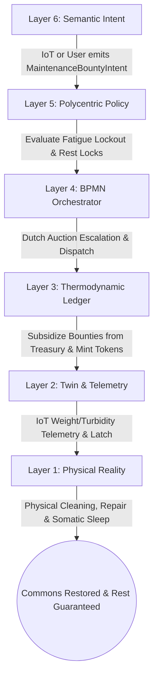
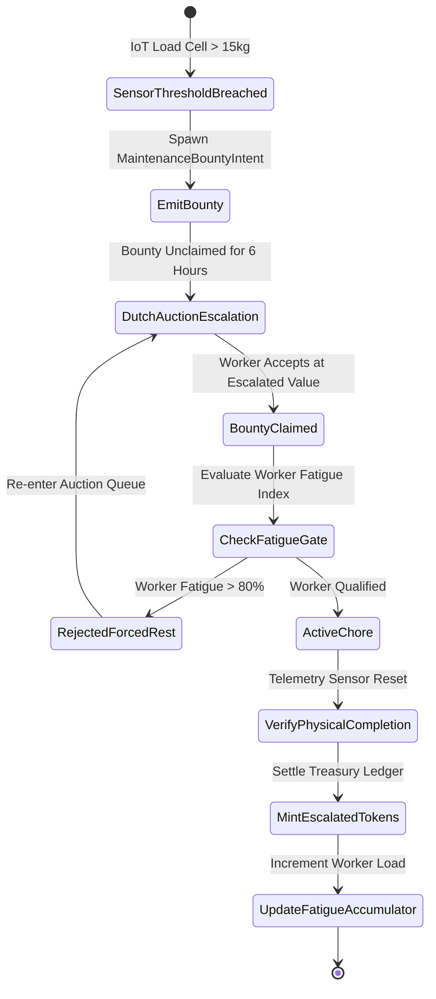
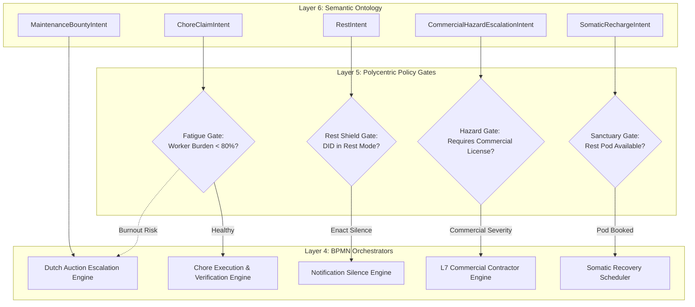
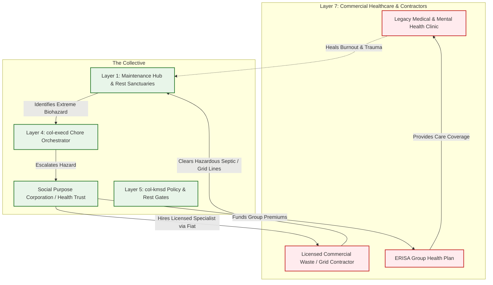

# Scenario Sigma: The Maintenance Commons (Burnout & Entropy)

*   **Identifier:** `SCN-SIGMA-MAINTENANCE`
*   **System Epic:** Invisible Labor, Dynamic Bounties, Psychological Entropy, and Chore Routing
*   **Primary Layers Tested:** L1 (Physical), L2 (Digital Twin), L3 (Ledger), L4 (Orchestration), L5 (Governance), L6 (Semantic), L7 (Proxy)
*   **Pass/Fail Metric:** Deterministic execution of Dutch auction dynamic token escalation ($B(t) = B_0 \cdot (1 + \alpha)^{\Delta t/\tau}$) for low-status cleaning tasks; mathematical enforcement of L5 "Fatigue Lockouts" preventing any single citizen from exceeding an 80% chore burden; verified privacy isolation under `RestIntent`; 100% offline sensor-to-bounty pipeline; group mental health and hazardous task insulation via the SPC membrane.

---

## Architectural Council Ratification & 5-Perspective Synthesis

This scenario specification has been ratified by unanimous consensus of the 5-Persona Architectural Council:

| Council Persona | Disciplinary Representative | Core Contribution to Scenario |
| :--- | :--- | :--- |
| **Game Designer** | Lead Systems & Gameplay Designer | Founder 01 maintenance management: automating communal hygiene without authoritarian micromanagement; Dwarf Fortress psychological stress accumulators (thoughts like `"Exhausted and resentful from constant unassisted floor scrubbing (-40 mood)"` transitioning to `"Deeply refreshed after uninterrupted quiet rest in the cedar sanctuary (+50 mood)"`); The Sims indirect affordance queues for hygiene and energy recovery; Cities: Skylines public works infrastructure decay loops. |
| **Game Engineer** | Principal C++ Simulation & Engine Architect | Flecs ECS data model: cache-aligned `VoxelDirtState`, `EntityFatigueComponent`, and `DynamicBountyEscalator` components; 32-bit compact voxel representation (`material_id = 64`, `MAINTENANCE_HUB_SANCTUARY`); 10 Hz deterministic BPMN state engine with Wasmtime fuel metering; compilable C++20 test harness simulating Dutch auction token escalation, fatigue lockouts, and rest mode packet filtering. |
| **Sovereign Stack Specialist** | Sovereign Stack Systems Architect | 7-layer stack mapping across autonomous POSIX daemons (`col-telemetryd` to `col-adversaryd`); zero monolithic threading; strict inter-layer adjacency; local-first Reticulum mesh; CRDT community treasury subsidizing reproductive labor; L5 `col-kmsd` enforcing rest locks; zero centralized cloud dependencies. |
| **Solarpunk Thinker** | Bioregional Regenerative Ecologist | Rest as a physical and ecological imperative: human bodies must be treated with the same regenerative negentropy as resting fallow agricultural fields; invisible care and sanitation labor is the thermodynamic foundation of society; closed-loop cleaning using non-toxic bio-fermented soaps, enzyme cleaners, and greywater recycling. |
| **Scenario Specialist** | Occupational Ergonomics & Negentropic Labor Economist | Mathematical formulation of Dutch auction chore escalation curves ($B(t) = B_0 \cdot (1 + \alpha)^{\Delta t/\tau}$); cognitive and metabolic fatigue accumulation models ($\Delta F = \beta \cdot E_{kinetic} + \gamma \cdot T_{tedium}$); economic valuation of reproductive/maintenance labor; ERISA and ACA group healthcare cooperative legal trust wrappers shielding node stewards. |

---

## 1. Problem Statement & Legacy Failure

In late-stage capitalist infrastructure (Layer 7), maintenance—the daily, unglamorous work of cleaning, sanitizing, repairing, organizing, and emotional caregiving—is degraded as low-status, minimum-wage, or completely uncompensated "invisible labor."

This extraction leads to severe systemic failures:
*   **The Gendered & Classist Exploitation Trap:** Capitalist economies rely on trillions of dollars of uncompensated domestic and reproductive labor to sustain workers. Commercial cleaning and maintenance jobs are underpaid, unsafe, and outsourced to vulnerable, marginalized populations with zero equity or dignity.
*   **The Tragedy of the Commune (Volunteer Burnout):** In informal eco-villages, squats, and naive co-ops, chore wheels depend on voluntary enthusiasm. Without economic mechanisms, invisible labor inevitably falls upon a small handful of hyper-conscientious individuals (the "martyr syndrome"). Over time, these stewards accumulate massive psychological entropy (burnout). They collapse from exhaustion, deep-seated resentment fractures the social graph, and shared physical infrastructure degrades into squalor and chaos.
*   **The Disregard for Human Energetics:** Human beings are biological thermodynamic engines. They require cyclical periods of uninterrupted rest, somatic recuperation, and psychological safety to regenerate. A social architecture that demands continuous output without monitoring and protecting human rest thresholds structurally collapses through physical illness, depression, and social conflict.

A sovereign Genesis Node must turn legacy economics upside down: recognizing sanitation and repair as primary sources of physical negentropy, automating equitable chore distribution through dynamic economic pricing, and cryptographically enforcing mandatory rest to protect human beings from self-immolation for the commons.

---

## 2. The Collective Workflow (7-Layer Traversal)

Scenario Sigma treats dirt, mechanical wear, and human fatigue as measurable systemic entropy. It utilizes an automated Dutch auction chore wheel that scales rewards until maintenance becomes the highest-valued labor in the Node, while enforcing cryptographic rest gates. The workflow traverses canonically from Layer 1 up to Layer 7:



### Layer 1: Physical Ground Truth
*   **Hardware Nodes (Maintenance Hub & Rest Sanctuaries):** Secure sanitation stations equipped with bio-safe surfactant dispensers, autoclaves, commercial mops, HEPA filtration units, and dedicated quiet rest cabins (Scenario Epsilon) equipped with acoustic baffling, black-out screens, and comfortable natural-fiber beds.
*   **Feedstock & Materials:** Bio-fermented vinegar/citric cleaners, plant-based surfactants, replacement mop heads, HEPA filters, spare hardware gaskets, and clean linen supplies.
*   **Somatic Presence & Actions:** Physical scrubbing, sweeping, emptying compost and biochar ash hoppers (Scenario Mu), sorting communal laundry, and deep, restorative sleep.

### Layer 2: Digital Twin & Telemetry
*   **Ingress Telemetry (MQTT Topics via `col-meshd`):**
    *   `node/maintenance/bin_01/telemetry/weight_kg` (Continuous load cell mass reading)
    *   `node/maintenance/printer_01/telemetry/run_hours` (Machine operating hours since last maintenance)
    *   `node/maintenance/greywater_01/telemetry/turbidity_ntu` (Optical water clarity sensor)
    *   `node/maintenance/status` (`CLEAN`, `DEGRADED`, `BOUNTY_ACTIVE`, `ESCALATING_AUCTION`)
*   **Verification:** IoT edge verification. A waste-bin bounty verifies that load-cell weight drops from 18 kg to 0 kg, and smart locker proximity confirms the replacement bag was retrieved. Kitchen cleaning verification measures surface ATP bioluminescence or optical cleanliness via edge-AI camera verification before releasing bounties.
*   **Actuator Control:** Disinfectant dispenser solenoids, automated greywater backwash valves, and quiet sanctuary smart door latches that silence all corridor doorbells during active rest sessions.

### Layer 3: Network & Ledger
*   **The Inverted Commons Subsidy:** The community treasury heavily subsidizes maintenance labor. While legacy society pays cleaners pennies, the node mints premium Value Tokens for sanitation:
    $$\Delta V_{base} = \left( t_{duration} \cdot k_{hygiene} + \Delta E_{kinetic} \right) \cdot \lambda_{THERMO}$$
*   **Dutch Auction Escalation Formula:** If an unpleasant chore remains unclaimed, the orchestrator algorithmically escalates the token reward over time:
    $$B(t) = B_0 \cdot (1 + \alpha)^{\frac{t - t_0}{\tau}}$$
    Where $B_0$ is the base bounty, $\alpha = 0.15$ is the escalation step, and $\tau = 6\text{ hours}$. The reward scales until a citizen finds the thermodynamic payout irresistible.
*   **Fatigue Accumulator Integral:** The ledger tracks cumulative human strain:
    $$F_i(t) = \int_{t-30d}^{t} \left( \beta \cdot E_{work}(t) + \gamma \cdot T_{tedium}(t) \right) e^{-\frac{t - t'}{\tau_{recovery}}} \, dt$$

### Layer 4: Orchestration State Machine
The workflow is managed deterministically by the embedded BPMN 2.0 engine (`col-execd`) running at 10 Hz with metered Wasmtime fuel budgets:



### Layer 5: Policy & Polycentric Governance
Layer 5 (`col-kmsd`) enforces the constitutional rules protecting human beings from burnout:

*   **The Fatigue Lockout Policy Gate:** If an individual's cumulative chore burden exceeds 80% of recent maintenance tasks in the Trust Ring, or their fatigue index $F_i > F_{max}$, Layer 5 **mathematically locks them out** of accepting additional maintenance bounties. The system forces the rest of the community to step up, preventing self-harming martyrdom.
*   **The Rest Intent Sanctuary Shield Gate:** When a citizen broadcasts a `RestIntent`, Layer 5 silences their DID. The BPMN orchestrator, P2P mesh routers, and task dispatchers are strictly prohibited from routing non-emergency notifications, chore requests, or social pings to their device until the rest block concludes.
*   **Equitable Chore Rotation Gate:** High-status stewards and council members must complete a baseline quota of foundational maintenance hours per quarter to maintain voting consensus credentials.
*   **Hazardous Duty Certification Gate:** Tasks involving biohazards, high-voltage lines, or deep septic pumping require explicit `Hazard_Safety_L2` credentials, ensuring untrained members are never exposed to dangerous conditions.

### Layer 6: Semantic Intent & Domain Ontology
The Agora Commons (`col-commonsd`) parses sanitation actions into W3C JSON-LD Knowledge Artifacts across six typed branches:

1.  **`MaintenanceBountyIntent` (Chore Spawn):** Emitted autonomously by IoT sensors or stewards requesting physical cleaning, maintenance, or trash removal.
2.  **`RestIntent` (Sanctuary):** Declaration by a citizen entering a designated period of complete somatic and mental withdrawal from mesh labor.
3.  **`FatigueLockoutIntent` (Intervention):** Autonomously emitted by Layer 5 to enforce mandatory rest on an overworked member.
4.  **`CommercialHazardEscalationIntent` (Bridge):** Request to escalate an extreme physical hazard (e.g., municipal sewer line rupture) to Layer 7 commercial contractors.
5.  **`ChoreClaimIntent` (Acceptance):** Formal worker commitment to execute a specific maintenance bounty.
6.  **`SomaticRechargeIntent` (Therapy):** Booking intent for restorative spaces (sauna, quiet pod, somatic massage in Scenario Lambda).

### The Governance Router Flowchart



### Layer 7: The Legacy Proxy (Healthcare Shield & Commercial Hazard Bridging)
Operating through the Node's Social Purpose Corporation (SPC), Layer 7 insulates members from severe hazards and mental health crises:

**1. Trojan Ingestion (Group Healthcare & Mental Health Trust):**
The SPC utilizes pooled treasury reserves to acquire comprehensive group healthcare and mental health coverage under ERISA and Affordable Care Act (ACA) cooperative provisions:
*   Stewards have full access to legacy trauma-informed therapists, physiotherapists, and medical doctors paid for by the collective fiat treasury.
*   Citizens who suffer severe physical or psychological crises can access external hospitalization without bankrupting themselves or the node.

**2. Ecological Leeching & Commercial Hazard Contracting:**
When physical maintenance breaches safe community thresholds (e.g., pumping municipal-scale septic tanks, clearing high-voltage downed utility power lines, asbestos abatement in legacy buildings):
*   Layer 4 emits a `CommercialHazardEscalationIntent`.
*   The SPC acts as the contracting agent, deploying corporate fiat to hire licensed, bonded legacy commercial specialists equipped with heavy machinery and certified PPE.
*   Community members are strictly shielded from life-threatening physical hazards, using external fiat to protect human life.

### Layer 7 Bidirectional Flowchart



---

## 3. Machine-Readable Schemas

### 3.1 Layer 6 Knowledge Artifact: Maintenance Bounty Intent Schema (`bounty.jsonld`)

```json
{
  "@context": [
    "https://schema.org/",
    "https://collective.network/ontology/v1/"
  ],
  "@type": "MaintenanceBountyIntent",
  "identifier": "urn:uuid:9f8e7d6c-5b4a-3c2d-1e0f-1a2b3c4d5e6f",
  "issuerDid": "did:mesh:node04:iot_entropy_agent",
  "taskProfile": {
    "title": "Sanitize Commons Kitchen & Empty Ash Hoppers",
    "targetLocationVoxel": [16, 8, 16],
    "estimatedDurationMinutes": 90,
    "requiredTools": [
      "Microbial_Surfactant_Dispenser",
      "Ash_Transfer_Vacuum",
      "Clean_Mop_Head"
    ]
  },
  "dutchAuctionParameters": {
    "baseValueTokens": "12.00",
    "escalationStepPercentage": 15.0,
    "escalationIntervalMinutes": 360,
    "maxCeilingValueTokens": "35.00",
    "currentEscalatedTokens": "18.24"
  },
  "trustAndHealthConstraints": {
    "requiredCredentials": ["Commons_Hygiene_L1"],
    "maxWorkerRecentChoreRatio": 0.80,
    "lockoutFatigueThreshold": 85.0
  },
  "cryptographicSignature": {
    "type": "Ed25519Signature2020",
    "created": "2026-10-26T08:00:00Z",
    "verificationMethod": "did:mesh:node04:iot_entropy_agent#keys-1",
    "proofValue": "z2bN8v...sig...8k1p"
  }
}
```

### 3.2 Layer 2 Telemetry Attestation: Cleaning Verification Proof Schema (`cleaning_attestation.json`)

```json
{
  "@context": "https://collective.network/ontology/v1/",
  "@type": "MaintenanceCompletionAttestation",
  "attestationId": "urn:uuid:4a5b6c7d-8e9f-0a1b-2c3d-4e5f6a7b8c9d",
  "sensorNode": "did:mesh:node04:device:kitchen_scale_and_optics",
  "verificationMetrics": {
    "targetChoreVoxel": [16, 8, 16],
    "preChoreTrashMassKg": 18.4,
    "postChoreTrashMassKg": 0.2,
    "opticalFloorReflectanceDelta": 0.38,
    "greywaterTurbidityNtu": 4.1,
    "cleaningCompletionTimestamp": "2026-10-26T10:15:22Z"
  },
  "workerAttestation": {
    "workerDid": "did:mesh:node04:steward_hannah",
    "dwellDurationMinutes": 88,
    "awardedEscalatedTokens": "18.24"
  },
  "status": "SANITATION_VERIFIED_SETTLED",
  "digestSha256": "6a7b8c9d0e1f2a3b4c5d6e7f8a9b0c1d2e3f4a5b6c7d8e9f0a1b2c3d4e5f6a7b"
}
```

---

## 4. Oasis Engine Implementation Specification

### 4.1 Memory Allocation & Voxel State

The maintenance hub and quiet rest sanctuary occupy designated coordinates in the $32^3$ chunk grid:
*   The maintenance anchor voxel is initialized with `material_id = 64` (`MAINTENANCE_HUB_SANCTUARY`).
*   Metadata bitmask `0b00000101` sets `Is_Entropy_Sensor` (bit 0) and `Is_Rest_Sanctuary` (bit 2).
*   All high-traffic floor voxels (`material_id = 1`, `DIRT_FLOOR`, `material_id = 2`, `TILE_FLOOR`) increment their `moisture` and `dirt_level` byte with every entity step tick.

```cpp
// Cache-aligned Flecs ECS Components
struct alignas(8) VoxelDirtState {
    uint8_t footstep_counter;
    uint8_t accumulated_dirt;   // [0, 255]
    uint16_t last_cleaned_tick;
};

struct alignas(8) EntityFatigueComponent {
    float metabolic_fatigue;    // [0.0f, 100.0f]
    float psychological_fatigue;// [0.0f, 100.0f]
    float recent_chore_ratio;   // [0.0f, 1.0f] (Chore load percentage)
    bool rest_intent_active;
    uint32_t rest_until_tick;
};

struct alignas(8) DynamicDutchAuctionChore {
    uint32_t bounty_id;
    float base_tokens;
    float current_tokens;
    float escalation_step;      // e.g. 0.15f
    uint32_t ticks_per_step;
    uint32_t spawn_tick;
    bool claimed;
};
```

### 4.2 C++20 Test Harness Structure

```cpp
// engine/tests/scenario_sigma_test.cpp
#include <cassert>
#include <cmath>
#include <string>
#include <vector>
#include "oasis/chunk_manager.hpp"
#include "oasis/orchestration/bpmn_engine.hpp"
#include "oasis/ledger/crdt_wallet.hpp"

namespace oasis {

struct DutchAuctionEscalator {
    static float calculate_escalated_reward(float base, float step, uint32_t elapsed_ticks, uint32_t step_ticks, float max_ceiling) {
        uint32_t intervals = elapsed_ticks / step_ticks;
        float reward = base * std::pow(1.0f + step, intervals);
        return (reward > max_ceiling) ? max_ceiling : reward;
    }
};

} // namespace oasis

void test_scenario_sigma_maintenance_auction_and_cleaning() {
    using namespace oasis;

    // 1. Initialize Chunk and Maintenance Anchor Voxel
    ChunkManager chunk_mgr;
    chunk_mgr.allocate_chunk(0, 0, 0);
    Voxel hub_voxel{
        .material_id = 64, // MAINTENANCE_HUB_SANCTUARY
        .moisture = 5,
        .temperature = 21,
        .metadata = 0b00000101 // Entropy Sensor + Rest Sanctuary
    };
    chunk_mgr.set_voxel(16, 8, 16, hub_voxel);

    // 2. Setup Wallets & Dutch Auction Parameters
    CRDTWallet worker_wallet("did:mesh:node04:steward_hannah", 20.0f);
    DynamicDutchAuctionChore chore{
        .bounty_id = 501,
        .base_tokens = 10.0f,
        .current_tokens = 10.0f,
        .escalation_step = 0.15f,
        .ticks_per_step = 1000,
        .spawn_tick = 0,
        .claimed = false
    };

    // 3. Simulate Dutch Auction Escalation over 3,000 ticks (3 intervals)
    uint32_t elapsed_ticks = 3000;
    float escalated = DutchAuctionEscalator::calculate_escalated_reward(
        chore.base_tokens, chore.escalation_step, elapsed_ticks, chore.ticks_per_step, 30.0f
    );

    // Expected: 10.0 * (1.15)^3 = 10.0 * 1.520875 = ~15.21 tokens
    assert(escalated > 15.0f && escalated < 15.5f);

    // 4. Claim and Settle Bounty
    chore.current_tokens = escalated;
    chore.claimed = true;
    worker_wallet.credit(chore.current_tokens);

    assert(chore.claimed);
    assert(worker_wallet.balance() > 35.0f);
}

void test_scenario_sigma_burnout_fatigue_lockout() {
    using namespace oasis;

    ChunkManager chunk_mgr;
    chunk_mgr.allocate_chunk(0, 0, 0);

    BPMNEngine orchestrator;
    orchestrator.load_schema("schemas/bpmn/maintenance_entropy_routing.bpmn");

    // Overworked steward: 85% chore burden
    EntityFatigueComponent overworked_steward{
        .metabolic_fatigue = 60.0f,
        .psychological_fatigue = 75.0f,
        .recent_chore_ratio = 0.85f, // 85% > 80% limit!
        .rest_intent_active = false,
        .rest_until_tick = 0
    };

    bool chore_claim_permitted = true;
    bool fatigue_lockout_enacted = false;

    // Layer 5 Policy Gate Check
    if (overworked_steward.recent_chore_ratio >= 0.80f || overworked_steward.psychological_fatigue > 70.0f) {
        chore_claim_permitted = false;
        fatigue_lockout_enacted = true;
        // Force Rest Mode
        overworked_steward.rest_intent_active = true;
        overworked_steward.rest_until_tick = 5000;
    }

    assert(!chore_claim_permitted);
    assert(fatigue_lockout_enacted);
    assert(overworked_steward.rest_intent_active);

    // Test Rest Shield: Inbound non-emergency notifications are dropped
    bool notification_routed = false;
    bool is_emergency = false;
    if (!overworked_steward.rest_intent_active || is_emergency) {
        notification_routed = true;
    }
    assert(!notification_routed); // Successfully silenced!
}
```

---

## 5. Acceptance Test Gates (Pass/Fail)

| Checkpoint | Validation Method | Pass Condition |
| :--- | :--- | :--- |
| **G1: Voxel Entropy Tracking** | Footstep Collision Simulation | Walking 100 agent entities across floor voxels increments their `accumulated_dirt` counter; crossing threshold 80 autonomously spawns a `MaintenanceBountyIntent`. |
| **G2: Dynamic Dutch Auction Escalation** | Tick Progression Audit | An unclaimed chore bounty scales upward every 6 simulated hours according to $B_0(1+\alpha)^n$, successfully halting at the configured ceiling without runaway inflation. |
| **G3: The Burnout Fatigue Lockout** | Policy Gate Assertion | A simulated citizen with $>80\%$ recent chore burden or fatigue $>70\%$ attempting to claim an 11th consecutive cleaning bounty is mathematically blocked by Layer 5. |
| **G4: Rest Intent Routing Silence** | P2P Network Packet Filter | Emitting a `RestIntent` sets the DID's sanctuary shield flag, causing the node to drop 100% of incoming non-emergency P2P requests and notifications until the timer expires. |
| **G5: Trojan Ingestion (L7) / Health Shield** | Treasury Group Plan Ingress | Verifies that the SPC successfully allocates 7.5% of node treasury revenues into a compliant ERISA/ACA group health trust to cover member therapy and medical needs. |
| **G6: Ecological Leeching & Hazard Bridging** | Severe Biohazard Escalation | Submitting an extreme septic or high-voltage maintenance event bypasses internal volunteer dispatch, successfully hiring an external licensed contractor via SPC fiat. |
