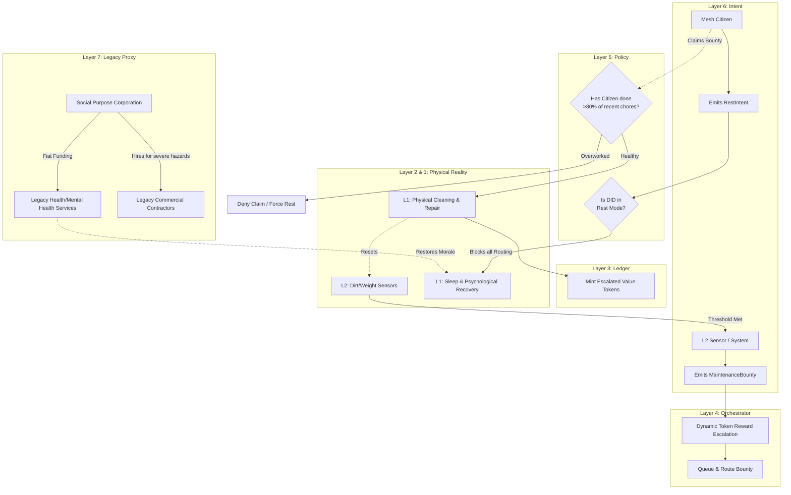

# Scenario Sigma: The Maintenance Commons (Burnout & Entropy)

*   **Identifier:** `SCN-SIGMA-MAINTENANCE`
*   **System Epic:** Invisible Labor, Dynamic Bounties, Psychological Entropy, and Chore Routing
*   **Primary Layers Tested:** L1 (Physical), L2 (Twin), L3 (Ledger), L4 (Orchestrator), L5 (Governance), L7 (Proxy)
*   **Pass/Fail Metric:** Successful routing and completion of low-status maintenance tasks via dynamic token escalation; mathematical prevention of human burnout by enforcing L5 "Rest Locks"; equitable distribution of invisible labor across the Trust Ring.

---

## 1. Problem Statement & Legacy Failure

In legacy capitalist structures, "maintenance" (cleaning, repairing, organizing, emotional labor) is treated as low-status, low-pay work. In informal communes or co-ops, this invisible labor inevitably falls onto a small fraction of hyper-conscientious individuals. Eventually, these individuals suffer complete psychological entropy (burnout). They stop working, resentment fractures the social graph, and the physical infrastructure degrades into chaos. 
Human beings are thermodynamic engines; they require downtime, rest, and psychological safety to recharge. If a system extracts labor without measuring and mitigating human fatigue, it will structurally collapse.

## 2. The Collective Workflow (7-Layer Traversal)

Scenario Sigma treats dirt, wear-and-tear, and human fatigue as measurable systemic entropy. It utilizes the orchestrator to dynamically price chores based on desirability, mathematically ensuring that maintenance is the highest-valued labor in the Node.

### Layer 7: The Legacy Proxy (The Health Shield)
*   **Healthcare Pooling:** The Social Purpose Corporation (SPC) uses fiat reserves to purchase high-quality group health and mental health insurance for the Stewards. 
*   **Legacy Services:** If a maintenance task is too specialized or hazardous for the mesh (e.g., pumping a massive septic tank or dealing with legacy electrical grid lines), the SPC bridges the gap, using fiat to hire legacy commercial contractors, protecting the citizens from undue physical hazard.

### Layer 6: Semantic Intent
*   The system autonomously emits a `MaintenanceBounty` (e.g., "Deep clean the Commons Kitchen" or "Empty the Biochar ash bins").
*   Citizens can emit a `RestIntent` (signaling they are stepping away from the mesh to recharge, effectively putting their DID in "Do Not Disturb" mode).

### Layer 5: Policy & Web of Trust (The Burnout Gate)
*   **The Fatigue Lockout:** Layer 5 monitors the velocity of a citizen's completed bounties. If an individual has claimed 80% of the cleaning bounties this month, the Trust Ring policy assumes they are approaching burnout. The policy mathematically *locks them out* of accepting new maintenance bounties, and temporarily suspends their ability to teach in **Scenario Kappa (Apprenticeship)**, forcing the rest of the network to step up and preventing the citizen from self-immolating for the commons.
*   **Rest Intent Respect:** When a DID broadcasts a `RestIntent`, Layer 5 policy strictly forbids the BPMN engine from routing them requests, messages, or notifications until the temporal block expires.

### Layer 4: Orchestration (Dynamic Escalation & Morale Routing)
*   The BPMN engine acts as an algorithmic chore wheel that cannot be ignored.
*   **Dutch Auction / Escalation:** When a chore is generated, it starts with a base Value Token bounty. If no one claims it, the orchestrator algorithmically increases the bounty. It continues to escalate the reward until the thermodynamic incentive matches a citizen's willingness to perform the low-status task.
*   **Morale Reconstruction Hook:** When a user triggers a Fatigue Lockout, the Orchestrator doesn't just block them; it actively emits suggestions for **Scenario Lambda (Cultural Commons / Somatic Play)** or **Scenario Gamma (Commons Kitchen)**, guiding the exhausted citizen toward psychological and physical restoration without demanding further labor.

### Layer 3: Ledger (Valuing the Invisible)
*   The Ledger flips legacy economics upside down. Because maintenance is critical to survival, tasks that legacy society ignores (sweeping, scrubbing, organizing tools) are heavily subsidized by the Node's treasury. A citizen can earn enough Value Tokens to feed themselves for a week simply by maintaining the hygiene of the physical commons.

### Layer 2 & 1: Digital Twin & Physical Reality
*   **Telemetry (L2):** IoT sensors track physical entropy. A weight sensor under a trash bin emits a `MaintenanceBounty` when it crosses 15kg. A runtime counter on the 3D printer emits a bounty to clean the nozzle after 100 hours.
*   **Physical (L1):** Mops, brooms, organizing bins, human rest, sleep, and the physical restoration of order.

---



---

## 3. Oasis Engine Implementation Specification

In the C++ Oasis engine, this scenario introduces the "Decay & Fatigue" physics:

*   **Voxel Entropy:** All man-made voxels (e.g., `FLOOR_TILE`, `KITCHEN_COUNTER`) contain a `dirt_level` integer. This integer ticks up based on player entity traffic through the chunk. If `dirt_level` reaches 100, the chunk applies a `MORALE_DEBUFF` to all entities inside it.
*   **Entity Fatigue:** `Player` and `NPC` entities possess a `fatigue` variable. Executing actions (crafting, harvesting) increases fatigue. If fatigue hits $100\%$, the entity enters a `FORCED_REST` state and cannot execute actions until they spend time in a `BED` voxel.
*   **Dynamic Bounty Spawning:** The `ChunkManager` monitors `dirt_level`. When it crosses a threshold, it publishes a bounty to the internal event bus. The `BountyManager` class increments the `token_reward` every 1,000 ticks until an entity accepts it.

---

```json
{
  "@context": [
    "[https://schema.org/](https://schema.org/)",
    "[https://collective.network/ontology/v1/](https://collective.network/ontology/v1/)"
  ],
  "@type": "MaintenanceBounty",
  "identifier": "urn:uuid:9f8e7d6c-5b4a-3c2d-1e0f-1a2b3c4d5e6f",
  "issuerDid": "did:mesh:node04:system_orchestrator",
  "taskProfile": {
    "title": "Deep Clean Commons Kitchen",
    "description": "Floor mopping, surface sanitization, and compost bin emptying required. L2 sensors indicate high traffic volume.",
    "estimatedDurationMinutes": 60,
    "requiredTools": ["Mop", "Bio-Safe_Cleaner"]
  },
  "escalationEngine": {
    "baseValueTokens": "8.00",
    "escalationRatePercentage": 10.0,
    "escalationIntervalHours": 12,
    "currentEscalatedTokens": "10.64"
  },
  "trustConstraints": {
    "requiredCredentials": ["Basic_Hygiene_L1"],
    "fatigueLockoutThresholdPercent": 50
  }
}
```

---

## 4. Acceptance Test Gates (Pass/Fail)

| Checkpoint | Validation Method | Pass Condition |
| :--- | :--- | :--- |
| **G1: Voxel Decay Tracking** | Traffic Simulation | The C++ engine successfully increments the `dirt_level` of a chunk strictly based on the physical traversal path of entities, spawning a bounty at the configured threshold. |
| **G2: Dynamic Bounty Escalation** | Tick-Based Auction | A simulated `MaintenanceBounty` left unclaimed successfully scales its Value Token reward upward over time until it is claimed. |
| **G3: The Burnout Lockout** | L5 Policy Engine | A simulated user attempting to accept a 10th consecutive cleaning bounty within a short time window is cryptographically denied by Layer 5 to enforce equitable labor distribution. |
| **G4: Rest Intent Routing** | BPMN Isolation | Emitting a `RestIntent` successfully drops all incoming non-emergency P2P requests to the simulated user's DID until the rest timer expires. |
