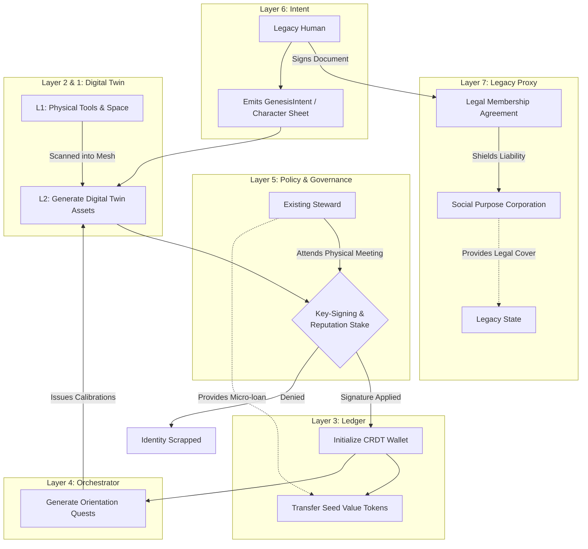

# Scenario Tau: Steward Genesis (Character Creation)

*   **Identifier:** `SCN-TAU-GENESIS`
*   **System Epic:** Identity Instantiation, Asset Mapping, and Sovereign Onboarding
*   **Primary Layers Tested:** L1 (Physical), L2 (Twin), L3 (Ledger), L4 (Orchestrator), L5 (Governance), L6 (Semantic), L7 (Proxy)
*   **Pass/Fail Metric:** Successful generation of a new Decentralized Identifier (DID) linked to a localized human; accurate digital mapping of their physical assets into the mesh inventory; successful cryptographic sponsorship by an existing Steward.

---

## 1. Problem Statement & Legacy Failure

In the legacy system, "onboarding" into society is coercive and bureaucratic. Your identity is reduced to extractive metrics: a credit score, a criminal background check, and a corporate resume. When you move to a new neighborhood, your actual utility—your tools, your skills, your willingness to help—is completely invisible to the people living 50 feet away from you.
To build a highly resilient, decentralized Node, new citizens must be able to securely plug their physical reality into the digital twin. The challenge is two-fold: First, the "Cold Start" problem. How does the very first Steward birth a new physical Node without a pre-existing Trust Ring? Second, how does a newcomer to an existing Node seamlessly "roll their character," digitizing their physical assets (a table saw, a spare bedroom) and skills (permaculture, coding) into a secure, trust-based pathway to begin trading exergy without legacy gatekeepers.

## 2. The Collective Workflow (7-Layer Traversal)

Scenario Tau is the "Genesis Protocol." It walks a legacy citizen through the creation of their sovereign identity, maps their physical assets, and initiates their first thermodynamic interactions with the Node.

### Layer 7: The Legacy Proxy (The Membership Membrane)
*   **The Legal Waiver:** Before generating keys, the legacy human signs a standard, legacy-compliant membership agreement or liability waiver with the Social Purpose Corporation (SPC). This legally classifies the mesh interactions as a "Private Mutual Aid Society" or "Private Club," shielding the internal thermodynamic trades from being classified by the legacy state as taxable commercial sales.

### Layer 6: Semantic Intent
*   The newcomer emits a `GenesisIntent`. This is their definitive "Character Sheet." It declares their physical location, baseline skills, and physical assets (e.g., "I am bringing a Bambu Lab A1, metric wrenches, and a 50L biochar retort").
*   **The Cross-Scenario Handshake:** Emitting this intent simultaneously triggers **Scenario Pi (The Sovereign Guild)** to establish their legacy EOR tax shield, and **Scenario Kappa (Apprenticeship)** to register them as an available apprentice/master in their declared skills.

### Layer 5: Policy & Web of Trust (The Prime vs. Standard Genesis)
*   **Prime Genesis (Node Birth):** If this is the birth of a brand new physical Node, there is no local Steward to vouch. The founding Steward must undergo a "Prime Genesis," utilizing a multi-sig cryptographic vouch from the global Collective network and heavily staking their own legacy fiat in the SPC to establish the initial trust anchor.
*   **Standard Genesis (Sponsorship):** For newcomers joining an active Node, the `GenesisIntent` must be co-signed by an existing Steward (their Sponsor) via a physical Key-Signing Party (linked to **Scenario Omicron** and breaking bread in **Scenario Gamma**). The Sponsor stakes their Reputational Weight to grant the newcomer `Trust_Level_1`.

### Layer 4: Orchestration (The Orientation Quests)
*   The BPMN engine acts as the "Dungeon Master," ingesting the Character Sheet and generating a personalized "Orientation Queue."
*   If the newcomer declared a 3D printer, Layer 4 immediately queues a `CalibrationBounty` (routing to **Scenario Alpha**) to prove hardware functionality. If they declared a spare room, it queues a `LodgingInspection` (routing to **Scenario Zeta**). 

### Layer 3: Ledger (The Seed Escrow)
*   The new DID's CRDT wallet is initialized with zero Value Tokens but holds a "Soulbound" token representing their genesis timestamp.
*   To prevent the "cold start" problem, the Sponsor or the Node Treasury can lock a "Seed Escrow"—a small micro-loan of Value Tokens that allows the newcomer to execute their first few transactions (e.g., paying for an orientation meal from Scenario Gamma) before they have earned their own.

### Layer 2 & 1: Digital Twin & Physical Reality
*   **Asset Ingestion (L2):** The newcomer uses their mobile device to scan the QR codes, serial numbers, or physical profiles of their tools and machinery. The digital twin generates new `Voxel` or `Entity` representations of these assets and assigns cryptographic ownership to the new DID.
*   **Physical (L1):** The human being, their physical house/apartment, their actual tools, and the physical handshake with their Sponsor.

---



---

## 3. Oasis Engine Implementation Specification

In the C++ Oasis engine, Scenario Tau serves as the player initialization sequence and inventory mapping protocol:

*   **Keypair Generation:** When a new `PlayerEntity` connects to the local mesh, the engine must execute the `libsodium` or equivalent cryptography library to generate a localized Ed25519 public/private keypair, storing the private key securely in the local edge node's keychain.
*   **Voxel Claiming:** The engine allows the new player to define a "Home Base" bounding box in the chunk grid. The engine verifies this space does not intersect with existing claimed properties, then updates the `owner_did` metadata for those voxels.
*   **Dynamic Skill Initialization:** The C++ core parses the `GenesisIntent` JSON and populates the player's initial `CredentialArray`, determining which internal event bus topics (e.g., `AGRICULTURE_EVENTS`, `METALLURGY_EVENTS`) the player is allowed to subscribe to.

---

```json
{
  "@context": [
    "[https://schema.org/](https://schema.org/)",
    "[https://collective.network/ontology/v1/](https://collective.network/ontology/v1/)"
  ],
  "@type": "GenesisIntent",
  "identifier": "urn:uuid:a1b2c3d4-0000-0000-0000-genesis00001",
  "requestedDidAlias": "steward_elara",
  "sponsorship": {
    "sponsorDid": "did:mesh:node04:steward_dave",
    "physicalKeySigningTimestamp": "2026-10-25T14:00:00Z"
  },
  "assetMapping": {
    "spatialAssets": [
      {
        "type": "Spare_Bedroom_15sqm",
        "intendedUse": "Scenario_Zeta_Lodging"
      }
    ],
    "hardwareAssets": [
      {
        "type": "3D_Printer_FDM",
        "make": "Bambu Lab A1 Mini",
        "intendedUse": "Scenario_Alpha_Fabrication"
      },
      {
        "type": "Industrial_Sewing_Machine",
        "make": "Juki DNU-1541S",
        "intendedUse": "Scenario_Nu_Fashion"
      }
    ]
  },
  "declaredCompetencies": [
    "Textile_Machinery_L2",
    "Basic_Botany_L1"
  ],
  "legacyCompliance": {
    "spcWaiverSigned": true,
    "legalNameMasked": true
  }
}
```

---

## 4. Acceptance Test Gates (Pass/Fail)

| Checkpoint | Validation Method | Pass Condition |
| :--- | :--- | :--- |
| **G1: Cryptographic Instantiation** | Keypair Verification | The engine successfully generates a valid Ed25519 DID, and the generated public key successfully signs a mock transaction on the local message bus. |
| **G2: L2 Asset Mapping** | Voxel Spawn Test | Assets declared in the `GenesisIntent` (e.g., a 3D printer) successfully spawn as digital twin entities in the engine with their `owner` variable strictly assigned to the new DID. |
| **G3: The Sponsorship Lock** | Gateway Defense | The new entity is mathematically blocked from interacting with any shared resources until an existing `PlayerEntity` with `Reputation > X` cryptographically signs the new DID's genesis block. |
| **G4: Orientation Spawning** | BPMN Queue Check | Upon successful sponsorship, the local orchestrator autonomously injects at least three targeted introductory bounties into the new entity's local UI feed. |
