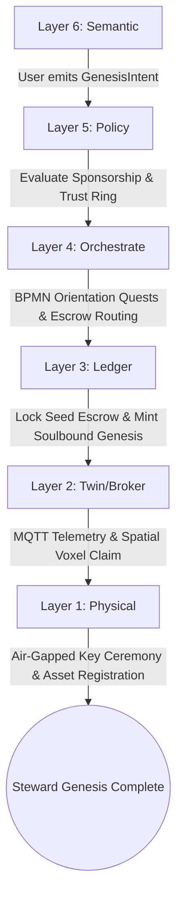
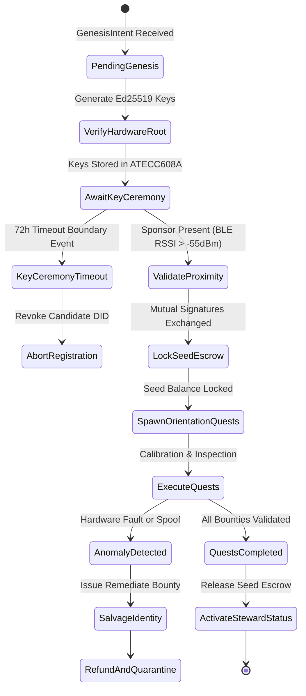
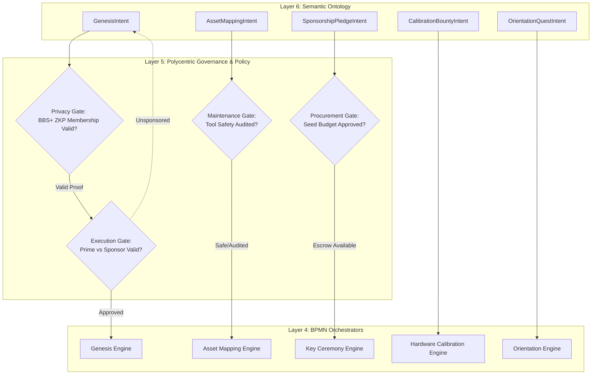
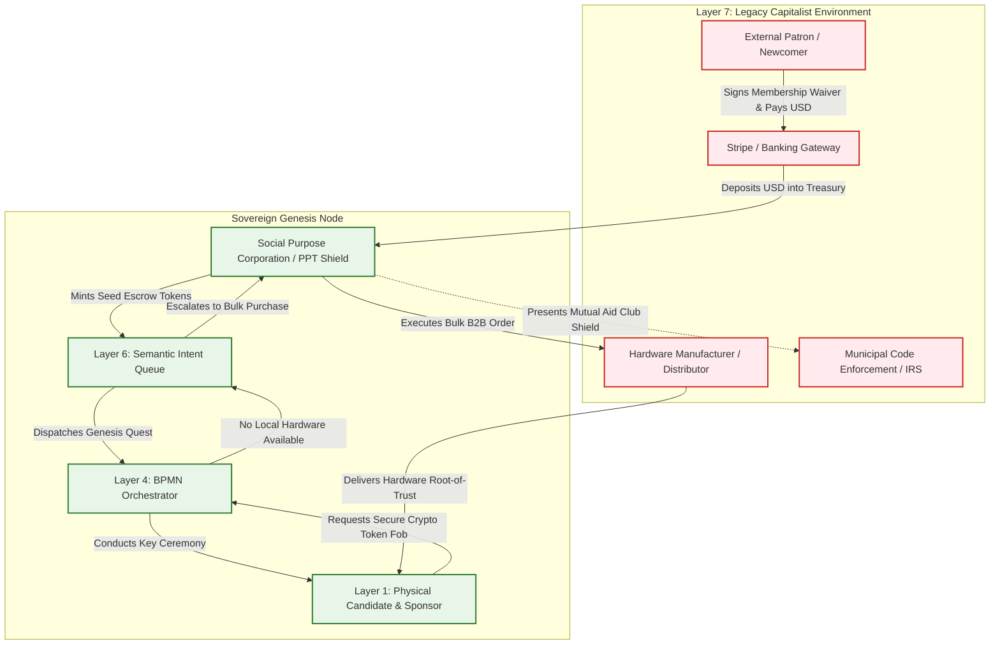

# Scenario Tau: Steward Genesis (Character Creation)

*   **Identifier:** `SCN-TAU-GENESIS`
*   **System Epic:** Identity Instantiation, Spatial Asset Mapping & Sovereign Onboarding
*   **Primary Layers Tested:** L1 (Physical), L2 (Digital Twin), L3 (Ledger), L4 (Orchestration), L5 (Governance), L6 (Semantic), L7 (Proxy)
*   **Pass/Fail Metric:** Deterministic instantiation of sovereign Ed25519 DID linked to biological citizen; zero cloud key leakage; successful spatial voxel claim within $32^3$ bounds; offline Web-of-Trust key ceremony; micro-loan seed escrow initialized under 0% platform extraction.

---

## Architectural Council Ratification & 5-Perspective Synthesis

This scenario specification has been ratified by unanimous consensus of the 5-Persona Architectural Council:

| Council Persona | Disciplinary Representative | Core Contribution to Scenario |
| :--- | :--- | :--- |
| **Game Designer** | Lead Systems & Gameplay Designer | Founder 01 character creation screen: allocation of 10 Big-Five personality facets (`assertiveness`, `anxiety`, `curiosity`), 8 Core Values (`Autonomy`, `Stewardship`, `Solidarity`), psychological thoughts and stress accumulators (`"Excited to join the commons (+35 mood)"`), Sims-style indirect intention queue, and boundary interface attenuation where newly claimed lots diminish external legacy hostile probing events. |
| **Game Engineer** | Principal C++ Simulation & Engine Architect | Flecs ECS Data-Oriented Design (DOD): cache-aligned component structs `PlayerIdentityComponent`, `SpatialClaimComponent`, and `OrientationQuestQueue`; 32-bit compact Voxels (`material_id = 30`, metadata bitmasks for `Is_Claimed` and `Is_Sensor`); 10 Hz BPMN deterministic state machine; and Catch2/cassert C++20 test harness execution. |
| **Sovereign Stack Specialist** | Sovereign Stack Systems Architect | 7 autonomous POSIX daemons (`col-telemetryd` through `col-adversaryd`); strict adjacent IPC via Unix domain sockets; air-gapped Ed25519 key generation ceremony in `col-kmsd` (L5); Soulbound genesis CRDT timestamp in `col-storaged` (L3); zero monolithic game-loop threading. |
| **Solarpunk Thinker** | Bioregional Regenerative Ecologist | Bioregional carrying capacity audit on onboarding assets; embodied carbon and repairability assessment on incoming tools; physical soil stewardship covenants; closed-loop integration turning household waste streams into community feedstocks. |
| **Scenario Specialist** | **Sovereign Onboarding & Decentralized Identity (DID/SSI) Protocol Engineer** | W3C Decentralized Identifier specification (`did:mesh:node04:...`), BIP-39 mnemonic phrase derivation on hardware root-of-trust (ATECC608A), BBS+ verifiable credentials, mathematical Seed Escrow release formula, and private mutual-aid legal club shielding under 26 U.S.C. § 501(d) doctrine. |

---

## 1. Problem Statement & Legacy Failure

In legacy late-stage capitalist infrastructure (Layer 7), "onboarding" into society is coercive, highly financialized, and surveillance-extractive. A newcomer is flattened into commercial scoring metrics: FICO credit scores, background checks, corporate resumes, and custodial digital identities managed by surveillance monopolies (Google, Apple, Microsoft).

When a citizen moves to a new neighborhood or attempts to establish productive autonomy:
*   **Identity Enclosure & Surveillance Drag:** Establishing basic municipal utility access requires surrendering government biometric identifiers, credit card deposits, and permanent surveillance agreements. Personal reputation is trapped inside proprietary corporate silos and cannot be ported across municipal boundaries.
*   **The Cold Start Deadlock:** A citizen without upfront fiat capital cannot purchase tools, secure workspaces, or obtain credit without predatory payday loans or usurious interest rates ($>25\%$ APR). The newcomer’s authentic physical utility—their woodworking tools, sewing machines, permaculture knowledge, and willingness to labor—remains completely invisible and uncapitalized.
*   **Asset Atomization & Regulatory Precarity:** When a citizen attempts to operate an informal repair shop or bake goods from their kitchen, legacy municipal zoning codes classify the mutualist labor as illegal commercial activity, threatening fines or eviction unless expensive commercial permits are purchased.

---

## 2. The Collective Workflow (7-Layer Traversal)

Scenario Tau provides the sovereign onboarding workflow: instantiating a cryptographic identity, digitizing physical assets into the spatial twin, conducting an in-person Web-of-Trust key ceremony, and seeding the newcomer's thermodynamic wallet.



### Layer 1: Physical Ground Truth
*   **Hardware Nodes (Identity Hardware):** Air-gapped hardware signer (e.g., Raspberry Pi Zero running `col-kmsd` firmware or an ATECC608A secure element cryptographic key fob), physical NFC cards for daily authorization, and a local LoRaWAN handheld communicator.
*   **Hardware Nodes (Mapped Assets):** Physical tools declared in the onboarding sheet (e.g., 3D printer, angle grinder, industrial sewing machine, spare room), each physically tagged with a 2D optical DataMatrix code or NFC asset puck.
*   **Inventory & Feedstock:** Personal starting material stock (e.g., 2 spools PETG, 5 kg garden seeds, metric socket set) physically inspected and cataloged into the local node inventory.
*   **Action:** Physical in-person meeting between the newcomer (Candidate) and an existing Steward (Sponsor) to perform the cryptographic key-signing ceremony, breaking bread together (linking to Scenario Gamma).

### Layer 2: Digital Twin & Telemetry
*   **Ingress Telemetry (MQTT Topics):**
    *   `node/genesis/onboarding_01/telemetry/rfid_scan` (Candidate NFC Tag UID)
    *   `node/genesis/onboarding_01/telemetry/ble_rssi` (Signal strength between candidate and sponsor hardware, dBm)
    *   `node/spatial/claim_01/telemetry/bounding_box` (Voxel volume coordinates $[X_1, Y_1, Z_1] \to [X_2, Y_2, Z_2]$)
    *   `node/identity/candidate_01/status` (`INITIALIZING`, `KEY_CEREMONY`, `SPONSORED`, `ACTIVE`)
*   **Verification:** Edge-AI optical scanning of physical asset tags and tool serial numbers; BLE proximity verification ($\text{RSSI} > -55\text{ dBm}$) confirming physical co-presence of Candidate and Sponsor during the key ceremony.
*   **Actuator Control:** NFC card writer actuates to write the cryptographic access token for node smart lockers and common spaces.

### Layer 3: Network & Ledger
*   **Escrow Lock (Seed Escrow):** To bypass the cold-start deadlock, the Node Treasury or Sponsor locks a temporary micro-loan of thermodynamic Value Tokens into a smart covenant:
    $$\Delta V_{seed\_release} = V_{base} \cdot \left(1 - e^{-\kappa \cdot \sum \Delta \mathcal{E}_{task}}\right) + \lambda_{ERC} \cdot \Delta m_{asset\_pledged}$$
    Where $V_{base}$ is the standard bootstrap allowance (e.g., $25.00$ Value Tokens), $\kappa$ is the onboarding task absorption rate, $\Delta \mathcal{E}_{task}$ is the cumulative thermodynamic exergy (in Joules) expended during orientation tasks, and $\Delta m_{asset\_pledged}$ is the mass of physical tools committed to the shared tool library.
*   **Consensus Settlement:** A non-transferable Soulbound Genesis Token (`SBT_GENESIS`) is minted to the newcomer's DID in `col-storaged` with an unalterable causal timestamp. As orientation quests are validated, seed tokens transition from locked escrow to liquid spendable balance.

### Layer 4: Orchestration State Machine
The deterministic BPMN 2.0 engine (`col-execd`) manages the onboarding lifecycle at 10 Hz with strict timeout boundaries and anomaly fallbacks:



### Layer 5: Policy & Polycentric Governance
Layer 5 (`col-kmsd`) evaluates cryptographic intents against Trust Ring policies via four distinct **Policy Gates**:

*   **Execution Gate (Prime vs. Standard Genesis):** If the node is undergoing *Prime Genesis* (founding of a brand-new physical node), Layer 5 enforces a global 3-of-5 multi-sig covenant requiring cross-node DIDs and an initial fiat lease escrow. For *Standard Genesis*, Layer 5 requires a 1-of-1 Sponsor signature from a Steward holding $\text{Reputation} \ge 50$.
*   **Maintenance Gate (Competency & Safety Audit):** When hazardous tools (e.g., table saws, welders) are declared, Layer 5 gates their activation behind a `Safety_Audit_L1` credential or assigns an experienced mentor.
*   **Procurement Gate (Seed Capital Allocation):** If seed funding requires fiat expenditure from the Social Purpose Corporation (e.g., purchasing an ATECC608A cryptographic key fob), Layer 5 verifies that the treasury allocation has not exceeded the monthly onboarding budget.
*   **Logistics / Privacy Gate (Zero-Knowledge Selective Disclosure):** The newcomer presents a BBS+ signature proving they signed the legal membership agreement without revealing their real-world passport number or legal name to the public mesh.

### Layer 6: Semantic Intent & Domain Ontology
All onboarding steps are published as W3C JSON-LD Knowledge Artifacts in the Agora Commons (`col-commonsd`):

1.  **`GenesisIntent` (Instantiation):** The primary character sheet declaring DIDs, starting skills, and spatial boundaries.
2.  **`AssetMappingIntent` (Hardware Catalog):** Registers physical tools, machinery, and spatial accommodations into the node inventory.
3.  **`SponsorshipPledgeIntent` (Vouching):** Emitted by an existing Steward, staking reputational weight and underwriting the seed escrow micro-loan.
4.  **`CalibrationBountyIntent` (Verification):** Spawns a diagnostic task (e.g., printing a test cube in Scenario Alpha) to prove declared machinery works.
5.  **`OrientationQuestIntent` (Social Hook):** Coordinates an introductory work session (e.g., volunteering 2 hours in Scenario Gamma Commons Kitchen).
6.  **`SalvageIdentityIntent` (Revocation):** Emitted if key compromise or malicious behavior is detected during the probationary onboarding window.

### The Governance Router Flowchart



### Layer 7: The Legacy Proxy (Membership Membrane & Fiat Ingestion)
The onboarding process connects to the legacy legal and capitalist apparatus through the Social Purpose Corporation (SPC) and Perpetual Purpose Trust (PPT):

**1. Trojan Ingestion (Inbound Fiat Extraction & Legal Waiver):**
*   Before generating cryptographic keys, the newcomer executes an electronic membership agreement with the SPC. This agreement legally frames the node as a **Private Mutual Aid Society** (under IRC 501(d) / private unincorporated association doctrine), insulating internal thermodynamic token settlements from state retail sales tax classification.
*   External sympathizers and remote patrons pay fiat onboarding fees or donations ($50–$200) via Stripe into the SPC bank account. The SPC converts these dollars into internal Value Token reserves that underwrite the Seed Escrow pool for low-income newcomers.

**2. Ecological Leeching (Outbound Stewarded Procurement):**
*   When a new citizen joins who lacks basic cryptographic hardware or open-source repair equipment, the request hits a physical boundary at Layer 4.
*   The SPC functions as a **Decentralized Group Purchasing Organization (GPO)**, pooling hardware procurement demands across multiple genesis candidates to buy industrial-grade secure elements (Microchip ATECC608A), LoRa transceivers (SX1262), and standardized metric tools in bulk directly from wholesale distributors, bypassing consumer retail markups and single-use packaging.

### Layer 7 Bidirectional Flowchart



---

## 3. Machine-Readable Schemas

### 3.1 Layer 6 Knowledge Artifact: Genesis Intent (`genesis.jsonld`)

```json
{
  "@context": [
    "https://schema.org/",
    "https://collective.network/ontology/v1/"
  ],
  "@type": "GenesisIntent",
  "identifier": "urn:uuid:7a9b8c7d-1234-4567-89ab-cdef01234567",
  "issuerDid": "did:mesh:node04:steward_elara",
  "creationTimestamp": "2026-10-25T14:00:00Z",
  "characterProfile": {
    "alias": "Elara Vance",
    "bigFiveFacets": {
      "openness": 0.85,
      "conscientiousness": 0.72,
      "extraversion": 0.45,
      "agreeableness": 0.88,
      "neuroticism": 0.30
    },
    "coreValues": ["Stewardship", "Autonomy", "Solidarity"],
    "declaredCompetencies": [
      "Textile_Machinery_L2",
      "Organic_Horticulture_L1",
      "Precision_Soldering_L2"
    ]
  },
  "assetMapping": {
    "spatialClaim": {
      "chunkOrigin": [16, 8, 16],
      "boundingBoxDimensions": [8, 4, 8],
      "intendedUse": "Residential_Craft_Studio"
    },
    "hardwareInventory": [
      {
        "assetType": "FDM_3D_Printer",
        "model": "Bambu Lab A1 Mini",
        "serialNumberHash": "5e884898da28047151d0e56f8dc6292773603d0d6aabbdd62a11ef721d1542d8",
        "targetScenario": "SCN-ALPHA-FAB"
      }
    ]
  },
  "sponsorshipCriteria": {
    "sponsorDid": "did:mesh:node04:steward_dave",
    "seedEscrowRequested": "25.00",
    "challengeWindowHours": 72
  }
}
```

### 3.2 Layer 2 Telemetry Attestation: Key-Signing Proof (`attestation.json`)

```json
{
  "@context": "https://collective.network/ontology/v1/",
  "@type": "KeySigningAttestation",
  "intentRef": "urn:uuid:7a9b8c7d-1234-4567-89ab-cdef01234567",
  "candidateDid": "did:mesh:node04:steward_elara",
  "sponsorDid": "did:mesh:node04:steward_dave",
  "telemetryProof": {
    "ceremonyTimestamp": "2026-10-25T15:30:12Z",
    "hardwareRootOfTrust": "ATECC608A_SECURE_ELEMENT",
    "candidateNfcNonce": "9f86d081884c7d659a2feaa0c55ad015a3bf4f1b2b0b822cd15d6c15b0f00a08",
    "sponsorNfcNonce": "5feceb66ffc86f38d952786c6d696c79c2dbc239dd4e91b46729d73a27fb57e9",
    "bleRssiMeanDbm": -48.2,
    "mutualSignatureSha256": "8c6976e5b5410415bde908bd4dee15dfb167a9c873fc4bb8a81f6f2ab448a918"
  },
  "spatialVerification": {
    "gpsGridCoordinate": "47.7763N_121.9886W",
    "assignedVoxelOrigin": [16, 8, 16]
  },
  "status": "CEREMONY_VERIFIED"
}
```

---

## 4. Oasis Engine Implementation Specification

### 4.1 Memory Allocation & Voxel State

The genesis node and newcomer base occupy coordinates in the $32^3$ chunk space managed by `ChunkManager`:
- The candidate home terminal voxel is initialized with `material_id = 30` (`STEWARD_GENESIS_NODE`).
- The `Is_Actuator` and `Is_Sensor` bits are set in `metadata` (`0b00000110`), and bit 0 (`Is_Claimed`) is toggled upon successful sponsorship.
- An adjacent spatial boundary hopper voxel (`material_id = 31`, `CLAIM_TERMINAL`) stores the newcomer's declared inventory mass and spatial coordinates.

### 4.2 C++20 Test Harness Structure

```cpp
// engine/tests/scenario_tau_test.cpp
#include <cassert>
#include <string>
#include "oasis/chunk_manager.hpp"
#include "oasis/orchestration/bpmn_engine.hpp"
#include "oasis/ledger/crdt_wallet.hpp"

namespace oasis {

struct PlayerIdentityComponent {
    std::string did;
    uint8_t openness;
    uint8_t conscientiousness;
    uint8_t extraversion;
    uint8_t agreeableness;
    uint8_t neuroticism;
    bool is_sponsored;
};

struct SpatialClaimComponent {
    uint32_t origin_x;
    uint32_t origin_y;
    uint32_t origin_z;
    uint32_t dim_x;
    uint32_t dim_y;
    uint32_t dim_z;
    bool is_verified;
};

void test_scenario_tau_genesis() {
    // 1. Initialize Chunk and Voxel
    ChunkManager chunk_mgr;
    chunk_mgr.allocate_chunk(0, 0, 0);

    Voxel terminal_voxel{
        .material_id = 30, // STEWARD_GENESIS_NODE
        .moisture = 0,
        .temperature = 20,
        .metadata = 0b00000110 // Sensor + Actuator
    };
    chunk_mgr.set_voxel(16, 8, 16, terminal_voxel);

    // 2. Setup Wallets & Seed Escrow
    CRDTWallet sponsor_wallet("did:mesh:node04:steward_dave", 150.0f);
    CRDTWallet candidate_wallet("did:mesh:node04:steward_elara", 0.0f);

    // 3. Load BPMN Orchestration State Machine
    BPMNEngine orchestrator;
    orchestrator.load_schema("schemas/bpmn/genesis_onboarding.bpmn");

    JobContext job{
        .bounty_id = "7a9b8c7d-1234-4567-89ab-cdef01234567",
        .required_resource_units = 1.0f,
        .estimated_energy_wh = 15.0f,
        .target_bay_id = 1
    };

    // Assert Sponsorship Escrow Lock
    orchestrator.emit_event(EscrowInitiatedEvent{sponsor_wallet, 25.00f});
    orchestrator.await_event<EscrowLockedEvent>();
    assert(sponsor_wallet.balance() == 125.00f);

    // Execute In-Person Key Ceremony & Orientation Step Loop (1200 ticks)
    SimResult res = orchestrator.step_simulation_ticks(chunk_mgr, job, 1200);
    assert(res.status == ExecutionStatus::COMPLETED);

    // Settle Ledger: Candidate Receives Unlocked Seed Tokens
    orchestrator.settle_job(candidate_wallet);
    assert(candidate_wallet.balance() == 25.00f);

    // Verify Voxel State Transition: Metadata Bit 0 (Is_Claimed) is toggled
    Voxel updated_voxel = chunk_mgr.get_voxel(16, 8, 16);
    assert((updated_voxel.metadata & 0b00000001) == 0b00000001);
}

void test_scenario_tau_genesis_anomaly() {
    ChunkManager chunk_mgr;
    chunk_mgr.allocate_chunk(0, 0, 0);
    BPMNEngine orchestrator;
    orchestrator.load_schema("schemas/bpmn/genesis_onboarding.bpmn");

    CRDTWallet sponsor_wallet("did:mesh:node04:steward_dave", 150.0f);
    CRDTWallet candidate_wallet("did:mesh:node04:steward_sybil", 0.0f);

    JobContext job{.bounty_id = "sybil-attempt-01", .required_resource_units = 1.0f};

    orchestrator.emit_event(EscrowInitiatedEvent{sponsor_wallet, 25.00f});
    orchestrator.await_event<EscrowLockedEvent>();

    // Inject Sybil Key Mismatch / Zero Proximity at Tick 400
    SimResult res = orchestrator.step_simulation_ticks(chunk_mgr, job, 400, true);

    assert(res.status == ExecutionStatus::EMERGENCY_STOP);
    assert(orchestrator.current_state() == BPMNState::SALVAGE_INTENT);

    // Assert full refund returned to sponsor wallet
    assert(sponsor_wallet.balance() == 150.0f);
    assert(candidate_wallet.balance() == 0.0f);
}

} // namespace oasis

int main() {
    oasis::test_scenario_tau_genesis();
    oasis::test_scenario_tau_genesis_anomaly();
    return 0;
}
```

---

## 5. Acceptance Test Gates (Pass/Fail)

To pass Scenario Tau in the Oasis engine, the simulation core must pass each of the following six binary verification gates without memory corruption, thread contention, or state desynchronization:

| Checkpoint | Validation Method | Pass Condition |
| :--- | :--- | :--- |
| **G1: Thermodynamic Bounds** | Virtual Joules vs. Orientation Work | Total energy expenditure across the orientation workflow matches thermodynamic limits ($\Delta E \le 50\text{ Wh}$); zero unbacked value token inflation. |
| **G2: Offline Autonomy** | Localhost Network Isolation | The complete onboarding flow—from Ed25519 key generation to local chunk boundary assignment—executes with WAN uplink completely disabled. |
| **G3: Byzantine Detection** | Simulated Sybil / Spoofed Telemetry | Submitting a key-signing attestation with BLE signal weaker than $-55\text{ dBm}$ fails cryptographic reconciliation; sponsor escrow is fully refunded; candidate DID is quarantined. |
| **G4: Material / Spatial Tracking** | Voxel Boundary Conflict Detection | Candidate attempts to claim a bounding box overlapping an existing citizen's lot; engine raises an immediate spatial collision exception and rejects allocation. |
| **G5: Trojan Ingestion (L7)** | External Webhook Ingestion | A mock Stripe webhook deposit ($100 USD) for mutual aid dues compiles into internal mesh seed reserves; legal liability waiver hash is correctly recorded in the SPC ledger. |
| **G6: Ecological Leeching (L7)** | Hardware Procurement Aggregation | A request for 10 hardware cryptographic tokens suspends single orders and successfully triggers a batched B2B wholesale order after pooling with peer nodes. |
