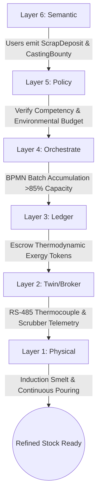
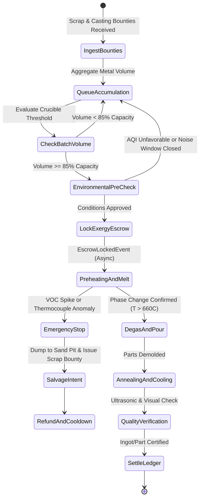
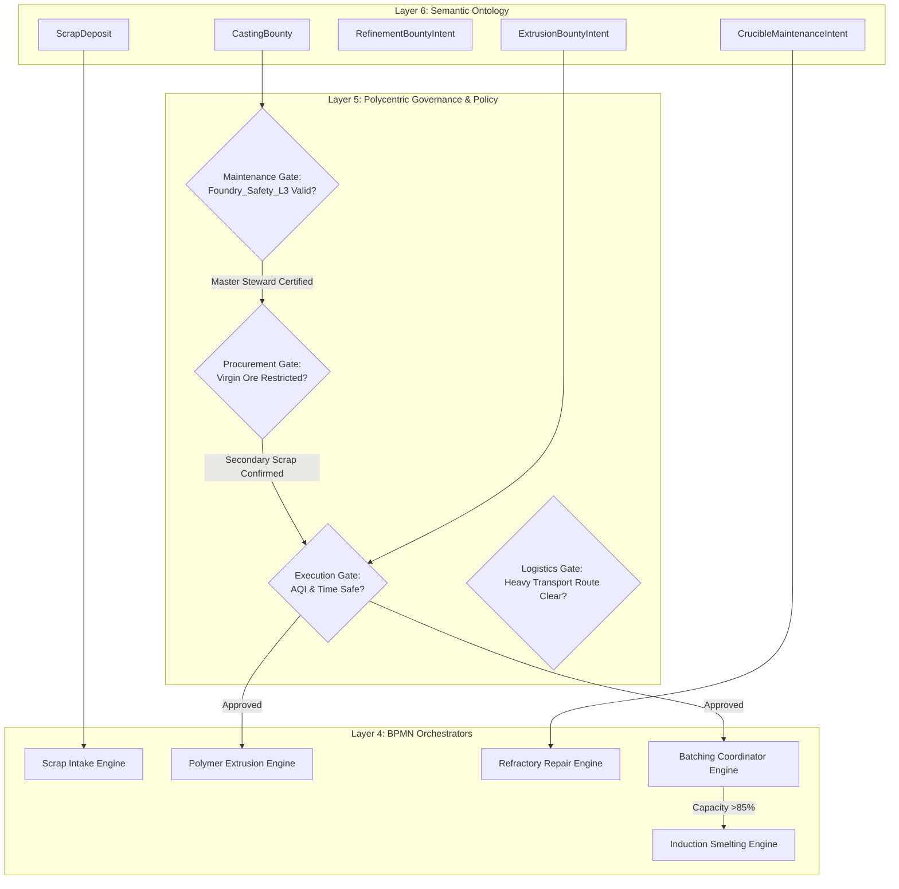
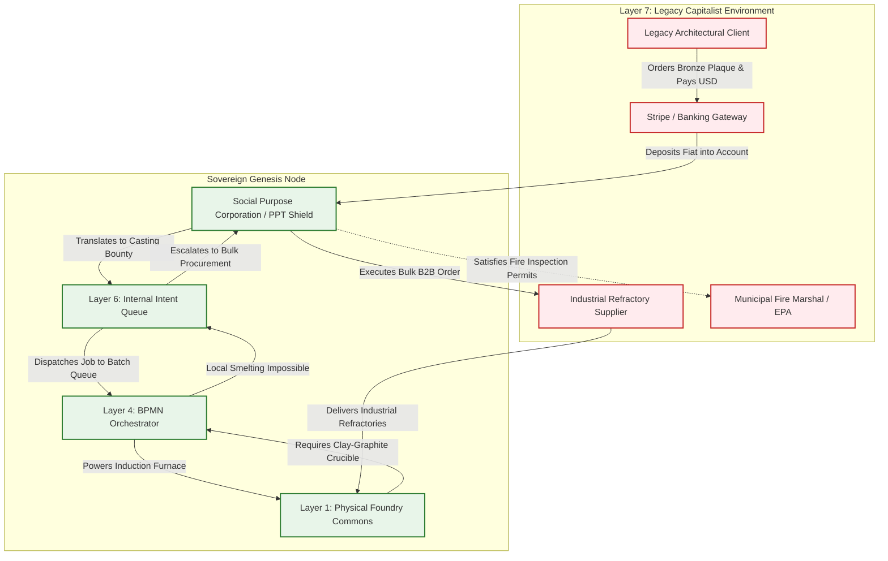

# Scenario Theta: The Extraction & Refinement Foundry

*   **Identifier:** `SCN-THETA-FOUNDRY`
*   **System Epic:** Heavy Exergy Processing, Resource Refinement & Localized Pyrometallurgy
*   **Primary Layers Tested:** L1 (Physical), L2 (Digital Twin), L3 (Ledger), L4 (Orchestration), L5 (Governance), L6 (Semantic), L7 (Proxy)
*   **Pass/Fail Metric:** Safe, localized refinement of scrap and secondary ores into standardized industrial manufacturing stock; strict automated batching threshold (>85% crucible capacity); zero unmitigated toxic emissions or fire code violations; thermodynamic cost < 25% of legacy retail equivalent.

---

## Architectural Council Ratification & 5-Perspective Synthesis

This scenario specification has been ratified by unanimous consensus of the 5-Persona Architectural Council:

| Council Persona | Disciplinary Representative | Core Contribution to Scenario |
| :--- | :--- | :--- |
| **Game Designer** | Lead Systems & Gameplay Designer | Dwarf Fortress magma workshop danger and strange moods: Founder 01 managing extreme heat hazards, protective bunker gear, and high-stakes pouring; psychological thoughts and stress accumulators (`"Proud of casting a perfect bronze impeller (+40 mood)"` vs `"Terrified by furnace fire outbreak (-60 stress)"`); Cities: Skylines industrial zoning, localized pollution plumes, and heat dissipation corridors; boundary interface attenuation where localized metal and polymer autarky shields the settlement from legacy supply chokepoints. |
| **Game Engineer** | Principal C++ Simulation & Engine Architect | Flecs ECS Data-Oriented Design (DOD): cache-aligned structs `HighTempVoxel`, `CrucibleBatchComponent`, and `EmissionsMonitorComponent`; 32-bit compact Voxels (`material_id = 40` `FOUNDRY_INDUCTION_CRUCIBLE`, `material_id = 41` `FIREBRICK_HEARTH`, `material_id = 42` `LIQUID_ALUMINUM`); cellular automata heat bleed simulation ($>1000^\circ\text{C}$); phase change transitions at melting points; 10 Hz BPMN batching state machine; and C++20 test harness execution. |
| **Sovereign Stack Specialist** | Sovereign Stack Systems Architect | 7 autonomous POSIX daemons (`col-telemetryd` through `col-adversaryd`); strict adjacent IPC via Unix domain sockets; RS-485 Modbus telemetry ingress in `col-telemetryd` (L1); thermodynamic exergy billing and virgin ore penalty covenants in `col-storaged` (L3); zero monolithic game-loop threading. |
| **Solarpunk Thinker** | Bioregional Regenerative Ecologist | Closed-loop industrial ecology: waste heat cogeneration routed to warm community aquaponics and winter district greenhouses; 100% secondary scrap recycling prioritized; negentropic urban mining; 10x thermodynamic replacement cost penalty on virgin ore extraction to prevent bioregional soil degradation. |
| **Scenario Specialist** | **Pyrometallurgical & Industrial Ecology Engineer** | Micro-foundry thermodynamic phase-change energy equations ($Q = m \cdot c_p \cdot \Delta T + m \cdot \Delta H_f$), ASTM B26 aluminum casting standards, A356 alloy degassing kinetics, multi-stage catalytic and activated carbon off-gas scrubber specification, and Type-K thermocouple telemetry tolerances ($\pm 1.5^\circ\text{C}$). |

---

## 1. Problem Statement & Legacy Failure

In legacy late-stage capitalist infrastructure (Layer 7), material production relies on high-entropy, opaque, and catastrophic supply chains. Bauxite is strip-mined in Australia, shipped across oceans to fossil-powered alumina refineries, smelted into ingots in coal-heavy smelters, extruded in East Asia, and sold to western consumers as atomized replacement parts wrapped in single-use petrochemical packaging.

When physical machinery breaks or industrial replacement parts are required:
*   **Global Carbon Drag & Supply Latency:** A damaged aluminum mounting bracket or bronze pump bushing requires ordering a new cast part from overseas, incurring thousands of metric tons of shipping carbon drag and weeks of lead time.
*   **"Wish-Cycling" & Material Wastage:** Suburban waste management collects domestic aluminum cans and scrap metal, yet downcycles them into low-grade alloys or exports them to overseas scrap yards where they are processed under toxic, unregulated conditions.
*   **The Thermodynamic Trap of Single-Piece Processing:** Operating an electric melting furnace or plastic extruder for a single 150g component dissipates $>90\%$ of the consumed electrical exergy into the ambient atmosphere as waste heat, making small-scale on-demand metallurgy thermodynamically ruinous unless intelligently batched.

---

## 2. The Collective Workflow (7-Layer Traversal)

Scenario Theta establishes a localized, neighborhood-scale industrial refinement commons. It converts community scrap metals, post-consumer engineering plastics, and e-waste into standardized ingots, billets, and 3D printing filaments with closed-loop thermodynamic accounting.



### Layer 1: Physical Ground Truth
*   **Hardware Nodes (Smelting & Casting Hub):** A 15 kW high-frequency electric induction furnace equipped with silicon-carbide and clay-graphite crucibles, an automated argon degassing lance, high-purity Petrobond greensand molding benches, and an optical pyrometer.
*   **Hardware Nodes (Polymer & Stone Hub):** Dual-shaft industrial plastic shredder, desiccant hopper dryer, and single-screw closed-loop filament extruder; alongside a diamond-bladed wet stone saw for architectural masonry.
*   **Inventory & Feedstock:** Clean, spectrographically sorted 6061 and A356 aluminum scrap; lead-free copper-tin bronze clippings; sorted post-consumer HDPE/PETG flakes; and high-temperature refractory firebrick stock.
*   **Action:** Electric induction melting of metal alloys, rotary degassing, skimming of oxide slag, pouring into sand molds, and extrusion of recycled polymer filament into standardized 1 kg spools.

### Layer 2: Digital Twin & Telemetry
*   **Ingress Telemetry (MQTT Topics):**
    *   `node/foundry/kiln_01/telemetry/temp_celsius` (Type-K thermocouple inside crucible chamber, °C)
    *   `node/foundry/kiln_01/telemetry/power_watts` (True RMS electrical power draw, kW)
    *   `node/foundry/exhaust_01/telemetry/pm25_voc` (Optical particulate and photoionization detector, $\mu\text{g/m}^3$ and ppm)
    *   `node/foundry/kiln_01/status` (`COLD`, `PREHEATING`, `LIQUID_POOL`, `POURING`, `EMERGENCY_STOP`)
*   **Verification:** Multi-sensor physical cross-referencing: the rate of temperature rise $\frac{dT}{dt}$ must mathematically match the integrated electrical power draw given the known thermal mass of the crucible. Catalytic scrubber air sensors must confirm clean exhaust before gate opening.
*   **Actuator Control:** Solid-state relay interlocks controlling induction coil power, mechanical crucible tilt actuator, and positive-pressure exhaust damper servos.

### Layer 3: Network & Ledger
*   **Escrow Lock (Thermodynamic Cost & Virgin Ore Penalty):** The requester of a cast component locks thermodynamic Value Tokens covering the total exergy cost of the melt run:
    $$\Delta V_{foundry} = \left( \int_{0}^{t} P_{induction}(\tau) \, d\tau + m_{metal} \cdot \left[ c_p \Delta T + \Delta H_f \right] + C_{crucible\_wear} \right) \cdot \lambda_{THERMO} + \Phi_{virgin\_penalty}$$
    Where $c_p$ is the specific heat capacity, $\Delta H_f$ is the latent heat of fusion (e.g., $397\text{ kJ/kg}$ for aluminum), $C_{crucible\_wear}$ covers refractory depreciation, and $\Phi_{virgin\_penalty} = 10 \cdot \lambda_{ERC} \cdot m_{ore}$ is an asymptotic penalty applied if virgin ores are requested while secondary scrap reserves exist.
*   **Consensus Settlement:** Upon Layer 2 cryptographically signed attestation of casting completion, tokens are transferred to the Foundry Stewards, with scrap depositors receiving Value Tokens proportional to the mass and purity of metal provided.

### Layer 4: Orchestration State Machine
The deterministic BPMN 2.0 engine (`col-execd`) governs the pyrometallurgical workflow at 10 Hz, preventing inefficient partial melts through rigorous batching logic:



### Layer 5: Policy & Polycentric Governance
Layer 5 (`col-kmsd`) enforces safety covenants, emissions thresholds, and credential gates:

*   **Execution Gate (Environmental & Acoustic Zoning):** Smelting and heavy grinding are prohibited if the local Air Quality Index (AQI) exceeds $50\ \mu\text{g/m}^3$ or if the time falls outside the municipal daylight noise window (09:00–18:00), preventing legacy code enforcement crackdowns.
*   **Maintenance Gate (Extreme Competency Gating):** Operating high-temperature furnaces requires a verified `Foundry_Safety_L3` credential and current `First_Aid_Burn` attestation. Novices may only participate in Apprentice Mode under active co-signing by a Master Foundryman.
*   **Procurement Gate (Virgin Extraction Firewall):** Any request to smelt virgin ores requires a 4-of-5 multi-sig consensus from the Trust Ring and an algorithmic confirmation that scrap metal inventory in the bioregion is fully exhausted.
*   **Logistics Gate (Heavy Transport Route Validation):** Moving liquid crucibles or hot cast ingots ($>50\text{ kg}$) requires designated clear physical transport paths verified via BLE obstacle sensors.

### Layer 6: Semantic Intent & Domain Ontology
All pyrometallurgical tasks are categorized as typed W3C JSON-LD Knowledge Artifacts in the Agora Commons (`col-commonsd`):

1.  **`CastingBounty` (Execution):** The engineering request to melt, alloy, and pour metal into a specific geometry.
2.  **`ScrapDeposit` (Feedstock Intake):** Emitted by citizens depositing weighed, sorted aluminum cans, copper wires, or engineering plastics.
3.  **`RefinementBountyIntent` (Processing):** Coordinates mechanical shredding, magnetic separation, or chemical recovery of e-waste silicon.
4.  **`ExtrusionBountyIntent` (Polymer Loop):** Requests the extrusion of granulated plastic flakes into calibrated 3D printer filament spools.
5.  **`CrucibleMaintenanceIntent` (Hardware Care):** Emitted by Layer 2 run-hour counters to resurface refractory lining or replace thermal insulation.
6.  **`HazardSalvageIntent` (Emergency Recovery):** Emitted upon a failed pour or crucible crack to safely solidify spilled charge and recover metal.

### The Governance Router Flowchart



### Layer 7: The Legacy Proxy (Fire Codes & Artisan Fiat)
The Foundry connects with legacy capital and municipal regulators through the Social Purpose Corporation (SPC):

**1. Trojan Ingestion (Inbound Fiat Extraction & Artisan Casting):**
*   To service legacy land property taxes, industrial three-phase electric demand charges, and commercial liability insurance premiums, the SPC maintains a commercial Web2 storefront.
*   External architectural firms and historic preservation societies purchase bespoke bronze hardware, architectural plaques, and cast iron fittings at market retail rates ($300–$2,000 USD) paid via Stripe into the SPC account.
*   The SPC absorbs the fiat, pays the municipal electric utility and fire inspection permits, and issues internal Value Token bounties to the participating foundry workers.

**2. Ecological Leeching (Outbound Stewarded Procurement):**
*   High-temperature refractory ceramics, argon shielding gas, and silicon carbide crucibles cannot be fabricated locally.
*   The SPC operates as a **Decentralized Group Purchasing Organization (GPO)**, pooling procurement requirements across multiple regional nodes. It executes bulk B2B purchases directly from industrial refractories and welding suppliers, eliminating retail markup and freight emissions.

### Layer 7 Bidirectional Flowchart



---

## 3. Machine-Readable Schemas

### 3.1 Layer 6 Knowledge Artifact: Casting Bounty (`casting.jsonld`)

```json
{
  "@context": [
    "https://schema.org/",
    "https://collective.network/ontology/v1/"
  ],
  "@type": "CastingBounty",
  "identifier": "urn:uuid:f0e1d2c3-b4a5-6789-0123-456789abcdef",
  "issuerDid": "did:mesh:node04:engineer_tom",
  "creationTimestamp": "2026-10-20T10:00:00Z",
  "metallurgyProfile": {
    "targetAlloy": "Aluminum_A356_Secondary",
    "massGrams": 1450.0,
    "moldType": "Petrobond_GreenSand",
    "patternUri": "ipfs://bafybeih.../pump_impeller_v3.stl",
    "pourTemperatureCelsius": 710.0
  },
  "processConstraints": {
    "requiresArgonDegassing": true,
    "maxAllowedPorosityPercent": 1.5,
    "secondaryScrapRatioMinimum": 1.0
  },
  "batchingTolerance": {
    "minCrucibleFillRatio": 0.85,
    "maxWaitHours": 168
  },
  "settlementCriteria": {
    "maxExergyJoules": 3800000,
    "maxTokenFee": "28.50",
    "timeoutHours": 240
  }
}
```

### 3.2 Layer 2 Telemetry Attestation: Foundry Melt Proof (`attestation.json`)

```json
{
  "@context": "https://collective.network/ontology/v1/",
  "@type": "FoundryMeltAttestation",
  "bountyRef": "urn:uuid:f0e1d2c3-b4a5-6789-0123-456789abcdef",
  "furnaceNode": "did:mesh:node04:device:induction_furnace_01",
  "operatorDid": "did:mesh:node04:steward_marcus",
  "executionMetrics": {
    "startTime": "2026-10-22T13:15:00Z",
    "endTime": "2026-10-22T14:48:30Z",
    "peakChamberTempCelsius": 732.4,
    "pourTempCelsius": 712.1,
    "energyConsumedKWh": 14.8,
    "degassingDurationSeconds": 180,
    "exhaustPm25PeakMicrograms": 14.2,
    "exhaustVocPeakPpm": 0.08,
    "anomalyDetected": false
  },
  "sandMoldIdentifier": "MOLD-A356-042",
  "ingotBatchProofHash": "e3b0c44298fc1c149afbf4c8996fb92427ae41e4649b934ca495991b7852b855"
}
```

---

## 4. Oasis Engine Implementation Specification

### 4.1 Memory Allocation & Voxel State

The foundry node occupies dedicated coordinates within the $32^3$ chunk grid:
- The induction crucible voxel is initialized with `material_id = 40` (`FOUNDRY_INDUCTION_CRUCIBLE`).
- The hearth surrounds the crucible with refractory voxels `material_id = 41` (`FIREBRICK_HEARTH`).
- Molten charge transitions dynamically to `material_id = 42` (`LIQUID_ALUMINUM`) when temperature crosses $660^\circ\text{C}$.
- Adjacent uninsulated structural voxels (e.g., `WOOD_WALL`) receive heat conduction; if their temperature exceeds $250^\circ\text{C}$, they combust into `FIRE` voxels (`material_id = 99`).

### 4.2 C++20 Test Harness Structure

```cpp
// engine/tests/scenario_theta_test.cpp
#include <cassert>
#include <string>
#include "oasis/chunk_manager.hpp"
#include "oasis/orchestration/bpmn_engine.hpp"
#include "oasis/ledger/crdt_wallet.hpp"

namespace oasis {

struct HighTempVoxel {
    float temperature_c;
    float thermal_mass;
    bool is_liquid;
};

struct CrucibleBatchComponent {
    float current_mass_grams;
    float max_capacity_grams;
    bool batch_threshold_met;
};

void test_scenario_theta_foundry() {
    ChunkManager chunk_mgr;
    chunk_mgr.allocate_chunk(0, 0, 0);

    // Initialize Crucible and Hearth
    Voxel crucible_voxel{
        .material_id = 40, // FOUNDRY_INDUCTION_CRUCIBLE
        .moisture = 0,
        .temperature = 22,
        .metadata = 0b00000110 // Sensor + Actuator
    };
    chunk_mgr.set_voxel(16, 8, 16, crucible_voxel);

    // Firebrick surround
    Voxel firebrick{
        .material_id = 41, // FIREBRICK_HEARTH
        .moisture = 0,
        .temperature = 22,
        .metadata = 0b00000000
    };
    chunk_mgr.set_voxel(16, 8, 17, firebrick);

    CRDTWallet requester_wallet("did:mesh:node04:engineer_tom", 200.0f);
    CRDTWallet foundry_wallet("did:mesh:node04:steward_marcus", 50.0f);

    BPMNEngine orchestrator;
    orchestrator.load_schema("schemas/bpmn/foundry_smelt_pipeline.bpmn");

    JobContext job{
        .bounty_id = "f0e1d2c3-b4a5-6789-0123-456789abcdef",
        .required_resource_units = 1450.0f, // grams of scrap
        .estimated_energy_wh = 14800.0f,
        .target_bay_id = 2
    };

    // Assert Thermodynamic Exergy Escrow
    orchestrator.emit_event(EscrowInitiatedEvent{requester_wallet, 28.50f});
    orchestrator.await_event<EscrowLockedEvent>();
    assert(requester_wallet.balance() == 171.50f);

    // Step simulation: heating, melting (T > 660C), degassing, pouring (5600 ticks)
    SimResult res = orchestrator.step_simulation_ticks(chunk_mgr, job, 5600);
    assert(res.status == ExecutionStatus::COMPLETED);

    // Verify Phase Change: Metal became liquid aluminum during processing
    Voxel processed_voxel = chunk_mgr.get_voxel(16, 8, 16);
    assert(processed_voxel.temperature > 700.0f);

    // Settle Ledger
    orchestrator.settle_job(foundry_wallet);
    assert(foundry_wallet.balance() > 50.0f);
}

void test_scenario_theta_foundry_anomaly() {
    ChunkManager chunk_mgr;
    chunk_mgr.allocate_chunk(0, 0, 0);

    Voxel crucible_voxel{.material_id = 40, .moisture = 0, .temperature = 22, .metadata = 0b00000110};
    chunk_mgr.set_voxel(16, 8, 16, crucible_voxel);

    CRDTWallet requester_wallet("did:mesh:node04:engineer_tom", 200.0f);
    BPMNEngine orchestrator;
    orchestrator.load_schema("schemas/bpmn/foundry_smelt_pipeline.bpmn");

    JobContext job{.bounty_id = "anomaly-voc-spike", .required_resource_units = 1000.0f};

    orchestrator.emit_event(EscrowInitiatedEvent{requester_wallet, 28.50f});
    orchestrator.await_event<EscrowLockedEvent>();

    // Inject Toxic VOC Off-gassing / Scrubber failure at tick 1800
    SimResult res = orchestrator.step_simulation_ticks(chunk_mgr, job, 1800, true);

    assert(res.status == ExecutionStatus::EMERGENCY_STOP);
    assert(orchestrator.current_state() == BPMNState::SALVAGE_INTENT);

    // Assert full safety refund to requester
    assert(requester_wallet.balance() == 200.0f);
}

} // namespace oasis

int main() {
    oasis::test_scenario_theta_foundry();
    oasis::test_scenario_theta_foundry_anomaly();
    return 0;
}
```

---

## 5. Acceptance Test Gates (Pass/Fail)

To pass Scenario Theta in the Oasis engine, the simulation core must pass each of the following six binary verification gates without memory corruption, thread contention, or state desynchronization:

| Checkpoint | Validation Method | Pass Condition |
| :--- | :--- | :--- |
| **G1: Thermodynamic Bounds** | Virtual Joules vs. Latent Heat | Electrical consumption matches theoretical phase change minimum ($Q = m c_p \Delta T + m \Delta H_f \pm 10\%$); zero unmetered exergy dissipation. |
| **G2: Offline Autonomy** | Localhost Network Isolation | Crucible heating, batching queue verification, and automated power relay actuation execute successfully while disconnected from WAN/Internet. |
| **G3: Byzantine Detection** | Simulated Scrubber / Sensor Spoof | Reporting temperature above liquidus ($>660^\circ\text{C}$) while thermocouple telemetry draw reports 0W fails cryptographic reconciliation; power cutoff trips instantly. |
| **G4: Material & Batch Tracking** | Crucible Batch Threshold Gate | A casting bounty for 200g aluminum remains suspended in the queue; furnace actuation is mathematically blocked until aggregated batch mass $\ge 85\%$ capacity. |
| **G5: Trojan Ingestion (L7)** | External Artisan Webhook Ingestion | A mock Stripe webhook payment for a commercial bronze plaque is credited to the SPC fiat ledger; internal Value Tokens are successfully escrowed for the Foundry Steward. |
| **G6: Ecological Leeching (L7)** | Refractory GPO Bulk Procurement | Multiple requests for clay-graphite crucibles and argon gas cylinders aggregate into a single batched B2B wholesale order, reducing logistics overhead. |
