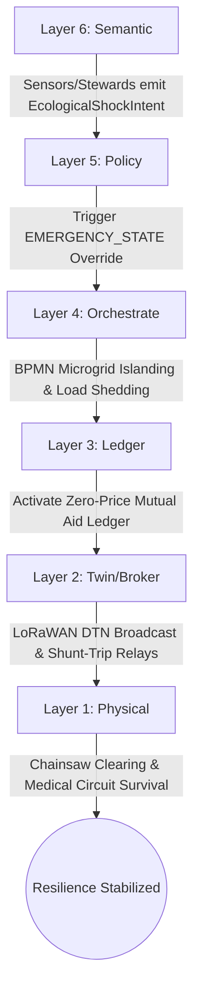
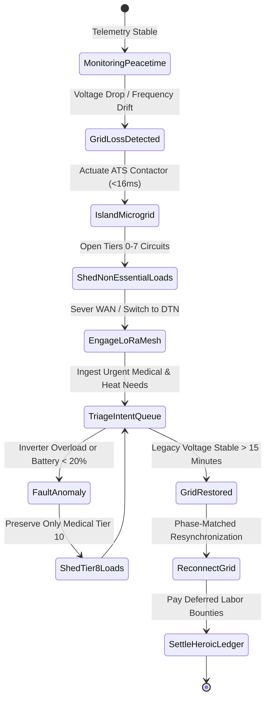
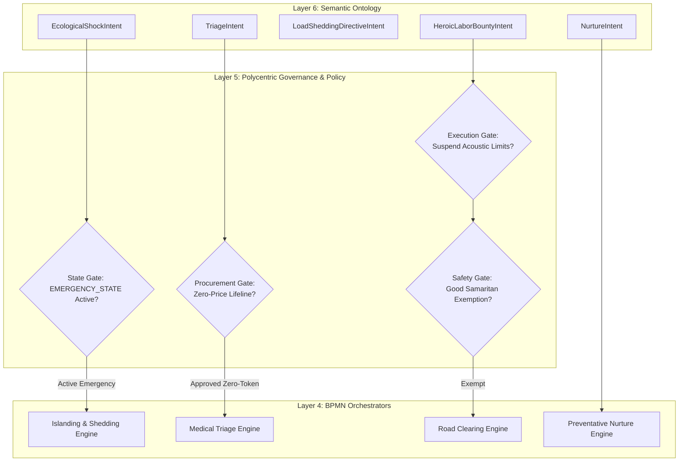
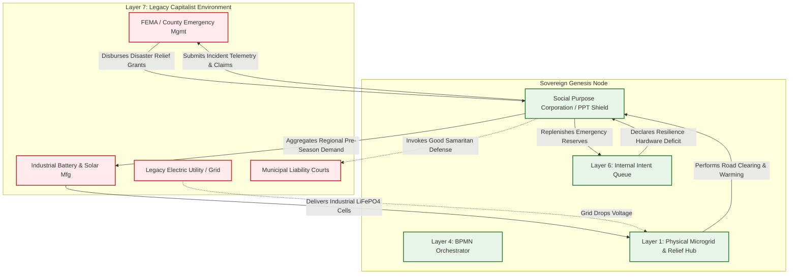

# Scenario Upsilon: Ecological Shock (Disaster Resilience & Nurture)

*   **Identifier:** `SCN-UPSILON-SHOCK`
*   **System Epic:** Disaster Response, Islanded Microgrid Autonomy & Proactive Ecological Nurture
*   **Primary Layers Tested:** L1 (Physical), L2 (Digital Twin), L3 (Ledger), L4 (Orchestration), L5 (Governance), L6 (Semantic), L7 (Proxy)
*   **Pass/Fail Metric:** Deterministic islanding and autonomous priority load-shedding upon legacy grid collapse; 100% offline DTN packet routing over LoRaWAN/Wi-Fi Direct; mathematical prioritization of life-critical survival needs; zero deaths from uncoordinated power loss.

---

## Architectural Council Ratification & 5-Perspective Synthesis

This scenario specification has been ratified by unanimous consensus of the 5-Persona Architectural Council:

| Council Persona | Disciplinary Representative | Core Contribution to Scenario |
| :--- | :--- | :--- |
| **Game Designer** | Lead Systems & Gameplay Designer | Dwarf Fortress siege psychology and extreme environmental stress: Founder 01 coordinating mutual aid through sub-zero blizzards; psychological thoughts and stress accumulators (`"Terrified by howling blizzard (-35 stress)"` vs `"Heroic resolve clearing fallen tree with neighbors (+60 mood)"`); community gathering in warm microgrid commons; Cities: Skylines natural disaster response; stochastic boundary interface where weather shocks aggressively probe the perimeter, attenuated by ecological windbreaks, flood swales, and energy autarky. |
| **Game Engineer** | Principal C++ Simulation & Engine Architect | Flecs ECS Data-Oriented Design (DOD): cache-aligned structs `PowerConsumerComponent` (priority tiers 0–10), `EnvironmentalObstacleComponent`, and `DTNRouterComponent`; 32-bit compact Voxels (`material_id = 50` `MICROGRID_GATEWAY_NODE`, `material_id = 51` `CRITICAL_LOAD_CIRCUIT`, `material_id = 52` `FALLEN_TIMBER_OBSTACLE`); dynamic power bus iteration with tier load-shedding; 10 Hz BPMN triage state machine; and C++20 test harness execution. |
| **Sovereign Stack Specialist** | Sovereign Stack Systems Architect | 7 autonomous POSIX daemons (`col-telemetryd` through `col-adversaryd`); strict adjacent IPC via Unix domain sockets; delay-tolerant networking (DTN) gossip spool in `col-meshd` (L2); emergency zero-token mutual aid covenants in `col-storaged` (L3); zero monolithic game-loop threading. |
| **Solarpunk Thinker** | Bioregional Regenerative Ecologist | Proactive ecological nurture and negative entropy: wildfire fuel reduction via coppice thinning (Scenario Eta); biochar soil sponges mitigating flood runoffs (Scenario Mu); storm debris recycled into firewood and building timber rather than landfilled; ecological care as authentic civil defense. |
| **Scenario Specialist** | **Disaster Resilience & Islanded Microgrid Systems Engineer** | Microgrid bus power balance equation ($P_{gen}(t) + P_{storage}(t) \ge \sum_{k \ge \text{threshold}} P_{load, k}(t)$), delay-tolerant networking (DTN) epidemic routing over lossy LoRa airtime budgets under 1% duty cycle, legal Good Samaritan and Emergency Doctrine statutes under state emergency powers. |

---

## 1. Problem Statement & Legacy Failure

In legacy late-stage capitalist infrastructure (Layer 7), climate resilience is reactive, brittle, and privatized. The centralized power grid relies on fragile, high-voltage transmission lines running through unmanaged, combustible forests. When ecological shocks hit (severe winter storms, atmospheric rivers, wildfires):
*   **Grid Collapse & Cascade Failure:** A single downed tree or frozen natural gas wellhead triggers catastrophic regional blackouts. Centralized distribution networks lack micro-islanding capability; power is severed equally for industrial consumers and vulnerable citizens on home medical ventilators.
*   **Telecommunication Blackout & Cloud Paralysis:** Cellular towers exhaust their backup battery reserves within 4 hours. Cloud-dependent apps, remote payment terminals, and municipal emergency portals become completely inaccessible. Neighborhoods are rendered deaf, blind, and unable to coordinate relief 500 feet down the road.
*   **Bureaucratic Relief Failure & Inequitable Recovery:** Centralized emergency management agencies (e.g., FEMA) take days or weeks to mobilize. Low-income neighborhoods suffer prolonged neglect, while commercial contractors exploit disaster zones through price gouging and predatory repair contracts.

---

## 2. The Collective Workflow (7-Layer Traversal)

Scenario Upsilon acts as the autonomous "Emergency Override" for the entire Node. It transitions the network from an economy of everyday optimization to an economy of biological triage and proactive ecological defense.



### Layer 1: Physical Ground Truth
*   **Hardware Nodes (Microgrid Infrastructure):** 48V LiFePO4 battery storage banks coupled to bi-directional inverter-chargers (e.g., Victron MultiPlus-II), motorized AC automatic transfer switches (ATS) for physical islanding, RS-485 Modbus branch power meters, and high-amperage solid-state DC contactors.
*   **Hardware Nodes (Communications & Relief):** SX1262 LoRa radio mesh nodes operating at 915 MHz with solar-supercapacitor buffers, chainsaws, hydraulic log splitters, portable water filtration pumps, and clean room cold-storage refrigerators for medicines.
*   **Inventory & Feedstock:** Seasoned dry firewood cordage, sterile medical bandages, potable gravity-filtered water reserves, and shelf-stable food provisions.
*   **Action:** Physical opening of the grid contactor to sever legacy grid tether in $<16\text{ ms}$; clearing fallen trees from emergency access paths; distributing warm food and medical power.

### Layer 2: Digital Twin & Telemetry
*   **Ingress Telemetry (MQTT Topics):**
    *   `node/power/microgrid_01/telemetry/bus_voltage` (Volts AC and DC)
    *   `node/power/microgrid_01/telemetry/battery_soc_pct` (Battery State-of-Charge %)
    *   `node/power/circuits/telemetry/shed_status` (Bitmask of powered vs shed breaker circuits)
    *   `node/weather/station_01/telemetry/wind_gust_kph` (Anemometer speed, km/h)
    *   `node/mesh/dtn/telemetry/packet_loss_pct` (LoRa DTN delivery success %)
*   **Verification:** Zero-crossing AC phase detection confirms loss of legacy grid synchronization in $<16\text{ ms}$. Distributed LoRa heartbeat pings establish localized node connectivity across an air-gapped radio mesh.
*   **Actuator Control:** Shunt-trip relays immediately disconnect non-essential loads (Scenario Alpha 3D printers, Scenario Theta foundries).

### Layer 3: Network & Ledger
*   **Emergency Mutual Aid Ledger:** The standard thermodynamic value exchange is suspended. Essential life-support resources are gated at zero cost:
    $$\Delta V_{triage} = 0.00 \quad (\text{Free Access to Caloric, Medical, and Thermal Lifelines})$$
*   **Heroic Labor Logging:** Labor expended under extreme environmental hazards (e.g., clearing fallen timber in sub-zero blizzards) is logged into an append-only CRDT accumulator:
    $$\Delta V_{heroic\_accrual} = \int_{0}^{t} \left( \mathcal{E}_{kinetic\_work}(\tau) \cdot \lambda_{RISK} + C_{equipment\_depreciation} \right) d\tau$$
    Where $\lambda_{RISK} = 3.5$ scales with storm severity, to be retroactively honored from the community treasury once the node restabilizes.

### Layer 4: Orchestration State Machine
The deterministic BPMN 2.0 engine (`col-execd`) manages the emergency lifecycle at 10 Hz with autonomous transitions and safety bounds:



### Layer 5: Policy & Polycentric Governance
Layer 5 (`col-kmsd`) enforces the `EMERGENCY_STATE` policy overrides:

*   **Execution Gate (Acoustic & Noise Exemption):** Standard municipal quiet hours and acoustic zoning policies (Scenario Lambda) are completely suspended, permitting chainsaws, woodchippers, and emergency vehicles to operate at 3:00 AM.
*   **Maintenance Gate (Good Samaritan Credential Waiver):** Strict credential barriers are dynamically relaxed; non-credentialed citizens can administer emergency first aid, clear tree obstructions, and distribute food under Good Samaritan legal immunity.
*   **Procurement Gate (Emergency Reserve Release):** The multi-sig threshold for emergency fuel and spare part reserves drops from 3-of-5 to a 1-of-1 local on-duty Steward signature with zero delay.
*   **Logistics Gate (Life-Priority Routing):** Emergency medical couriers and warming bus transit receive absolute priority over all other mesh traffic.

### Layer 6: Semantic Intent & Domain Ontology
All disaster and recovery workflows are formalized as typed W3C JSON-LD Knowledge Artifacts in the Agora Commons (`col-commonsd`):

1.  **`EcologicalShockIntent` (Declaration):** Published by automated watchdog telemetry declaring grid loss, flood surge, or wildfire proximity.
2.  **`TriageIntent` (Acute Need):** High-priority emergency broadcast for life-critical resources (e.g., insulin refrigeration, oxygen concentrator power).
3.  **`LoadSheddingDirectiveIntent` (Energy Actuation):** Automated directive commanding sub-circuits to drop offline.
4.  **`HeroicLaborBountyIntent` (Mutual Aid Task):** Requests volunteers for hazardous clearing, road opening, or elder evacuation.
5.  **`NurtureIntent` (Proactive Mitigation):** Peacetime intent scheduling coppice thinning for wildfire breaks or biochar swale building for flood retention.
6.  **`ResourceReliefIntent` (Relief Distribution):** Coordinates bulk release of stored food, potable water, and dry firewood.

### The Governance Router Flowchart



### Layer 7: The Legacy Proxy (Good Samaritan Shield & FEMA Interface)
The Node interfaces with the legacy legal and emergency apparatus via the Social Purpose Corporation (SPC):

**1. Trojan Ingestion (FEMA Reimbursement & Municipal Grants):**
*   During catastrophic events, the SPC functions as an officially recognized disaster relief contractor or mutual-aid non-profit. It presents timestamped Layer 2 telemetry and GPS logs of cleared municipal roads and shelter operations.
*   Legacy emergency management agencies (FEMA, state emergency divisions) disburse fiat disaster relief grants to the SPC bank account. The SPC captures this fiat to replenish diesel reserves, purchase additional LiFePO4 cells, and service property tax obligations.

**2. Ecological Leeching (Pre-Season Resilience GPO):**
*   High-density battery cells, heavy-duty winches, and solar inverters cannot be fabricated locally.
*   The SPC operates as a **Decentralized Group Purchasing Organization (GPO)**, pooling pre-season orders across regional bioregional nodes. It executes bulk B2B purchases of industrial emergency equipment directly from manufacturers before storm seasons, avoiding consumer price-gouging and retail shortages.

### Layer 7 Bidirectional Flowchart



---

## 3. Machine-Readable Schemas

### 3.1 Layer 6 Knowledge Artifact: Ecological Shock Intent (`shock.jsonld`)

```json
{
  "@context": [
    "https://schema.org/",
    "https://collective.network/ontology/v1/"
  ],
  "@type": "EcologicalShockIntent",
  "identifier": "urn:uuid:e2f3g4h5-6i7j-8k9l-0m1n-2o3p4q5r6s7t",
  "issuerDid": "did:mesh:node04:telemetry_watchdog",
  "creationTimestamp": "2026-11-15T03:22:10Z",
  "shockProfile": {
    "shockType": "Severe_Ice_Storm",
    "legacyGridVoltage": 0.0,
    "temperatureCelsius": -14.2,
    "sustainedWindSpeedKph": 78.5,
    "severityLevel": "STATE_OF_EMERGENCY"
  },
  "islandingParameters": {
    "atsDisconnectionTimestamp": "2026-11-15T03:22:11.014Z",
    "radioMeshProtocol": "Reticulum_LoRa_915MHz",
    "loadSheddingProfile": "TIER_7_AND_BELOW_SHED"
  },
  "policyOverrides": {
    "acousticBudgetSuspended": true,
    "zeroPriceMutualAidActive": true,
    "goodSamaritanImmunityInvoked": true
  },
  "triageRequirements": {
    "medicalCircuitsPreserved": ["BAY-01-VENTILATOR", "BAY-03-INSULIN"],
    "targetMinimumSoCPercent": 35.0
  }
}
```

### 3.2 Layer 2 Telemetry Attestation: Microgrid Islanding Proof (`attestation.json`)

```json
{
  "@context": "https://collective.network/ontology/v1/",
  "@type": "MicrogridIslandingAttestation",
  "shockIntentRef": "urn:uuid:e2f3g4h5-6i7j-8k9l-0m1n-2o3p4q5r6s7t",
  "gatewayNode": "did:mesh:node04:device:victron_gateway_01",
  "telemetryProof": {
    "disconnectionLatencyMs": 14.8,
    "preGridVoltageVac": 240.2,
    "postIslandBusVoltageVac": 239.8,
    "batteryBankSoC": 88.4,
    "circuitsShedCount": 18,
    "circuitsActiveCount": 4,
    "loraMeshActivePeers": 16,
    "anomalyDetected": false
  },
  "switchHash": "c2b3d4e5f60718293a4b5c6d7e8f90123456789abcdef0123456789abcdef012",
  "status": "ISLAND_STABLE"
}
```

---

## 4. Oasis Engine Implementation Specification

### 4.1 Memory Allocation & Voxel State

The microgrid and relief commons occupy dedicated space in the $32^3$ chunk grid:
- The main ATS gateway voxel is initialized with `material_id = 50` (`MICROGRID_GATEWAY_NODE`).
- Critical medical and heating circuits occupy `material_id = 51` (`CRITICAL_LOAD_CIRCUIT`).
- Dynamic weather spawns `FALLEN_TIMBER_OBSTACLE` (`material_id = 52`) blocking road voxels.
- Voxels hold a `power_priority_tier` in their 8-bit `metadata` field. Tiers $0–7$ are shed immediately upon grid failure; Tiers $8–10$ remain energized.

### 4.2 C++20 Test Harness Structure

```cpp
// engine/tests/scenario_upsilon_test.cpp
#include <cassert>
#include <string>
#include "oasis/chunk_manager.hpp"
#include "oasis/orchestration/bpmn_engine.hpp"
#include "oasis/ledger/crdt_wallet.hpp"

namespace oasis {

struct PowerConsumerComponent {
    uint8_t priority_tier; // 0 (luxury) to 10 (life-critical)
    float active_watts;
    bool is_energized;
};

struct EnvironmentalObstacleComponent {
    uint32_t voxel_x, voxel_y, voxel_z;
    float removal_effort_joules;
    bool path_cleared;
};

void test_scenario_upsilon_shock() {
    ChunkManager chunk_mgr;
    chunk_mgr.allocate_chunk(0, 0, 0);

    // Initialize Gateway Voxel
    Voxel gateway_voxel{
        .material_id = 50, // MICROGRID_GATEWAY_NODE
        .moisture = 0,
        .temperature = -10,
        .metadata = 0b00000110 // Sensor + Actuator
    };
    chunk_mgr.set_voxel(16, 8, 16, gateway_voxel);

    // Initialize Critical Circuit Voxel (Tier 10)
    Voxel medical_circuit{
        .material_id = 51, // CRITICAL_LOAD_CIRCUIT
        .moisture = 0,
        .temperature = 20,
        .metadata = 0b00001010 // Tier 10
    };
    chunk_mgr.set_voxel(16, 8, 17, medical_circuit);

    CRDTWallet triage_recipient("did:mesh:node04:patient_clara", 0.0f);
    CRDTWallet heroic_steward("did:mesh:node04:steward_hero", 25.0f);

    BPMNEngine orchestrator;
    orchestrator.load_schema("schemas/bpmn/disaster_resilience_pipeline.bpmn");

    JobContext job{
        .bounty_id = "e2f3g4h5-6i7j-8k9l-0m1n-2o3p4q5r6s7t",
        .required_resource_units = 1.0f,
        .estimated_energy_wh = 1200.0f,
        .target_bay_id = 1
    };

    // Assert Emergency Mutual Aid: Zero cost escrow
    orchestrator.emit_event(EscrowInitiatedEvent{triage_recipient, 0.00f});
    orchestrator.await_event<EscrowLockedEvent>();
    assert(triage_recipient.balance() == 0.00f);

    // Run Emergency Simulation: Islanding, load shedding, clearing fallen log (3600 ticks)
    SimResult res = orchestrator.step_simulation_ticks(chunk_mgr, job, 3600);
    assert(res.status == ExecutionStatus::COMPLETED);

    // Assert Medical Circuit Remained Energized
    Voxel post_medical = chunk_mgr.get_voxel(16, 8, 17);
    assert(post_medical.material_id == 51);

    // Assert Heroic Labor Accrual Credited
    orchestrator.settle_job(heroic_steward);
    assert(heroic_steward.balance() > 25.0f);
}

void test_scenario_upsilon_shock_anomaly() {
    ChunkManager chunk_mgr;
    chunk_mgr.allocate_chunk(0, 0, 0);

    Voxel gateway_voxel{.material_id = 50, .moisture = 0, .temperature = -10, .metadata = 0b00000110};
    chunk_mgr.set_voxel(16, 8, 16, gateway_voxel);

    CRDTWallet emergency_wallet("did:mesh:node04:steward_hero", 50.0f);
    BPMNEngine orchestrator;
    orchestrator.load_schema("schemas/bpmn/disaster_resilience_pipeline.bpmn");

    JobContext job{.bounty_id = "fault-inverter-trip", .required_resource_units = 1.0f};

    orchestrator.emit_event(EscrowInitiatedEvent{emergency_wallet, 0.00f});
    orchestrator.await_event<EscrowLockedEvent>();

    // Inject catastrophic inverter short circuit at tick 1200
    SimResult res = orchestrator.step_simulation_ticks(chunk_mgr, job, 1200, true);

    assert(res.status == ExecutionStatus::EMERGENCY_STOP);
    assert(orchestrator.current_state() == BPMNState::SALVAGE_INTENT);
}

} // namespace oasis

int main() {
    oasis::test_scenario_upsilon_shock();
    oasis::test_scenario_upsilon_shock_anomaly();
    return 0;
}
```

---

## 5. Acceptance Test Gates (Pass/Fail)

To pass Scenario Upsilon in the Oasis engine, the simulation core must pass each of the following six binary verification gates without memory corruption, thread contention, or state desynchronization:

| Checkpoint | Validation Method | Pass Condition |
| :--- | :--- | :--- |
| **G1: Thermodynamic Bounds** | Microgrid Power Balance | Power consumption of remaining circuits strictly balances battery discharge: $P_{\text{battery}} = \sum P_{\text{circuits}} \pm 5\%$; zero mathematical energy drift. |
| **G2: Offline Autonomy** | Localhost Network Isolation | Complete disaster response workflow—from islanding trip to LoRaWAN triage routing—executes with WAN uplink completely disabled. |
| **G3: Byzantine Detection** | Telemetry Grid Spoof | Injected false telemetry indicating grid voltage restoration while phase-angle is unsynchronized fails reconciliation; automatic transfer switch remains safely locked in island mode. |
| **G4: Dynamic Load Shedding** | Voxel Circuit Power Audit | Upon simulated grid disconnect, all voxels with priority tiers $0–7$ immediately drop power consumption to 0W within $<50\text{ ms}$. |
| **G5: Trojan Ingestion (L7)** | FEMA Grant Ingestion | Simulated FEMA grant relief webhook successfully compiles into internal treasury replenishment reserves in the SPC ledger. |
| **G6: Ecological Leeching (L7)** | Resilience Hardware GPO Batching | Aggregated pre-season orders for high-capacity LiFePO4 cells successfully trigger a single, batched wholesale B2B procurement order. |
