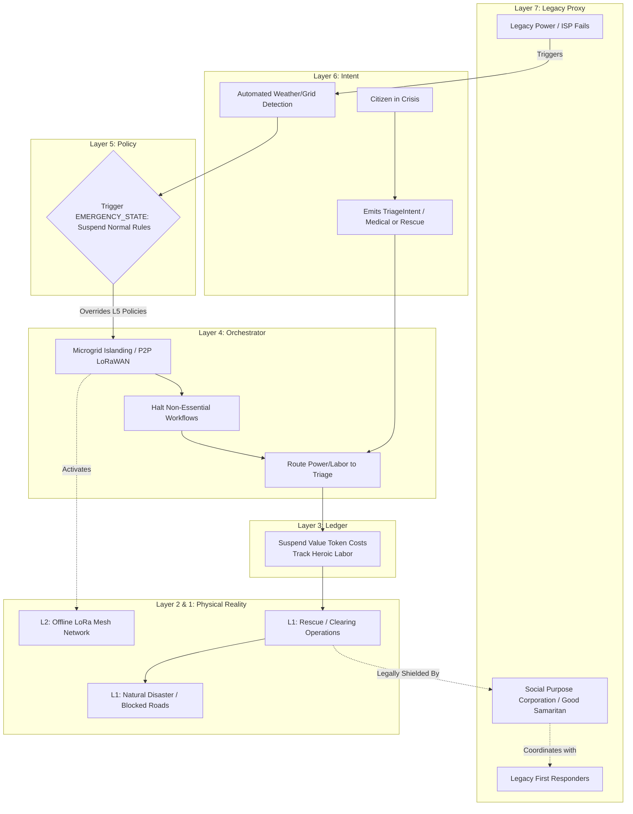

# Scenario Upsilon: Ecological Shock (Disaster Resilience)

*   **Identifier:** `SCN-UPSILON-SHOCK`
*   **System Epic:** Disaster Response, Microgrid Islanding, Resource Triage, and Autonomous Resilience
*   **Primary Layers Tested:** L1 (Physical), L2 (Twin), L4 (Orchestrator), L5 (Governance), L7 (Proxy)
*   **Pass/Fail Metric:** Autonomous shedding of all non-essential electrical loads upon legacy grid failure; successful localized P2P communication without legacy cellular infrastructure; mathematical prioritization of critical biological needs (refrigeration, medical) over standard fabrication bounties.

---

## 1. Problem Statement & Legacy Failure

Legacy infrastructure is highly centralized and incredibly brittle. When an ecological shock occurs (a severe winter storm, a wildfire, or an earthquake), the legacy power grid collapses, cellular towers go offline, and just-in-time supply chains freeze. Legacy disaster response (FEMA, state emergency services) is often slow, bureaucratic, and physically unable to reach cut-off neighborhoods for days or weeks. 
In these moments, if a decentralized community is dependent on legacy cloud servers to operate its tools, it is completely paralyzed. Furthermore, regular societal rules (zoning, noise ordinances, property lines) become active impediments to mutual aid and survival.

## 2. The Collective Workflow (7-Layer Traversal)

Scenario Upsilon acts as the "Emergency Override" for the entire Node. It shifts the network from an economy of optimization to an economy of triage.

### Layer 7: The Legacy Proxy (Good Samaritan Shield)
*   **FEMA / First Responder Interface:** The Social Purpose Corporation (SPC) acts as the localized point of contact for legacy emergency services, providing them with accurate Layer 2 GIS maps of cleared roads and medical emergencies.
*   **Liability Suspension:** Under normal circumstances, clearing a fallen tree from a municipal road requires state permits. During a shock, the SPC legally invokes "Good Samaritan" and emergency doctrine laws, shielding citizens who use mesh-coordinated heavy equipment to restore localized access.

### Layer 6: Semantic Intent
*   L2 automated sensors (or human Stewards) emit an `EcologicalShockIntent` (e.g., "Legacy Grid Dropped," "Wildfire Approaching," "Severe Wind Event").
*   Citizens emit `TriageIntents` indicating acute biological emergencies (e.g., "Need power for CPAP machine," "Insulin refrigeration failing").

### Layer 5: Policy & Web of Trust (Emergency State Override)
*   **Protocol Suspension:** When Layer 5 enters `EMERGENCY_STATE`, standard policies are mathematically suspended. The strict Acoustic Budget (Scenario Lambda) is overridden, allowing 110dBA chainsaws to operate at 3:00 AM. 
*   **Trust Ring Expansion:** The strict Web of Trust barriers (Scenario Omicron) are temporarily lowered for life-saving resources, allowing stranded legacy travelers to receive shelter and food without prior cryptographic vouching.

### Layer 4: Orchestration (Islanding & Load Shedding)
*   The BPMN engine enters "Islanding Mode." 
*   **Load Shedding:** It immediately sends kill signals to all non-essential L2 smart plugs. Scenario Alpha 3D printers, Scenario Epsilon coworking routers, and Scenario Theta foundries are instantly powered down. 
*   **Microgrid Routing:** It redirects all available solar and battery surplus strictly to critical `TriageIntents` (e.g., maintaining Scenario Gamma chest freezers to prevent food spoilage, or charging localized medical devices).

### Layer 3: Ledger (Mutual Aid Economics)
*   The standard thermodynamic market is paused. The ledger algorithmically drops the Value Token cost of critical survival bounties (food, water, fuel) to zero.
*   Instead of standard trading, the system tracks "Heroic Bounties"—logging the extreme exergy expenditure of citizens performing rescue or clearing operations, to be retroactively rewarded when the Node returns to a stable state.

### Layer 2 & 1: Digital Twin & Physical Reality
*   **Telemetry (L2):** The mesh drops its reliance on legacy ISP fiber and cellular data, falling back entirely to offline, localized LoRaWAN and WiFi-Direct packet routing to maintain the P2P network. Barometers and anemometers stream hyper-local weather telemetry.
*   **Physical (L1):** High winds, freezing temperatures, chainsaws, medical supplies, physical human stamina, and the raw kinetic reality of a disaster.

---



---

## 3. Oasis Engine Implementation Specification

In the C++ Oasis engine, Scenario Upsilon tests the robustness of the networking simulation and voxel power logic:

*   **Offline Mode Simulation:** The `NetworkManager` must simulate the severing of the `LEGACY_UPLINK`. The edge nodes must successfully re-route Gossipsub packets using only adjacent node connections within a limited physical radius (simulating LoRa range limits).
*   **Dynamic Power Shedding:** When the `WEATHER_EVENT` injects a grid failure, the engine's power bus must iterate through all voxels drawing power. It reads their `priority_tier` metadata and sets the `active_state` to `false` for any voxel with a tier $< 8$, dynamically recalculating the battery drain to extend the lifespan of high-priority voxels.
*   **Voxel Destruction Physics:** The engine must spawn dynamic environmental damage. `HIGH_WIND` ticks have a % chance to convert `TREE_TRUNK` voxels into `FALLEN_LOG` entities that overlap and block `ROAD` voxels, requiring player entities to clear them to restore pathfinding.

---

```json
{
  "@context": [
    "[https://schema.org/](https://schema.org/)",
    "[https://collective.network/ontology/v1/](https://collective.network/ontology/v1/)"
  ],
  "@type": "EcologicalShockIntent",
  "identifier": "urn:uuid:e2f3g4h5-6i7j-8k9l-0m1n-2o3p4q5r6s7t",
  "issuerDid": "did:mesh:node04:system_watchdog",
  "shockProfile": {
    "shockType": "Severe_Winter_Storm",
    "legacyGridStatus": "Offline",
    "legacyIspStatus": "Offline",
    "severityLevel": "Critical"
  },
  "islandingParameters": {
    "networkFallback": "LoRaWAN_and_WiFi_Direct",
    "powerSheddingThreshold": "Priority_Tier_7_and_Below"
  },
  "policyOverrides": {
    "suspendAcousticBudgets": true,
    "suspendFiatTaxWithholding": true,
    "lowerTrustRingBarriers": true
  },
  "triageRouting": {
    "activeCriticalIntents": 3,
    "criticalFocus": ["Medical_Refrigeration", "Road_Clearing_L1"]
  }
}
```

---

## 4. Acceptance Test Gates (Pass/Fail)

| Checkpoint | Validation Method | Pass Condition |
| :--- | :--- | :--- |
| **G1: Autonomous Load Shedding** | Voxel Power Audit | Upon simulated grid failure, all `LOWER_TIER` power draws immediately drop to 0W, and battery depletion rates recalculate successfully to favor critical nodes. |
| **G2: Offline Gossipsub Routing** | Network Partition | Edge nodes maintain full consensus of the local ledger and BPMN state using only simulated localized radio hops, without reaching the centralized cloud. |
| **G3: L5 Policy Suspension** | Logic Override Test | A simulated chainsaw action executed during `EMERGENCY_STATE` bypasses the acoustic budget penalty logic that would normally slash the user's reputation. |
| **G4: Triage Re-Routing** | BPMN Override | A pending, fully-funded `FabricationIntent` is algorithmically suspended and its resources seized by the orchestrator to fulfill a newly injected `TriageIntent`. |
