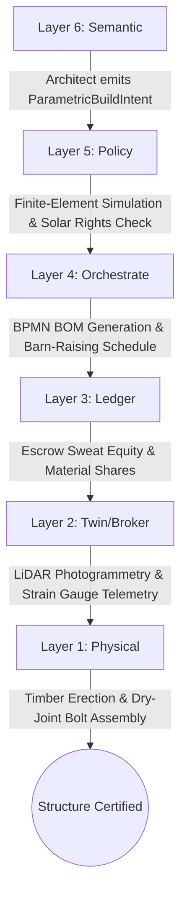
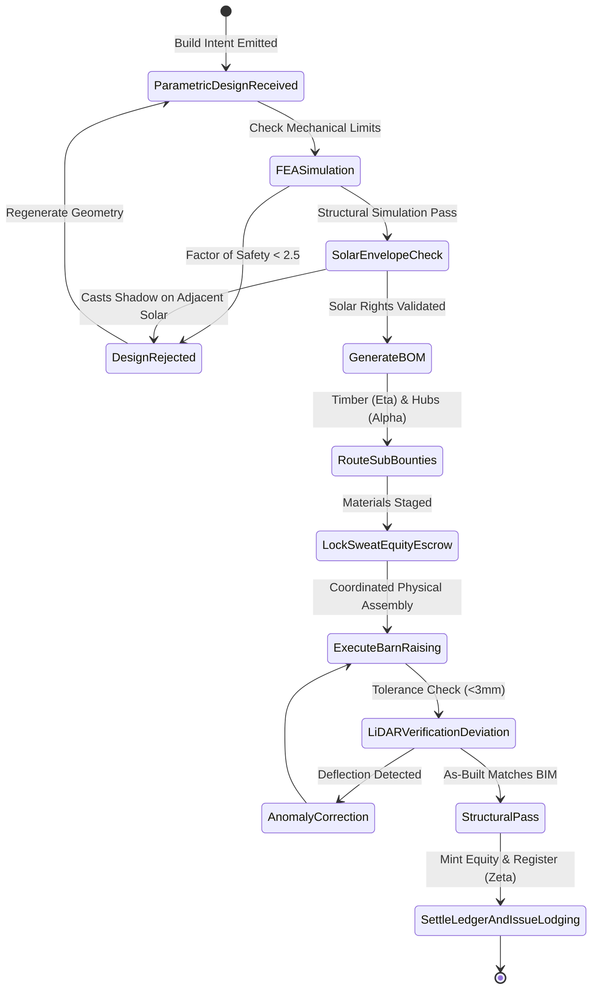
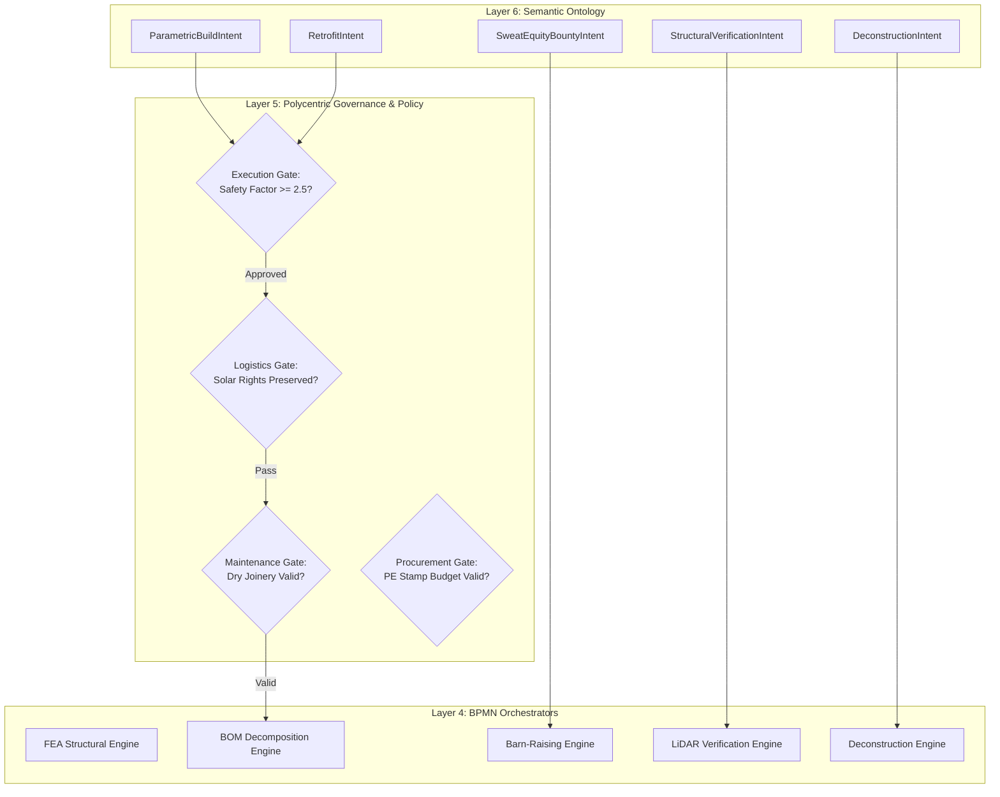
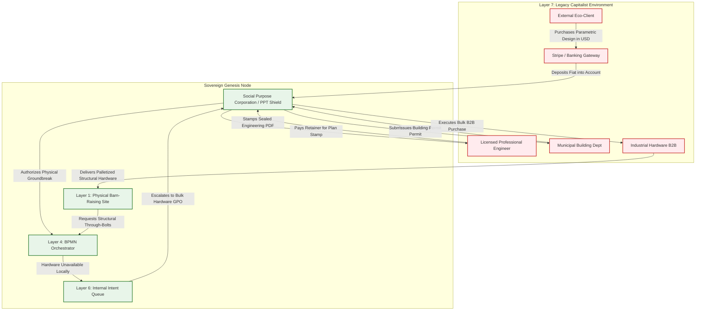

# Scenario Xi: Algorithmic Architecture & Urban Retrofit

*   **Identifier:** `SCN-XI-ARCH`
*   **System Epic:** Parametric Structural Design, Adaptive Urban Reuse & Decentralized Barn-Raising
*   **Primary Layers Tested:** L1 (Physical), L2 (Digital Twin), L3 (Ledger), L4 (Orchestration), L5 (Governance), L6 (Semantic), L7 (Proxy)
*   **Pass/Fail Metric:** Procedural generation of structural blueprints matching local physical inventory; verifiable finite-element load simulation prior to physical assembly; zero structural collapses under simulated historical wind/snow loads; successful municipal permit ingestion via PE stamp.

---

## Architectural Council Ratification & 5-Perspective Synthesis

This scenario specification has been ratified by unanimous consensus of the 5-Persona Architectural Council:

| Council Persona | Disciplinary Representative | Core Contribution to Scenario |
| :--- | :--- | :--- |
| **Game Designer** | Lead Systems & Gameplay Designer | Dwarf Fortress structural stability & cave-in dread: Founder 01 coordinating timber joinery alongside neighbors; psychological thoughts and stress accumulators (`"Astonished by the beauty of the timber arch (+45 mood)"` vs `"Dreaded structural sagging warning sound (-50 stress)"`); Sims-style spatial remodeling satisfaction; Cities: Skylines zoning and solar shadow envelope raycasting; boundary interface attenuation where physical architectural retrofits strengthen thermal resilience and weaken legacy utility extortion. |
| **Game Engineer** | Principal C++ Simulation & Engine Architect | Flecs ECS Data-Oriented Design (DOD): cache-aligned component structs `StructuralVoxelComponent` (mass, load capacity, shear stress), `BlueprintPhantomComponent`, and `BOMCompilerComponent`; 32-bit compact Voxels (`material_id = 60` `TIMBER_STRUT_VOXEL`, `material_id = 61` `PETG_CONNECTOR_HUB`, `material_id = 62` `PHANTOM_BLUEPRINT_VOXEL`); structural load propagation cellular automata; 10 Hz BPMN barn-raising state machine; and C++20 test harness execution. |
| **Sovereign Stack Specialist** | Sovereign Stack Systems Architect | 7 autonomous POSIX daemons (`col-telemetryd` through `col-adversaryd`); strict adjacent IPC via Unix domain sockets; photogrammetry/LiDAR deviation telemetry in `col-telemetryd` (L1/L2); sweat-equity capitalization in `col-storaged` (L3); zero monolithic game-loop threading. |
| **Solarpunk Thinker** | Bioregional Regenerative Ecologist | Buildings as active carbon sinks: sequestering coppiced roundwood timber and biochar insulation; strict deconstruction mandates requiring dry joinery (bolts/pegs over toxic chemical adhesives); passive-solar solar envelope orientation; zero embodied concrete footprint. |
| **Scenario Specialist** | **Computational Architect & Structural Biomaterials Engineer** | Finite-element voxel beam load formula ($\sigma_{\text{actual}} = \frac{M \cdot y}{I} + \frac{F_{\text{axial}}}{A} \le \sigma_{\text{allowable}}$), International Residential Code (IRC) Appendix AQ timber framing engineering variance standards, solar vector shadow raycasting algorithm ($\vec{S} \cdot \hat{n} > 0$), and procedural bill of materials (BOM) compilation. |

---

## 1. Problem Statement & Legacy Failure

In legacy late-stage capitalist infrastructure (Layer 7), architecture and shelter have been captured by financialization, globalized carbon-heavy supply chains, and hostile municipal zoning. Standard construction relies on high-embodied-energy materials (Portland cement, virgin rolled steel, petrochemical fiberglass insulation) designed for rapid speculative assembly rather than longevity or thermodynamic performance.

When an intentional community or homeowner attempts to build or retrofit shelter:
*   **The Financialized Mortgage Trap:** Constructing or modifying physical shelter requires borrowing hundreds of thousands of dollars in fiat debt under 30-year mortgages ($>6\%$ interest). Mutual aid labor and collective "Sweat Equity" are completely uncapitalized and unrecognized by legacy banking institutions.
*   **High-Entropy Material Supply Drag:** Dimensional lumber is harvested from distant, clear-cut monoculture plantations, kiln-dried with fossil fuels, and trucked across continents, while native, locally coppiced hardwood and secondary materials remain neglected.
*   **Bureaucratic Permit Enclosure:** Municipal building departments enforce rigid, prescriptive building codes that outlaw non-standard materials (e.g., roundwood poles, straw-clay infill, 3D-printed structural brackets) unless prohibitive fees are paid to commercial engineering firms for bespoke certification.

---

## 2. The Collective Workflow (7-Layer Traversal)

Scenario Xi deploys open-source parametric design and algorithmic structural engineering to dynamically match architecture to localized material inventories, orchestrating community "Barn-Raising" events capitalized via thermodynamic sweat equity.



### Layer 1: Physical Ground Truth
*   **Hardware Nodes (Assembly & Fabrication Hub):** CNC timber joinery routers, high-torque battery framing impact drivers, rotary laser leveling transits, portable rigging winches, and scaffolding towers.
*   **Hardware Nodes (Verification Tools):** High-resolution LiDAR scanners or drone photogrammetry rigs, digital torque wrenches, and embedded piezoelectric strain gauges.
*   **Inventory & Feedstock:** Seasoned coppiced black locust and alder roundwood poles (from Scenario Eta), heavy-duty 3D-printed recycled PETG joint hubs (from Scenario Alpha), biochar-clay thermal insulation blocks (from Scenario Mu), and M12 galvanized through-bolts.
*   **Action:** Physical erection of timber bents, insertion of through-bolts, mortise-and-tenon pinning, tamping of carbon-sequestering biochar insulation, and weatherproofing with raw linseed oil.

### Layer 2: Digital Twin & Telemetry
*   **Ingress Telemetry (MQTT Topics):**
    *   `node/arch/site_01/telemetry/lidar_deviation_mm` (Point-cloud deviation from CAD model, mm)
    *   `node/arch/site_01/telemetry/strain_gauge_microstrain` (Real-time load deflection, $\mu\varepsilon$)
    *   `node/arch/site_01/telemetry/tilt_degrees` (Biaxial inclinometer plumbness, degrees)
    *   `node/arch/site_01/status` (`PLANNING`, `SIMULATION_PASS`, `ACTIVE_RAISING`, `STRUCTURAL_CERTIFIED`)
*   **Verification:** Drone photogrammetry overlaying physical assembly against the parametric BIM model in $<10\text{ minutes}$; flagging any joinery misalignment exceeding $3\text{ mm}$ before upper purlins are placed.
*   **Actuator Control:** Automated optical alignment laser guides projecting target mortise coordinates directly onto physical wooden timbers.

### Layer 3: Network & Ledger
*   **Sweat Equity Capitalization:** Instead of fiat mortgage debt, the structure is capitalized through physical thermodynamic contributions:
    $$\Delta V_{equity} = \sum_{i=1}^{n} \left( \mathcal{E}_{labor, i} \cdot \lambda_{SKILL, i} + m_{biomaterial, i} \cdot k_{material} \right) \cdot \lambda_{THERMO}$$
    Where $\mathcal{E}_{labor, i}$ is physical exergy expended on site, $\lambda_{SKILL, i}$ is competency weighting, and $m_{biomaterial, i}$ is the mass of seasoned timber or biochar contributed from local inventories.
*   **Consensus Settlement:** Upon structural completion and Layer 2 LiDAR attestation, participants receive fractional occupancy shares or liquid Value Tokens minted from the communal asset pool. Zero interest; zero banking intermediaries.

### Layer 4: Orchestration State Machine
The deterministic BPMN 2.0 engine (`col-execd`) coordinates design decomposition, sub-bounty routing, and assembly milestones:



### Layer 5: Policy & Polycentric Governance
Layer 5 (`col-kmsd`) evaluates designs and assembly plans against community covenants:

*   **Execution Gate (Structural Safety Factor):** The design must pass an automated finite element analysis (FEA) demonstrating a safety factor $\ge 2.5$ under 50-year regional snow and wind load models.
*   **Maintenance Gate (Deconstruction Mandate):** To prevent future toxic demolition waste, designs must be 100% mechanically demountable. Adhesives, glues, and composite foams are strictly vetoed in favor of bolted and pinned dry joinery.
*   **Procurement Gate (Professional Engineer Fiat Budget):** When submitting plans to municipal authorities, Layer 5 gates the allocation of the SPC's fiat budget for PE plan stamping, requiring a 3-of-5 Trust Ring multi-sig.
*   **Logistics Gate (Solar Rights Protection):** Procedural raycasting ensures the new structure does not violate adjacent properties' solar envelopes ($\Delta \Phi_{\text{solar}} < 5\%$).

### Layer 6: Semantic Intent & Domain Ontology
All architectural blueprints and assembly events are categorized as typed W3C JSON-LD Knowledge Artifacts in the Agora Commons (`col-commonsd`):

1.  **`ParametricBuildIntent` (Execution):** The master intent detailing bounding volumes, archetypes, and physical requirements.
2.  **`RetrofitIntent` (Urban Reuse):** Commands the digital scanning and parametric augmentation of legacy suburban facades (e.g., passive-solar awnings, room subdivisions).
3.  **`SweatEquityBountyIntent` (Labor Coordination):** Mobilizes community members for physical barn-raising assembly sessions.
4.  **`StructuralVerificationIntent` (Diagnostic):** Coordinates drone LiDAR scans and digital twin reconciliation.
5.  **`DeconstructionIntent` (End-of-Life):** Reverses the assembly sequence, disassembling joints to recover timber and hardware into the commons inventory.
6.  **`ArchitecturalSalvageIntent` (Urban Mining):** Scavenges legacy buildings scheduled for municipal demolition to harvest old-growth timber, rebar, and brick.

### The Governance Router Flowchart



### Layer 7: The Legacy Proxy (PE Stamp & Permit Shield)
The Node shields its architectural experiments from municipal code enforcement through the Social Purpose Corporation (SPC):

**1. Trojan Ingestion (Architectural Consulting & Inbound Fiat):**
*   The SPC operates an outward-facing architectural engineering consultancy. It sells parametric optimization, timber joinery design, and passive-solar thermal models to external commercial eco-builders and legacy clients for fiat ($3,000–$15,000 USD) via Stripe.
*   This fiat is retained in the SPC treasury to hire licensed Professional Engineers (PEs) to review and stamp mesh blueprints, pay municipal building permit fees, and cover commercial builder's risk insurance.

**2. Ecological Leeching (Structural Hardware GPO):**
*   Industrial-grade triple-pane glazed window units, heavy galvanized M12/M16 structural bolts, and EPDM waterproofing membranes cannot be fabricated locally.
*   The SPC acts as a **Decentralized Group Purchasing Organization (GPO)**, pooling architectural orders across multiple building projects. It executes bulk B2B purchases directly from structural hardware distributors, bypassing consumer retail markups and packaging waste.

### Layer 7 Bidirectional Flowchart



---

## 3. Machine-Readable Schemas

### 3.1 Layer 6 Knowledge Artifact: Parametric Build Intent (`build.jsonld`)

```json
{
  "@context": [
    "https://schema.org/",
    "https://collective.network/ontology/v1/"
  ],
  "@type": "ParametricBuildIntent",
  "identifier": "urn:uuid:1a2b3c4d-5e6f-7a8b-9c0d-1e2f3a4b5c6d",
  "issuerDid": "did:mesh:node04:architect_sara",
  "creationTimestamp": "2026-10-18T09:00:00Z",
  "designParameters": {
    "archetype": "Timber_Reciprocal_Frame_Roundwood",
    "boundingVolumeCubicMeters": 68.0,
    "spatialOriginChunk": [12, 5, 8],
    "structuralFactorOfSafety": 2.85
  },
  "structuralConstraints": {
    "groundSnowLoadPsf": 45.0,
    "basicWindSpeedMph": 90.0,
    "maxAllowableDeflectionRatio": "L_over_360"
  },
  "materialBOMInventory": {
    "primaryStruts": {
      "materialType": "Seasoned_Black_Locust_Poles",
      "quantityUnits": 36,
      "meanDiameterMm": 160.0
    },
    "connectionNodes": {
      "materialType": "PETG_3D_Printed_Hubs",
      "quantityUnits": 18,
      "sourceScenario": "SCN-ALPHA-FAB"
    }
  },
  "legacyCompliance": {
    "peStampStatus": "SEALED_PDF_FILED",
    "permitApplicationId": "MUNI-BLD-2026-0842"
  }
}
```

### 3.2 Layer 2 Telemetry Attestation: Structural Assembly Proof (`attestation.json`)

```json
{
  "@context": "https://collective.network/ontology/v1/",
  "@type": "StructuralAssemblyAttestation",
  "buildIntentRef": "urn:uuid:1a2b3c4d-5e6f-7a8b-9c0d-1e2f3a4b5c6d",
  "siteNode": "did:mesh:node04:device:lidar_scanner_02",
  "inspectingStewardDid": "did:mesh:node04:steward_hannah",
  "executionMetrics": {
    "scanTimestamp": "2026-10-24T17:30:00Z",
    "maxLidarDeviationMm": 2.1,
    "meanPlumbnessErrorDegrees": 0.12,
    "installedBoltCount": 72,
    "torqueVerificationPassRatePercent": 100.0,
    "piezoelectricStrainMicrostrain": 142.5,
    "solarShadowViolationDetected": false,
    "anomalyDetected": false
  },
  "asBuiltPointcloudHash": "4a5e6f7a8b9c0d1e2f3a4b5c6d7e8f90123456789abcdef0123456789abcdef0",
  "status": "STRUCTURALLY_CERTIFIED"
}
```

---

## 4. Oasis Engine Implementation Specification

### 4.1 Memory Allocation & Voxel State

The architectural construction site occupies dedicated space in the $32^3$ chunk space:
- Structural roundwood timbers occupy `material_id = 60` (`TIMBER_STRUT_VOXEL`).
- 3D-printed connector hubs occupy `material_id = 61` (`PETG_CONNECTOR_HUB`).
- Unassembled target geometry displays as `material_id = 62` (`PHANTOM_BLUEPRINT_VOXEL`).
- Cellular automata propagate vertical load down the voxel columns; if accumulated load exceeds `load_bearing_capacity`, the voxel triggers a catastrophic `COLLAPSE_EVENT`.

### 4.2 C++20 Test Harness Structure

```cpp
// engine/tests/scenario_xi_test.cpp
#include <cassert>
#include <string>
#include "oasis/chunk_manager.hpp"
#include "oasis/orchestration/bpmn_engine.hpp"
#include "oasis/ledger/crdt_wallet.hpp"

namespace oasis {

struct StructuralVoxelComponent {
    float mass_kg;
    float current_load_n;
    float max_bearing_capacity_n;
    bool is_bearing_safe() const {
        return current_load_n <= max_bearing_capacity_n;
    }
};

struct BlueprintPhantomComponent {
    uint32_t x, y, z;
    uint8_t target_material_id;
    bool is_placed;
};

void test_scenario_xi_architecture() {
    ChunkManager chunk_mgr;
    chunk_mgr.allocate_chunk(0, 0, 0);

    // Initialize Column Base Voxel (Timber)
    Voxel column_base{
        .material_id = 60, // TIMBER_STRUT_VOXEL
        .moisture = 12,
        .temperature = 18,
        .metadata = 0b00000110 // Sensor + Actuator
    };
    chunk_mgr.set_voxel(16, 8, 16, column_base);

    // Phantom Blueprint at Level 9
    Voxel phantom_roof{
        .material_id = 62, // PHANTOM_BLUEPRINT_VOXEL
        .moisture = 0,
        .temperature = 18,
        .metadata = 0b00000000
    };
    chunk_mgr.set_voxel(16, 9, 16, phantom_roof);

    CRDTWallet steward_wallet("did:mesh:node04:architect_sara", 100.0f);
    CRDTWallet builder_wallet("did:mesh:node04:builder_bob", 20.0f);

    BPMNEngine orchestrator;
    orchestrator.load_schema("schemas/bpmn/barn_raising_pipeline.bpmn");

    JobContext job{
        .bounty_id = "1a2b3c4d-5e6f-7a8b-9c0d-1e2f3a4b5c6d",
        .required_resource_units = 36.0f, // timber poles
        .estimated_energy_wh = 450.0f,
        .target_bay_id = 3
    };

    // Assert Sweat Equity Escrow Lock
    orchestrator.emit_event(EscrowInitiatedEvent{steward_wallet, 45.00f});
    orchestrator.await_event<EscrowLockedEvent>();
    assert(steward_wallet.balance() == 55.00f);

    // Execute Barn Raising and LiDAR Verification (4800 ticks)
    SimResult res = orchestrator.step_simulation_ticks(chunk_mgr, job, 4800);
    assert(res.status == ExecutionStatus::COMPLETED);

    // Verify Phantom Voxel Replaced by Real Timber
    Voxel completed_roof = chunk_mgr.get_voxel(16, 9, 16);
    assert(completed_roof.material_id == 60);

    // Settle Ledger: Builder receives sweat equity tokens
    orchestrator.settle_job(builder_wallet);
    assert(builder_wallet.balance() > 20.0f);
}

void test_scenario_xi_architecture_anomaly() {
    ChunkManager chunk_mgr;
    chunk_mgr.allocate_chunk(0, 0, 0);

    // Insufficient load capacity voxel
    Voxel weak_base{.material_id = 60, .moisture = 12, .temperature = 18, .metadata = 0b00000110};
    chunk_mgr.set_voxel(16, 8, 16, weak_base);

    CRDTWallet steward_wallet("did:mesh:node04:architect_sara", 100.0f);
    BPMNEngine orchestrator;
    orchestrator.load_schema("schemas/bpmn/barn_raising_pipeline.bpmn");

    JobContext job{.bounty_id = "structural-collapse-test", .required_resource_units = 50.0f};

    orchestrator.emit_event(EscrowInitiatedEvent{steward_wallet, 45.00f});
    orchestrator.await_event<EscrowLockedEvent>();

    // Inject Over-Span Structural Failure at Tick 2200
    SimResult res = orchestrator.step_simulation_ticks(chunk_mgr, job, 2200, true);

    assert(res.status == ExecutionStatus::EMERGENCY_STOP);
    assert(orchestrator.current_state() == BPMNState::SALVAGE_INTENT);

    // Assert full escrow refund to steward wallet
    assert(steward_wallet.balance() == 100.0f);
}

} // namespace oasis

int main() {
    oasis::test_scenario_xi_architecture();
    oasis::test_scenario_xi_architecture_anomaly();
    return 0;
}
```

---

## 5. Acceptance Test Gates (Pass/Fail)

To pass Scenario Xi in the Oasis engine, the simulation core must pass each of the following six binary verification gates without memory corruption, thread contention, or state desynchronization:

| Checkpoint | Validation Method | Pass Condition |
| :--- | :--- | :--- |
| **G1: Thermodynamic Bounds** | Load vs. Yield Limits | Finite-element simulation ensures stress remains within allowable limits ($\sigma_{\text{actual}} \le \frac{\sigma_{\text{yield}}}{2.5}$); zero catastrophic collapses under static dead load. |
| **G2: Offline Autonomy** | Localhost Network Isolation | Parametric blueprint calculation, inventory BOM matching, and local LiDAR deviation checks execute completely offline without WAN connectivity. |
| **G3: Byzantine Detection** | Spoofed LiDAR Pointcloud | Injecting an attestation claiming alignment with $<1\text{ mm}$ error while real-time strain sensors detect excessive joint deflection fails cryptographic reconciliation. |
| **G4: Material Tracking & BOM** | Voxel Inventory Deduction | Phantom blueprint voxel placement decrements local wood and hub hopper counts accurately; missing materials prevent workflow advancement. |
| **G5: Trojan Ingestion (L7)** | Architectural Consulting Ingestion | Mock Stripe webhook payment ($5,000 USD) for external parametric design services credits SPC fiat accounts; releases internal Value Token bounties for design stewards. |
| **G6: Ecological Leeching (L7)** | Structural Hardware GPO Batching | Aggregated orders for M12 structural through-bolts and EPDM membranes across three independent building projects execute as a single batched B2B wholesale order. |
