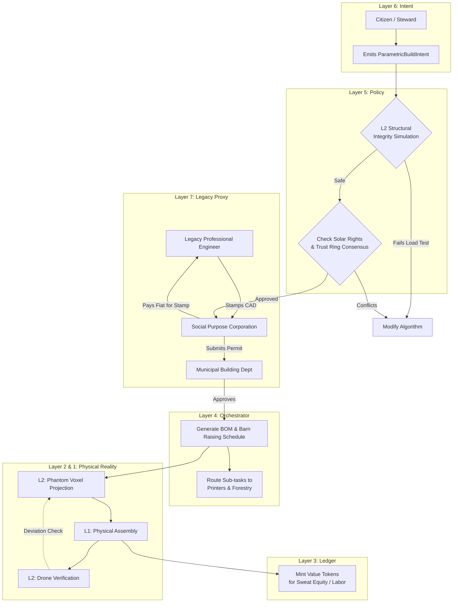

# Scenario Xi: Algorithmic Architecture & Urban Retrofit

*   **Identifier:** `SCN-XI-ARCH`
*   **System Epic:** Parametric Design, Adaptive Urban Reuse, Structural Simulation, and Decentralized Construction
*   **Primary Layers Tested:** L1 (Physical), L2 (Twin), L3 (Ledger), L4 (Orchestrator), L5 (Governance), L6 (Semantic), L7 (Proxy)
*   **Pass/Fail Metric:** Successful procedural generation of a load-bearing structure (or a thermodynamic retrofit to an existing urban building) optimized for local material inventory; verifiable structural and thermal simulation prior to physical assembly; successful legacy permit ingestion.

---

## 1. Problem Statement & Legacy Failure

Legacy construction relies on high-entropy, globalized supply chains that ignore local microclimates and thermodynamic efficiency. The result is a massive, culturally sterile, and thermodynamically bleeding suburban and urban sprawl. However, the Collective recognizes the deep psychological roots humans have to modern life; we cannot simply abandon the existing urban landscape to build geodesic domes in the woods. 
The challenge is two-fold: When a community attempts to build alternative ecological structures, they hit a bureaucratic wall of zoning and engineering constraints. More critically, when they attempt to *retrofit* the massive inventory of existing, inefficient legacy buildings, they lack the localized engineering intelligence to do so safely and cheaply. The Collective must algorithmically hack, augment, and retrofit the modern world from within.

## 2. The Collective Workflow (7-Layer Traversal)

Scenario Xi uses open-source, parametric algorithms to generate structural blueprints dynamically. It takes the exact inventory of the Node (e.g., "We have 40 irregular Alder logs and 200 3D-printed PETG brackets") and computes a structurally sound, custom geometry that can be assembled by decentralized labor.

### Layer 7: The Legacy Proxy (The PE Stamp & Permit Shield)
*   **The Fiat Bridge (Engineering):** Municipalities do not accept "the algorithm said it was safe." The Social Purpose Corporation (SPC) acts as the legacy contractor. It takes the generated parametric CAD file and uses a small amount of fiat to hire a legacy Professional Engineer (PE) to review and stamp the plans.
*   **Permit Insulation:** The SPC submits the stamped plans to the legacy building department, absorbing all permit fees and zoning hearings, legally shielding the decentralized labor force from state interference.

### Layer 6: Semantic Intent
*   A Citizen or Steward emits a `ParametricBuildIntent` for a new structure (e.g., a greenhouse), or a `RetrofitIntent` for an existing urban asset (e.g., scanning a legacy suburban facade to algorithmically generate passive-solar awnings or modular room subdivisions).
*   The intent defines the spatial bounding box, the archetype (e.g., "Timber-Frame", "Retrofit-Cladding"), and the load requirements.

### Layer 5: Policy & Web of Trust (The Physics & Exergy Gates)
*   **Structural Integrity Gate:** Layer 5 routes the intent through the L2 digital twin. If the algorithm detects the structure will fail under historical wind/snow loads, it is rejected.
*   **Thermal Exergy Gate:** The Digital Twin simulates passive solar performance. If the algorithm places massive windows facing the wrong way, leading to immense winter heat loss, the Orchestrator flags a "Thermodynamic Violation" and forces a geometry re-orientation.
*   **Deconstruction Mandate:** To prevent future landfill waste, Layer 5 mandates modular assembly (bolts/pegs over chemical glues). The design must prove it can be safely deconstructed at end-of-life.
*   **Zoning Consensus:** If the structure/retrofit affects the commons, Layer 5 requires multi-sig consensus to protect neighborhood solar rights.

### Layer 4: Orchestration (BOM & Cross-Scenario Routing)
*   The BPMN engine breaks the algorithm into a massive Bill of Materials (BOM) and labor sequence.
*   It routes material bounties across the mesh: requesting Scenarios Alpha and Theta to fabricate structural hardware, Scenario Eta for seasoned timber, and **Scenario Mu** for biochar (used here as an incredible, carbon-negative building insulation).
*   Upon completion of the physical "Barn Raising", the Orchestrator automatically emits a `LodgingIntent`, seamlessly bridging into **Scenario Zeta** to list the new architectural asset on the mesh.

### Layer 3: Ledger (Sweat Equity)
*   Legacy construction requires massive upfront fiat loans (mortgages). In the mesh, the structure is capitalized via thermodynamic "Sweat Equity."
*   Citizens who show up to physically assemble the structure, or who provide the raw materials from their local hoppers, are minted Value Tokens or granted fractional usage rights to the completed structure.

### Layer 2 & 1: Digital Twin & Physical Reality
*   **Telemetry (L2):** During construction, LiDAR or drone photogrammetry scans the physical progress, overlaying it against the digital twin to detect millimeter-level deviations before the next layer is added.
*   **Physical (L1):** Earth, timber, hardware, localized physical labor, and the finalized shelter.

---



---

## 3. Oasis Engine Implementation Specification

In the C++ Oasis engine, this scenario tests the procedural generation and physics mechanics of the voxel grid:

*   **Structural Load Physics:** The C++ core must implement a gravity and load-bearing simulation. Voxels possess a `load_bearing_capacity` and `mass`. If a player entity attempts to build a roof without adequate support columns, the accumulated mass must exceed the structural limits of the base voxels, triggering a `COLLAPSE_EVENT`.
*   **Procedural Blueprinting:** The engine must be able to read a `ParametricBuildIntent` JSON, scan the player's available inventory, and dynamically place phantom "blueprint" voxels in the world space, guiding the player where to place physical materials.
*   **BOM Calculation:** The engine must accurately sum the required voxels to complete the phantom blueprint and deduct them from the local chunk inventory as they are placed.

---

```json
{
  "@context": [
    "[https://schema.org/](https://schema.org/)",
    "[https://collective.network/ontology/v1/](https://collective.network/ontology/v1/)"
  ],
  "@type": "ParametricBuildIntent",
  "identifier": "urn:uuid:1a2b3c4d-5e6f-7a8b-9c0d-1e2f3a4b5c6d",
  "issuerDid": "did:mesh:node04:architect_sara",
  "designParameters": {
    "archetype": "Geodesic_Dome_V3",
    "boundingVolumeCubicMeters": 45.0,
    "targetLocation": {
      "chunkCoordinates": [12, 5, 8],
      "gisPolygon": "ipfs://QmSitePolygonHash..."
    }
  },
  "structuralConstraints": {
    "snowLoadPsf": 40.0,
    "windLoadMph": 85.0,
    "seismicCategory": "D"
  },
  "materialInventory": {
    "primaryStruts": "Coppiced_Alder_Logs",
    "primaryHubs": "PETG_3D_Printed_Joints"
  },
  "legacyCompliance": {
    "peStampRequired": true,
    "municipalPermitRequired": true,
    "allocatedFiatBudget": "1200.00"
  }
}
```

---

## 4. Acceptance Test Gates (Pass/Fail)

| Checkpoint | Validation Method | Pass Condition |
| :--- | :--- | :--- |
| **G1: Structural Integrity Sim** | Physics Engine Load Test | Attempting to execute a blueprint with a roof span exceeding the mathematical sheer strength of the supporting voxel material triggers a programmatic `DESIGN_REJECTED` state. |
| **G2: Material Orchestration** | BOM Generation | The BPMN engine successfully parses a complex geometric design into exact sub-bounties for 3D printed joints and timber lengths. |
| **G3: Solar Rights Validation** | Voxel Raycasting | The system rejects a build intent if the proposed bounding box casts a shadow (simulated via raycasting from the local sun vector) over a voxel marked as `SOLAR_ARRAY` on an adjacent property. |
| **G4: The Permit Bridge** | Layer 7 Aggregation | The system successfully suspends the physical assembly workflow until a simulated Layer 7 manual override (`PE_STAMP_RECEIVED`) is triggered by the SPC admin. |
