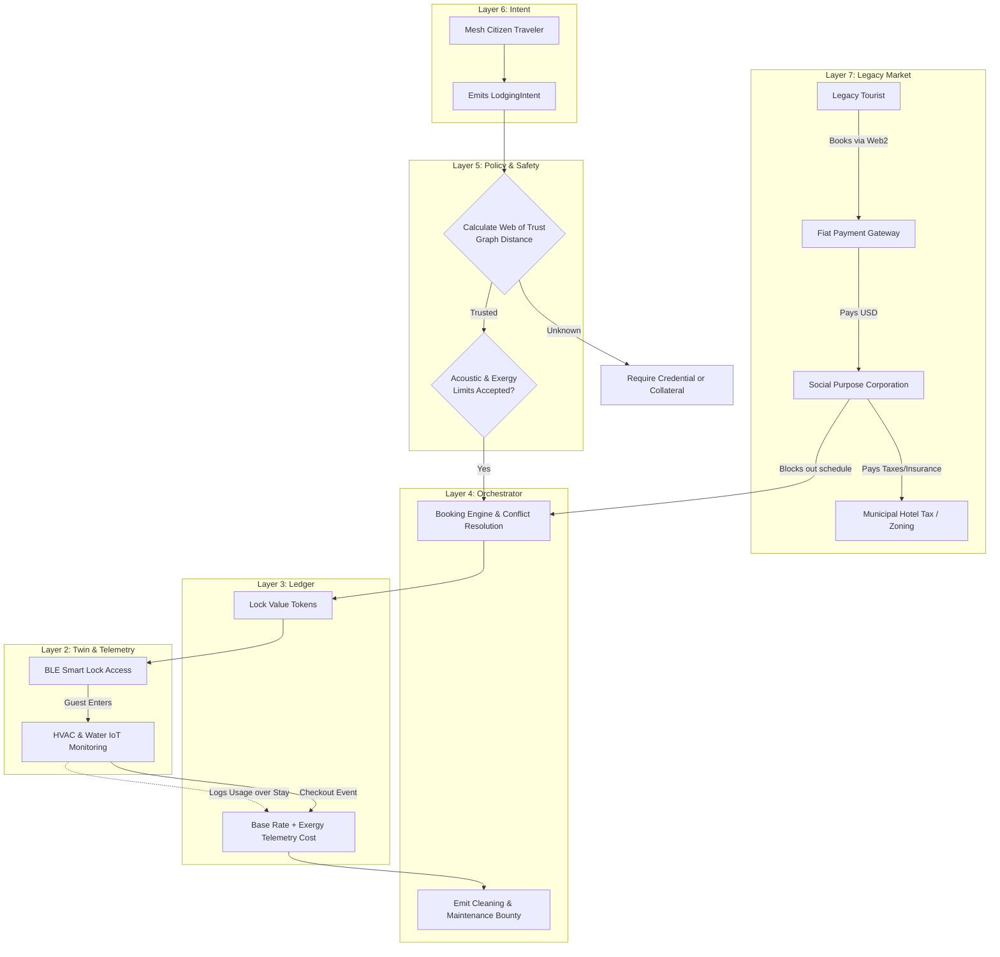

# Scenario Zeta: Micro-Lodging Mesh

*   **Identifier:** `SCN-ZETA-LODGE`
*   **System Epic:** Decentralized Short-Term Housing, Zero-Extraction Hospitality, and Spatial Routing
*   **Primary Layers Tested:** L2 (Twin), L3 (Ledger), L4 (Orchestrator), L5 (Governance), L6 (Semantic), L7 (Proxy)
*   **Pass/Fail Metric:** Successful spatial booking and physical access without centralized platform fees; automated thermodynamic billing of guest utility usage; successful legal insulation from municipal hotel zoning.

---

## 1. Problem Statement & Legacy Failure

The legacy "home-sharing" market has been completely financialized. Centralized platforms (Airbnb, VRBO) extract 15% to 30% of the transaction value from hosts and guests, inflating prices. Furthermore, this financialization distorts the local housing market, displacing long-term residents and triggering aggressive municipal crackdowns (zoning laws, hotel taxes). 
To enforce safety, these platforms rely on opaque, centralized algorithms that can arbitrarily ban users, leaving individuals with no sovereign control over their own property or reputation.

## 2. The Collective Workflow (7-Layer Traversal)

Scenario Zeta establishes a peer-to-peer micro-lodging mesh. It mathematically limits the financialization of housing by pricing stays in thermodynamic Value Tokens while providing a safe, cryptographically trusted network for hospitality.

### Layer 7: The Legacy Proxy (Zoning Shield & Trojan Hospitality)
*   **Trojan Lodging (Fiat Extraction):** To fund the Genesis Node's property taxes and legacy utilities, the Social Purpose Corporation (SPC) lists the ADU/Tiny Home on legacy Web2 platforms. Legacy tourists pay $150/night in fiat via Stripe. The SPC absorbs this fiat, legally operating as a licensed Short-Term Rental, paying the municipal hotel taxes, and providing liability insurance for the host.
*   **The Sovereign Subsidy:** Because legacy users fund the fiat tethers, the space becomes a sovereign asset. Mesh citizens traveling from other nodes can book the exact same space using internal Value Tokens, completely bypassing the legacy financial system.

### Layer 6: Semantic Intent
*   Hosts emit a `LodgingOffering` detailing the spatial specs (beds, square footage, amenities, house rules).
*   Travelers emit a `LodgingIntent` requesting shelter for a specific temporal block.

### Layer 5: Policy & Web of Trust (The Safety Gate)
*   **Cryptographic Vouching:** You do not invite random, untrusted individuals into your sanctuary. Layer 5 evaluates the graph distance between the Host and the Traveler. If the Traveler is an unknown entity (e.g., from a distant bioregional Node), they must present a `Trusted_Traveler` Verifiable Credential signed by a Steward recognized by the local Trust Ring, or lock a massive reputational collateral stake.
*   **House Rules as Code:** Acoustic budgets and privacy boundaries are cryptographically agreed upon prior to booking.

### Layer 4: Orchestration (Booking & Maintenance Lifecycle)
*   The BPMN engine acts as the decentralized property manager.
*   It handles temporal conflict resolution (preventing double bookings).
*   **The Maintenance Loop:** Upon guest checkout, the engine automatically emits a `MaintenanceIntent` (linking to Scenario Alpha/Gamma logic) to the local mesh, offering a Value Token bounty for a local citizen to clean the space and reset the linens.

### Layer 3: Ledger & Exact-Exergy Billing
*   Zero platform extraction fees. 100% of the Value Tokens escrowed by the guest transfer to the host and the cleaning steward.
*   **Thermodynamic Fairness:** The baseline token cost covers space and depreciation. However, if a guest cranks the HVAC to 80°F in winter or takes a 45-minute hot shower, Layer 2 telemetry adds the exact exergy cost of the electricity and water to their final ledger settlement.

### Layer 2 & 1: Digital Twin & Physical Reality
*   **Telemetry & Actuation (L2):** A BLE/NFC smart lock provisions a temporary cryptographic key to the guest's mobile device for the duration of the booking. IoT sensors monitor ambient room temperature, water flow, and decibel levels (without recording audio) to enforce the acoustic budget.
*   **Physical (L1):** ADUs, yurts, spare bedrooms, tiny homes, clean linens, and physical shelter.

---



---

## 3. Oasis Engine Implementation Specification

In the C++ Oasis engine, the lodging scenario requires persistent state tracking over long temporal spans (days/weeks) rather than short bursts (hours):

*   **Temporal Voxel Locking:** The `ChunkManager` must lock the designated lodging voxels, preventing other player entities from interacting with the internal inventory (e.g., the fridge, the bed) while the `Occupancy_State` is active.
*   **Telemetry Aggregation:** The engine must continuously sum the power and water draw within the locked voxels over millions of simulated ticks, calculating the final `Exergy_Debt` upon the `CHECKOUT` event.
*   **Event Triggering:** Transitioning from `CHECKOUT` must automatically spawn an NPC/Player bounty task (`CLEANING_BOUNTY`) on the local message bus.

---

```json
{
  "@context": [
    "[https://schema.org/](https://schema.org/)",
    "[https://collective.network/ontology/v1/](https://collective.network/ontology/v1/)"
  ],
  "@type": "LodgingIntent",
  "identifier": "urn:uuid:e5f6a9b2-33cc-4e1a-9f01-8c4d2e1f5b6c",
  "issuerDid": "did:mesh:node09:traveler_kai",
  "targetLocation": {
    "@type": "Place",
    "name": "Cascadia Bioregion - Node Duvall"
  },
  "spatialRequirements": {
    "occupants": 2,
    "minimumSquareMeters": 15,
    "requiredAssets": ["QueenBed", "FiberInternet", "Kitchenette"]
  },
  "temporalVector": {
    "checkIn": "2026-11-10T15:00:00Z",
    "checkOut": "2026-11-14T11:00:00Z",
    "totalNights": 4
  },
  "trustConstraints": {
    "presentedCredentials": ["Trusted_Traveler_L2", "Steward_Vouch_Alpha"],
    "maxGraphDistance": 3
  },
  "escrowCapacity": {
    "maxValueTokens": "85.00",
    "maxExergyOverage": "15.00"
  }
}
```

---

## 4. Acceptance Test Gates (Pass/Fail)

| Checkpoint | Validation Method | Pass Condition |
| :--- | :--- | :--- |
| **G1: Cryptographic Key Provisioning** | BLE Lock Actuation | The simulated door voxel only transitions to `UNLOCKED` when presented with a cryptographic signature matching the active, escrow-funded booking. |
| **G2: Exact-Exergy Settlement** | Resource Telemetry Summation | The final Value Token settlement deducts the base rate *plus* the exact thermodynamic cost of the simulated HVAC and water usage during the stay. |
| **G3: Post-Stay Orchestration** | Maintenance Spawning | Upon the checkout timestamp, the BPMN engine successfully generates a `MaintenanceIntent` for the chunk and locks the calendar until the cleaning bounty is claimed and completed. |
| **G4: The Web of Trust Filter** | Graph Traversal Rejection | A simulated traveler with zero common Trust Ring connections and no Verifiable Credentials is automatically blocked from booking the sovereign tier. |
