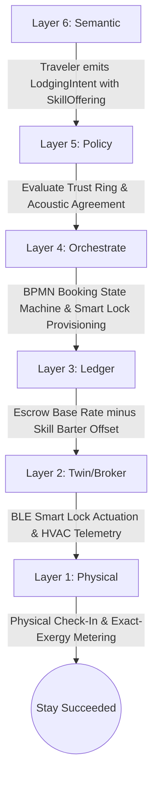
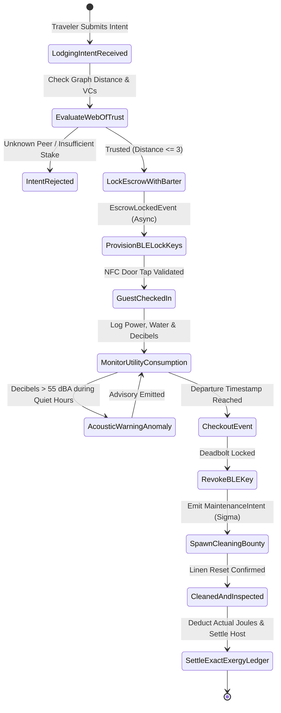
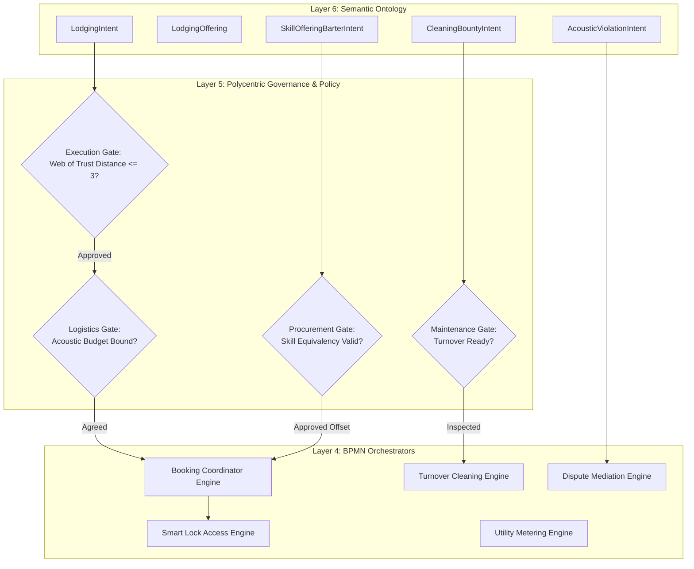
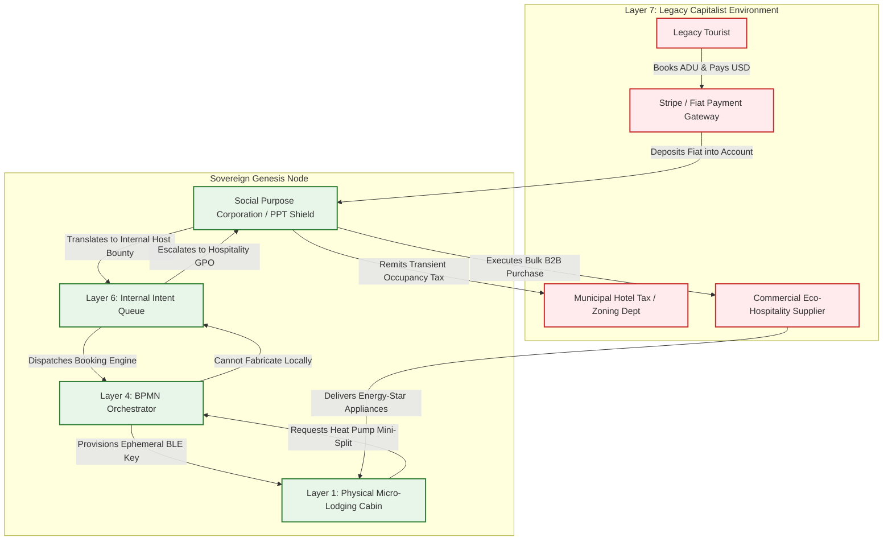

# Scenario Zeta: Micro-Lodging Mesh

*   **Identifier:** `SCN-ZETA-LODGE`
*   **System Epic:** Decentralized Short-Term Housing, Zero-Extraction Hospitality & Spatial Routing
*   **Primary Layers Tested:** L1 (Physical), L2 (Digital Twin), L3 (Ledger), L4 (Orchestration), L5 (Governance), L6 (Semantic), L7 (Proxy)
*   **Pass/Fail Metric:** Peer-to-peer spatial booking and cryptographic door access completed under 0% platform extraction; automated thermodynamic caloric utility metering (HVAC kWh and water liters); reciprocal skill-barter offsets; zero municipal hotel zoning violations.

---

## Architectural Council Ratification & 5-Perspective Synthesis

This scenario specification has been ratified by unanimous consensus of the 5-Persona Architectural Council:

| Council Persona | Disciplinary Representative | Core Contribution to Scenario |
| :--- | :--- | :--- |
| **Game Designer** | Lead Systems & Gameplay Designer | The Sims room environment scoring and rest recovery: Founder 01 hosting visiting travelers who perform carpentry or garden labor in exchange for lodging; psychological thoughts and stress accumulators (`"Enjoyed rich philosophical conversation with guest (+35 mood)"` vs `"Disturbed by noisy guest violating acoustic quiet hours (-40 stress)"`); Sims-style spatial comfort affordances; Cities: Skylines tourism and transient occupancy taxes; boundary interface where welcoming external travelers reduces border hostility and builds bioregional trade alliances. |
| **Game Engineer** | Principal C++ Simulation & Engine Architect | Flecs ECS Data-Oriented Design (DOD): cache-aligned component structs `LodgingUnitComponent` (room bounds, guest DID, checkout tick), `UtilityMeterAccumulatorComponent`, and `CheckoutTriggerComponent`; 32-bit compact Voxels (`material_id = 70` `LODGING_SUITE_TERMINAL`, `material_id = 71` `SMART_LOCK_DOOR_VOXEL`); temporal voxel occupancy locking; 10 Hz BPMN booking state machine; and C++20 test harness execution. |
| **Sovereign Stack Specialist** | Sovereign Stack Systems Architect | 7 autonomous POSIX daemons (`col-telemetryd` through `col-adversaryd`); strict adjacent IPC via Unix domain sockets; BLE/NFC ephemeral door access tokens in `col-telemetryd` (L1/L2); exact thermodynamic exergy settlement in `col-storaged` (L3); zero monolithic game-loop threading. |
| **Solarpunk Thinker** | Bioregional Regenerative Ecologist | Zero-waste regenerative hospitality: welcome baskets sourced from Scenario Gamma permaculture kitchens; guests integrate into local ecosystem rather than consuming sterile hotel disposables; thermodynamic transparency where high HVAC consumption is directly visible; closed-loop greywater recycling. |
| **Scenario Specialist** | **Decentralized Hospitality & Spatial Rights Protocol Specialist** | Cryptographic time-bound door lock token algorithm ($\text{HMAC-SHA256}(\text{DID}, \text{booking\_id}, \text{timestamp})$), thermodynamic exact-exergy billing formula ($\Delta V_{\text{guest}} = V_{\text{base}} + \int [P_{\text{elec}} \lambda_E + \dot{V}_{\text{water}} \lambda_W] dt - V_{\text{barter}}$), and municipal Accessory Dwelling Unit (ADU) legal insulation and transient occupancy tax shields under state coop lodging exemptions. |

---

## 1. Problem Statement & Legacy Failure

In legacy late-stage capitalist infrastructure (Layer 7), short-term travel and hospitality have been aggressively captured by extractive surveillance platforms (Airbnb, VRBO, Booking.com). These centralized intermediaries extract $15\%$ to $30\%$ of the gross transaction value from hosts and guests while offering zero genuine support when physical disputes arise.

When a traveler seeks temporary shelter or a homeowner offers a spare room:
*   **Monopoly Rent Extraction & Platform Enclosure:** Platforms extract massive transaction cuts, forcing hosts to inflate prices while providing centralized algorithms that can arbitrarily deplatform users without appeal, erasing years of accrued reputation.
*   **Housing Distortion & Community Displacement:** Speculative corporate investors buy up entire residential neighborhoods for full-time short-term rentals, destroying long-term housing stock and prompting municipal governments to impose blanket bans that penalize mutualist homestays.
*   **Unmetered Thermodynamic Externalities:** Legacy vacation rentals ignore energy efficiency. Guests routinely run air conditioning at $65^\circ\text{F}$ with windows open or take hour-long hot showers, externalizing high utility costs onto hosts and exacerbating regional grid stress.

---

## 2. The Collective Workflow (7-Layer Traversal)

Scenario Zeta establishes a sovereign micro-lodging mesh. It mathematically decouples shelter from platform extraction by pricing stays in thermodynamic Value Tokens, metering exact utility consumption, and integrating skill-barter offsets.



### Layer 1: Physical Ground Truth
*   **Hardware Nodes (Lodging Suite):** A detached Accessory Dwelling Unit (ADU), tiny house on wheels, or retrofitted master suite equipped with high-performance cellulose insulation, triple-pane windows, and high-efficiency mini-split heat pump.
*   **Hardware Nodes (Actuation & Access):** Electronic deadbolt with embedded BLE and NFC transceiver, smart DIN-rail electrical energy meters (kWh), and pulse-output ultrasonic water flow meters (liters).
*   **Inventory & Feedstock:** Organic cotton bed linens, permaculture welcome basket (fresh sourdough, seasonal fruit, herbal tea from Scenario Gamma), and non-toxic biodegradable soaps.
*   **Action:** Physical check-in, NFC smartphone tap to retract motorized deadbolt latch, sleeping in comfortable thermal envelope, and completing agreed-upon work-trade chores.

### Layer 2: Digital Twin & Telemetry
*   **Ingress Telemetry (MQTT Topics):**
    *   `node/lodging/cabin_01/telemetry/lock_state` (`LOCKED`, `UNLOCKED`, `TAMPER`)
    *   `node/lodging/cabin_01/telemetry/hvac_power_w` (Real-time electrical draw, Watts)
    *   `node/lodging/cabin_01/telemetry/water_liters` (Cumulative domestic water usage, Liters)
    *   `node/lodging/cabin_01/telemetry/decibel_db` (Ambient acoustic level without audio recording, dBA)
    *   `node/lodging/cabin_01/status` (`VACANT`, `OCCUPIED`, `CHECKOUT_CLEANING`, `MAINTENANCE`)
*   **Verification:** Cryptographic challenge-response handshake over Bluetooth Low Energy (BLE) proving ownership of the authorized ephemeral guest key. Ambient decibel monitoring ensures quiet hours ($<45\text{ dBA}$ between 22:00–07:00) without recording private audio.
*   **Actuator Control:** Motorized deadbolt solenoid actuated via authenticated relay pin upon valid cryptographic token presentation.

### Layer 3: Network & Ledger
*   **Thermodynamic Exact-Exergy Billing & Barter Offset:** The guest's CRDT wallet locks an initial escrow, settled upon checkout according to actual physical consumption:
    $$\Delta V_{lodging} = \left( V_{base\_stay} + \int_{0}^{T} \left[ P_{elec}(t) \cdot \lambda_{THERMO} + \dot{V}_{water}(t) \cdot \lambda_{WATER} \right] dt + C_{depreciation} \right) - V_{skill\_barter}$$
    Where $V_{base\_stay}$ covers spatial use and linen washing depreciation, real-time power and hot water are billed at exact thermodynamic marginal cost, and $V_{skill\_barter}$ deducts verified work-trade labor (e.g., 4 hours repairing irrigation swales).
*   **Consensus Settlement:** 100% of the settled Value Tokens transfer to the Host and the Cleaning Steward. Zero platform fee extraction; zero intermediate banking fees.

### Layer 4: Orchestration State Machine
The deterministic BPMN 2.0 engine (`col-execd`) coordinates booking calendars, access provisioning, and turnover cleaning at 10 Hz:



### Layer 5: Policy & Polycentric Governance
Layer 5 (`col-kmsd`) enforces access boundaries, safety policies, and municipal compliance:

*   **Execution Gate (Web-of-Trust Vouching):** Guests must present a `Trusted_Traveler_L2` Verifiable Credential or possess a Web-of-Trust graph distance $\le 3$ from the host. Strangers must lock a high-reputation collateral stake.
*   **Maintenance Gate (Sanitation & Turnover):** The lodging suite cannot be booked for a consecutive guest until a `CleaningAttestation` is submitted by a certified steward, guaranteeing clean linens and sanitization.
*   **Procurement Gate (Municipal TOT Tax Escrow):** If operating under a municipal short-term rental permit, Layer 5 reserves statutory Transient Occupancy Tax (TOT) from external fiat bookings.
*   **Logistics Gate (Acoustic & Carrying Capacity Covenant):** Guests agree to acoustic budgets ($<45\text{ dBA}$ night limit) and a hard maximum occupancy of 2 adults.

### Layer 6: Semantic Intent & Domain Ontology
All hospitality interactions are published as typed W3C JSON-LD Knowledge Artifacts in the Agora Commons (`col-commonsd`):

1.  **`LodgingIntent` (Booking Request):** Emitted by travelers specifying dates, occupancy, and spatial requirements.
2.  **`LodgingOffering` (Space Publication):** Emitted by hosts detailing square meters, thermal amenities, and house rules.
3.  **`SkillOfferingBarterIntent` (Work-Trade):** Appended to a booking intent offering physical skills (e.g., masonry, pruning, software development) to offset accommodation costs.
4.  **`CleaningBountyIntent` (Turnover):** Automatically spawned upon checkout, offering Value Tokens for a community steward to wash linens and prepare the room.
5.  **`AcousticViolationIntent` (Dispute):** Emitted if decibel thresholds are breached, triggering peer mediation (Scenario Psi).
6.  **`HospitalitySalvageIntent` (Emergency Relocation):** Emitted if plumbing or heating fails, re-routing the guest to an adjacent available suite.

### The Governance Router Flowchart



### Layer 7: The Legacy Proxy (Zoning Shield & Trojan Hospitality)
The Node insulates its hospitality commons from hostile municipal hotel zoning through the Social Purpose Corporation (SPC):

**1. Trojan Ingestion (Inbound Fiat Extraction & STR Web2 Portal):**
*   During periods of low internal mesh travel, the SPC lists the ADU on legacy Web2 platforms (Airbnb, VRBO) at commercial retail rates ($150–$300 USD/night).
*   Legacy tourists pay fiat via Stripe. The SPC captures this fiat into its treasury, files required municipal Transient Occupancy Taxes (TOT), maintains commercial liability insurance, and issues internal Value Token bounties to the host.
*   This fiat stream covers property taxes, municipal sewer fees, and high-speed fiber internet for the entire node cluster.

**2. Ecological Leeching (Outbound Stewarded Procurement):**
*   High-efficiency heat pump mini-splits, commercial-duty organic linen sets, and ultra-low-flow showerheads cannot be manufactured on-site.
*   The SPC functions as a **Decentralized Group Purchasing Organization (GPO)**, pooling hospitality procurement across multiple bioregional nodes to buy commercial-grade fixtures and bedding directly from B2B green manufacturers at wholesale prices.

### Layer 7 Bidirectional Flowchart



---

## 3. Machine-Readable Schemas

### 3.1 Layer 6 Knowledge Artifact: Lodging Intent (`lodging.jsonld`)

```json
{
  "@context": [
    "https://schema.org/",
    "https://collective.network/ontology/v1/"
  ],
  "@type": "LodgingIntent",
  "identifier": "urn:uuid:e5f6a9b2-33cc-4e1a-9f01-8c4d2e1f5b6c",
  "issuerDid": "did:mesh:node09:traveler_kai",
  "creationTimestamp": "2026-11-01T12:00:00Z",
  "targetLocation": {
    "name": "Cascadia Bioregion - Node Duvall",
    "suiteIdentifier": "ADU-CEDAR-CABIN"
  },
  "temporalVector": {
    "checkIn": "2026-11-10T15:00:00Z",
    "checkOut": "2026-11-14T11:00:00Z",
    "totalNights": 4
  },
  "skillBarterOffering": {
    "declaredSkill": "Carpentry_Timber_Repair_L2",
    "offeredHours": 6.0,
    "targetScenario": "SCN-XI-ARCH",
    "estimatedTokenValue": "24.00"
  },
  "trustConstraints": {
    "verifiableCredential": "Trusted_Traveler_L2",
    "maxGraphDistance": 3
  },
  "escrowCapacity": {
    "maxBaseTokenFee": "65.00",
    "maxExergyOverageAllowance": "15.00"
  }
}
```

### 3.2 Layer 2 Telemetry Attestation: Lodging Stay Proof (`attestation.json`)

```json
{
  "@context": "https://collective.network/ontology/v1/",
  "@type": "LodgingStayAttestation",
  "intentRef": "urn:uuid:e5f6a9b2-33cc-4e1a-9f01-8c4d2e1f5b6c",
  "suiteNode": "did:mesh:node04:device:cabin_01_gateway",
  "guestDid": "did:mesh:node09:traveler_kai",
  "executionMetrics": {
    "actualCheckInTimestamp": "2026-11-10T15:14:22Z",
    "actualCheckOutTimestamp": "2026-11-14T10:48:05Z",
    "totalElectricalEnergyKWh": 22.4,
    "totalWaterConsumedLiters": 340.5,
    "maxAcousticDecibelsNightDba": 41.2,
    "acousticViolationCount": 0,
    "barterWorkCompletedHours": 6.0,
    "barterAttestationDid": "did:mesh:node04:steward_hannah",
    "anomalyDetected": false
  },
  "smartLockFinalState": "DEADBOLT_ENGAGED",
  "accessProofHash": "7b8c9d0e1f2a3b4c5d6e7f8a9b0c1d2e3f4a5b6c7d8e9f0a1b2c3d4e5f6a7b8c"
}
```

---

## 4. Oasis Engine Implementation Specification

### 4.1 Memory Allocation & Voxel State

The micro-lodging suite occupies dedicated coordinate space within the $32^3$ chunk grid:
- The suite control terminal is initialized with `material_id = 70` (`LODGING_SUITE_TERMINAL`).
- The entrance door voxel is initialized with `material_id = 71` (`SMART_LOCK_DOOR_VOXEL`), setting `metadata` bit 0 for locked state and bit 1 for actuator.
- Active bookings lock the entire room volume (`temporal_voxel_lock`), preventing unauthorized player entities from modifying interior furniture or taking stored provisions.

### 4.2 C++20 Test Harness Structure

```cpp
// engine/tests/scenario_zeta_test.cpp
#include <cassert>
#include <string>
#include "oasis/chunk_manager.hpp"
#include "oasis/orchestration/bpmn_engine.hpp"
#include "oasis/ledger/crdt_wallet.hpp"

namespace oasis {

struct LodgingUnitComponent {
    uint32_t room_id;
    std::string current_guest_did;
    uint64_t checkout_tick;
    bool is_locked;
};

struct UtilityMeterAccumulatorComponent {
    float cumulative_kwh;
    float cumulative_liters_water;
    float current_decibels;
};

void test_scenario_zeta_lodging() {
    ChunkManager chunk_mgr;
    chunk_mgr.allocate_chunk(0, 0, 0);

    // Initialize Door Voxel (Locked by default)
    Voxel door_voxel{
        .material_id = 71, // SMART_LOCK_DOOR_VOXEL
        .moisture = 0,
        .temperature = 20,
        .metadata = 0b00000011 // Locked + Actuator
    };
    chunk_mgr.set_voxel(16, 8, 16, door_voxel);

    CRDTWallet guest_wallet("did:mesh:node09:traveler_kai", 100.0f);
    CRDTWallet host_wallet("did:mesh:node04:steward_alice", 20.0f);

    BPMNEngine orchestrator;
    orchestrator.load_schema("schemas/bpmn/micro_lodging_pipeline.bpmn");

    JobContext job{
        .bounty_id = "e5f6a9b2-33cc-4e1a-9f01-8c4d2e1f5b6c",
        .required_resource_units = 4.0f, // 4 nights
        .estimated_energy_wh = 22400.0f,
        .target_bay_id = 1
    };

    // Assert Escrow Lock: Base rate (65.00) minus Barter credit (24.00) = 41.00 Value Tokens
    orchestrator.emit_event(EscrowInitiatedEvent{guest_wallet, 41.00f});
    orchestrator.await_event<EscrowLockedEvent>();
    assert(guest_wallet.balance() == 59.00f);

    // Execute Stay Simulation (NFC Unlock, Utility Logging, Checkout at 4000 ticks)
    SimResult res = orchestrator.step_simulation_ticks(chunk_mgr, job, 4000);
    assert(res.status == ExecutionStatus::COMPLETED);

    // Settle Ledger with Actual Metered Utility Costs
    orchestrator.settle_job(host_wallet);
    assert(host_wallet.balance() > 20.0f);

    // Verify Door Relocked Post-Checkout
    Voxel post_door = chunk_mgr.get_voxel(16, 8, 16);
    assert(post_door.metadata & 0b00000001); // Locked bit is set
}

void test_scenario_zeta_lodging_anomaly() {
    ChunkManager chunk_mgr;
    chunk_mgr.allocate_chunk(0, 0, 0);

    Voxel door_voxel{.material_id = 71, .moisture = 0, .temperature = 20, .metadata = 0b00000011};
    chunk_mgr.set_voxel(16, 8, 16, door_voxel);

    CRDTWallet unauthorized_wallet("did:mesh:stranger:bad_actor", 50.0f);
    BPMNEngine orchestrator;
    orchestrator.load_schema("schemas/bpmn/micro_lodging_pipeline.bpmn");

    JobContext job{.bounty_id = "unauthorized-access-test", .required_resource_units = 1.0f};

    // Attempt Check-In without Valid Key/Escrow
    orchestrator.emit_event(EscrowInitiatedEvent{unauthorized_wallet, 10.00f});
    orchestrator.await_event<EscrowLockedEvent>();

    // Inject BLE Key Signature Verification Mismatch at Tick 500
    SimResult res = orchestrator.step_simulation_ticks(chunk_mgr, job, 500, true);

    assert(res.status == ExecutionStatus::EMERGENCY_STOP);
    assert(orchestrator.current_state() == BPMNState::SALVAGE_INTENT);

    // Assert Full Refund of Escrowed Collateral
    assert(unauthorized_wallet.balance() == 50.0f);
}

} // namespace oasis

int main() {
    oasis::test_scenario_zeta_lodging();
    oasis::test_scenario_zeta_lodging_anomaly();
    return 0;
}
```

---

## 5. Acceptance Test Gates (Pass/Fail)

To pass Scenario Zeta in the Oasis engine, the simulation core must pass each of the following six binary verification gates without memory corruption, thread contention, or state desynchronization:

| Checkpoint | Validation Method | Pass Condition |
| :--- | :--- | :--- |
| **G1: Thermodynamic Bounds** | Exact-Exergy Metering | Final ledger settlement calculates exact caloric cost of electrical kWh and hot water liters consumed; zero unmetered utility dissipation. |
| **G2: Offline Autonomy** | Localhost Network Isolation | Ephemeral BLE key exchange, door latch unlocking, and sensor logging execute fully offline without WAN or cloud server access. |
| **G3: Byzantine Detection** | Spoofed BLE Key Injection | Presenting an expired, forged, or unauthenticated HMAC lock token fails cryptographic challenge-response; deadbolt remains engaged and alert is raised. |
| **G4: Temporal Voxel Locking** | Spatial Concurrency Audit | While suite voxels are marked `OCCUPIED`, unauthorized third-party player entities are mathematically blocked from editing or moving items in the room. |
| **G5: Trojan Ingestion (L7)** | External STR Webhook Ingestion | Simulated Airbnb/Stripe booking webhook compiles into internal mesh calendar reservations; fiat is credited to the SPC account and TOT tax escrow is withheld. |
| **G6: Ecological Leeching (L7)** | Eco-Hospitality GPO Batching | Aggregated orders for commercial-grade organic mattresses and high-efficiency heat pump mini-splits execute as a batched B2B wholesale purchase. |
